# 存储引擎

<cite>
**本文档引用的文件**
- [BPTree.java](file://src/main/java/alchemystar/freedom/index/bp/BPTree.java)
- [BPNode.java](file://src/main/java/alchemystar/freedom/index/bp/BPNode.java)
- [BpPage.java](file://src/main/java/alchemystar/freedom/index/bp/BpPage.java)
- [Page.java](file://src/main/java/alchemystar/freedom/store/page/Page.java)
- [PageHeaderData.java](file://src/main/java/alchemystar/freedom/store/page/PageHeaderData.java)
- [PagePool.java](file://src/main/java/alchemystar/freedom/store/page/PagePool.java)
- [FStore.java](file://src/main/java/alchemystar/freedom/store/fs/FStore.java)
- [BaseIndexCursor.java](file://src/main/java/alchemystar/freedom/access/BaseIndexCursor.java)
- [Position.java](file://src/main/java/alchemystar/freedom/index/bp/Position.java)
- [SystemConfig.java](file://src/main/java/alchemystar/freedom/config/SystemConfig.java)
</cite>

## 目录
1. [引言](#引言)
2. [项目结构](#项目结构)
3. [核心组件](#核心组件)
4. [架构概述](#架构概述)
5. [详细组件分析](#详细组件分析)
6. [依赖分析](#依赖分析)
7. [性能考虑](#性能考虑)
8. [故障排除指南](#故障排除指南)
9. [结论](#结论)

## 引言
本文档旨在详细描述存储引擎的架构设计，重点聚焦于B+树索引与页面管理的协同工作机制。文档将深入探讨BPTree如何实现键值存储和范围查询，Page和PagePool如何管理内存中的数据页，FStore如何将页面持久化到文件系统。同时，文档将解释BaseIndexCursor等游标类如何支持索引遍历操作，并说明页面缓存策略、预读机制和I/O优化技术。通过数据页结构布局图，分析空间利用率和访问局部性，并讨论存储引擎的扩展性与性能瓶颈。

## 项目结构
存储引擎的项目结构清晰地划分为多个模块，每个模块负责特定的功能。核心模块包括`index`、`store`、`access`和`config`。`index`模块负责B+树索引的实现，`store`模块负责页面管理和持久化，`access`模块负责游标操作，`config`模块负责系统配置。

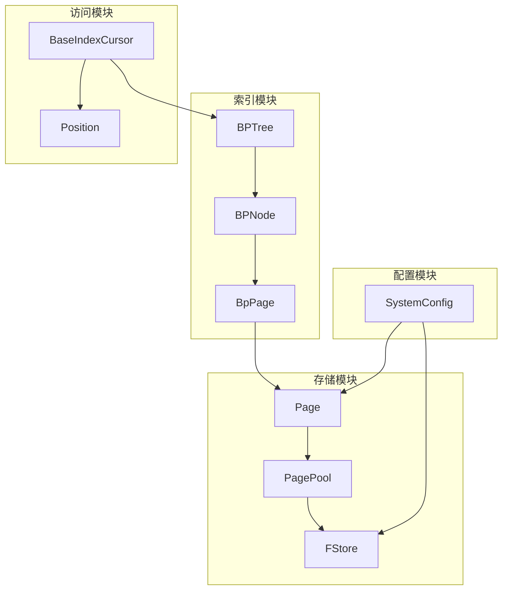

**图来源**
- [BPTree.java](file://src/main/java/alchemystar/freedom/index/bp/BPTree.java)
- [BPNode.java](file://src/main/java/alchemystar/freedom/index/bp/BPNode.java)
- [BpPage.java](file://src/main/java/alchemystar/freedom/index/bp/BpPage.java)
- [Page.java](file://src/main/java/alchemystar/freedom/store/page/Page.java)
- [PagePool.java](file://src/main/java/alchemystar/freedom/store/page/PagePool.java)
- [FStore.java](file://src/main/java/alchemystar/freedom/store/fs/FStore.java)
- [BaseIndexCursor.java](file://src/main/java/alchemystar/freedom/access/BaseIndexCursor.java)
- [Position.java](file://src/main/java/alchemystar/freedom/index/bp/Position.java)
- [SystemConfig.java](file://src/main/java/alchemystar/freedom/config/SystemConfig.java)

**节来源**
- [BPTree.java](file://src/main/java/alchemystar/freedom/index/bp/BPTree.java)
- [BPNode.java](file://src/main/java/alchemystar/freedom/index/bp/BPNode.java)
- [BpPage.java](file://src/main/java/alchemystar/freedom/index/bp/BpPage.java)
- [Page.java](file://src/main/java/alchemystar/freedom/store/page/Page.java)
- [PagePool.java](file://src/main/java/alchemystar/freedom/store/page/PagePool.java)
- [FStore.java](file://src/main/java/alchemystar/freedom/store/fs/FStore.java)
- [BaseIndexCursor.java](file://src/main/java/alchemystar/freedom/access/BaseIndexCursor.java)
- [Position.java](file://src/main/java/alchemystar/freedom/index/bp/Position.java)
- [SystemConfig.java](file://src/main/java/alchemystar/freedom/config/SystemConfig.java)

## 核心组件
存储引擎的核心组件包括BPTree、BPNode、BpPage、Page、PagePool、FStore、BaseIndexCursor和Position。这些组件协同工作，实现了高效的键值存储和查询功能。

**节来源**
- [BPTree.java](file://src/main/java/alchemystar/freedom/index/bp/BPTree.java)
- [BPNode.java](file://src/main/java/alchemystar/freedom/index/bp/BPNode.java)
- [BpPage.java](file://src/main/java/alchemystar/freedom/index/bp/BpPage.java)
- [Page.java](file://src/main/java/alchemystar/freedom/store/page/Page.java)
- [PagePool.java](file://src/main/java/alchemystar/freedom/store/page/PagePool.java)
- [FStore.java](file://src/main/java/alchemystar/freedom/store/fs/FStore.java)
- [BaseIndexCursor.java](file://src/main/java/alchemystar/freedom/access/BaseIndexCursor.java)
- [Position.java](file://src/main/java/alchemystar/freedom/index/bp/Position.java)

## 架构概述
存储引擎的架构设计围绕B+树索引和页面管理展开。BPTree作为B+树的根节点，负责管理整个索引结构。BPNode表示B+树的节点，可以是叶子节点或非叶子节点。BpPage是BPNode的物理表示，负责将节点数据持久化到文件系统。Page是内存中的数据页，PagePool负责管理这些数据页的分配和回收。FStore负责将页面数据写入文件系统。BaseIndexCursor和Position类支持索引的遍历操作。

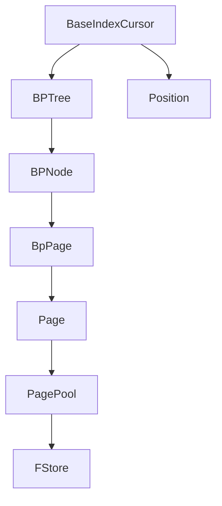

**图来源**
- [BPTree.java](file://src/main/java/alchemystar/freedom/index/bp/BPTree.java)
- [BPNode.java](file://src/main/java/alchemystar/freedom/index/bp/BPNode.java)
- [BpPage.java](file://src/main/java/alchemystar/freedom/index/bp/BpPage.java)
- [Page.java](file://src/main/java/alchemystar/freedom/store/page/Page.java)
- [PagePool.java](file://src/main/java/alchemystar/freedom/store/page/PagePool.java)
- [FStore.java](file://src/main/java/alchemystar/freedom/store/fs/FStore.java)
- [BaseIndexCursor.java](file://src/main/java/alchemystar/freedom/access/BaseIndexCursor.java)
- [Position.java](file://src/main/java/alchemystar/freedom/index/bp/Position.java)

## 详细组件分析
### BPTree分析
BPTree是B+树的根节点，负责管理整个索引结构。它提供了插入、删除、查找等操作的接口。

#### 类图
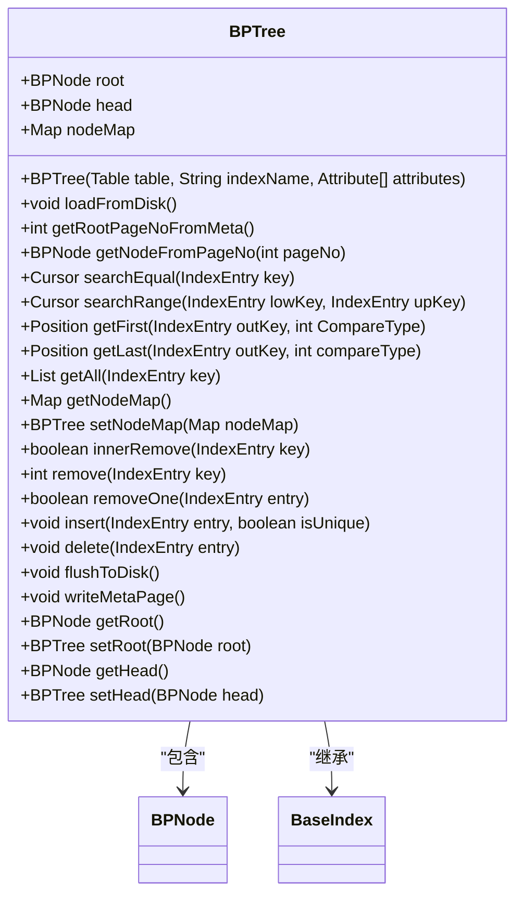

**图来源**
- [BPTree.java](file://src/main/java/alchemystar/freedom/index/bp/BPTree.java)

**节来源**
- [BPTree.java](file://src/main/java/alchemystar/freedom/index/bp/BPTree.java)

### BPNode分析
BPNode表示B+树的节点，可以是叶子节点或非叶子节点。它负责管理节点内的键值对和子节点。

#### 类图
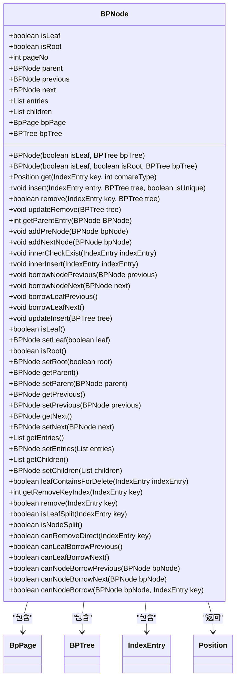

**图来源**
- [BPNode.java](file://src/main/java/alchemystar/freedom/index/bp/BPNode.java)

**节来源**
- [BPNode.java](file://src/main/java/alchemystar/freedom/index/bp/BPNode.java)

### BpPage分析
BpPage是BPNode的物理表示，负责将节点数据持久化到文件系统。它提供了读取和写入页面数据的方法。

#### 类图
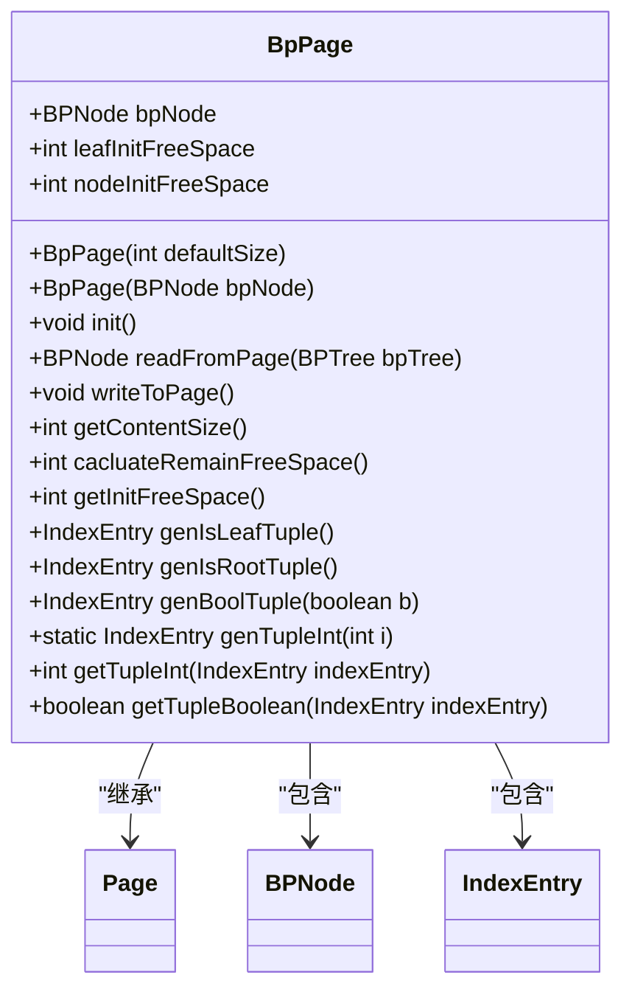

**图来源**
- [BpPage.java](file://src/main/java/alchemystar/freedom/index/bp/BpPage.java)

**节来源**
- [BpPage.java](file://src/main/java/alchemystar/freedom/index/bp/BpPage.java)

### Page分析
Page是内存中的数据页，负责管理页面内的数据。它提供了读取和写入页面数据的方法。

#### 类图
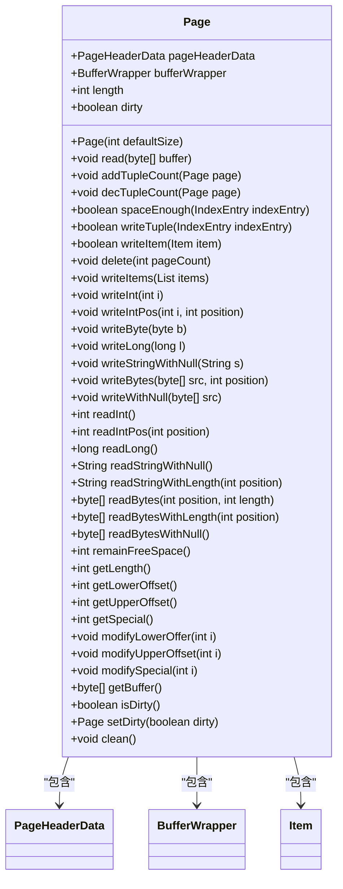

**图来源**
- [Page.java](file://src/main/java/alchemystar/freedom/store/page/Page.java)

**节来源**
- [Page.java](file://src/main/java/alchemystar/freedom/store/page/Page.java)

### PagePool分析
PagePool负责管理内存中的数据页，提供数据页的分配和回收功能。

#### 类图
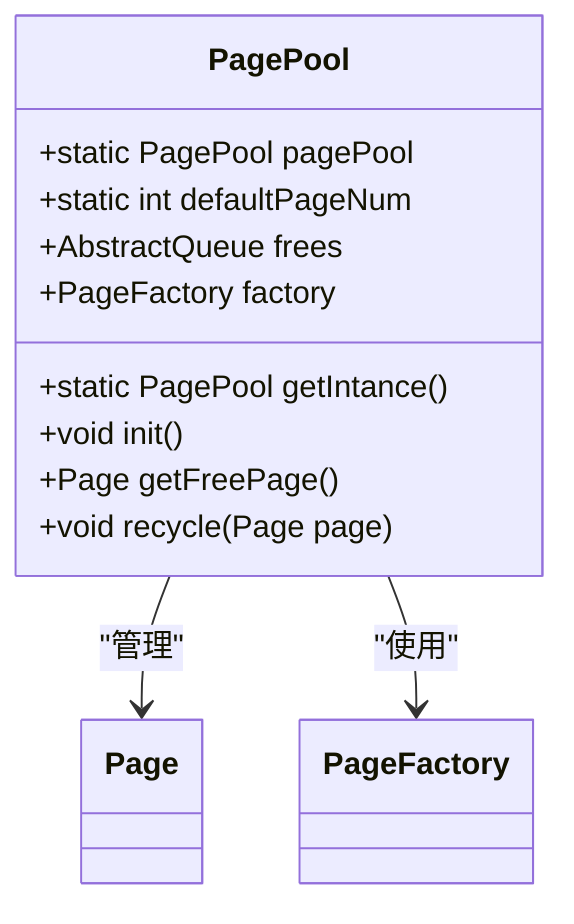

**图来源**
- [PagePool.java](file://src/main/java/alchemystar/freedom/store/page/PagePool.java)

**节来源**
- [PagePool.java](file://src/main/java/alchemystar/freedom/store/page/PagePool.java)

### FStore分析
FStore负责将页面数据写入文件系统，提供读取和写入页面数据的方法。

#### 类图
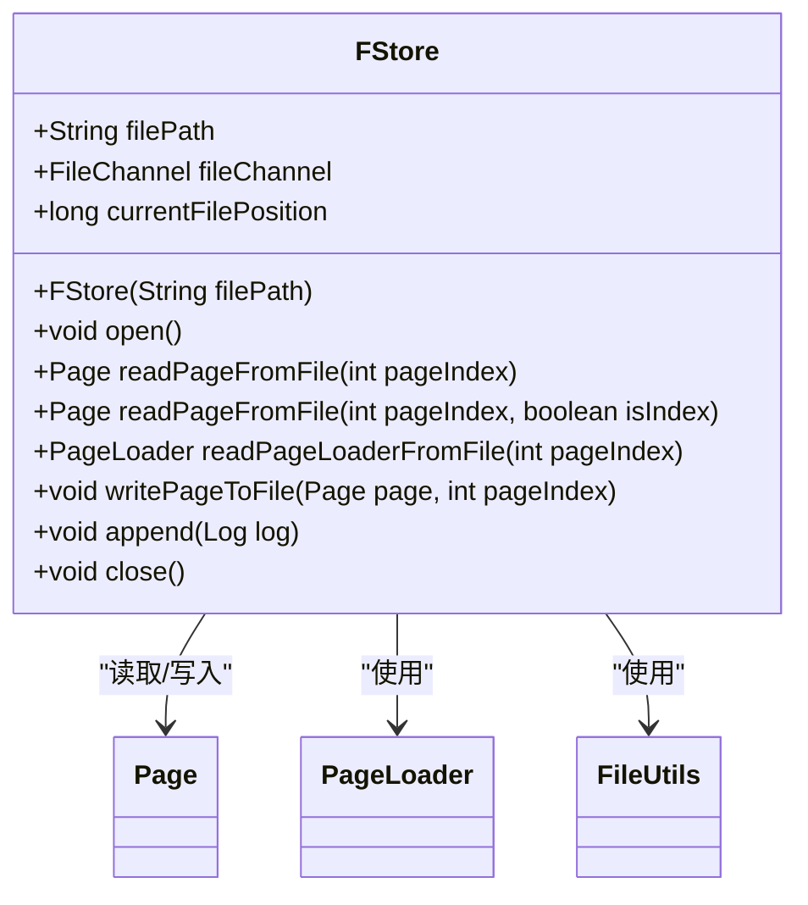

**图来源**
- [FStore.java](file://src/main/java/alchemystar/freedom/store/fs/FStore.java)

**节来源**
- [FStore.java](file://src/main/java/alchemystar/freedom/store/fs/FStore.java)

### BaseIndexCursor分析
BaseIndexCursor支持索引的遍历操作，提供查找下一个键值对的方法。

#### 类图
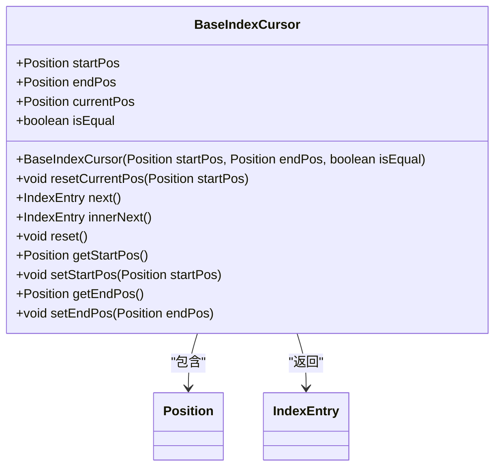

**图来源**
- [BaseIndexCursor.java](file://src/main/java/alchemystar/freedom/access/BaseIndexCursor.java)

**节来源**
- [BaseIndexCursor.java](file://src/main/java/alchemystar/freedom/access/BaseIndexCursor.java)

### Position分析
Position表示索引中的位置，包含节点和位置信息。

#### 类图
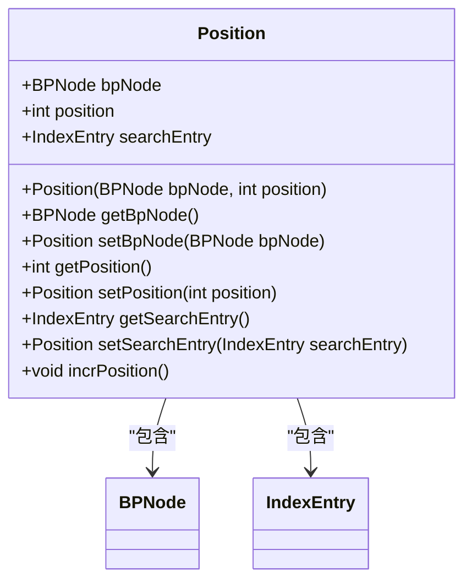

**图来源**
- [Position.java](file://src/main/java/alchemystar/freedom/index/bp/Position.java)

**节来源**
- [Position.java](file://src/main/java/alchemystar/freedom/index/bp/Position.java)

## 依赖分析
存储引擎的组件之间存在紧密的依赖关系。BPTree依赖于BPNode和BpPage，BPNode依赖于BpPage和BPTree，BpPage依赖于Page和BPNode，Page依赖于PageHeaderData和BufferWrapper，PagePool依赖于Page和PageFactory，FStore依赖于Page和FileUtils，BaseIndexCursor依赖于Position和BPTree。

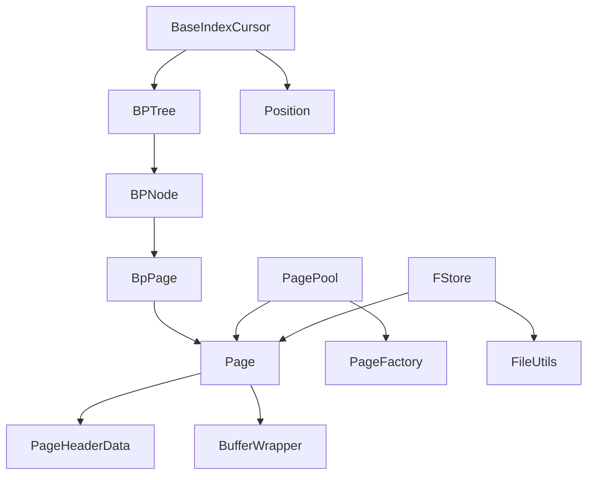

**图来源**
- [BPTree.java](file://src/main/java/alchemystar/freedom/index/bp/BPTree.java)
- [BPNode.java](file://src/main/java/alchemystar/freedom/index/bp/BPNode.java)
- [BpPage.java](file://src/main/java/alchemystar/freedom/index/bp/BpPage.java)
- [Page.java](file://src/main/java/alchemystar/freedom/store/page/Page.java)
- [PageHeaderData.java](file://src/main/java/alchemystar/freedom/store/page/PageHeaderData.java)
- [BufferWrapper.java](file://src/main/java/alchemystar/freedom/util/BufferWrapper.java)
- [PagePool.java](file://src/main/java/alchemystar/freedom/store/page/PagePool.java)
- [PageFactory.java](file://src/main/java/alchemystar/freedom/store/page/PageFactory.java)
- [FStore.java](file://src/main/java/alchemystar/freedom/store/fs/FStore.java)
- [FileUtils.java](file://src/main/java/alchemystar/freedom/store/fs/FileUtils.java)
- [BaseIndexCursor.java](file://src/main/java/alchemystar/freedom/access/BaseIndexCursor.java)
- [Position.java](file://src/main/java/alchemystar/freedom/index/bp/Position.java)

**节来源**
- [BPTree.java](file://src/main/java/alchemystar/freedom/index/bp/BPTree.java)
- [BPNode.java](file://src/main/java/alchemystar/freedom/index/bp/BPNode.java)
- [BpPage.java](file://src/main/java/alchemystar/freedom/index/bp/BpPage.java)
- [Page.java](file://src/main/java/alchemystar/freedom/store/page/Page.java)
- [PageHeaderData.java](file://src/main/java/alchemystar/freedom/store/page/PageHeaderData.java)
- [BufferWrapper.java](file://src/main/java/alchemystar/freedom/util/BufferWrapper.java)
- [PagePool.java](file://src/main/java/alchemystar/freedom/store/page/PagePool.java)
- [PageFactory.java](file://src/main/java/alchemystar/freedom/store/page/PageFactory.java)
- [FStore.java](file://src/main/java/alchemystar/freedom/store/fs/FStore.java)
- [FileUtils.java](file://src/main/java/alchemystar/freedom/store/fs/FileUtils.java)
- [BaseIndexCursor.java](file://src/main/java/alchemystar/freedom/access/BaseIndexCursor.java)
- [Position.java](file://src/main/java/alchemystar/freedom/index/bp/Position.java)

## 性能考虑
存储引擎的性能优化主要体现在以下几个方面：
1. **页面缓存策略**：通过PagePool管理内存中的数据页，减少频繁的内存分配和回收。
2. **预读机制**：在读取页面数据时，预读相邻的页面，提高数据访问的局部性。
3. **I/O优化技术**：通过FStore将页面数据批量写入文件系统，减少I/O操作的次数。

## 故障排除指南
在使用存储引擎时，可能会遇到以下问题：
1. **内存不足**：检查PagePool的配置，确保有足够的内存用于数据页的分配。
2. **文件系统错误**：检查FStore的配置，确保文件路径正确，文件系统有足够的空间。
3. **索引损坏**：检查BPTree的配置，确保索引结构正确，数据一致性得到保证。

**节来源**
- [PagePool.java](file://src/main/java/alchemystar/freedom/store/page/PagePool.java)
- [FStore.java](file://src/main/java/alchemystar/freedom/store/fs/FStore.java)
- [BPTree.java](file://src/main/java/alchemystar/freedom/index/bp/BPTree.java)

## 结论
本文档详细描述了存储引擎的架构设计，重点聚焦于B+树索引与页面管理的协同工作机制。通过深入分析BPTree、BPNode、BpPage、Page、PagePool、FStore、BaseIndexCursor和Position等核心组件，展示了存储引擎如何实现高效的键值存储和查询功能。同时，文档还讨论了页面缓存策略、预读机制和I/O优化技术，为存储引擎的性能优化提供了指导。通过数据页结构布局图，分析了空间利用率和访问局部性，并讨论了存储引擎的扩展性与性能瓶颈。