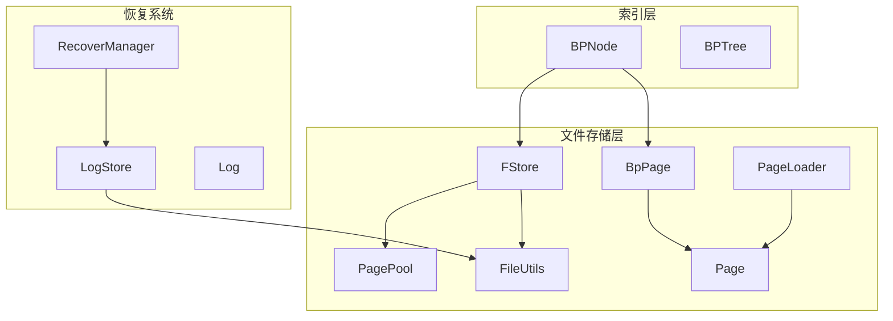
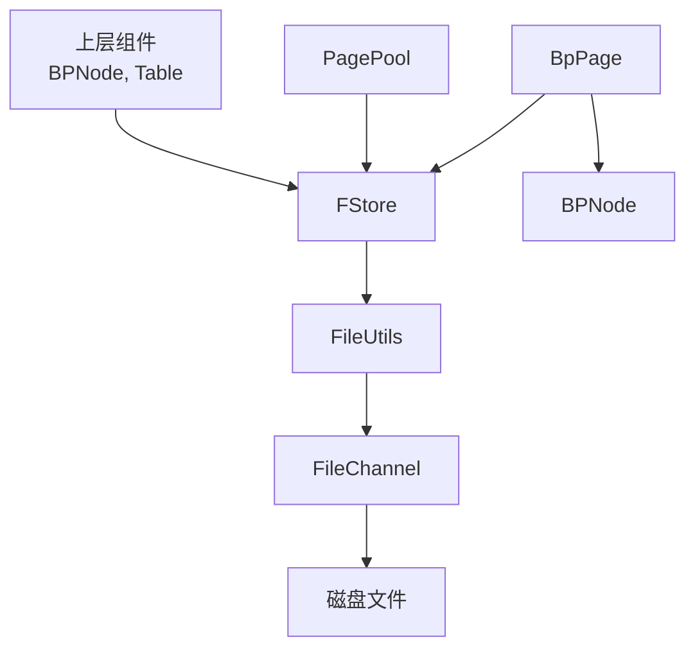
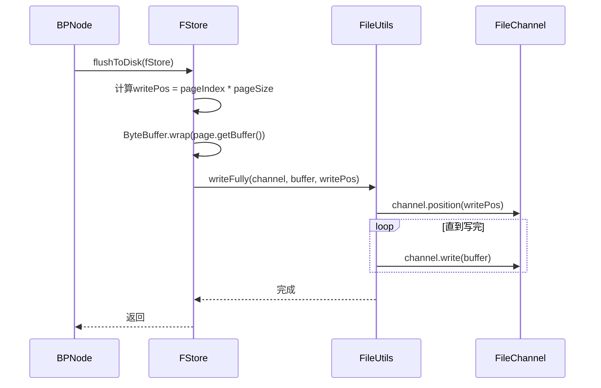
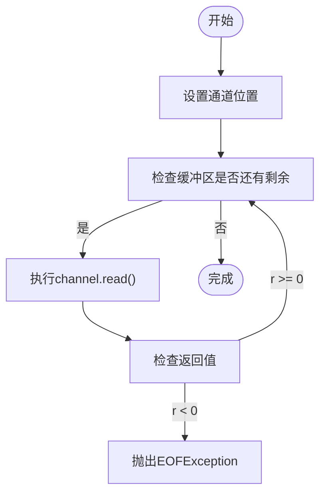
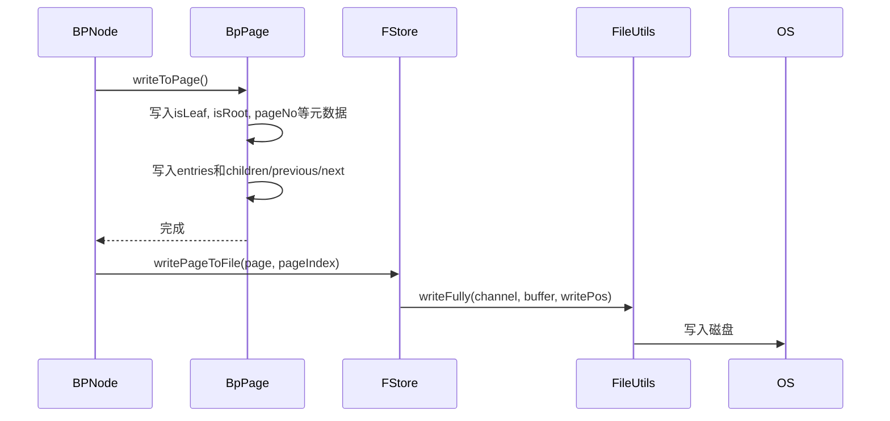
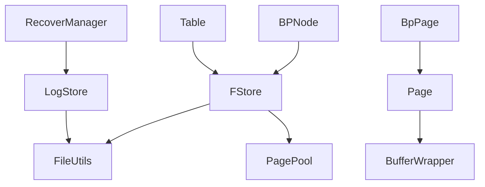

# 文件系统接口

<cite>
**本文档引用文件**  
- [FStore.java](file://src/main/java/alchemystar/freedom/store/fs/FStore.java)
- [FileUtils.java](file://src/main/java/alchemystar/freedom/store/fs/FileUtils.java)
- [BpPage.java](file://src/main/java/alchemystar/freedom/index/bp/BpPage.java)
- [Page.java](file://src/main/java/alchemystar/freedom/store/page/Page.java)
- [PagePool.java](file://src/main/java/alchemystar/freedom/store/page/PagePool.java)
- [PageLoader.java](file://src/main/java/alchemystar/freedom/store/page/PageLoader.java)
- [RecoverManager.java](file://src/main/java/alchemystar/freedom/recovery/RecoverManager.java)
- [LogStore.java](file://src/main/java/alchemystar/freedom/store/log/LogStore.java)
- [Table.java](file://src/main/java/alchemystar/freedom/meta/Table.java)
- [BPNode.java](file://src/main/java/alchemystar/freedom/index/bp/BPNode.java)
</cite>

## 目录
1. [引言](#引言)
2. [项目结构](#项目结构)
3. [核心组件](#核心组件)
4. [架构概述](#架构概述)
5. [详细组件分析](#详细组件分析)
6. [依赖分析](#依赖分析)
7. [性能考虑](#性能考虑)
8. [故障排除指南](#故障排除指南)
9. [结论](#结论)

## 引言
本文档旨在全面描述Freedom数据库系统中文件存储层的设计与实现，重点聚焦于`FStore`类如何将内存中的页面持久化到磁盘文件。文档详细阐述了文件读写接口、页面偏移计算机制、I/O模式选择策略（直接I/O与缓冲I/O），并解析了`FileUtils`工具类在路径处理、文件创建和目录管理中的作用。结合`BpPage`的落盘流程，说明数据一致性保障机制、文件扩展策略和错误恢复方法。同时分析文件系统对存储性能的影响，提供磁盘布局建议和I/O调度优化技巧，并列举常见的文件访问异常及其解决方案。

## 项目结构
文件存储相关的核心代码位于`src/main/java/alchemystar/freedom/store/fs`包下，主要包括`FStore`和`FileUtils`两个核心类。`FStore`负责页面级别的读写操作，而`FileUtils`提供了底层文件通道的管理与数据传输功能。页面数据结构定义在`store/page`包中，B+树索引页面的实现位于`index/bp`包中。整个存储层与事务恢复模块（`recovery`）和日志系统（`log`）紧密协作，确保数据的持久性和一致性。

**图示来源**  
- [FStore.java](file://src/main/java/alchemystar/freedom/store/fs/FStore.java)
- [FileUtils.java](file://src/main/java/alchemystar/freedom/store/fs/FileUtils.java)
- [BpPage.java](file://src/main/java/alchemystar/freedom/index/bp/BpPage.java)
- [Page.java](file://src/main/java/alchemystar/freedom/store/page/Page.java)
- [PagePool.java](file://src/main/java/alchemystar/freedom/store/page/PagePool.java)
- [PageLoader.java](file://src/main/java/alchemystar/freedom/store/page/PageLoader.java)
- [BPNode.java](file://src/main/java/alchemystar/freedom/index/bp/BPNode.java)
- [LogStore.java](file://src/main/java/alchemystar/freedom/store/log/LogStore.java)

**本节来源**  
- [FStore.java](file://src/main/java/alchemystar/freedom/store/fs/FStore.java)
- [FileUtils.java](file://src/main/java/alchemystar/freedom/store/fs/FileUtils.java)

## 核心组件
文件存储层的核心是`FStore`类，它封装了对单个数据文件的读写操作。`FStore`通过`FileChannel`与操作系统交互，利用`FileUtils`提供的工具方法进行安全的I/O操作。`Page`类是内存中页面的通用表示，而`BpPage`是专为B+树节点设计的特殊页面类型，能够序列化和反序列化`BPNode`对象。`PagePool`负责页面的分配与回收，`PageLoader`则用于从原始字节流中重建页面内容。这些组件协同工作，实现了内存与磁盘之间的高效数据交换。

**本节来源**  
- [FStore.java](file://src/main/java/alchemystar/freedom/store/fs/FStore.java#L1-L96)
- [Page.java](file://src/main/java/alchemystar/freedom/store/page/Page.java#L1-L208)
- [BpPage.java](file://src/main/java/alchemystar/freedom/index/bp/BpPage.java#L1-L205)
- [PagePool.java](file://src/main/java/alchemystar/freedom/store/page/PagePool.java)
- [PageLoader.java](file://src/main/java/alchemystar/freedom/store/page/PageLoader.java)

## 架构概述
文件存储层的架构设计遵循分层原则。最上层是`FStore`，它为上层索引和表管理器提供页面级别的读写接口。中间层是`FileUtils`，它屏蔽了`FileChannel`的复杂性，提供了`readFully`和`writeFully`等原子性保证的I/O方法。底层是`java.nio.channels.FileChannel`，它提供了对文件的随机访问能力。`BpPage`作为`Page`的子类，实现了B+树节点的序列化协议，确保了索引结构的持久化。整个架构通过`PagePool`实现了内存页面的高效复用，减少了垃圾回收压力。

**图示来源**  
- [FStore.java](file://src/main/java/alchemystar/freedom/store/fs/FStore.java#L1-L96)
- [FileUtils.java](file://src/main/java/alchemystar/freedom/store/fs/FileUtils.java#L1-L73)
- [BpPage.java](file://src/main/java/alchemystar/freedom/index/bp/BpPage.java#L1-L205)
- [BPNode.java](file://src/main/java/alchemystar/freedom/index/bp/BPNode.java)

## 详细组件分析

### FStore 类分析
`FStore`类是文件存储的核心，负责管理一个数据文件的生命周期和I/O操作。

#### 文件读写接口
`FStore`提供了`readPageFromFile`和`writePageToFile`两个核心方法。`readPageFromFile`根据页面索引计算文件偏移量（`pageIndex * DEFAULT_PAGE_SIZE`），然后使用`FileUtils.readFully`将整个页面读入缓冲区。`writePageToFile`则将`Page`对象的字节缓冲区写入指定的页面位置。这些操作保证了页面的原子性读写。

**图示来源**  
- [FStore.java](file://src/main/java/alchemystar/freedom/store/fs/FStore.java#L50-L78)
- [FileUtils.java](file://src/main/java/alchemystar/freedom/store/fs/FileUtils.java#L35-L45)

#### 页面偏移计算
页面偏移量的计算非常直接，采用`pageIndex * SystemConfig.DEFAULT_PAGE_SIZE`的公式。这种固定大小的页面设计简化了寻址逻辑，使得随机访问任意页面的时间复杂度为O(1)。

**本节来源**  
- [FStore.java](file://src/main/java/alchemystar/freedom/store/fs/FStore.java#L50-L51)
- [FStore.java](file://src/main/java/alchemystar/freedom/store/fs/FStore.java#L63-L64)

#### I/O 模式选择策略
当前实现中，`FileUtils`使用的是标准的`FileChannel`进行I/O操作。`readFully`和`writeFully`方法通过循环调用`read`和`write`来确保数据完全传输，这本质上是缓冲I/O。虽然代码中没有显式使用直接I/O（Direct I/O），但`ByteBuffer.allocate`创建的是堆内缓冲区，数据在JVM和操作系统之间需要复制。若要实现真正的直接I/O，应使用`ByteBuffer.allocateDirect`。

**本节来源**  
- [FileUtils.java](file://src/main/java/alchemystar/freedom/store/fs/FileUtils.java#L25-L45)

### FileUtils 工具类分析
`FileUtils`是一个静态工具类，封装了文件操作的常见任务。

#### 路径处理与文件管理
`FileUtils`通过`exists`方法检查文件是否存在，`open`方法以读写模式（"rw"）打开文件并返回`FileChannel`，`closeFile`方法安全地关闭通道。这些方法简化了文件资源的管理，避免了重复代码。

**本节来源**  
- [FileUtils.java](file://src/main/java/alchemystar/freedom/store/fs/FileUtils.java#L10-L33)

#### 原子性I/O操作
`readFully`和`writeFully`是`FileUtils`的关键方法。它们通过循环操作确保指定的字节缓冲区被完全读取或写入，即使底层I/O操作可能被中断或只完成部分传输。这为上层提供了原子性保证，防止了部分读写导致的数据损坏。

**图示来源**  
- [FileUtils.java](file://src/main/java/alchemystar/freedom/store/fs/FileUtils.java#L25-L33)

### BpPage 落盘流程分析
`BpPage`的落盘是确保B+树索引持久化的关键。

#### 数据一致性保障
`BpPage`通过`writeToPage`方法将`BPNode`的状态序列化到其字节缓冲区中。这个过程包括写入节点类型（叶子/非叶子）、根节点标志、页面号、父节点号、条目数、所有条目以及子节点号（非叶子）或前后兄弟节点号（叶子）。`FStore`随后将这个完整的缓冲区写入磁盘。由于`writeFully`的原子性，整个页面的写入是原子的，保证了单个页面内的数据一致性。

#### 文件扩展策略
当前代码中没有显式的文件扩展逻辑。当尝试写入一个超出当前文件大小的页面时，`FileChannel`会自动扩展文件。这是一种简单的扩展策略，但可能导致文件碎片。更高级的策略可能包括预分配文件空间或使用稀疏文件。

#### 错误恢复方法
数据一致性不仅依赖于原子写入，还依赖于事务日志（WAL）。`RecoverManager`在系统重启时会重放`LogStore`中的日志，将数据库恢复到一致状态。即使某个`writePageToFile`操作在中途崩溃，日志也能确保未完成的事务被回滚或已完成的事务被重做。

**图示来源**  
- [BpPage.java](file://src/main/java/alchemystar/freedom/index/bp/BpPage.java#L100-L180)
- [FStore.java](file://src/main/java/alchemystar/freedom/store/fs/FStore.java#L70-L78)
- [FileUtils.java](file://src/main/java/alchemystar/freedom/store/fs/FileUtils.java#L35-L45)

**本节来源**  
- [BpPage.java](file://src/main/java/alchemystar/freedom/index/bp/BpPage.java#L100-L180)
- [FStore.java](file://src/main/java/alchemystar/freedom/store/fs/FStore.java#L70-L78)
- [RecoverManager.java](file://src/main/java/alchemystar/freedom/recovery/RecoverManager.java#L15-L25)

## 依赖分析
文件存储层与其他模块存在紧密的依赖关系。`FStore`被`BPNode`用于持久化节点数据，也被`Table`用于存储元数据。`FileUtils`被`FStore`和`LogStore`共同使用，体现了其作为底层I/O工具的通用性。`Page`和`BpPage`依赖于`BufferWrapper`进行字节操作，而`PagePool`为`FStore`提供页面实例。`RecoverManager`依赖`LogStore`加载日志，间接依赖`FileUtils`进行文件读取。

**图示来源**  
- [FStore.java](file://src/main/java/alchemystar/freedom/store/fs/FStore.java)
- [FileUtils.java](file://src/main/java/alchemystar/freedom/store/fs/FileUtils.java)
- [BPNode.java](file://src/main/java/alchemystar/freedom/index/bp/BPNode.java)
- [Table.java](file://src/main/java/alchemystar/freedom/meta/Table.java)
- [LogStore.java](file://src/main/java/alchemystar/freedom/store/log/LogStore.java)
- [RecoverManager.java](file://src/main/java/alchemystar/freedom/recovery/RecoverManager.java)

**本节来源**  
- [FStore.java](file://src/main/java/alchemystar/freedom/store/fs/FStore.java)
- [FileUtils.java](file://src/main/java/alchemystar/freedom/store/fs/FileUtils.java)
- [BPNode.java](file://src/main/java/alchemystar/freedom/index/bp/BPNode.java)
- [Table.java](file://src/main/java/alchemystar/freedom/meta/Table.java)
- [LogStore.java](file://src/main/java/alchemystar/freedom/store/log/LogStore.java)
- [RecoverManager.java](file://src/main/java/alchemystar/freedom/recovery/RecoverManager.java)

## 性能考虑
文件I/O是数据库性能的瓶颈之一。`FStore`的固定页面大小设计有利于预读和缓存。使用`FileChannel`和`ByteBuffer`可以利用操作系统的页缓存。然而，当前的缓冲I/O模式可能会导致数据在JVM堆和操作系统内核之间复制，引入额外开销。对于高吞吐量场景，可以考虑使用直接缓冲区（Direct Buffer）来减少复制。此外，`PagePool`避免了频繁的页面对象创建和销毁，显著降低了GC压力。文件的随机访问模式（通过页面索引）适合SSD，但在HDD上可能因寻道时间而性能下降。建议将数据文件放置在I/O性能良好的磁盘上，并考虑使用RAID或SSD来提升性能。

**本节来源**  
- [FStore.java](file://src/main/java/alchemystar/freedom/store/fs/FStore.java)
- [PagePool.java](file://src/main/java/alchemystar/freedom/store/page/PagePool.java)
- [FileUtils.java](file://src/main/java/alchemystar/freedom/store/fs/FileUtils.java)

## 故障排除指南
以下是文件存储层可能遇到的常见问题及解决方案：

- **文件无法打开**：检查文件路径是否正确，进程是否有读写权限。确保父目录存在。
- **EOFException**：在读取页面时抛出，通常表示请求的页面索引超出了文件的当前大小。这可能是正常的（文件尚未扩展到该页面），也可能是数据损坏的迹象。应结合日志系统检查是否有未完成的写入操作。
- **IOException**：通用I/O错误，可能由磁盘故障、权限问题或文件系统错误引起。检查系统日志和磁盘健康状况。
- **数据不一致**：如果怀疑数据损坏，应首先尝试使用`RecoverManager`进行恢复。如果失败，可能需要从备份恢复。
- **性能低下**：监控I/O等待时间。如果很高，考虑优化磁盘布局、增加内存以扩大页缓存，或升级到更快的存储设备。

**本节来源**  
- [FStore.java](file://src/main/java/alchemystar/freedom/store/fs/FStore.java#L55-L58)
- [FileUtils.java](file://src/main/java/alchemystar/freedom/store/fs/FileUtils.java#L28-L30)
- [RecoverManager.java](file://src/main/java/alchemystar/freedom/recovery/RecoverManager.java#L15-L25)

## 结论
`FStore`和`FileUtils`构成了Freedom数据库文件存储层的基石。它们通过简洁的设计实现了页面的可靠持久化。`FStore`提供了高层的页面读写接口，而`FileUtils`确保了底层I/O的原子性和安全性。`BpPage`的序列化协议保证了B+树索引结构的一致性。结合事务日志的恢复机制，系统能够在崩溃后恢复到一致状态。尽管当前实现主要依赖缓冲I/O，但其架构为未来引入直接I/O或异步I/O等优化留下了空间。整体而言，该文件存储层设计合理，为上层提供了稳定、高效的数据持久化服务。