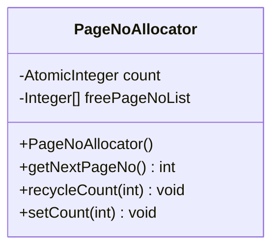
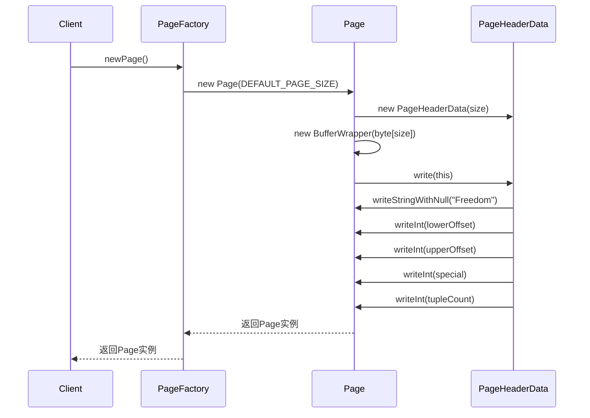

# 页面分配

<cite>
**本文档引用的文件**  
- [PageNoAllocator.java](file://src/main/java/alchemystar/freedom/store/page/PageNoAllocator.java)
- [PageFactory.java](file://src/main/java/alchemystar/freedom/store/page/PageFactory.java)
- [Page.java](file://src/main/java/alchemystar/freedom/store/page/Page.java)
- [PageHeaderData.java](file://src/main/java/alchemystar/freedom/store/page/PageHeaderData.java)
- [BaseIndex.java](file://src/main/java/alchemystar/freedom/index/BaseIndex.java)
</cite>

## 目录
1. [引言](#引言)
2. [PageNoAllocator页号分配机制](#pagenoallocator页号分配机制)
3. [PageFactory页面创建流程](#pagefactory页面创建流程)
4. [空闲页列表管理与写入性能](#空闲页列表管理与写入性能)
5. [大规模数据插入的扩展性优化方向](#大规模数据插入的扩展性优化方向)
6. [结论](#结论)

## 引言
本文档旨在深入分析Freedom数据库系统中页面管理的核心机制，重点阐述`PageNoAllocator`如何高效管理数据文件中页面编号的分配与回收，确保页号的唯一性与空间复用效率。同时，分析`PageFactory`在创建新页面时的初始化流程，并探讨空闲页列表管理机制对写入性能的影响，为大规模数据场景下的系统优化提供理论依据。

## PageNoAllocator页号分配机制

`PageNoAllocator`是系统中负责页号分配与回收的核心组件，其设计目标是保证页号的全局唯一性，并通过回收机制实现存储空间的高效复用。

该类维护两个关键状态：
- `count`：一个原子整数，记录当前已分配的最大页号，初始值为1（0号页保留给元数据页）。
- `freePageNoList`：一个链表，用于存储已被回收的页号。

页号分配流程如下：
1. 调用`getNextPageNo()`方法时，首先检查`freePageNoList`是否为空。
2. 若为空，则从`count`获取下一个连续的页号并递增，确保新页号的唯一性。
3. 若不为空，则从列表头部移除一个页号并返回，实现了对已删除页空间的复用。

页号回收流程通过`recycleCount(int pageNo)`方法实现，将指定的页号添加到`freePageNoList`中，等待后续分配。此外，`setCount(int lastPageNo)`方法用于在从磁盘重新加载数据时，重置`count`的值，确保内存状态与磁盘状态一致。

**图示来源**
- [PageNoAllocator.java](file://src/main/java/alchemystar/freedom/store/page/PageNoAllocator.java#L1-L40)

**本节来源**
- [PageNoAllocator.java](file://src/main/java/alchemystar/freedom/store/page/PageNoAllocator.java#L1-L40)
- [BaseIndex.java](file://src/main/java/alchemystar/freedom/index/BaseIndex.java#L50-L55)

## PageFactory页面创建流程

`PageFactory`是页面对象的工厂类，负责创建不同类型的页面实例。它采用单例模式，确保全局只有一个实例。

当需要创建一个普通数据页时，调用`newPage()`方法。该方法会：
1. 使用`SystemConfig.DEFAULT_PAGE_SIZE`作为默认大小。
2. 调用`Page`类的构造函数，传入页面大小。

在`Page`的构造函数中，会执行以下初始化流程：
1. 创建`PageHeaderData`实例，用于管理页面头信息。
2. 初始化`BufferWrapper`，分配指定大小的字节数组作为页面的底层存储。
3. 调用`pageHeaderData.write(this)`方法，将页面头信息（如magic word、偏移量等）写入底层字节数组的起始位置。
4. 将`dirty`标志位设置为`false`，表示页面尚未被修改。

对于B+树索引页（`BpPage`），`PageFactory`提供了`newBpPage(BPNode bpNode)`方法，创建一个与特定`BPNode`关联的索引页。

**图示来源**
- [PageFactory.java](file://src/main/java/alchemystar/freedom/store/page/PageFactory.java#L1-L30)
- [Page.java](file://src/main/java/alchemystar/freedom/store/page/Page.java#L1-L20)
- [PageHeaderData.java](file://src/main/java/alchemystar/freedom/store/page/PageHeaderData.java#L1-L20)

**本节来源**
- [PageFactory.java](file://src/main/java/alchemystar/freedom/store/page/PageFactory.java#L1-L30)
- [Page.java](file://src/main/java/alchemystar/freedom/store/page/Page.java#L1-L20)
- [PageHeaderData.java](file://src/main/java/alchemystar/freedom/store/page/PageHeaderData.java#L1-L20)

## 空闲页列表管理与写入性能

空闲页列表（`freePageNoList`）是`PageNoAllocator`实现空间复用的关键机制。其管理策略直接影响系统的写入性能。

**管理机制分析：**
- **数据结构选择**：使用`LinkedList<Integer>`作为底层存储。`LinkedList`在头部插入和移除操作上具有O(1)的时间复杂度，非常适合“先进先出”或“后进先出”的回收再利用场景。
- **分配策略**：优先从`freePageNoList`中分配页号。这确保了被删除页面的空间能够被快速重用，避免了文件的无限增长。
- **回收策略**：当一个页面被删除或清空时，其页号通过`recycleCount`方法被加入列表。这种延迟回收机制减少了直接操作磁盘的频率。

**对写入性能的影响：**
- **正面影响**：
  1. **减少磁盘I/O**：通过复用旧页号，避免了为新数据分配连续物理空间的需求，减少了文件扩展操作。
  2. **提高缓存命中率**：频繁访问的页号可能在内存中保持活跃，复用这些页号有助于维持缓存的局部性。
- **潜在瓶颈**：
  1. **线程安全问题**：代码注释明确指出`// todo thread-safe`。当前的`LinkedList`和`AtomicInteger`组合并不能保证整个分配/回收操作的原子性，在高并发场景下可能导致页号冲突或列表状态不一致，成为性能瓶颈。
  2. **列表增长**：在频繁删除和插入的场景下，`freePageNoList`可能持续增长，增加内存开销和遍历成本。

## 大规模数据插入的扩展性优化方向

在大规模数据插入场景下，当前的页面管理机制面临挑战，可从以下几个方向进行优化：

1.  **线程安全增强**：
    - 将`freePageNoList`替换为线程安全的集合，如`ConcurrentLinkedQueue<Integer>`，确保在多线程环境下的操作安全。
    - 或者，采用分段锁（Striped Lock）技术，将页号空间划分为多个区间，每个区间由独立的`PageNoAllocator`实例管理，减少锁竞争。

2.  **批量分配优化**：
    - 实现`getNextPageNos(int count)`方法，支持一次性分配多个连续页号。这可以显著减少在批量插入时的函数调用开销。
    - 预分配策略：在系统启动或空闲时，预先分配一批页号并放入`freePageNoList`，以应对突发的写入压力。

3.  **智能回收策略**：
    - 引入LRU（最近最少使用）或LFU（最不经常使用）算法，优先回收长期未被访问的页号，优化内存和磁盘的使用效率。
    - 结合`PagePool`（页池）机制，将回收的页号与物理页面对象绑定，实现“页号+物理页”的整体回收与再利用，减少对象创建的开销。

4.  **空间预分配与文件管理**：
    - 在文件系统层面，预先分配大块连续空间，避免因频繁扩展文件导致的碎片化。
    - 实现更复杂的空闲空间位图（Free Space Bitmap），替代简单的链表，以O(1)时间复杂度查找空闲页，提升分配效率。

## 结论
`PageNoAllocator`和`PageFactory`共同构成了Freedom数据库页面管理的基础。`PageNoAllocator`通过计数器与空闲列表的结合，有效保证了页号的唯一性和空间复用。`PageFactory`则标准化了页面的创建与初始化流程。尽管当前设计在单线程下表现良好，但其线程安全缺陷是主要的扩展性瓶颈。未来优化应聚焦于提升并发性能、实现批量操作和引入更智能的回收策略，以满足大规模数据处理的需求。