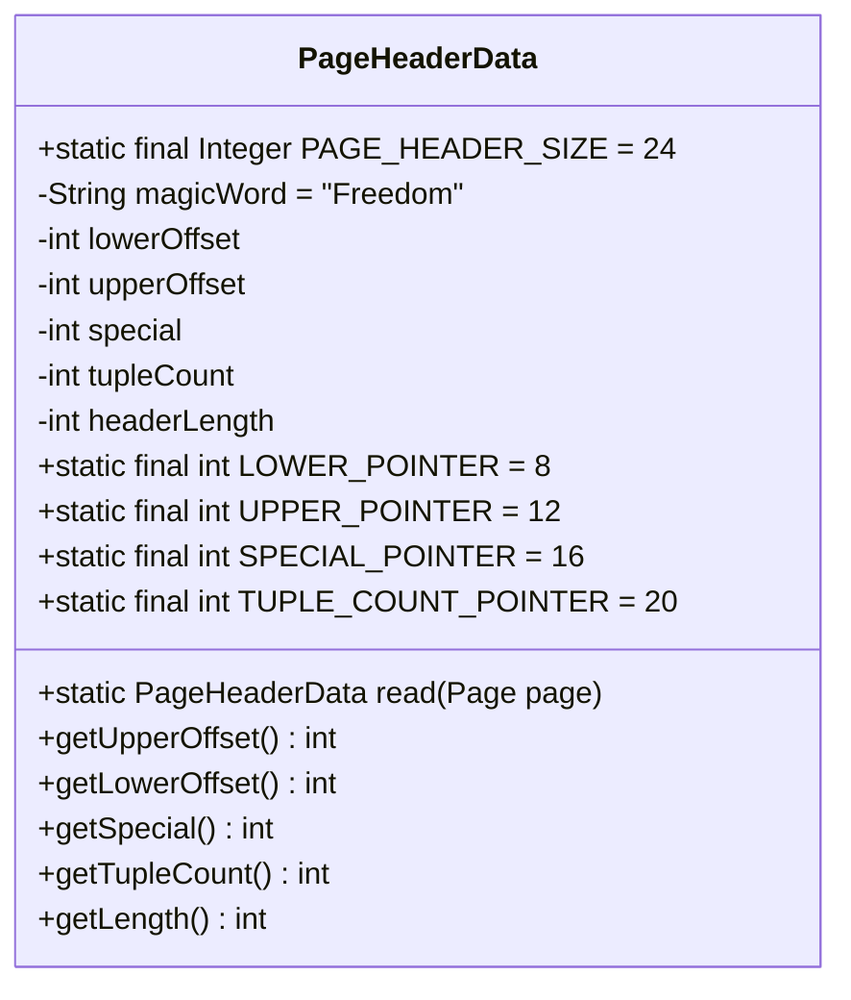
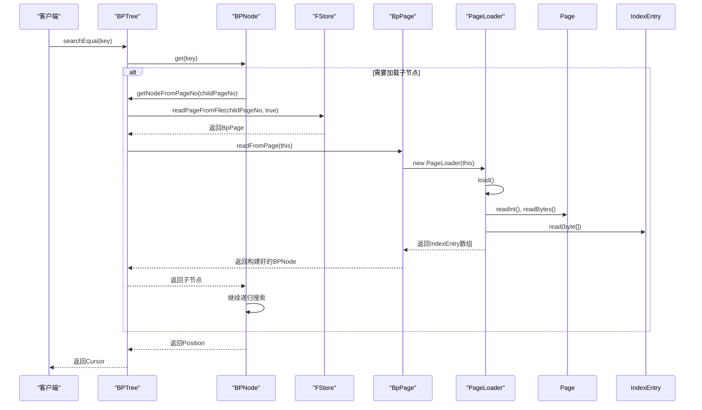

# 页面加载

<cite>
**本文档中引用的文件**  
- [PageLoader.java](file://src/main/java/alchemystar/freedom/store/page/PageLoader.java)
- [PageHeaderData.java](file://src/main/java/alchemystar/freedom/store/page/PageHeaderData.java)
- [Page.java](file://src/main/java/alchemystar/freedom/store/page/Page.java)
- [BpPage.java](file://src/main/java/alchemystar/freedom/index/bp/BpPage.java)
- [BPTree.java](file://src/main/java/alchemystar/freedom/index/bp/BPTree.java)
- [FStore.java](file://src/main/java/alchemystar/freedom/store/fs/FStore.java)
- [IndexEntry.java](file://src/main/java/alchemystar/freedom/meta/IndexEntry.java)
- [ItemPointer.java](file://src/main/java/alchemystar/freedom/store/item/ItemPointer.java)
</cite>

## 目录
1. [引言](#引言)
2. [页面加载核心流程](#页面加载核心流程)
3. [PageHeaderData元信息解析](#pageheaderdata元信息解析)
4. [页面校验与损坏识别](#页面校验与损坏识别)
5. [B+树节点读取调用链路](#b+树节点读取调用链路)
6. [异常处理最佳实践](#异常处理最佳实践)
7. [总结](#总结)

## 引言
本文档详细说明了Freedom数据库系统中`PageLoader`如何从持久化存储中读取原始字节流并解析为结构化`Page`对象的完整过程。重点阐述了`PageHeaderData`中关键元信息（如页面类型、页号、使用状态等）的解析逻辑，解释了页面校验机制、损坏页的识别与恢复策略。同时，结合B+树索引访问场景，展示了页面加载在查询过程中的完整调用链路，并提供了相关的异常处理最佳实践。

## 页面加载核心流程

`PageLoader`是负责将存储在磁盘上的原始字节流解析为内存中结构化`Page`对象的核心组件。其加载流程始于从持久化存储（`FStore`）读取一个完整的页面字节缓冲区，然后通过`PageHeaderData`解析出页面的元信息，最后根据元信息定位并反序列化出存储在页面中的所有元组（`IndexEntry`）。

整个流程的入口是`PageLoader.load()`方法。该方法首先调用`PageHeaderData.read(page)`静态方法，从`Page`对象的字节缓冲区中读取并构建出`PageHeaderData`实例。`PageHeaderData`包含了页面的结构定义，其中`getTupleCount()`方法返回了该页面中有效元组的数量，`getLength()`方法返回了页面头部的总长度，这为后续读取元组指针提供了起始偏移量。

在获取了元组数量和头部长度后，`PageLoader`会循环读取每个元组。它首先从页面中读取一个`ItemPointer`，该指针包含了元组在页面中的偏移量（`offset`）和长度（`tupleLength`）。如果读取到的`tupleLength`为-1，则表明该元组已被删除，`PageLoader`会跳过此条目。对于有效的元组，`PageLoader`会调用`page.readBytes(ptr.getOffset(), ptr.getTupleLength())`从指定的偏移位置读取指定长度的原始字节。最后，这些原始字节被传递给`IndexEntry.read(byte[])`方法，由`IndexEntry`完成反序列化，最终将所有有效的`IndexEntry`对象存储在一个数组中，完成整个页面的加载。

**Section sources**
- [PageLoader.java](file://src/main/java/alchemystar/freedom/store/page/PageLoader.java#L15-L58)
- [PageHeaderData.java](file://src/main/java/alchemystar/freedom/store/page/PageHeaderData.java#L80-L100)
- [IndexEntry.java](file://src/main/java/alchemystar/freedom/meta/IndexEntry.java#L90-L120)
- [ItemPointer.java](file://src/main/java/alchemystar/freedom/store/item/ItemPointer.java#L25-L30)

## PageHeaderData元信息解析

`PageHeaderData`类定义了每个页面开头的固定结构，它存储了所有关于页面布局和状态的关键元信息。这些信息对于正确解析页面内容至关重要。

`PageHeaderData`的结构和解析过程如下：
1.  **Magic Word (魔数)**: 页面的前几个字节是一个固定的字符串"Freedom"。这是一个校验标识，用于快速判断一个数据块是否为有效的页面。在`read(Page page)`方法中，首先通过`page.readStringWithNull()`读取这个字符串，如果读取结果不等于"Freedom"，则可以立即判定页面已损坏。
2.  **Lower Offset (下部偏移)**: 一个4字节的整数，记录了页面中已分配的元组数据区的结束位置，即下一个新元组将要写入的起始偏移量。该值在`LOWER_POINTER`（偏移量8）处存储。
3.  **Upper Offset (上部偏移)**: 一个4字节的整数，记录了页面中空闲空间的结束位置，即从页面末尾开始向前，可用空间的边界。该值在`UPPER_POINTER`（偏移量12）处存储。`lowerOffset`和`upperOffset`之间的区域即为当前页面的空闲空间。
4.  **Special (特殊区域)**: 一个4字节的整数，记录了页面末尾特殊区域的起始偏移量。该值在`SPECIAL_POINTER`（偏移量16）处存储。特殊区域通常用于存储与页面类型相关的特定数据，例如B+树节点的元数据。
5.  **Tuple Count (元组计数)**: 一个4字节的整数，记录了页面中当前有效元组的数量。该值在`TUPLE_COUNT_POINTER`（偏移量20）处存储。这是`PageLoader`确定需要读取多少个元组的关键依据。

`PageHeaderData`的`read`方法严格按照上述顺序和偏移量从`Page`的字节缓冲区中读取这些字段，并将其封装成一个`PageHeaderData`对象。这些元信息共同定义了页面的内部结构，使得`PageLoader`能够准确地定位和读取每一个元组。

**Diagram sources**
- [PageHeaderData.java](file://src/main/java/alchemystar/freedom/store/page/PageHeaderData.java#L10-L40)

**Section sources**
- [PageHeaderData.java](file://src/main/java/alchemystar/freedom/store/page/PageHeaderData.java#L10-L130)

## 页面校验与损坏识别

系统通过多层次的机制来校验页面的完整性和识别损坏的页面，确保数据访问的可靠性。

1.  **魔数校验 (Magic Word Check)**: 这是最基础也是最快速的校验。在`PageHeaderData.read()`方法的开始，系统会读取并验证`magicWord`是否为"Freedom"。如果校验失败，说明该数据块不是有效的页面，或者数据已严重损坏，系统会立即抛出异常或返回错误，阻止后续的解析操作。
2.  **边界校验 (Boundary Check)**: 在解析`ItemPointer`时，系统会检查其`offset`和`tupleLength`是否在有效范围内。例如，`offset`必须大于`PageHeaderData.getLength()`（即头部之后），且`offset + tupleLength`不能超过`special`区域的起始位置。如果发现指针指向了非法区域，可以判定页面结构已损坏。
3.  **元组计数一致性校验**: `PageHeaderData`中记录的`tupleCount`应与实际能成功读取的有效元组数量一致。`PageLoader`在加载过程中会维护一个临时列表，最终将列表大小与`tupleCount`进行比较。虽然代码中允许因删除操作导致计数不完全一致（以临时列表为准），但一个巨大的差异可能暗示着数据损坏。
4.  **数据反序列化校验**: 在`IndexEntry.read(byte[])`方法中，反序列化过程本身也是一种校验。该方法会逐个读取`Value`类型的标识符和长度，然后读取相应字节。如果在读取过程中发生`BufferUnderflowException`（缓冲区不足）或遇到不支持的`Value`类型，都表明原始字节流的结构已损坏。

对于识别出的损坏页，系统目前的策略是依赖上层调用者进行处理。例如，在`FStore.readPageFromFile()`方法中，如果在读取文件时捕获到`EOFException`，会直接返回`null`，表示文件不完整或读取失败。上层逻辑（如`BPTree.getNodeFromPageNo()`）在收到`null`后，会认为该页面不存在或已损坏，并可能触发恢复流程或向上抛出更明确的异常。

**Section sources**
- [PageHeaderData.java](file://src/main/java/alchemystar/freedom/store/page/PageHeaderData.java#L80-L100)
- [PageLoader.java](file://src/main/java/alchemystar/freedom/store/page/PageLoader.java#L30-L45)
- [FStore.java](file://src/main/java/alchemystar/freedom/store/fs/FStore.java#L50-L60)
- [IndexEntry.java](file://src/main/java/alchemystar/freedom/meta/IndexEntry.java#L90-L120)

## B+树节点读取调用链路

`PageLoader`在B+树索引的访问过程中扮演着关键角色，它是将磁盘上的B+树节点加载到内存的桥梁。以下是一个典型的B+树搜索操作中，页面加载的完整调用链路：

1.  **`BPTree.searchEqual(key)`**: 用户发起一个等值查询，调用`BPTree`的`searchEqual`方法。
2.  **`BPTree.getFirst(key, CompareType.EQUAL)`**: `searchEqual`方法内部调用`getFirst`来定位第一个匹配的键。`getFirst`方法从`root`节点开始搜索。
3.  **`BPNode.get(key, comareType)`**: 搜索逻辑在`BPNode`的`get`方法中实现。如果当前节点不是叶子节点，它会递归地调用其子节点的`get`方法。
4.  **`BPTree.getNodeFromPageNo(pageNo)`**: 当需要访问一个尚未加载到内存的子节点时，`BPNode`会通过其`BPTree`引用调用`getNodeFromPageNo(pageNo)`方法。
5.  **`FStore.readPageFromFile(pageNo, true)`**: `getNodeFromPageNo`方法会调用`FStore`的`readPageFromFile`方法，并传入`isIndex=true`。这会创建一个`BpPage`实例，并从文件中读取指定`pageNo`的字节数据填充到其缓冲区。
6.  **`BpPage.readFromPage(bpTree)`**: `BpPage`被创建并填充数据后，`getNodeFromPageNo`会立即调用其`readFromPage`方法，传入`BPTree`实例。
7.  **`PageLoader.load()`**: `readFromPage`方法的内部，会创建一个`PageLoader`实例，并调用其`load()`方法。这正是本文档描述的核心流程，`PageLoader`会解析`BpPage`中的字节流，加载出所有的`IndexEntry`。
8.  **构建BPNode**: `readFromPage`方法利用`PageLoader`加载出的`IndexEntry`数组，解析出节点的类型（叶子/非叶子）、页号、父节点页号、条目数、子节点页号等信息，并用这些信息构建出一个完整的`BPNode`对象，同时建立节点间的父子和兄弟关系。

这个调用链路清晰地展示了`PageLoader`如何作为底层数据解析器，支撑起整个B+树的索引访问机制。

**Diagram sources**
- [BPTree.java](file://src/main/java/alchemystar/freedom/index/bp/BPTree.java#L70-L90)
- [BpPage.java](file://src/main/java/alchemystar/freedom/index/bp/BpPage.java#L65-L95)
- [PageLoader.java](file://src/main/java/alchemystar/freedom/store/page/PageLoader.java#L20-L25)

**Section sources**
- [BPTree.java](file://src/main/java/alchemystar/freedom/index/bp/BPTree.java#L48-L92)
- [BpPage.java](file://src/main/java/alchemystar/freedom/index/bp/BpPage.java#L64-L96)

## 异常处理最佳实践

在使用`PageLoader`和相关组件时，应遵循以下异常处理最佳实践，以确保系统的健壮性：

1.  **检查空值**: 在调用`PageLoader.load()`后，应检查`getIndexEntries()`的返回值是否为`null`。虽然在当前实现中，即使没有记录也会返回一个空数组，但在未来扩展或处理损坏数据时，检查空值是一种良好的防御性编程习惯。
2.  **处理文件I/O异常**: `FStore.readPageFromFile()`方法可能抛出`IOException`或返回`null`（如`EOFException`）。上层逻辑（如`BPTree.getNodeFromPageNo()`）应捕获这些异常，并将其转换为更明确的业务异常，例如`StorageException`或`CorruptedException`，以便上层应用能够区分是磁盘故障还是数据逻辑错误。
3.  **验证魔数**: 在任何自定义的页面读取逻辑中，都应首先验证`magicWord`。如果校验失败，应立即停止解析，并记录严重错误日志，这通常是数据损坏的明确信号。
4.  **资源清理**: 虽然`Page`和`PageLoader`本身不直接持有外部资源，但`FStore`持有`FileChannel`。应确保在数据库关闭时调用`FStore.close()`方法，以正确释放文件句柄。
5.  **日志记录**: 在关键的异常处理点（如捕获`IOException`或发现魔数校验失败）添加详细的日志记录，包括页号、文件路径和错误堆栈，这对于故障排查和数据恢复至关重要。

**Section sources**
- [FStore.java](file://src/main/java/alchemystar/freedom/store/fs/FStore.java#L50-L60)
- [PageHeaderData.java](file://src/main/java/alchemystar/freedom/store/page/PageHeaderData.java#L80-L100)

## 总结
`PageLoader`是Freedom数据库存储引擎中一个核心的解析组件，它实现了从持久化字节流到内存结构化对象的转换。通过`PageHeaderData`，系统能够精确地解析出页面的元信息，为元组的定位和读取提供依据。结合魔数校验和边界检查，系统具备了基本的页面损坏识别能力。在B+树索引的访问链路中，`PageLoader`作为底层支撑，确保了索引节点能够被正确地从磁盘加载到内存。遵循良好的异常处理实践，可以进一步提升系统的稳定性和可维护性。