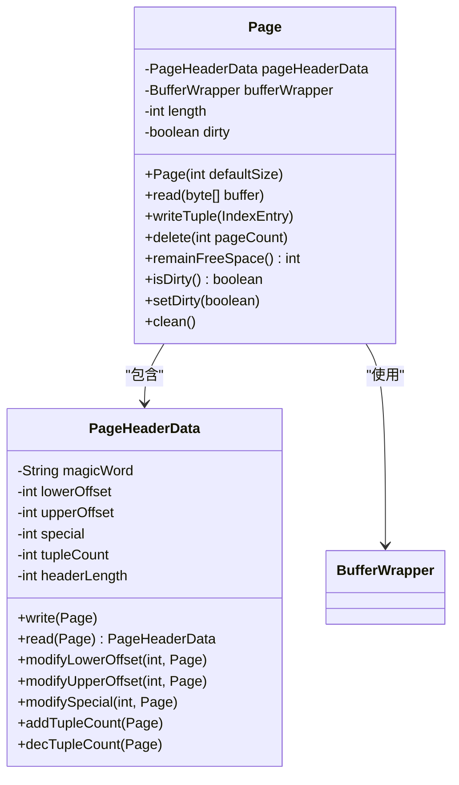
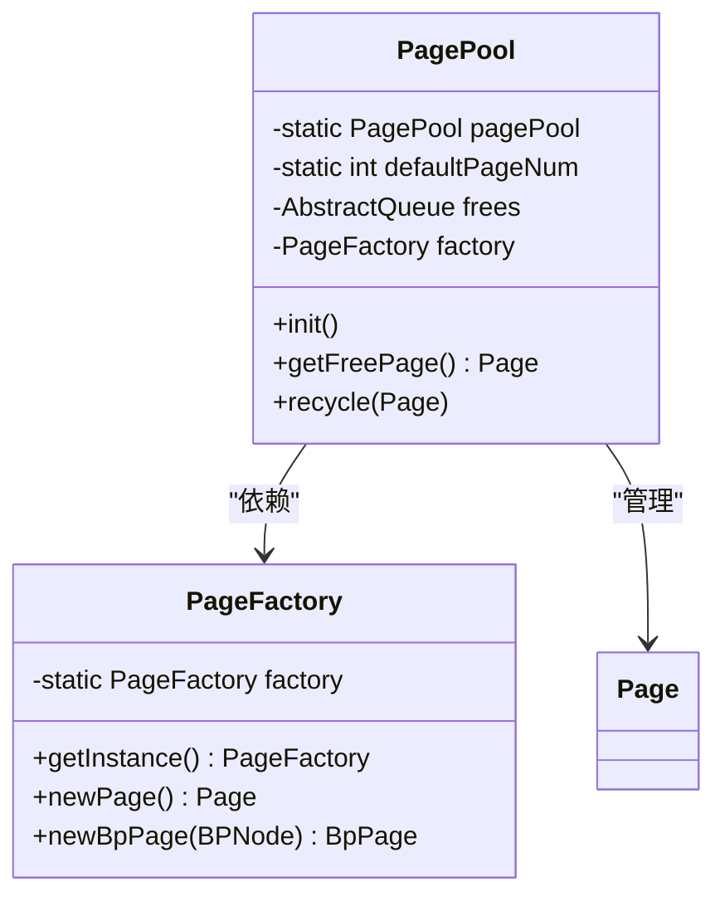
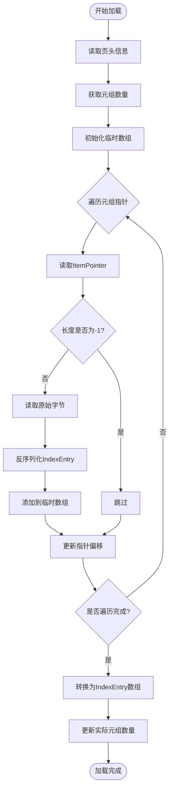
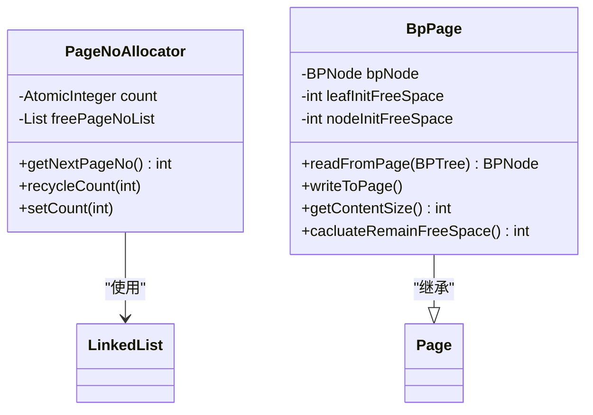
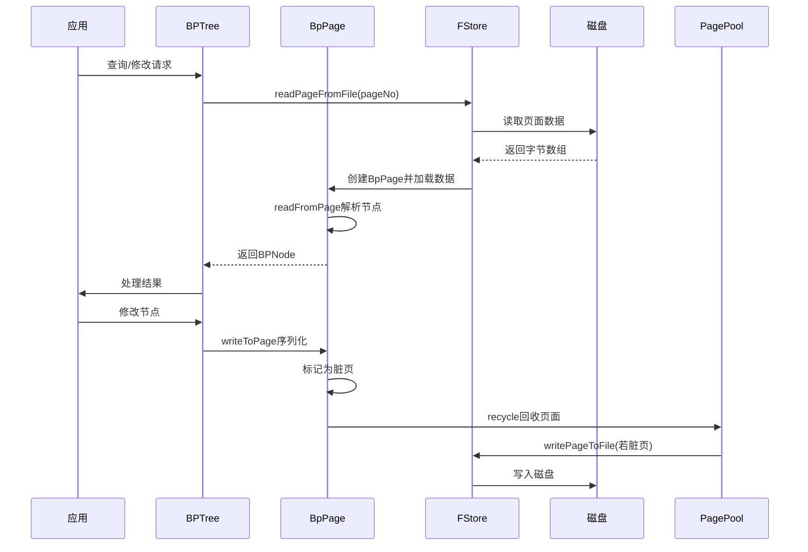

# 页面管理

<cite>
**本文档引用文件**  
- [Page.java](file://src/main/java/alchemystar/freedom/store/page/Page.java)
- [PageHeaderData.java](file://src/main/java/alchemystar/freedom/store/page/PageHeaderData.java)
- [PagePool.java](file://src/main/java/alchemystar/freedom/store/page/PagePool.java)
- [PageLoader.java](file://src/main/java/alchemystar/freedom/store/page/PageLoader.java)
- [PageFactory.java](file://src/main/java/alchemystar/freedom/store/page/PageFactory.java)
- [PageNoAllocator.java](file://src/main/java/alchemystar/freedom/store/page/PageNoAllocator.java)
- [BpPage.java](file://src/main/java/alchemystar/freedom/index/bp/BpPage.java)
- [FStore.java](file://src/main/java/alchemystar/freedom/store/fs/FStore.java)
</cite>

## 目录
1. [引言](#引言)
2. [页面结构设计](#页面结构设计)
3. [页面内存管理](#页面内存管理)
4. [页面加载机制](#页面加载机制)
5. [页面创建与编号分配](#页面创建与编号分配)
6. [B+树场景下的页面操作](#b树场景下的页面操作)
7. [页面内存布局与性能分析](#页面内存布局与性能分析)
8. [极端情况处理](#极端情况处理)
9. [总结](#总结)

## 引言
本文档深入解析Freedom数据库系统中页面管理模块的核心实现机制。重点阐述`Page`类如何封装固定大小的数据页，`PagePool`如何实现内存页的缓存与复用，`PageLoader`如何解析页内结构。同时说明页面头信息（`PageHeaderData`）的设计原理，`PageFactory`的创建策略，以及页面分配器（`PageNoAllocator`）的编号管理机制。结合B+树使用场景，描述页面读写流程、脏页标记、缓存命中率优化等关键技术点。提供页面内存布局图，分析空间开销与访问效率，并讨论极端情况下的内存溢出处理方案。

## 页面结构设计

### Page类封装机制
`Page`类是数据页的核心封装，通过`BufferWrapper`管理固定大小的字节数组，实现对页内数据的读写操作。每个页面包含一个`PageHeaderData`对象，用于维护页头元信息，如空闲空间边界、元组数量等。页面采用双指针结构（`lowerOffset`和`upperOffset`）管理空闲空间，分别从页头和页尾向中间增长，最大化利用存储空间。

页面支持元组的增删改操作，通过`writeTuple`、`delete`等方法实现。删除操作采用标记法（将长度置为-1），便于后续空间回收。页面通过`dirty`标志位记录是否被修改，用于判断是否需要持久化。



**图示来源**  
- [Page.java](file://src/main/java/alchemystar/freedom/store/page/Page.java#L1-L207)
- [PageHeaderData.java](file://src/main/java/alchemystar/freedom/store/page/PageHeaderData.java#L1-L129)

**本节来源**  
- [Page.java](file://src/main/java/alchemystar/freedom/store/page/Page.java#L1-L207)
- [PageHeaderData.java](file://src/main/java/alchemystar/freedom/store/page/PageHeaderData.java#L1-L129)

### 页面头信息设计原理
`PageHeaderData`类定义了页面的元数据结构，其设计遵循紧凑性和可扩展性原则。页头固定大小为24字节，包含以下字段：
- **magicWord**：标识符"Freedom"，用于校验页面完整性
- **lowerOffset**：指向页头后第一个可用位置，管理从页头开始增长的数据
- **upperOffset**：指向页尾前第一个可用位置，管理从页尾开始增长的空闲空间
- **special**：特殊区域起始偏移，预留64字节用于存储特定结构（如B+树节点信息）
- **tupleCount**：记录当前页中有效元组数量

页头信息在页面初始化时写入，并通过`modifyLowerOffset`、`modifyUpperOffset`等方法动态更新。所有修改均直接写入底层字节数组，确保元数据与数据的一致性。

## 页面内存管理

### PagePool缓存复用机制
`PagePool`实现了一个简单的页面缓存池，用于复用内存中的页面对象，减少频繁的内存分配与垃圾回收开销。池中维护一个`ConcurrentLinkedQueue`队列，存储可用的空闲页面。系统启动时预分配8个页面，后续通过`getFreePage`方法获取空闲页。

当页面使用完毕后，调用`recycle`方法将其回收至池中。回收前会调用`clean`方法重置页面状态，包括清空缓冲区、重置脏标志位、重新初始化页头信息等，确保页面处于干净状态。



**图示来源**  
- [PagePool.java](file://src/main/java/alchemystar/freedom/store/page/PagePool.java#L1-L52)
- [PageFactory.java](file://src/main/java/alchemystar/freedom/store/page/PageFactory.java#L1-L31)

**本节来源**  
- [PagePool.java](file://src/main/java/alchemystar/freedom/store/page/PagePool.java#L1-L52)
- [Page.java](file://src/main/java/alchemystar/freedom/store/page/Page.java#L1-L207)

## 页面加载机制

### PageLoader解析流程
`PageLoader`负责从`Page`对象中解析出所有有效的元组数据。其核心方法`load`执行以下步骤：
1. 读取页头信息，获取元组数量和指针起始位置
2. 遍历元组指针数组，跳过已被删除的元组（长度为-1）
3. 根据指针的偏移和长度，从页面缓冲区读取原始字节
4. 调用`IndexEntry.read`方法反序列化元组数据
5. 将有效元组存入数组，更新实际元组数量

该机制支持元组的动态删除与空间回收，通过跳过无效元组实现逻辑删除。加载过程完全在内存中进行，不涉及磁盘I/O，确保高效的数据访问。



**图示来源**  
- [PageLoader.java](file://src/main/java/alchemystar/freedom/store/page/PageLoader.java#L1-L58)
- [Page.java](file://src/main/java/alchemystar/freedom/store/page/Page.java#L1-L207)

**本节来源**  
- [PageLoader.java](file://src/main/java/alchemystar/freedom/store/page/PageLoader.java#L1-L58)

## 页面创建与编号分配

### PageFactory创建策略
`PageFactory`采用单例模式，提供统一的页面创建入口。其`newPage`方法根据`SystemConfig.DEFAULT_PAGE_SIZE`配置创建标准数据页。对于B+树专用页面，提供`newBpPage`方法，接收`BPNode`对象作为参数，创建`BpPage`实例。

`BpPage`继承自`Page`，扩展了B+树节点特有的元数据，如是否为叶子节点、父节点、子节点等。在初始化时计算叶子节点和非叶子节点的初始空闲空间，考虑节点类型对空间需求的差异。

### PageNoAllocator编号管理
`PageNoAllocator`负责页面编号的分配与回收，确保每个页面拥有唯一标识。其核心机制如下：
- 使用`AtomicInteger`原子计数器生成新页面编号，初始值为1（0保留给元数据页）
- 维护一个`LinkedList`列表存储回收的页面编号，实现编号复用
- `getNextPageNo`方法优先从回收列表获取编号，若为空则从计数器获取
- `recycleCount`方法将使用完毕的页面编号加入回收列表
- `setCount`方法用于从磁盘恢复时重置计数器

该机制在保证线程安全的同时，实现了编号的高效分配与回收，避免了编号空间的无限增长。



**图示来源**  
- [PageNoAllocator.java](file://src/main/java/alchemystar/freedom/store/page/PageNoAllocator.java#L1-L40)
- [BpPage.java](file://src/main/java/alchemystar/freedom/index/bp/BpPage.java#L1-L204)

**本节来源**  
- [PageFactory.java](file://src/main/java/alchemystar/freedom/store/page/PageFactory.java#L1-L31)
- [PageNoAllocator.java](file://src/main/java/alchemystar/freedom/store/page/PageNoAllocator.java#L1-L40)
- [BpPage.java](file://src/main/java/alchemystar/freedom/index/bp/BpPage.java#L1-L204)

## B+树场景下的页面操作

### 页面读写流程
在B+树场景下，页面的读写流程如下：
1. **读取**：通过`FStore.readPageFromFile`从磁盘读取页面，若为索引页则创建`BpPage`实例
2. **加载**：使用`PageLoader`解析页内元组，构建`BPNode`对象
3. **修改**：在内存中修改`BPNode`结构，触发`BpPage`的脏页标记
4. **写回**：调用`BpPage.writeToPage`序列化节点数据，通过`FStore.writePageToFile`持久化

`BpPage`的`writeToPage`方法将节点状态（是否叶子、是否根节点）、页面编号、父节点、子节点等元数据写入页面，确保树结构的完整性。

### 脏页标记与缓存优化
页面通过`dirty`标志位实现脏页标记。任何修改操作（如`writeTuple`）都会将页面标记为脏页。在缓存回收时，仅对脏页执行磁盘写入操作，避免不必要的I/O开销。

为提高缓存命中率，系统采用以下策略：
- **预分配页面**：`PagePool`预分配8个页面，减少运行时内存分配
- **页面复用**：使用完毕的页面回收至池中，供后续请求复用
- **延迟写入**：脏页在回收至池前才写入磁盘，合并多次修改



**图示来源**  
- [BpPage.java](file://src/main/java/alchemystar/freedom/index/bp/BpPage.java#L1-L204)
- [FStore.java](file://src/main/java/alchemystar/freedom/store/fs/FStore.java#L1-L96)

**本节来源**  
- [BpPage.java](file://src/main/java/alchemystar/freedom/index/bp/BpPage.java#L1-L204)
- [FStore.java](file://src/main/java/alchemystar/freedom/store/fs/FStore.java#L1-L96)

## 页面内存布局与性能分析

### 内存布局图
```mermaid
flowchart LR
subgraph Page [数据页 (4096字节)]
direction TB
Header[页头 (24字节)] --> Data["数据区 (lowerOffset → upperOffset)"]
Data --> Special["特殊区 (64字节)"]
Header --> |magicWord| "Freedom\0"
Header --> |lowerOffset| "指向数据区起始"
Header --> |upperOffset| "指向数据区结束"
Header --> |special| "指向特殊区起始"
Header --> |tupleCount| "元组数量"
Data --> |ItemPointer数组| PtrArray["指针数组"]
Data --> |元组数据| TupleData["元组1, 元组2, ..."]
Special --> |B+树元数据| BPTreeMeta["isLeaf, isRoot, pageNo, ..."]
end
```

**图示来源**  
- [PageHeaderData.java](file://src/main/java/alchemystar/freedom/store/page/PageHeaderData.java#L1-L129)
- [BpPage.java](file://src/main/java/alchemystar/freedom/index/bp/BpPage.java#L1-L204)

### 空间开销分析
- **页头开销**：24字节，固定不变
- **特殊区开销**：64字节，用于B+树元数据
- **指针开销**：每个元组对应一个`ItemPointer`（8字节）
- **有效载荷**：剩余空间用于存储元组数据

以默认页大小4096字节为例：
- 可用空间 = 4096 - 24 - 64 = 4008字节
- 若元组平均大小为100字节，则每页可存储约37个元组
- 指针开销占比约2%，空间利用率较高

### 访问效率分析
- **顺序访问**：通过`PageLoader`批量加载元组，减少方法调用开销
- **随机访问**：通过`ItemPointer`直接定位元组，时间复杂度O(1)
- **插入性能**：双指针结构支持高效插入，无需移动数据
- **删除性能**：标记删除避免数据移动，但需定期清理碎片

## 极端情况处理

### 内存溢出处理方案
当页面数据超出容量时，系统抛出`RuntimeException("data too long")`。该异常在`writeItems`方法中检测剩余空间后触发。处理方案包括：
1. **前端拦截**：在应用层限制单次写入数据大小
2. **分页写入**：将大数据拆分为多个页面存储
3. **压缩存储**：对元组数据进行压缩，提高空间利用率
4. **异常捕获**：在调用层捕获异常并执行降级策略

对于页面池的内存溢出，当前实现未限制最大页面数，依赖JVM内存管理。建议在生产环境中监控内存使用，必要时增加池大小限制。

**本节来源**  
- [Page.java](file://src/main/java/alchemystar/freedom/store/page/Page.java#L1-L207)
- [PagePool.java](file://src/main/java/alchemystar/freedom/store/page/PagePool.java#L1-L52)

## 总结
Freedom系统的页面管理模块通过`Page`、`PagePool`、`PageLoader`等组件协同工作，实现了高效的数据页封装、缓存复用和结构解析。`PageHeaderData`的紧凑设计和双指针空闲管理机制，最大化利用了存储空间。`PageNoAllocator`的编号复用策略，有效管理了页面生命周期。在B+树场景下，通过脏页标记和延迟写入，优化了缓存命中率和I/O性能。整体设计兼顾了性能、可靠性和可维护性，为数据库的稳定运行提供了坚实基础。