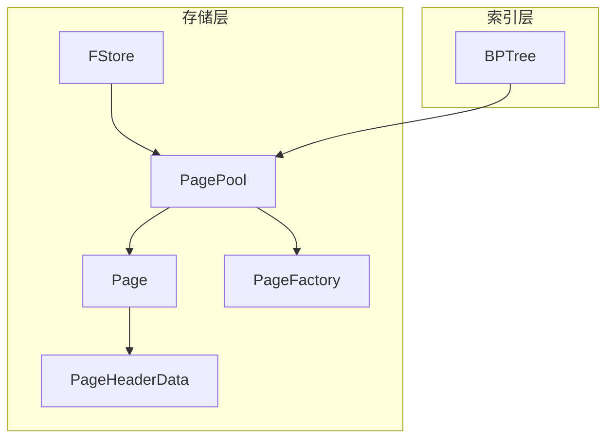
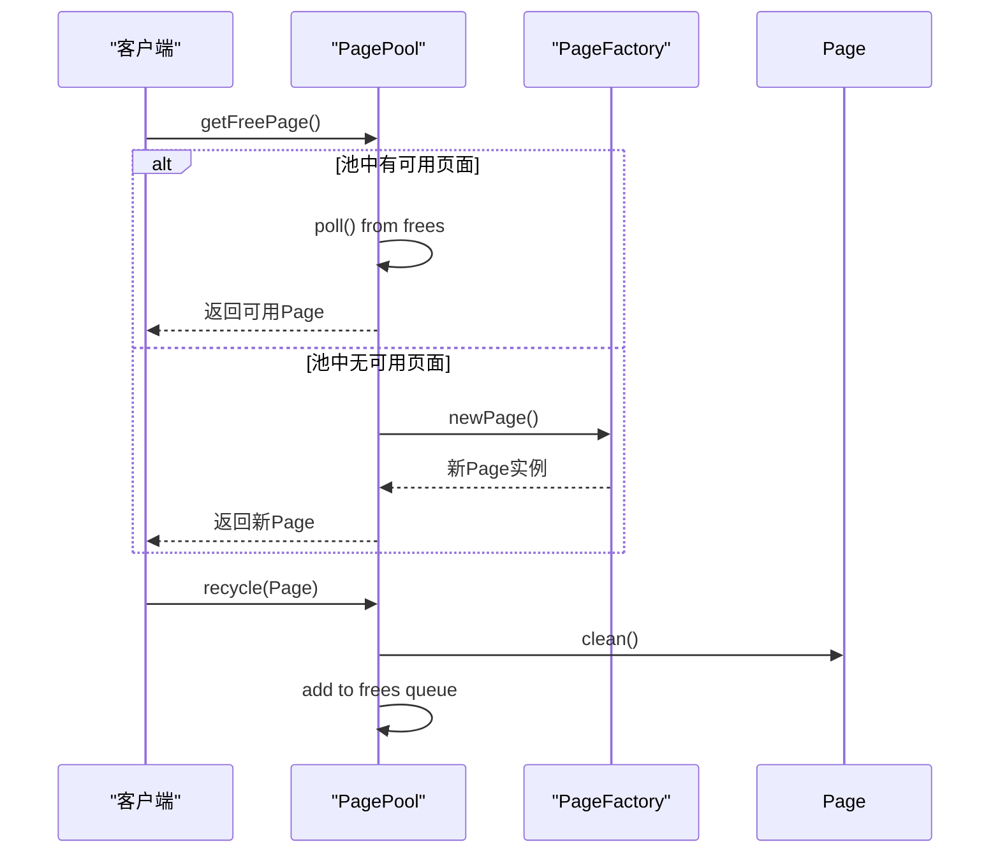
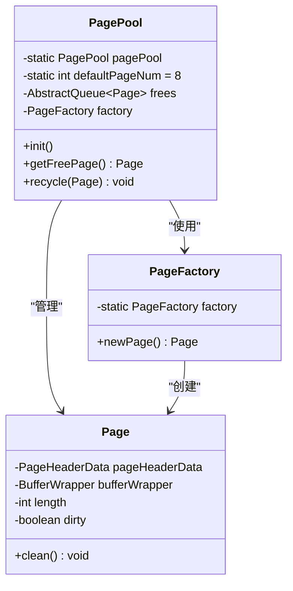
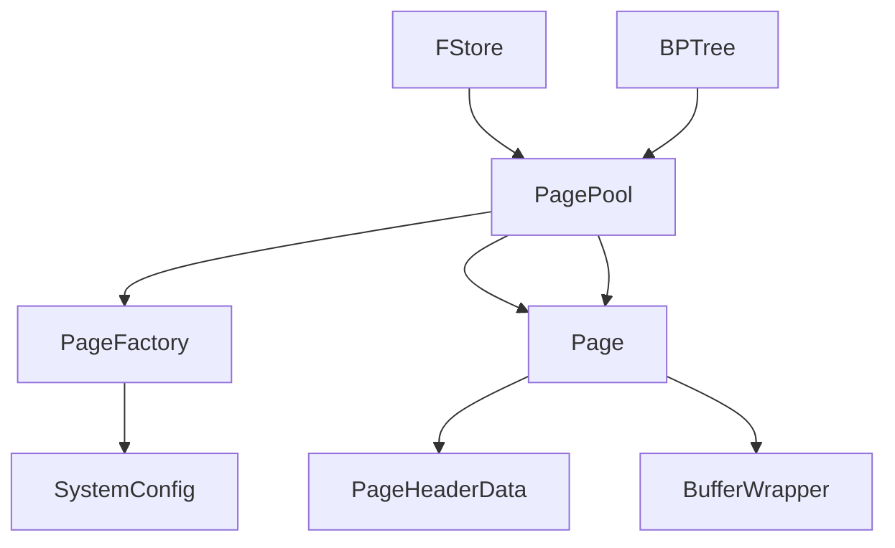

# 页面缓存

<cite>
**本文档引用的文件**  
- [PagePool.java](file://src/main/java/alchemystar/freedom/store/page/PagePool.java)
- [Page.java](file://src/main/java/alchemystar/freedom/store/page/Page.java)
- [PageFactory.java](file://src/main/java/alchemystar/freedom/store/page/PageFactory.java)
- [FStore.java](file://src/main/java/alchemystar/freedom/store/fs/FStore.java)
- [SystemConfig.java](file://src/main/java/alchemystar/freedom/config/SystemConfig.java)
- [PageHeaderData.java](file://src/main/java/alchemystar/freedom/store/page/PageHeaderData.java)
- [BPTree.java](file://src/main/java/alchemystar/freedom/index/bp/BPTree.java)
</cite>

## 目录
1. [简介](#简介)
2. [项目结构](#项目结构)
3. [核心组件](#核心组件)
4. [架构概述](#架构概述)
5. [详细组件分析](#详细组件分析)
6. [依赖分析](#依赖分析)
7. [性能考量](#性能考量)
8. [故障排除指南](#故障排除指南)
9. [结论](#结论)

## 简介
本文档深入解析 `PagePool` 类如何实现内存中数据页的缓存与高效复用机制，阐述其页面置换策略、生命周期管理、线程安全性保障及高并发性能表现。同时提供缓存监控建议与调优方法。

## 项目结构
项目采用典型的分层架构，核心存储模块位于 `store/page` 目录下，其中 `PagePool` 作为页面缓存的核心管理类，与 `Page`、`PageFactory`、`FStore` 等组件协同工作，实现高效的内存页管理。



**图示来源**  
- [PagePool.java](file://src/main/java/alchemystar/freedom/store/page/PagePool.java#L1-L52)
- [Page.java](file://src/main/java/alchemystar/freedom/store/page/Page.java#L1-L208)
- [FStore.java](file://src/main/java/alchemystar/freedom/store/fs/FStore.java#L1-L97)

**本节来源**  
- [PagePool.java](file://src/main/java/alchemystar/freedom/store/page/PagePool.java#L1-L52)
- [FStore.java](file://src/main/java/alchemystar/freedom/store/fs/FStore.java#L1-L97)

## 核心组件
`PagePool` 是页面缓存的核心，通过对象池模式复用 `Page` 实例，减少频繁创建与销毁带来的开销。其设计结合了工厂模式（`PageFactory`）与线程安全队列（`ConcurrentLinkedQueue`），确保在高并发环境下的稳定运行。

**本节来源**  
- [PagePool.java](file://src/main/java/alchemystar/freedom/store/page/PagePool.java#L1-L52)
- [PageFactory.java](file://src/main/java/alchemystar/freedom/store/page/PageFactory.java#L1-L32)

## 架构概述
系统通过 `PagePool` 统一管理可用页面，当需要新页面时优先从池中获取，若池为空则通过 `PageFactory` 创建新实例。页面使用完毕后通过 `recycle` 方法归还至池中，实现循环利用。



**图示来源**  
- [PagePool.java](file://src/main/java/alchemystar/freedom/store/page/PagePool.java#L30-L50)
- [Page.java](file://src/main/java/alchemystar/freedom/store/page/Page.java#L150-L170)

## 详细组件分析

### PagePool 分析
`PagePool` 使用静态单例模式初始化，启动时预创建 8 个页面实例放入 `ConcurrentLinkedQueue` 队列中。该队列保证了多线程环境下的线程安全。

#### 对象池机制


**图示来源**  
- [PagePool.java](file://src/main/java/alchemystar/freedom/store/page/PagePool.java#L1-L52)
- [PageFactory.java](file://src/main/java/alchemystar/freedom/store/page/PageFactory.java#L1-L32)
- [Page.java](file://src/main/java/alchemystar/freedom/store/page/Page.java#L1-L208)

#### 页面生命周期管理
页面的生命周期包括：创建 → 使用 → 标记脏页 → 刷盘 → 清理 → 回收 → 复用。`Page` 类通过 `dirty` 标志位记录是否为脏页，`clean()` 方法重置状态以便复用。

```mermaid
flowchart TD
A[创建新Page] --> B[写入数据]
B --> C{是否修改?}
C --> |是| D[标记dirty=true]
C --> |否| E[保持clean]
D --> F[刷盘到磁盘]
E --> G[直接回收]
F --> H[调用clean()]
G --> H
H --> I[归还PagePool]
I --> J[等待下次getFreePage]
```

**图示来源**  
- [Page.java](file://src/main/java/alchemystar/freedom/store/page/Page.java#L150-L170)
- [PagePool.java](file://src/main/java/alchemystar/freedom/store/page/PagePool.java#L45-L50)

**本节来源**  
- [PagePool.java](file://src/main/java/alchemystar/freedom/store/page/PagePool.java#L1-L52)
- [Page.java](file://src/main/java/alchemystar/freedom/store/page/Page.java#L1-L208)

### 缓存策略分析
当前 `PagePool` 实现为简单的对象池，未采用 LRU 等复杂置换算法。其策略为：优先复用空闲页，若无空闲页则直接新建。该策略适用于页面创建成本较低的场景。

**本节来源**  
- [PagePool.java](file://src/main/java/alchemystar/freedom/store/page/PagePool.java#L30-L40)

## 依赖分析
`PagePool` 依赖于多个核心组件协同工作，形成完整的页面管理闭环。



**图示来源**  
- [PagePool.java](file://src/main/java/alchemystar/freedom/store/page/PagePool.java#L1-L52)
- [PageFactory.java](file://src/main/java/alchemystar/freedom/store/page/PageFactory.java#L1-L32)
- [SystemConfig.java](file://src/main/java/alchemystar/freedom/config/SystemConfig.java#L1-L39)

**本节来源**  
- [PagePool.java](file://src/main/java/alchemystar/freedom/store/page/PagePool.java#L1-L52)
- [PageFactory.java](file://src/main/java/alchemystar/freedom/store/page/PageFactory.java#L1-L32)
- [SystemConfig.java](file://src/main/java/alchemystar/freedom/config/SystemConfig.java#L1-L39)

## 性能考量
- **线程安全**：使用 `ConcurrentLinkedQueue` 保证多线程下 `getFreePage` 与 `recycle` 的线程安全。
- **内存复用**：通过对象池减少 GC 压力，提升内存利用率。
- **扩展性**：当前未限制最大页面数，可结合 `SystemConfig` 增加最大池大小配置，防止内存溢出。
- **监控建议**：可增加 `frees.size()` 监控，评估缓存命中率与内存使用趋势。

**本节来源**  
- [PagePool.java](file://src/main/java/alchemystar/freedom/store/page/PagePool.java#L1-L52)
- [SystemConfig.java](file://src/main/java/alchemystar/freedom/config/SystemConfig.java#L1-L39)

## 故障排除指南
- **内存泄漏**：检查 `recycle` 是否被正确调用，确保所有使用完的页面都被归还。
- **缓存未命中率高**：监控 `frees` 队列长度，若长期为空，可考虑增加初始页面数或实现 LRU 回收策略。
- **脏页未刷盘**：确保在持久化前检查 `isDirty()` 状态，避免数据丢失。

**本节来源**  
- [Page.java](file://src/main/java/alchemystar/freedom/store/page/Page.java#L140-L150)
- [PagePool.java](file://src/main/java/alchemystar/freedom/store/page/PagePool.java#L45-L50)

## 结论
`PagePool` 实现了一个轻量级、线程安全的页面对象池，有效提升了内存页的复用效率。其设计简洁，依赖清晰，为数据库存储层提供了稳定的内存管理基础。未来可扩展支持 LRU 置换、最大池大小限制、缓存命中率统计等高级特性，以适应更复杂的生产环境需求。