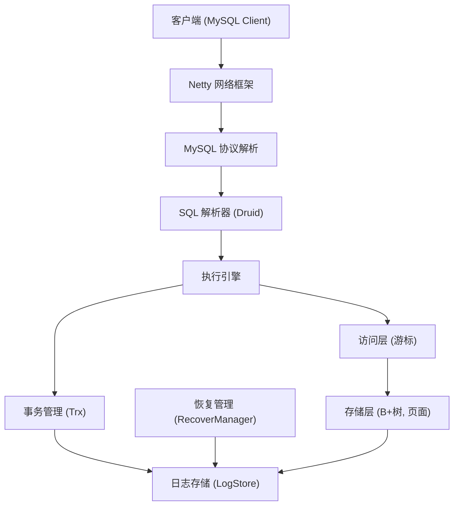
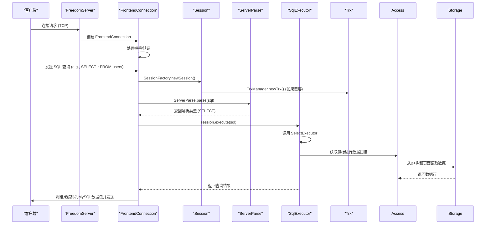

# 架构设计

<cite>
**本文档引用文件**  
- [Database.java](file://src/main/java/alchemystar/freedom/engine/Database.java)
- [FreedomServer.java](file://src/main/java/alchemystar/freedom/engine/server/FreedomServer.java)
- [FrontendConnection.java](file://src/main/java/alchemystar/freedom/engine/net/handler/frontend/FrontendConnection.java)
- [Session.java](file://src/main/java/alchemystar/freedom/engine/session/Session.java)
- [TrxManager.java](file://src/main/java/alchemystar/freedom/transaction/TrxManager.java)
- [ServerParse.java](file://src/main/java/alchemystar/freedom/engine/parser/ServerParse.java)
- [README.md](file://README.md)
</cite>

## 目录
1. [引言](#引言)
2. [分层架构概述](#分层架构概述)
3. [核心组件职责与交互](#核心组件职责与交互)
4. [系统上下文图](#系统上下文图)
5. [组件交互图](#组件交互图)
6. [关键设计决策](#关键设计决策)
7. [可扩展性与局限性](#可扩展性与局限性)
8. [结论](#结论)

## 引言
Freedom数据库是一个轻量级、高性能的Java实现数据库系统，其设计目标是提供一个简洁、可理解的数据库内核实现。本文档旨在深入剖析其分层架构，详细描述网络层、解析层、执行层、存储层和事务层的职责划分与交互流程。以`Database.java`单例为核心，阐述其作为全局资源管理器的角色，以及如何被`FreedomServer`初始化和调用。通过系统上下文图和组件交互图，说明从客户端请求到结果返回的数据流和控制流（如连接建立、会话创建）。同时，解释选择Netty和Druid等关键技术的原因，并讨论当前架构的可扩展性与局限性。

## 分层架构概述
Freedom数据库采用清晰的分层架构设计，各层职责分明，协同工作以处理客户端请求。主要分为以下五个层次：

- **网络层**：基于Netty框架，负责处理TCP连接、数据包的编解码、连接管理与心跳检测。
- **解析层**：利用阿里巴巴的Druid SQL解析器，将客户端发送的SQL文本解析为抽象语法树（AST），并进行初步的语义分析。
- **执行层**：根据解析结果，调用相应的执行器（如`SelectExecutor`）来执行SQL命令，协调访问层、优化器和事务管理。
- **存储层**：负责数据的持久化存储，包括B+树索引管理、页面管理、文件系统交互和日志存储。
- **事务层**：提供事务支持，实现ACID特性，包括事务的开始、提交、回滚，以及通过redo/undo日志进行恢复。

这种分层设计使得系统模块化程度高，便于维护和扩展。

**Section sources**
- [README.md](file://README.md#L17-L31)

## 核心组件职责与交互
### Database.java：全局资源管理器
`Database.java`是整个系统的核心，采用单例模式（Singleton Pattern）实现，确保全局仅存在一个数据库实例。它在静态代码块中初始化，加载表元数据（通过`TableLoader`）和日志存储（`LogStore`），并启动恢复管理器（`RecoverManager`）进行崩溃恢复。

该类作为全局资源管理器，持有对配置、表管理器、日志存储等关键组件的引用，为其他模块提供统一的访问入口。例如，`FreedomServer`在启动时通过`Database.getInstance()`获取数据库实例，以获取服务器端口等配置信息。

**Section sources**
- [Database.java](file://src/main/java/alchemystar/freedom/engine/Database.java#L0-L78)

### FreedomServer：系统启动器
`FreedomServer`是数据库的启动入口，继承自`Thread`类。其`main`方法创建服务器实例并启动。`startServer`方法使用Netty框架初始化服务端，创建`bossGroup`和`workerGroup`两个事件循环组，分别负责连接的接收和I/O读写。

服务器通过`Database.getInstance()`获取单例，绑定到指定端口，并设置`FrontHandlerFactory`作为`childHandler`，用于为每个新建立的客户端连接创建处理链。

**Section sources**
- [FreedomServer.java](file://src/main/java/alchemystar/freedom/engine/server/FreedomServer.java#L0-L76)

### 网络与会话管理
当客户端连接建立时，Netty的`FrontHandlerFactory`会创建一系列处理器，最终生成一个`FrontendConnection`对象来代表该连接。`FrontendConnection`负责处理MySQL协议相关的数据包，如认证、查询、心跳等。

在初始化数据库（`initDB`）或执行查询（`query`）时，`FrontendConnection`会通过`SessionFactory`创建一个`Session`对象。`Session`是服务器端会话的抽象，它关联一个`Trx`（事务）对象，负责执行具体的SQL命令，并维护会话级别的状态（如自动提交模式、事务隔离级别）。

**Section sources**
- [FrontendConnection.java](file://src/main/java/alchemystar/freedom/engine/net/handler/frontend/FrontendConnection.java#L0-L320)
- [Session.java](file://src/main/java/alchemystar/freedom/engine/session/Session.java)

### 事务管理
事务管理由`TrxManager`和`Trx`类实现。`TrxManager`是一个工厂类，负责生成新的事务ID和创建`Trx`实例。`Trx`类封装了事务的状态（如`TRX_STATE_ACTIVE`）、事务ID和日志列表。

当会话执行`BEGIN`命令时，`Session`会调用`Trx.begin()`方法，该方法会生成一个`TRX_START`类型的日志并写入`LogStore`，标志着事务的正式开始。事务的提交和回滚操作也由`Trx`对象协调完成。

**Section sources**
- [TrxManager.java](file://src/main/java/alchemystar/freedom/transaction/TrxManager.java#L0-L22)

## 系统上下文图

**Diagram sources**
- [FreedomServer.java](file://src/main/java/alchemystar/freedom/engine/server/FreedomServer.java#L42-L75)
- [FrontendConnection.java](file://src/main/java/alchemystar/freedom/engine/net/handler/frontend/FrontendConnection.java#L300-L319)

## 组件交互图

**Diagram sources**
- [FreedomServer.java](file://src/main/java/alchemystar/freedom/engine/server/FreedomServer.java#L0-L46)
- [FrontendConnection.java](file://src/main/java/alchemystar/freedom/engine/net/handler/frontend/FrontendConnection.java#L0-L320)
- [ServerParse.java](file://src/main/java/alchemystar/freedom/engine/parser/ServerParse.java#L0-L29)

## 关键设计决策
### 选择Netty作为网络框架
Netty是一个高性能、异步事件驱动的NIO框架。选择Netty的原因在于：
1. **高性能**：基于Reactor模式，能够用少量线程处理大量并发连接，非常适合数据库这种高并发场景。
2. **可靠性**：Netty经过大规模生产环境验证，稳定可靠。
3. **灵活性**：提供了丰富的编解码器和处理器，便于实现MySQL二进制协议。
4. **社区支持**：拥有活跃的社区和完善的文档。

在`FreedomServer`中，通过`NioEventLoopGroup`和`ServerBootstrap`配置Netty服务端，体现了对高性能网络通信的追求。

### 选择Druid作为SQL解析器
Druid是阿里巴巴开源的数据库连接池，其SQL解析器功能强大且成熟。选择Druid的原因包括：
1. **成熟稳定**：Druid的SQL解析器经过了阿里巴巴海量业务的考验，对SQL语法的支持非常全面。
2. **功能丰富**：不仅能解析SQL，还能进行语法树遍历、SQL格式化、SQL防火墙等。
3. **易于集成**：作为Java库，可以无缝集成到Java应用中。
4. **性能良好**：解析效率高，满足数据库系统的需求。

如`README.md`所述，Druid将SQL文本解析为树状结构的表达式，便于后续的访问层进行过滤和计算。

**Section sources**
- [README.md](file://README.md#L17-L31)

## 可扩展性与局限性
### 可扩展性
1. **模块化设计**：清晰的分层架构使得各层可以独立优化和替换。例如，未来可以引入更先进的查询优化器或存储引擎。
2. **基于Netty**：Netty的线程模型和事件驱动机制为系统处理高并发连接提供了良好的基础。
3. **单例全局管理**：`Database`单例模式简化了全局资源的管理和访问。

### 局限性
1. **单线程Acceptor**：`FreedomServer`中`BOSS_THREAD_COUNT`固定为1，虽然对于单端口足够，但在极端高并发连接建立场景下可能成为瓶颈。
2. **功能完整性**：作为一个教学或轻量级项目，可能缺少一些企业级数据库的高级特性，如复杂的分布式事务、高可用集群等。
3. **存储引擎**：当前的B+树实现和页面管理可能在极端大数据量下的性能和稳定性有待验证。
4. **事务隔离级别**：虽然支持设置隔离级别，但具体的并发控制机制（如锁或MVCC）在现有信息中未明确体现。

## 结论
Freedom数据库通过采用Netty和Druid等成熟技术，构建了一个结构清晰、职责分明的分层架构。`Database.java`单例作为全局资源管理器，被`FreedomServer`成功初始化和调用，协调网络层、解析层、执行层、存储层和事务层共同工作。系统上下文图和组件交互图清晰地展示了数据流和控制流。尽管存在一些局限性，但其设计体现了良好的模块化和可扩展性，为理解数据库内核实现提供了一个优秀的范例。