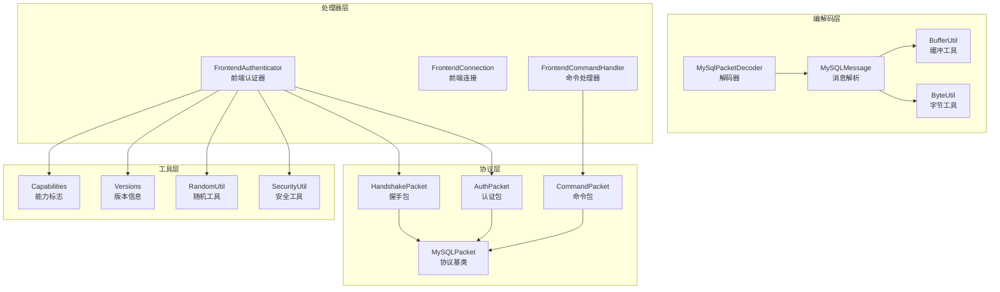
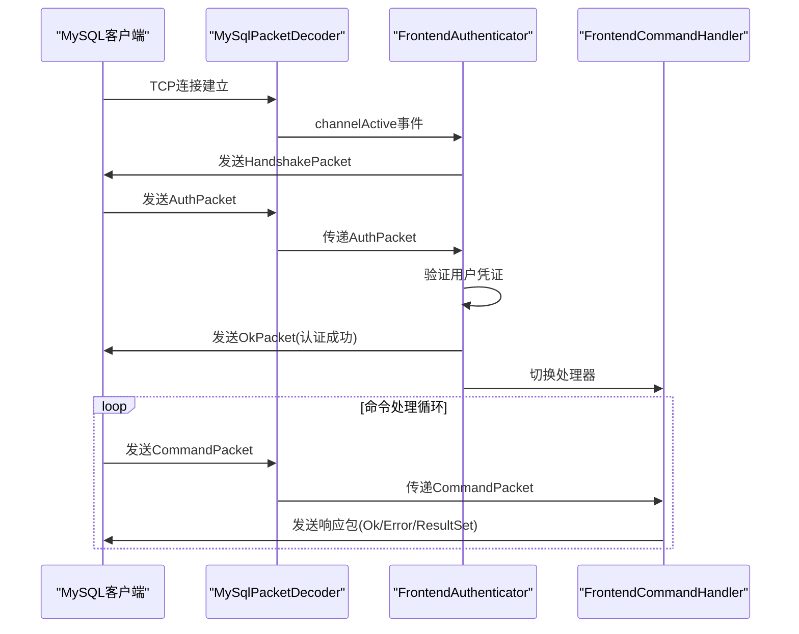
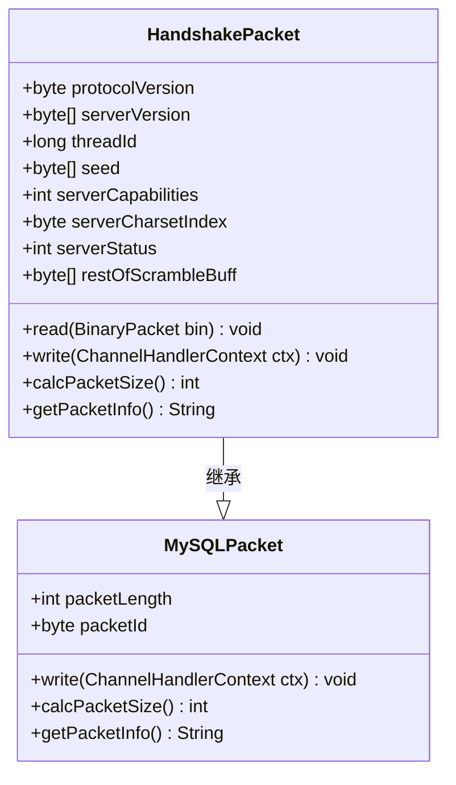
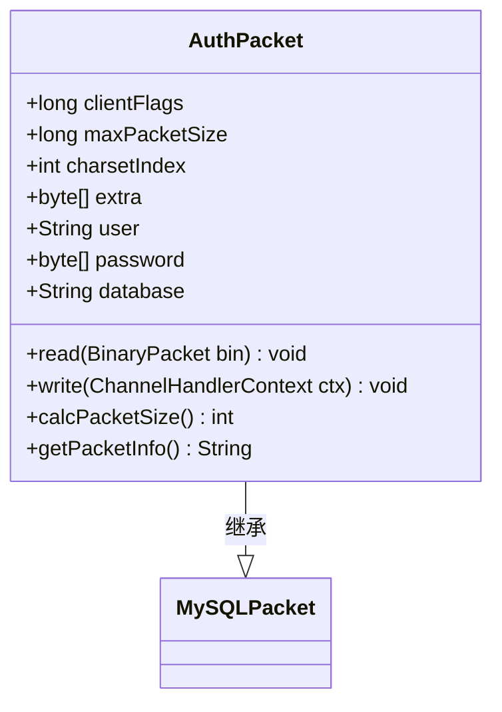
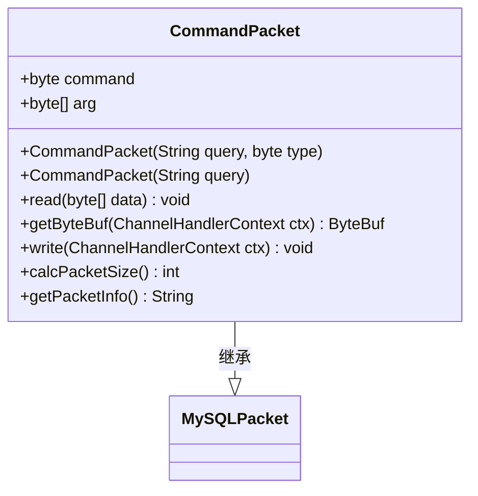
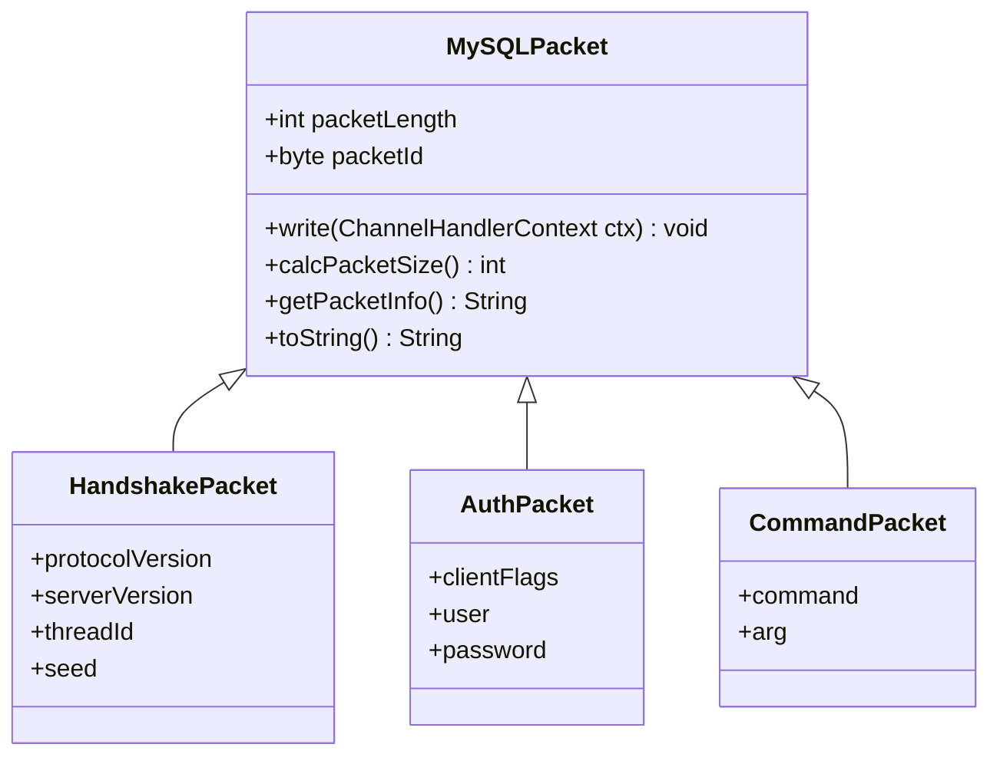
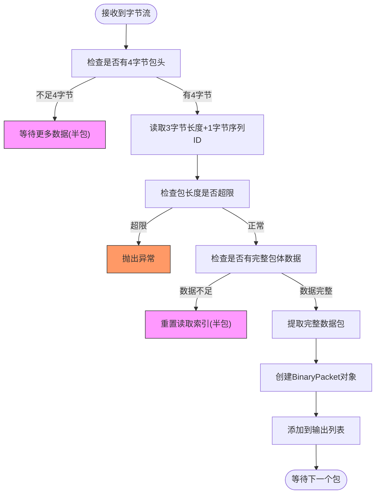
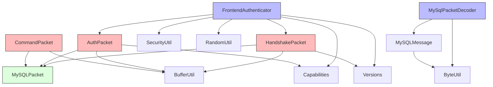

# MySQL协议实现

<cite>
**本文档中引用的文件**  
- [HandshakePacket.java](file://src/main/java/alchemystar/freedom/engine/net/proto/mysql/HandshakePacket.java)
- [AuthPacket.java](file://src/main/java/alchemystar/freedom/engine/net/proto/mysql/AuthPacket.java)
- [CommandPacket.java](file://src/main/java/alchemystar/freedom/engine/net/proto/mysql/CommandPacket.java)
- [MySQLPacket.java](file://src/main/java/alchemystar/freedom/engine/net/proto/MySQLPacket.java)
- [FrontendAuthenticator.java](file://src/main/java/alchemystar/freedom/engine/net/handler/frontend/FrontendAuthenticator.java)
- [MySqlPacketDecoder.java](file://src/main/java/alchemystar/freedom/engine/net/codec/MySqlPacketDecoder.java)
- [Capabilities.java](file://src/main/java/alchemystar/freedom/engine/net/proto/util/Capabilities.java)
- [Versions.java](file://src/main/java/alchemystar/freedom/engine/net/proto/util/Versions.java)
- [MySQLMessage.java](file://src/main/java/alchemystar/freedom/engine/net/proto/mysql/MySQLMessage.java)
- [BufferUtil.java](file://src/main/java/alchemystar/freedom/engine/net/proto/util/BufferUtil.java)
- [BinaryPacket.java](file://src/main/java/alchemystar/freedom/engine/net/proto/mysql/BinaryPacket.java)
- [RandomUtil.java](file://src/main/java/alchemystar/freedom/engine/net/proto/util/RandomUtil.java)
- [SecurityUtil.java](file://src/main/java/alchemystar/freedom/engine/net/proto/util/SecurityUtil.java)
- [FrontendConnection.java](file://src/main/java/alchemystar/freedom/engine/net/handler/frontend/FrontendConnection.java)
</cite>

## 目录
1. [简介](#简介)
2. [项目结构](#项目结构)
3. [核心组件](#核心组件)
4. [架构概述](#架构概述)
5. [详细组件分析](#详细组件分析)
6. [依赖分析](#依赖分析)
7. [性能考虑](#性能考虑)
8. [故障排除指南](#故障排除指南)
9. [结论](#结论)

## 简介
本文档详细阐述了Freedom数据库对MySQL客户端/服务器协议的实现机制，重点解析了握手、认证、命令交互等核心流程。文档深入分析了协议包的结构设计、序列化/反序列化过程以及兼容性实现策略，为开发者和运维人员提供全面的技术参考。

## 项目结构
Freedom数据库的MySQL协议实现主要集中在`engine/net`模块中，采用分层设计，清晰划分了编解码、协议定义、处理器等职责。



**图示来源**  
- [HandshakePacket.java](file://src/main/java/alchemystar/freedom/engine/net/proto/mysql/HandshakePacket.java)
- [AuthPacket.java](file://src/main/java/alchemystar/freedom/engine/net/proto/mysql/AuthPacket.java)
- [CommandPacket.java](file://src/main/java/alchemystar/freedom/engine/net/proto/mysql/CommandPacket.java)
- [MySQLPacket.java](file://src/main/java/alchemystar/freedom/engine/net/proto/MySQLPacket.java)
- [MySqlPacketDecoder.java](file://src/main/java/alchemystar/freedom/engine/net/codec/MySqlPacketDecoder.java)
- [FrontendAuthenticator.java](file://src/main/java/alchemystar/freedom/engine/net/handler/frontend/FrontendAuthenticator.java)
- [Capabilities.java](file://src/main/java/alchemystar/freedom/engine/net/proto/util/Capabilities.java)
- [Versions.java](file://src/main/java/alchemystar/freedom/engine/net/proto/util/Versions.java)

**本节来源**  
- [src/main/java/alchemystar/freedom/engine/net/proto/mysql](file://src/main/java/alchemystar/freedom/engine/net/proto/mysql)
- [src/main/java/alchemystar/freedom/engine/net/codec](file://src/main/java/alchemystar/freedom/engine/net/codec)
- [src/main/java/alchemystar/freedom/engine/net/handler/frontend](file://src/main/java/alchemystar/freedom/engine/net/handler/frontend)
- [src/main/java/alchemystar/freedom/engine/net/proto/util](file://src/main/java/alchemystar/freedom/engine/net/proto/util)

## 核心组件
Freedom数据库的MySQL协议实现围绕几个核心组件构建：`MySQLPacket`作为所有协议包的基类，定义了通用结构；`HandshakePacket`和`AuthPacket`分别处理连接初始化和用户认证；`CommandPacket`用于传输客户端命令；`MySqlPacketDecoder`负责网络字节流的解析；`FrontendAuthenticator`管理前端连接的认证流程。

**本节来源**  
- [MySQLPacket.java](file://src/main/java/alchemystar/freedom/engine/net/proto/MySQLPacket.java)
- [HandshakePacket.java](file://src/main/java/alchemystar/freedom/engine/net/proto/mysql/HandshakePacket.java)
- [AuthPacket.java](file://src/main/java/alchemystar/freedom/engine/net/proto/mysql/AuthPacket.java)
- [CommandPacket.java](file://src/main/java/alchemystar/freedom/engine/net/proto/mysql/CommandPacket.java)
- [MySqlPacketDecoder.java](file://src/main/java/alchemystar/freedom/engine/net/codec/MySqlPacketDecoder.java)
- [FrontendAuthenticator.java](file://src/main/java/alchemystar/freedom/engine/net/handler/frontend/FrontendAuthenticator.java)

## 架构概述
Freedom数据库的MySQL协议实现遵循典型的Netty事件驱动架构，采用责任链模式处理客户端请求。当客户端连接建立时，系统首先发送握手包进行协议协商，随后接收并验证认证包完成身份验证，最后通过命令处理器处理各种SQL操作。



**图示来源**  
- [MySqlPacketDecoder.java](file://src/main/java/alchemystar/freedom/engine/net/codec/MySqlPacketDecoder.java#L25-L60)
- [FrontendAuthenticator.java](file://src/main/java/alchemystar/freedom/engine/net/handler/frontend/FrontendAuthenticator.java#L35-L170)
- [HandshakePacket.java](file://src/main/java/alchemystar/freedom/engine/net/proto/mysql/HandshakePacket.java#L40-L70)
- [AuthPacket.java](file://src/main/java/alchemystar/freedom/engine/net/proto/mysql/AuthPacket.java#L30-L60)

## 详细组件分析

### 握手包(HandshakePacket)分析
`HandshakePacket`类实现了MySQL协议的握手阶段，负责向客户端发送服务器信息并启动认证流程。该包包含协议版本、服务器版本、线程ID、挑战种子等关键参数。



**图示来源**  
- [HandshakePacket.java](file://src/main/java/alchemystar/freedom/engine/net/proto/mysql/HandshakePacket.java#L15-L80)
- [MySQLPacket.java](file://src/main/java/alchemystar/freedom/engine/net/proto/MySQLPacket.java#L100-L150)

**本节来源**  
- [HandshakePacket.java](file://src/main/java/alchemystar/freedom/engine/net/proto/mysql/HandshakePacket.java)
- [FrontendAuthenticator.java](file://src/main/java/alchemystar/freedom/engine/net/handler/frontend/FrontendAuthenticator.java#L35-L55)
- [Versions.java](file://src/main/java/alchemystar/freedom/engine/net/proto/util/Versions.java)

#### 握手包结构与序列化
`HandshakePacket`遵循MySQL协议规范，其结构由多个字段组成，总长度通过`calcPacketSize()`方法计算。序列化过程通过`write()`方法完成，使用`BufferUtil`工具将各个字段写入Netty的`ByteBuf`中。

**字段说明：**
- **protocolVersion**: 协议版本号，固定为10（MySQL 4.1+协议）
- **serverVersion**: 服务器版本字符串，如"5.1.1-freedom"
- **threadId**: 连接线程ID，使用前端连接的唯一ID
- **seed**: 挑战种子，用于密码加密，由8字节随机数组成
- **serverCapabilities**: 服务器能力标志位，决定支持的协议特性
- **serverCharsetIndex**: 服务器默认字符集索引
- **serverStatus**: 服务器状态标志
- **restOfScrambleBuff**: 挑战种子的剩余部分，12字节随机数

挑战种子（scramble buffer）采用分段设计，`seed`字段包含前8字节，`restOfScrambleBuff`包含后12字节，合计20字节，符合MySQL 4.1+协议要求。

### 认证包(AuthPacket)分析
`AuthPacket`类处理客户端发来的认证信息，包括用户名、密码、数据库名等，并验证用户凭证的有效性。



**图示来源**  
- [AuthPacket.java](file://src/main/java/alchemystar/freedom/engine/net/proto/mysql/AuthPacket.java#L15-L90)
- [MySQLPacket.java](file://src/main/java/alchemystar/freedom/engine/net/proto/MySQLPacket.java)

**本节来源**  
- [AuthPacket.java](file://src/main/java/alchemystar/freedom/engine/net/proto/mysql/AuthPacket.java)
- [FrontendAuthenticator.java](file://src/main/java/alchemystar/freedom/engine/net/handler/frontend/FrontendAuthenticator.java#L80-L120)
- [SecurityUtil.java](file://src/main/java/alchemystar/freedom/engine/net/proto/util/SecurityUtil.java)
- [Capabilities.java](file://src/main/java/alchemystar/freedom/engine/net/proto/util/Capabilities.java)

#### 认证流程与密码验证
认证流程在`FrontendAuthenticator`的`channelRead`方法中处理。系统首先解析客户端发送的`AuthPacket`，然后通过`checkPassword`方法验证凭证。

密码验证采用MySQL 4.1+的SCRAMBLE机制：
1. 服务器生成20字节的随机挑战种子（在握手阶段发送）
2. 客户端使用`scramble411`算法将明文密码与挑战种子混合
3. 服务器使用相同的算法和存储的密码生成预期的加密结果
4. 比较客户端发送的加密密码与预期结果是否一致

客户端能力标志（`clientFlags`）用于协商协议特性，如是否支持数据库连接（`CLIENT_CONNECT_WITH_DB`）、是否使用安全连接（`CLIENT_SECURE_CONNECTION`）等。

### 命令包(CommandPacket)分析
`CommandPacket`类封装了客户端发送的各种命令，是执行SQL语句的主要载体。



**图示来源**  
- [CommandPacket.java](file://src/main/java/alchemystar/freedom/engine/net/proto/mysql/CommandPacket.java#L15-L70)
- [MySQLPacket.java](file://src/main/java/alchemystar/freedom/engine/net/proto/MySQLPacket.java)

**本节来源**  
- [CommandPacket.java](file://src/main/java/alchemystar/freedom/engine/net/proto/mysql/CommandPacket.java)
- [MySQLPacket.java](file://src/main/java/alchemystar/freedom/engine/net/proto/MySQLPacket.java#L20-L90)
- [FrontendCommandHandler.java](file://src/main/java/alchemystar/freedom/engine/net/handler/frontend/FrontendCommandHandler.java)

#### 命令类型体系
`CommandPacket`支持多种命令类型，定义在`MySQLPacket`基类中：

| 命令类型 | 常量名 | 说明 |
|---------|--------|------|
| 3 | COM_QUERY | 执行SQL查询 |
| 2 | COM_INIT_DB | 选择数据库 |
| 1 | COM_QUIT | 关闭连接 |
| 7 | COM_REFRESH | 刷新操作 |
| 9 | COM_STATISTICS | 获取服务器统计信息 |
| 14 | COM_PING | 心跳检测 |
| 22 | COM_STMT_PREPARE | 预处理语句 |
| 23 | COM_STMT_EXECUTE | 执行预处理语句 |

`CommandPacket`提供两个构造函数：一个接受SQL查询字符串，自动设置为`COM_QUERY`类型；另一个允许指定任意命令类型。

### 协议包基类(MySQLPacket)分析
`MySQLPacket`是所有MySQL协议包的抽象基类，定义了协议的通用结构和行为规范。



**图示来源**  
- [MySQLPacket.java](file://src/main/java/alchemystar/freedom/engine/net/proto/MySQLPacket.java#L50-L150)
- [HandshakePacket.java](file://src/main/java/alchemystar/freedom/engine/net/proto/mysql/HandshakePacket.java)
- [AuthPacket.java](file://src/main/java/alchemystar/freedom/engine/net/proto/mysql/AuthPacket.java)
- [CommandPacket.java](file://src/main/java/alchemystar/freedom/engine/net/proto/mysql/CommandPacket.java)

**本节来源**  
- [MySQLPacket.java](file://src/main/java/alchemystar/freedom/engine/net/proto/MySQLPacket.java)
- [HandshakePacket.java](file://src/main/java/alchemystar/freedom/engine/net/proto/mysql/HandshakePacket.java)
- [AuthPacket.java](file://src/main/java/alchemystar/freedom/engine/net/proto/mysql/AuthPacket.java)
- [CommandPacket.java](file://src/main/java/alchemystar/freedom/engine/net/proto/mysql/CommandPacket.java)

#### 协议通用结构与分包机制
所有MySQL协议包遵循相同的通用结构：
- **3字节长度**: 表示包体数据的长度（不包括包头本身）
- **1字节序列ID**: 从0开始递增，用于包的顺序控制和重组

分包机制规定，当单个数据包超过最大长度（通常16MB）时，需要将其分割为多个连续的数据包，每个包使用递增的序列ID。接收方根据序列ID重组原始数据。

`MySQLPacket`的`calcPacketSize()`方法由子类实现，计算包体数据的实际长度，该值将被写入3字节长度字段。

### 编解码机制分析
协议的编解码由`MySqlPacketDecoder`和相关工具类协同完成，实现了网络字节流到协议对象的转换。



**图示来源**  
- [MySqlPacketDecoder.java](file://src/main/java/alchemystar/freedom/engine/net/codec/MySqlPacketDecoder.java#L25-L60)
- [ByteUtil.java](file://src/main/java/alchemystar/freedom/engine/net/proto/util/ByteUtil.java)
- [BufferUtil.java](file://src/main/java/alchemystar/freedom/engine/net/proto/util/BufferUtil.java)

**本节来源**  
- [MySqlPacketDecoder.java](file://src/main/java/alchemystar/freedom/engine/net/codec/MySqlPacketDecoder.java)
- [ByteUtil.java](file://src/main/java/alchemystar/freedom/engine/net/proto/util/ByteUtil.java)
- [BufferUtil.java](file://src/main/java/alchemystar/freedom/engine/net/proto/util/BufferUtil.java)
- [MySQLMessage.java](file://src/main/java/alchemystar/freedom/engine/net/proto/mysql/MySQLMessage.java)
- [BinaryPacket.java](file://src/main/java/alchemystar/freedom/engine/net/proto/mysql/BinaryPacket.java)

#### 解码流程详解
`MySqlPacketDecoder`继承自Netty的`ByteToMessageDecoder`，其`decode`方法实现了解码逻辑：
1. 检查输入缓冲区是否有至少4字节（包头大小）
2. 读取3字节包长度和1字节序列ID
3. 验证包长度是否超过最大限制（16MB）
4. 检查缓冲区是否有完整的包体数据
5. 如果数据不完整，则重置读取索引，等待更多数据（半包处理）
6. 如果数据完整，则创建`BinaryPacket`对象并添加到输出列表

`MySQLMessage`类提供高级读取方法（如`readUB4`、`readBytesWithNull`），简化了变长数据的解析过程。

## 依赖分析
Freedom数据库的MySQL协议实现具有清晰的依赖关系，各组件职责分明，耦合度低。



**图示来源**  
- [FrontendAuthenticator.java](file://src/main/java/alchemystar/freedom/engine/net/handler/frontend/FrontendAuthenticator.java)
- [MySqlPacketDecoder.java](file://src/main/java/alchemystar/freedom/engine/net/codec/MySqlPacketDecoder.java)
- [HandshakePacket.java](file://src/main/java/alchemystar/freedom/engine/net/proto/mysql/HandshakePacket.java)
- [AuthPacket.java](file://src/main/java/alchemystar/freedom/engine/net/proto/mysql/AuthPacket.java)
- [CommandPacket.java](file://src/main/java/alchemystar/freedom/engine/net/proto/mysql/CommandPacket.java)
- [MySQLPacket.java](file://src/main/java/alchemystar/freedom/engine/net/proto/MySQLPacket.java)

**本节来源**  
- [src/main/java/alchemystar/freedom/engine/net](file://src/main/java/alchemystar/freedom/engine/net)
- 所有相关协议和处理器类

## 性能考虑
Freedom数据库的MySQL协议实现注重性能优化，主要体现在以下几个方面：
- **缓冲区优化**: 在`write`方法中使用`ctx.alloc().buffer()`分配缓冲区，避免频繁的内存分配
- **零拷贝**: `BinaryPacket`直接使用Netty `ByteBuf`的`array()`方法获取底层字节数组，减少数据复制
- **批量写入**: 使用`writeAndFlush`一次性完成写入和刷新操作，减少系统调用次数
- **避免装箱**: 尽量使用基本类型而非包装类型，减少GC压力
- **预分配**: `HandshakePacket`等类在写入时预估缓冲区大小，避免缓冲区扩容

## 故障排除指南

### 常见握手失败问题
1. **客户端不支持协议41+**
   - 现象：客户端立即断开连接
   - 原因：`serverCapabilities`中设置了`CLIENT_PROTOCOL_41`，但旧客户端不支持
   - 解决：检查客户端版本，或在`getServerCapabilities`中移除该标志

2. **字符集不匹配**
   - 现象：中文乱码或连接失败
   - 原因：`serverCharsetIndex`设置的字符集客户端不支持
   - 解决：确保服务器和客户端使用兼容的字符集

3. **挑战种子生成失败**
   - 现象：认证总是失败
   - 原因：`RandomUtil.randomBytes`返回null或长度不足
   - 解决：检查`RandomUtil`实现，确保能生成足够的随机字节

4. **包长度超限**
   - 现象：连接被服务器主动关闭
   - 原因：客户端发送的包超过`maxPacketSize`(16MB)
   - 解决：检查客户端发送的数据大小，或调整`MySqlPacketDecoder`的限制

### 协议兼容性测试方法
1. **使用标准MySQL客户端测试**
   ```bash
   mysql -h127.0.0.1 -P3306 -uusername -ppassword
   ```
   验证基本连接、认证和简单查询是否正常。

2. **使用不同版本客户端**
   测试MySQL 5.7、8.0、MariaDB等不同版本客户端的兼容性。

3. **压力测试**
   使用`sysbench`等工具进行并发连接测试，验证协议处理的稳定性和性能。

4. **异常情况测试**
   - 发送格式错误的包
   - 发送超大包
   - 快速建立/关闭连接
   - 网络中断重连

5. **Wireshark抓包分析**
   使用抓包工具分析实际的网络流量，验证协议包结构是否符合MySQL协议规范。

## 结论
Freedom数据库的MySQL协议实现完整支持了MySQL客户端/服务器协议的核心功能，包括握手、认证和命令处理。通过清晰的分层设计和模块化实现，系统具有良好的可维护性和扩展性。协议实现严格遵循MySQL 4.1+协议规范，确保了与主流MySQL客户端的兼容性。未来可进一步完善对预处理语句、SSL连接等高级特性的支持，提升系统的完整性和安全性。