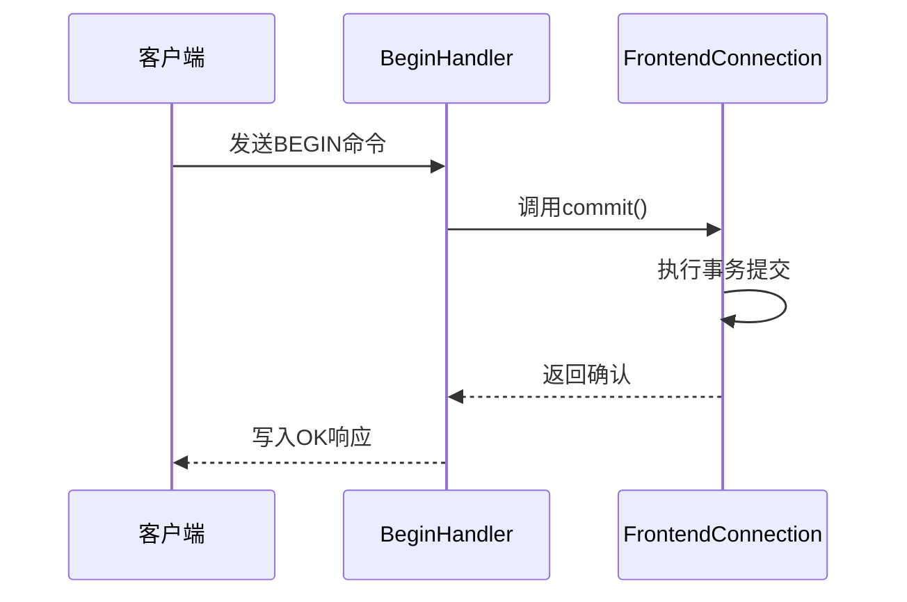
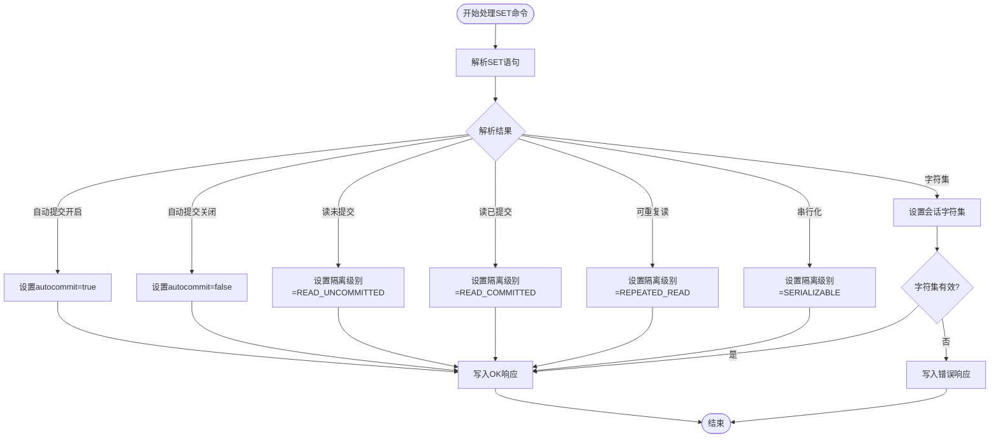
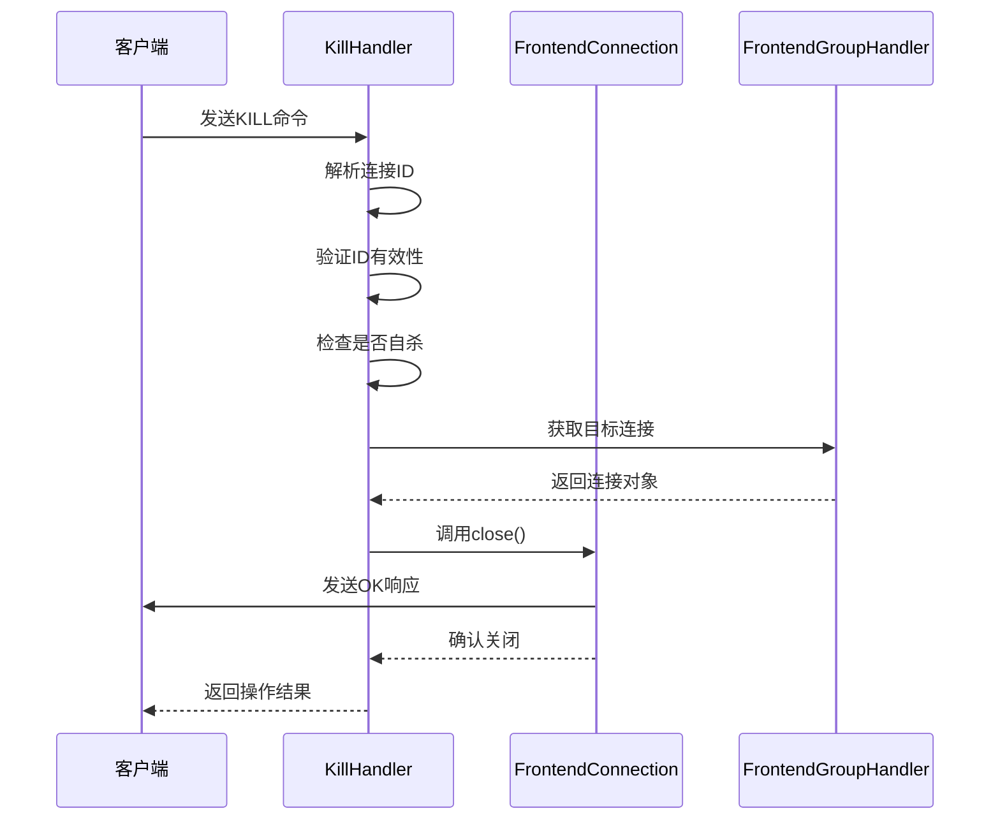
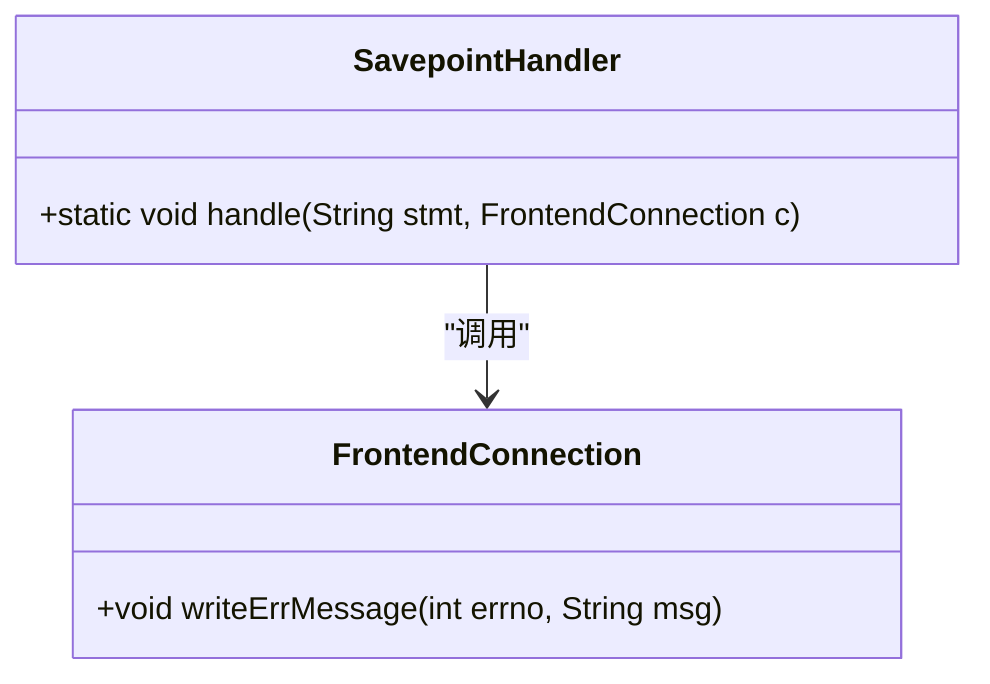
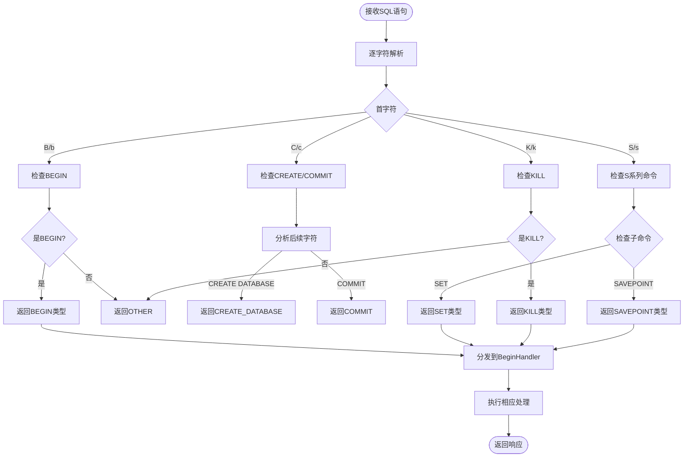
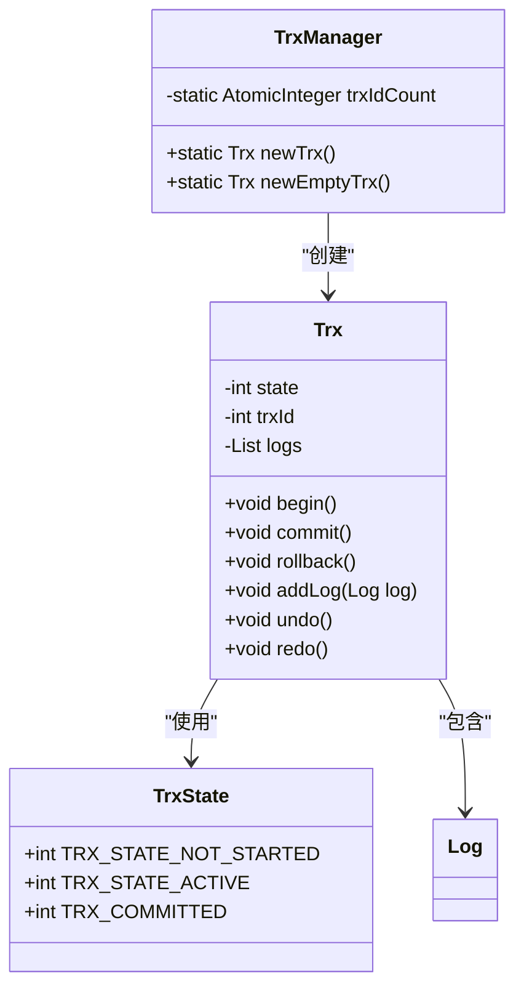
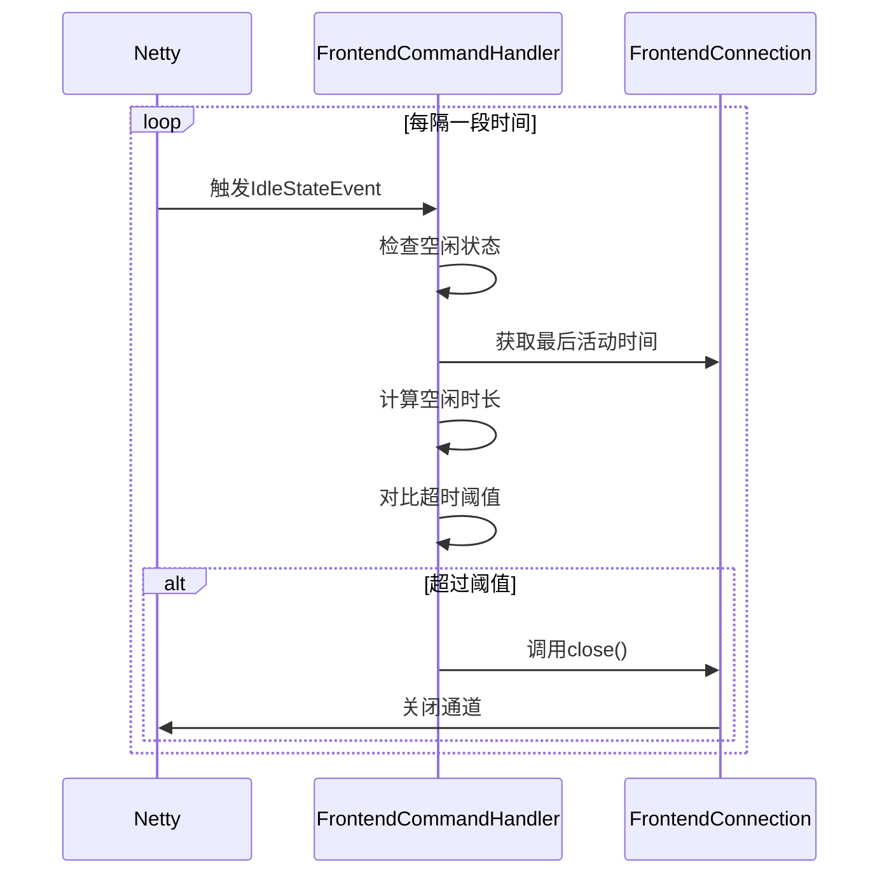

# 会话控制命令处理

<cite>
**本文档引用的文件**   
- [BeginHandler.java](file://src/main/java/alchemystar/freedom/engine/net/handler/frontend/BeginHandler.java)
- [SetHandler.java](file://src/main/java/alchemystar/freedom/engine/net/handler/frontend/SetHandler.java)
- [KillHandler.java](file://src/main/java/alchemystar/freedom/engine/net/handler/frontend/KillHandler.java)
- [SavepointHandler.java](file://src/main/java/alchemystar/freedom/engine/net/handler/frontend/SavepointHandler.java)
- [ServerParse.java](file://src/main/java/alchemystar/freedom/engine/parser/ServerParse.java)
- [FrontendConnection.java](file://src/main/java/alchemystar/freedom/engine/net/handler/frontend/FrontendConnection.java)
- [TrxManager.java](file://src/main/java/alchemystar/freedom/transaction/TrxManager.java)
- [Trx.java](file://src/main/java/alchemystar/freedom/transaction/Trx.java)
- [TrxState.java](file://src/main/java/alchemystar/freedom/transaction/TrxState.java)
</cite>

## 目录
1. [事务控制命令实现](#事务控制命令实现)
2. [会话配置命令处理](#会话配置命令处理)
3. [连接管理命令机制](#连接管理命令机制)
4. [保存点管理功能](#保存点管理功能)
5. [命令解析与分发机制](#命令解析与分发机制)
6. [事务状态与恢复策略](#事务状态与恢复策略)
7. [连接泄漏防护机制](#连接泄漏防护机制)

## 事务控制命令实现

`BeginHandler`类负责处理事务开始命令，当客户端发送`BEGIN`语句时，系统通过`FrontendConnection`对象执行事务提交并返回成功响应。该处理流程确保了事务的正确启动和状态管理。

**图示来源**
- [BeginHandler.java](file://src/main/java/alchemystar/freedom/engine/net/handler/frontend/BeginHandler.java#L10-L14)
- [FrontendConnection.java](file://src/main/java/alchemystar/freedom/engine/net/handler/frontend/FrontendConnection.java#L150-L155)

**本节来源**
- [BeginHandler.java](file://src/main/java/alchemystar/freedom/engine/net/handler/frontend/BeginHandler.java#L10-L14)
- [FrontendConnection.java](file://src/main/java/alchemystar/freedom/engine/net/handler/frontend/FrontendConnection.java#L150-L155)

## 会话配置命令处理

`SetHandler`类负责处理`SET`语句，通过解析语句内容来更新会话的各种属性。该处理器支持自动提交模式、事务隔离级别和字符集等关键会话参数的配置。

**图示来源**
- [SetHandler.java](file://src/main/java/alchemystar/freedom/engine/net/handler/frontend/SetHandler.java#L20-L80)
- [ServerParseSet.java](file://src/main/java/alchemystar/freedom/engine/parser/ServerParseSet.java)

**本节来源**
- [SetHandler.java](file://src/main/java/alchemystar/freedom/engine/net/handler/frontend/SetHandler.java#L20-L80)
- [FrontendConnection.java](file://src/main/java/alchemystar/freedom/engine/net/handler/frontend/FrontendConnection.java#L250-L270)

## 连接管理命令机制

`KillHandler`类实现了连接终止功能，允许管理员终止指定的连接或查询线程。该处理器通过连接ID识别目标连接，并执行相应的关闭操作。

**图示来源**
- [KillHandler.java](file://src/main/java/alchemystar/freedom/engine/net/handler/frontend/KillHandler.java#L10-L55)
- [FrontendGroupHandler.java](file://src/main/java/alchemystar/freedom/engine/net/handler/frontend/FrontendGroupHandler.java)

**本节来源**
- [KillHandler.java](file://src/main/java/alchemystar/freedom/engine/net/handler/frontend/KillHandler.java#L10-L55)
- [FrontendConnection.java](file://src/main/java/alchemystar/freedom/engine/net/handler/frontend/FrontendConnection.java#L100-L110)

## 保存点管理功能

`SavepointHandler`目前实现了保存点命令的基本框架，但尚未提供完整的保存点管理功能。当前实现会返回不支持该语句的错误信息。

**图示来源**
- [SavepointHandler.java](file://src/main/java/alchemystar/freedom/engine/net/handler/frontend/SavepointHandler.java#L10-L16)
- [FrontendConnection.java](file://src/main/java/alchemystar/freedom/engine/net/handler/frontend/FrontendConnection.java#L280-L290)

**本节来源**
- [SavepointHandler.java](file://src/main/java/alchemystar/freedom/engine/net/handler/frontend/SavepointHandler.java#L10-L16)

## 命令解析与分发机制

`ServerParse`类实现了SQL命令的解析和分发机制，通过字符级别的分析确定命令类型，并将其分发到相应的处理器。该机制支持`BEGIN`、`SET`、`KILL`等多种会话控制命令。

**图示来源**
- [ServerParse.java](file://src/main/java/alchemystar/freedom/engine/parser/ServerParse.java#L50-L450)
- [FrontendCommandHandler.java](file://src/main/java/alchemystar/freedom/engine/net/handler/frontend/FrontendCommandHandler.java)

**本节来源**
- [ServerParse.java](file://src/main/java/alchemystar/freedom/engine/parser/ServerParse.java#L50-L450)
- [FrontendCommandHandler.java](file://src/main/java/alchemystar/freedom/engine/net/handler/frontend/FrontendCommandHandler.java#L40-L60)

## 事务状态与恢复策略

事务管理系统通过`Trx`类和`TrxManager`类协同工作，实现了完整的事务生命周期管理。`TrxManager`负责创建新的事务对象，而`Trx`类管理事务的具体状态和操作。

**图示来源**
- [TrxManager.java](file://src/main/java/alchemystar/freedom/transaction/TrxManager.java#L10-L22)
- [Trx.java](file://src/main/java/alchemystar/freedom/transaction/Trx.java#L10-L120)
- [TrxState.java](file://src/main/java/alchemystar/freedom/transaction/TrxState.java#L5-L18)

**本节来源**
- [TrxManager.java](file://src/main/java/alchemystar/freedom/transaction/TrxManager.java#L10-L22)
- [Trx.java](file://src/main/java/alchemystar/freedom/transaction/Trx.java#L10-L120)
- [TrxState.java](file://src/main/java/alchemystar/freedom/transaction/TrxState.java#L5-L18)

## 连接泄漏防护机制

系统通过`FrontendConnection`类中的空闲状态检测机制来防止连接泄漏。当连接长时间处于空闲状态时，系统会自动关闭该连接以释放资源。

**图示来源**
- [FrontendCommandHandler.java](file://src/main/java/alchemystar/freedom/engine/net/handler/frontend/FrontendCommandHandler.java#L70-L85)
- [FrontendConnection.java](file://src/main/java/alchemystar/freedom/engine/net/handler/frontend/FrontendConnection.java#L300-L310)

**本节来源**
- [FrontendCommandHandler.java](file://src/main/java/alchemystar/freedom/engine/net/handler/frontend/FrontendCommandHandler.java#L70-L85)
- [SystemConfig.java](file://src/main/java/alchemystar/freedom/config/SystemConfig.java)