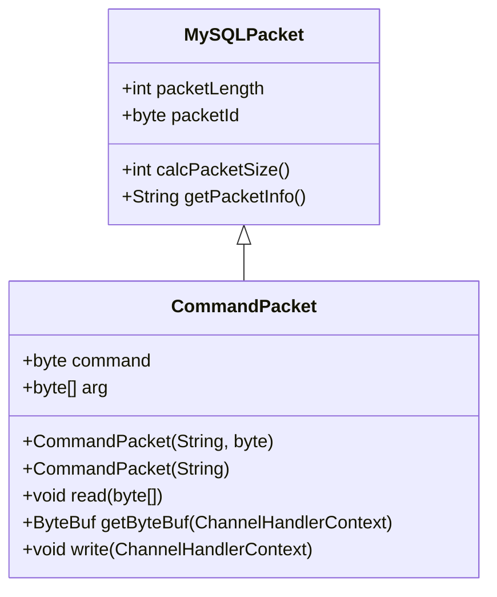
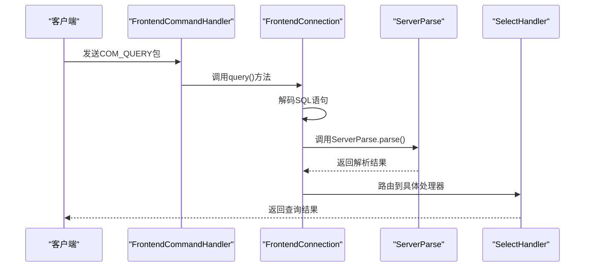
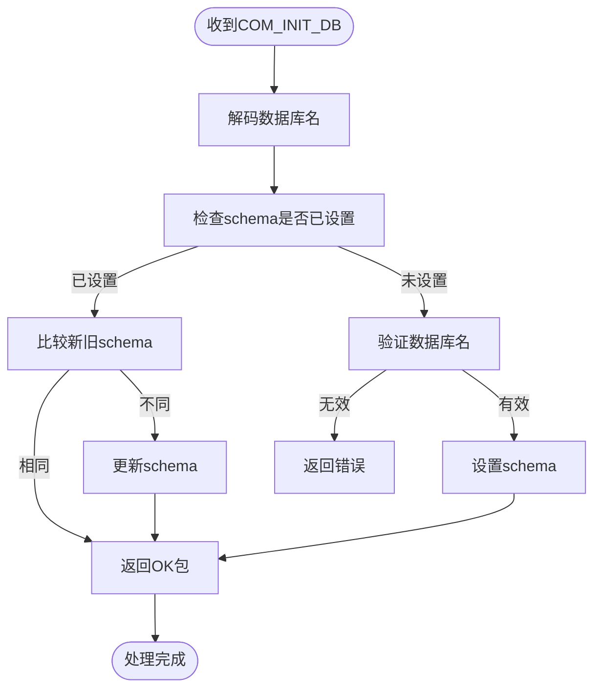
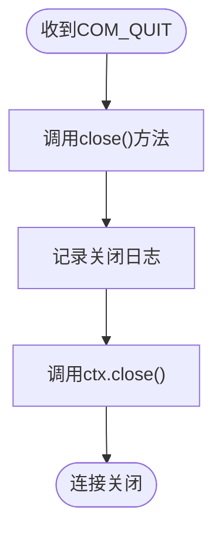
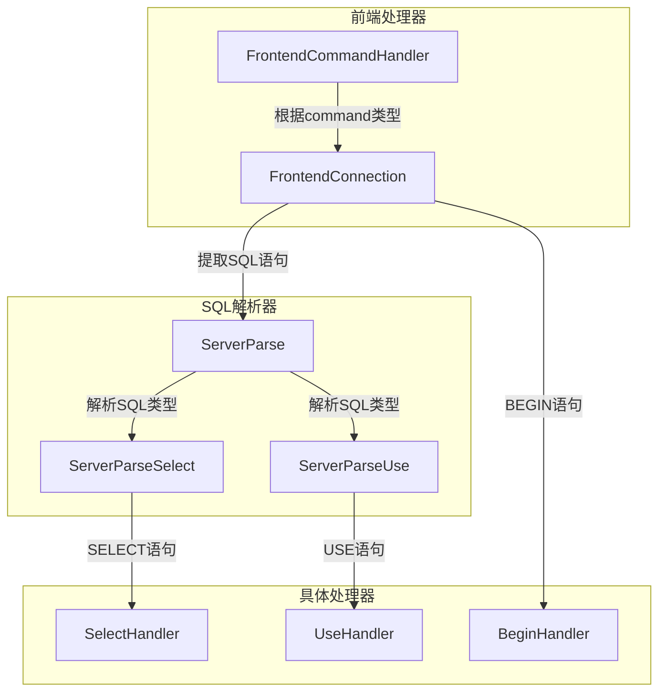
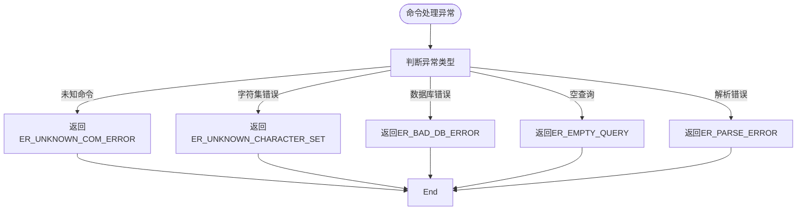

# 命令处理

<cite>
**本文档引用文件**  
- [CommandPacket.java](file://src/main/java/alchemystar/freedom/engine/net/proto/mysql/CommandPacket.java)
- [FrontendCommandHandler.java](file://src/main/java/alchemystar/freedom/engine/net/handler/frontend/FrontendCommandHandler.java)
- [ServerParse.java](file://src/main/java/alchemystar/freedom/engine/parser/ServerParse.java)
- [MySQLPacket.java](file://src/main/java/alchemystar/freedom/engine/net/proto/MySQLPacket.java)
- [FrontendConnection.java](file://src/main/java/alchemystar/freedom/engine/net/handler/frontend/FrontendConnection.java)
- [ErrorCode.java](file://src/main/java/alchemystar/freedom/engine/net/proto/util/ErrorCode.java)
- [MySQLMessage.java](file://src/main/java/alchemystar/freedom/engine/net/proto/mysql/MySQLMessage.java)
- [SelectHandler.java](file://src/main/java/alchemystar/freedom/engine/net/handler/frontend/SelectHandler.java)
- [UseHandler.java](file://src/main/java/alchemystar/freedom/engine/net/handler/frontend/UseHandler.java)
</cite>

## 目录
1. [简介](#简介)
2. [命令包结构与类型体系](#命令包结构与类型体系)
3. [核心命令类型与处理流程](#核心命令类型与处理流程)
4. [命令分发机制](#命令分发机制)
5. [参数解析与编码规范](#参数解析与编码规范)
6. [长查询语句分包处理](#长查询语句分包处理)
7. [错误处理与恢复策略](#错误处理与恢复策略)

## 简介
Freedom数据库的命令处理机制基于MySQL协议实现，通过CommandPacket封装客户端请求，经由FrontendCommandHandler进行类型分发，最终由ServerParse解析SQL语义并路由至具体处理器。本文档详细阐述该机制的架构设计、核心组件交互及关键实现细节。

## 命令包结构与类型体系



**图示来源**  
- [CommandPacket.java](file://src/main/java/alchemystar/freedom/engine/net/proto/mysql/CommandPacket.java#L1-L63)
- [MySQLPacket.java](file://src/main/java/alchemystar/freedom/engine/net/proto/MySQLPacket.java#L1-L206)

**命令类型常量定义**
```mermaid
erDiagram
COM_TYPE {
byte COM_QUIT = 1
byte COM_INIT_DB = 2
byte COM_QUERY = 3
byte COM_FIELD_LIST = 4
byte COM_REFRESH = 7
byte COM_SHUTDOWN = 8
byte COM_STATISTICS = 9
byte COM_PROCESS_INFO = 10
byte COM_PROCESS_KILL = 12
byte COM_PING = 14
byte COM_HEARTBEAT = 64
}
```

**图示来源**  
- [MySQLPacket.java](file://src/main/java/alchemystar/freedom/engine/net/proto/MySQLPacket.java#L74-L142)

**本节来源**  
- [CommandPacket.java](file://src/main/java/alchemystar/freedom/engine/net/proto/mysql/CommandPacket.java#L1-L63)
- [MySQLPacket.java](file://src/main/java/alchemystar/freedom/engine/net/proto/MySQLPacket.java#L1-L206)

## 核心命令类型与处理流程

### COM_QUERY 命令
用于执行SQL查询语句，是数据库最核心的命令类型。

**处理流程**


**图示来源**  
- [FrontendCommandHandler.java](file://src/main/java/alchemystar/freedom/engine/net/handler/frontend/FrontendCommandHandler.java#L30-L35)
- [FrontendConnection.java](file://src/main/java/alchemystar/freedom/engine/net/handler/frontend/FrontendConnection.java#L65-L85)
- [ServerParse.java](file://src/main/java/alchemystar/freedom/engine/parser/ServerParse.java#L1-L449)

### COM_INIT_DB 命令
用于初始化数据库连接的默认schema。

**处理流程**


**图示来源**  
- [FrontendCommandHandler.java](file://src/main/java/alchemystar/freedom/engine/net/handler/frontend/FrontendCommandHandler.java#L25-L28)
- [FrontendConnection.java](file://src/main/java/alchemystar/freedom/engine/net/handler/frontend/FrontendConnection.java#L30-L63)

### COM_QUIT 命令
用于关闭数据库连接。

**处理流程**


**图示来源**  
- [FrontendCommandHandler.java](file://src/main/java/alchemystar/freedom/engine/net/handler/frontend/FrontendCommandHandler.java#L36-L38)
- [FrontendConnection.java](file://src/main/java/alchemystar/freedom/engine/net/handler/frontend/FrontendConnection.java#L90-L95)

**本节来源**  
- [FrontendCommandHandler.java](file://src/main/java/alchemystar/freedom/engine/net/handler/frontend/FrontendCommandHandler.java#L25-L38)
- [FrontendConnection.java](file://src/main/java/alchemystar/freedom/engine/net/handler/frontend/FrontendConnection.java#L30-L95)

## 命令分发机制



**图示来源**  
- [FrontendCommandHandler.java](file://src/main/java/alchemystar/freedom/engine/net/handler/frontend/FrontendCommandHandler.java#L1-L89)
- [ServerParse.java](file://src/main/java/alchemystar/freedom/engine/parser/ServerParse.java#L1-L449)
- [SelectHandler.java](file://src/main/java/alchemystar/freedom/engine/net/handler/frontend/SelectHandler.java#L1-L40)
- [UseHandler.java](file://src/main/java/alchemystar/freedom/engine/net/handler/frontend/UseHandler.java#L1-L15)

**分发逻辑说明**
1. FrontendCommandHandler接收二进制包，根据command字段分发
2. FrontendConnection负责具体命令的执行入口
3. ServerParse对SQL语句进行词法分析，确定具体操作类型
4. 根据解析结果调用相应的处理器（如SelectHandler、UseHandler）

**本节来源**  
- [FrontendCommandHandler.java](file://src/main/java/alchemystar/freedom/engine/net/handler/frontend/FrontendCommandHandler.java#L1-L89)
- [FrontendConnection.java](file://src/main/java/alchemystar/freedom/engine/net/handler/frontend/FrontendConnection.java#L1-L320)
- [ServerParse.java](file://src/main/java/alchemystar/freedom/engine/parser/ServerParse.java#L1-L449)

## 参数解析与编码规范

### arg参数字段解析
CommandPacket的arg字段包含命令的具体参数，其解析过程如下：

```mermaid
flowchart TD
Start([CommandPacket.read()]) --> ReadUB3["读取packetLength"]
ReadUB3 --> ReadPacketId["读取packetId"]
ReadPacketId --> ReadCommand["读取command字段"]
ReadCommand --> ReadArg["读取剩余所有字节作为arg"]
ReadArg --> CreateMM["创建MySQLMessage对象"]
CreateMM --> ProcessArg["根据command类型处理arg"]
ProcessArg --> End([参数解析完成])
```

**图示来源**  
- [CommandPacket.java](file://src/main/java/alchemystar/freedom/engine/net/proto/mysql/CommandPacket.java#L25-L32)
- [MySQLMessage.java](file://src/main/java/alchemystar/freedom/engine/net/proto/mysql/MySQLMessage.java#L1-L364)

### SQL语句编码要求
1. **字符编码**：必须使用UTF-8编码
2. **字符串解码**：通过MySQLMessage.readString(charset)方法解码
3. **异常处理**：若字符集不支持，返回ER_UNKNOWN_CHARACTER_SET错误

```java
// 示例代码逻辑
try {
    sql = mm.readString(charset);
} catch (UnsupportedEncodingException e) {
    writeErrMessage(ErrorCode.ER_UNKNOWN_CHARACTER_SET, "Unknown charset '" + charset + "'");
    return;
}
```

**本节来源**  
- [CommandPacket.java](file://src/main/java/alchemystar/freedom/engine/net/proto/mysql/CommandPacket.java#L25-L32)
- [FrontendConnection.java](file://src/main/java/alchemystar/freedom/engine/net/handler/frontend/FrontendConnection.java#L70-L75)
- [MySQLMessage.java](file://src/main/java/alchemystar/freedom/engine/net/proto/mysql/MySQLMessage.java#L250-L270)

## 长查询语句分包处理
当SQL语句长度超过单个数据包容量时，系统支持分包传输：

1. **分包检测**：通过packetLength字段判断是否为分包
2. **缓冲区管理**：前端连接维护临时缓冲区
3. **重组机制**：将多个分包的数据按顺序重组
4. **完整性校验**：验证重组后的SQL语句完整性

虽然当前代码未显式实现分包处理逻辑，但Netty框架的ByteBuf机制天然支持大数据包的分段读取与重组。

**本节来源**  
- [FrontendConnection.java](file://src/main/java/alchemystar/freedom/engine/net/handler/frontend/FrontendConnection.java#L65-L85)
- [MySQLMessage.java](file://src/main/java/alchemystar/freedom/engine/net/proto/mysql/MySQLMessage.java#L1-L364)

## 错误处理与恢复策略

### 典型错误码
```mermaid
erDiagram
ERROR_CODE {
int ER_UNKNOWN_COM_ERROR = 1047
int ER_UNKNOWN_CHARACTER_SET = 1033
int ER_BAD_DB_ERROR = 1049
int ER_EMPTY_QUERY = 1065
int ER_PARSE_ERROR = 1064
int ER_NOT_ALLOWED_COMMAND = 1046
}
```

**图示来源**  
- [ErrorCode.java](file://src/main/java/alchemystar/freedom/engine/net/proto/util/ErrorCode.java#L1-L522)

### 错误处理流程


**恢复策略**
1. **连接保持**：除COM_QUIT外，大多数错误不会关闭连接
2. **状态重置**：错误处理后重置相关状态变量
3. **日志记录**：详细记录错误信息用于诊断
4. **客户端提示**：返回明确的错误信息帮助客户端定位问题

**本节来源**  
- [ErrorCode.java](file://src/main/java/alchemystar/freedom/engine/net/proto/util/ErrorCode.java#L1-L522)
- [FrontendCommandHandler.java](file://src/main/java/alchemystar/freedom/engine/net/handler/frontend/FrontendCommandHandler.java#L55-L58)
- [FrontendConnection.java](file://src/main/java/alchemystar/freedom/engine/net/handler/frontend/FrontendConnection.java#L150-L170)