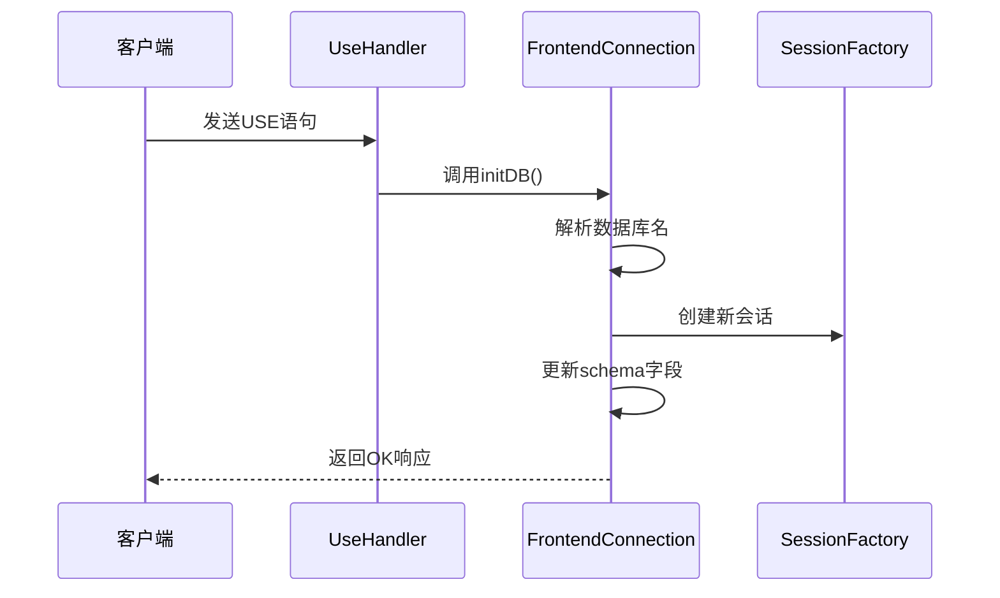
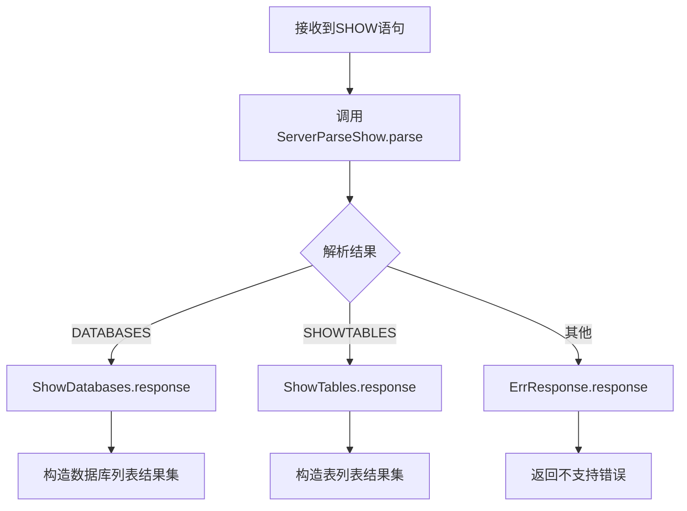
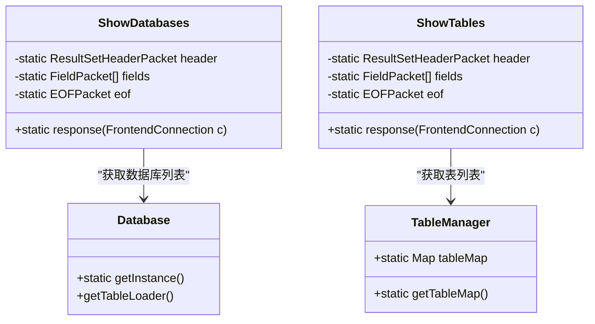
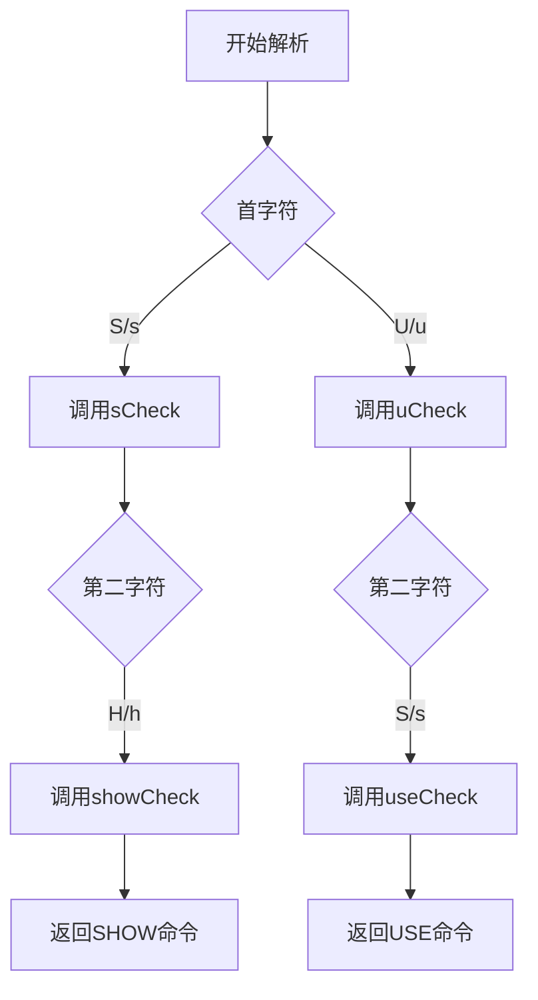
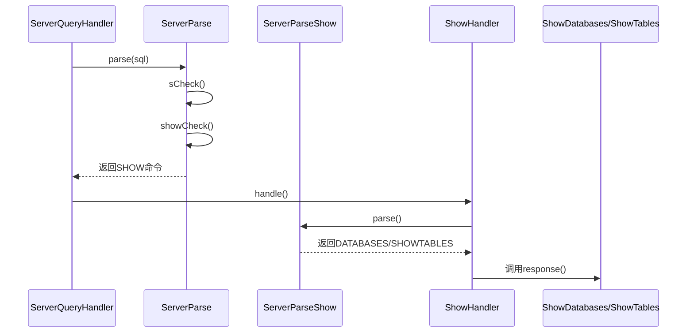
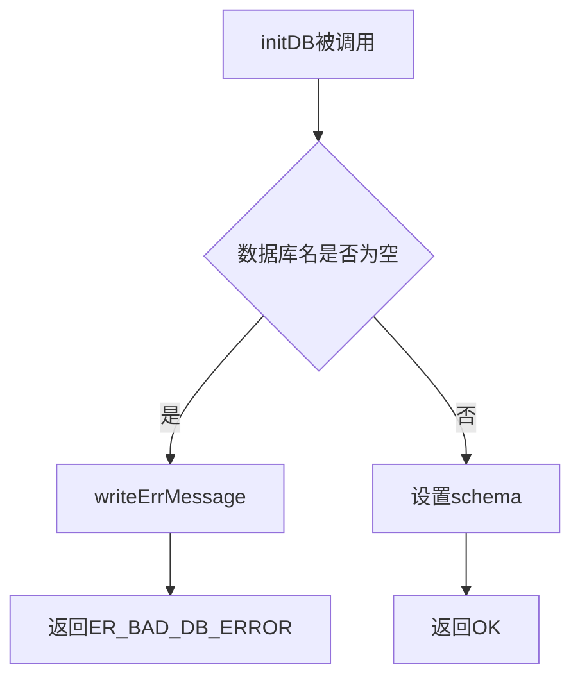
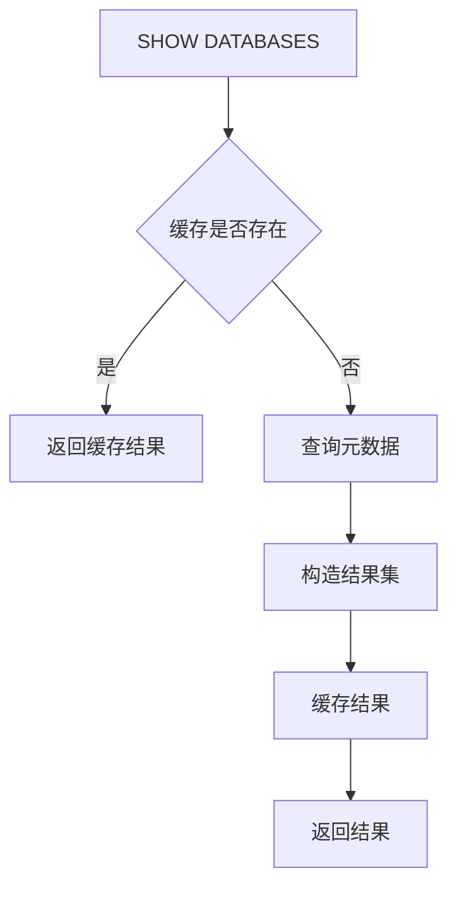

# 数据库操作命令处理

<cite>
**本文档引用的文件**
- [FrontendConnection.java](file://src/main/java/alchemystar/freedom/engine/net/handler/frontend/FrontendConnection.java)
- [UseHandler.java](file://src/main/java/alchemystar/freedom/engine/net/handler/frontend/UseHandler.java)
- [ShowHandler.java](file://src/main/java/alchemystar/freedom/engine/net/handler/frontend/ShowHandler.java)
- [ServerParse.java](file://src/main/java/alchemystar/freedom/engine/parser/ServerParse.java)
- [ServerParseShow.java](file://src/main/java/alchemystar/freedom/engine/parser/ServerParseShow.java)
- [ShowDatabases.java](file://src/main/java/alchemystar/freedom/engine/net/response/ShowDatabases.java)
- [ShowTables.java](file://src/main/java/alchemystar/freedom/engine/net/response/ShowTables.java)
- [TableManager.java](file://src/main/java/alchemystar/freedom/meta/TableManager.java)
- [Database.java](file://src/main/java/alchemystar/freedom/Database.java)
</cite>

## 目录
1. [简介](#简介)
2. [USE命令处理机制](#use命令处理机制)
3. [SHOW命令处理流程](#show命令处理流程)
4. [命令解析识别机制](#命令解析识别机制)
5. [错误处理与权限校验](#错误处理与权限校验)
6. [元数据查询性能优化](#元数据查询性能优化)
7. [结论](#结论)

## 简介
本文档深入分析Freedom数据库系统中COM_INIT_DB和SHOW命令的处理实现。重点描述UseHandler如何处理USE语句，包括数据库切换逻辑、元数据验证及会话状态更新。同时解析ShowHandler对SHOW DATABASES/SHOW TABLES的处理流程，说明其如何调用TableManager获取元数据列表，并通过ShowDatabases、ShowTables等响应类构造结果集。结合ServerParse中的USE和SHOW解析逻辑，阐述命令识别机制。提供数据库不存在时的错误处理（ER_BAD_DB_ERROR）和权限校验流程，并给出元数据查询的性能优化建议。

## USE命令处理机制

### UseHandler处理流程
UseHandler负责处理客户端发送的USE语句，实现数据库切换功能。当前实现中，`handle`方法直接调用`writeOk()`返回成功响应，实际的数据库切换逻辑在`FrontendConnection.initDB()`方法中完成。

**图示来源**
- [UseHandler.java](file://src/main/java/alchemystar/freedom/engine/net/handler/frontend/UseHandler.java)
- [FrontendConnection.java](file://src/main/java/alchemystar/freedom/engine/net/handler/frontend/FrontendConnection.java#L43-L76)

### 数据库切换逻辑
数据库切换的核心逻辑在`FrontendConnection.initDB()`方法中实现：

1. 从二进制包中解析出数据库名称
2. 检查是否已设置schema，若已设置且与目标数据库相同则直接返回
3. 若数据库名为空，则返回ER_BAD_DB_ERROR错误
4. 否则设置schema字段并返回成功响应

该方法同时创建新的Session对象，实现会话状态的更新。

**本节来源**
- [FrontendConnection.java](file://src/main/java/alchemystar/freedom/engine/net/handler/frontend/FrontendConnection.java#L43-L76)

## SHOW命令处理流程

### ShowHandler处理机制
ShowHandler负责处理SHOW语句，根据解析结果分发到不同的响应处理器：

**图示来源**
- [ShowHandler.java](file://src/main/java/alchemystar/freedom/engine/net/handler/frontend/ShowHandler.java)

### 元数据获取与结果集构造
#### SHOW DATABASES实现
`ShowDatabases.response()`方法通过`Database.getInstance()`获取数据库实例，然后获取所有可用的数据库名称列表，构造包含单列"DATABASE"的结果集。

#### SHOW TABLES实现
`ShowTables.response()`方法通过`TableManager.getTableMap()`获取当前数据库中所有表的名称，构造包含单列"TABLES"的结果集。

**图示来源**
- [ShowDatabases.java](file://src/main/java/alchemystar/freedom/engine/net/response/ShowDatabases.java)
- [ShowTables.java](file://src/main/java/alchemystar/freedom/engine/net/response/ShowTables.java)
- [TableManager.java](file://src/main/java/alchemystar/freedom/meta/TableManager.java)
- [Database.java](file://src/main/java/alchemystar/freedom/Database.java)

**本节来源**
- [ShowHandler.java](file://src/main/java/alchemystar/freedom/engine/net/handler/frontend/ShowHandler.java)
- [ShowDatabases.java](file://src/main/java/alchemystar/freedom/engine/net/response/ShowDatabases.java)
- [ShowTables.java](file://src/main/java/alchemystar/freedom/engine/net/response/ShowTables.java)

## 命令解析识别机制

### ServerParse命令识别
ServerParse类负责SQL语句的初步解析和命令类型识别。对于USE和SHOW命令的识别机制如下：

**图示来源**
- [ServerParse.java](file://src/main/java/alchemystar/freedom/engine/parser/ServerParse.java)

### SHOW命令详细解析
ServerParseShow类进一步解析SHOW语句的具体类型：

1. `showCheck()`方法识别"SHOW"关键字
2. `dataCheck()`方法检查是否为"SHOW DATA"
3. `showDatabases()`方法识别"SHOW DATABASES"完整命令
4. 返回对应的命令类型常量（ServerParseShow.DATABASES）

**图示来源**
- [ServerParse.java](file://src/main/java/alchemystar/freedom/engine/parser/ServerParse.java)
- [ServerParseShow.java](file://src/main/java/alchemystar/freedom/engine/parser/ServerParseShow.java)
- [ServerQueryHandler.java](file://src/main/java/alchemystar/freedom/engine/net/handler/frontend/ServerQueryHandler.java)

**本节来源**
- [ServerParse.java](file://src/main/java/alchemystar/freedom/engine/parser/ServerParse.java)
- [ServerParseShow.java](file://src/main/java/alchemystar/freedom/engine/parser/ServerParseShow.java)

## 错误处理与权限校验

### 数据库不存在错误处理
当请求的数据库不存在时，系统返回ER_BAD_DB_ERROR错误码。在`FrontendConnection.initDB()`方法中：

1. 如果解析出的数据库名为null，直接调用`writeErrMessage()`
2. 使用ErrorCode.ER_BAD_DB_ERROR作为错误码
3. 错误信息为"Unknown database 'null'"

### 权限校验流程
当前系统实现中，USE命令的权限校验较为简单：

1. 仅验证数据库名称的有效性
2. 不进行用户权限检查
3. 假设连接用户有权访问指定数据库
4. 通过会话级别的schema字段实现数据库隔离

未来可扩展的权限校验包括：
- 用户角色与数据库访问权限映射
- 动态权限检查机制
- 细粒度的表级权限控制

**本节来源**
- [FrontendConnection.java](file://src/main/java/alchemystar/freedom/engine/net/handler/frontend/FrontendConnection.java#L43-L76)
- [ServerParse.java](file://src/main/java/alchemystar/freedom/engine/parser/ServerParse.java)

## 元数据查询性能优化

### 当前实现分析
当前SHOW命令的元数据查询实现具有以下特点：

1. **内存存储**：TableManager使用静态HashMap存储所有表元数据，查询时间为O(1)
2. **无缓存机制**：每次SHOW命令都重新构造结果集
3. **单列结果**：仅返回表名或数据库名，不包含额外元信息

### 性能优化建议
#### 1. 结果集缓存

#### 2. 元数据索引优化
- 为TableManager的tableMap添加读写锁，支持并发读取
- 实现LRU缓存机制，限制元数据内存占用
- 预加载常用数据库的元数据

#### 3. 网络传输优化
- 复用结果集头部包（ResultSetHeaderPacket）
- 预分配常用字段包（FieldPacket）
- 批量写入行数据包，减少网络调用次数

#### 4. 查询计划优化
- 为SHOW命令添加简单的查询计划
- 支持WHERE条件过滤（如SHOW TABLES LIKE 'user%'）
- 实现元数据统计信息收集

**本节来源**
- [TableManager.java](file://src/main/java/alchemystar/freedom/meta/TableManager.java)
- [ShowDatabases.java](file://src/main/java/alchemystar/freedom/engine/net/response/ShowDatabases.java)
- [ShowTables.java](file://src/main/java/alchemystar/freedom/engine/net/response/ShowTables.java)

## 结论
Freedom数据库系统对COM_INIT_DB和SHOW命令的处理实现了基本的数据库切换和元数据查询功能。USE命令通过FrontendConnection的initDB方法完成数据库切换和会话状态更新，而SHOW命令通过ShowHandler分发到相应的响应处理器。命令识别机制基于ServerParse的字符匹配算法，具有较高的解析效率。

当前实现中，错误处理机制较为完善，能够正确返回ER_BAD_DB_ERROR错误码。权限校验相对简单，主要依赖会话级别的schema隔离。元数据查询性能方面，由于TableManager使用内存HashMap存储，基本查询性能良好，但仍有缓存优化、并发控制和网络传输优化等改进空间。

建议未来版本中增强权限管理体系，实现更细粒度的访问控制，并优化元数据查询的缓存机制，以提升系统整体性能和安全性。