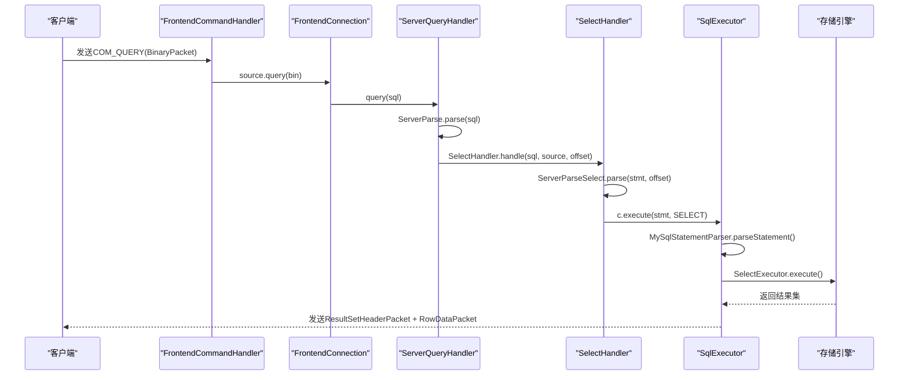

# 查询命令处理

<cite>
**本文档引用文件**  
- [FrontendCommandHandler.java](file://src/main/java/alchemystar/freedom/engine/net/handler/frontend/FrontendCommandHandler.java)
- [ServerQueryHandler.java](file://src/main/java/alchemystar/freedom/engine/net/handler/frontend/ServerQueryHandler.java)
- [SelectHandler.java](file://src/main/java/alchemystar/freedom/engine/net/handler/frontend/SelectHandler.java)
- [ServerParse.java](file://src/main/java/alchemystar/freedom/engine/parser/ServerParse.java)
- [ServerParseSelect.java](file://src/main/java/alchemystar/freedom/engine/parser/ServerParseSelect.java)
- [SqlExecutor.java](file://src/main/java/alchemystar/freedom/sql/SqlExecutor.java)
- [BinaryPacket.java](file://src/main/java/alchemystar/freedom/engine/net/proto/mysql/BinaryPacket.java)
- [ErrorCode.java](file://src/main/java/alchemystar/freedom/engine/net/proto/util/ErrorCode.java)
</cite>

## 目录
1. [引言](#引言)
2. [COM_QUERY命令处理流程概述](#com_query命令处理流程概述)
3. [FrontendCommandHandler接收请求](#frontendcommandhandler接收请求)
4. [ServerQueryHandler分发SQL语句](#serverqueryhandler分发sql语句)
5. [SelectHandler处理SELECT语句](#selecthandler处理select语句)
6. [ServerParseSelect解析SELECT语句](#serverparseselect解析select语句)
7. [SQL执行与结果返回](#sql执行与结果返回)
8. [错误处理机制](#错误处理机制)
9. [典型SELECT语句处理时序图](#典型select语句处理时序图)
10. [总结](#总结)

## 引言
本文档详细阐述了Freedom数据库系统中COM_QUERY命令的完整处理流程。从FrontendCommandHandler接收到BinaryPacket开始，分析SQL语句如何被传递至ServerQueryHandler进行分发，并重点说明SelectHandler对SELECT语句的处理机制。内容涵盖语法解析、执行计划生成、查询执行全过程，以及异常处理策略。

## COM_QUERY命令处理流程概述
当客户端发送一个COM_QUERY命令时，系统通过Netty框架接收BinaryPacket数据包，由FrontendCommandHandler解析命令类型。若为COM_QUERY，则调用FrontendConnection的query方法，将SQL语句交由ServerQueryHandler处理。ServerQueryHandler使用ServerParse进行语法识别，根据解析结果分发至相应的处理器（如SelectHandler）。对于SELECT语句，进一步由SelectHandler判断是否为系统变量查询，否则交由SqlExecutor执行。

## FrontendCommandHandler接收请求

FrontendCommandHandler是Netty通道处理器，负责处理前端传入的命令包。其`channelRead`方法接收BinaryPacket对象，提取第一个字节作为命令类型：

```java
BinaryPacket bin = (BinaryPacket) msg;
byte type = bin.data[0];
```

当`type == MySQLPacket.COM_QUERY`时，调用`source.query(bin)`将请求转发给FrontendConnection实例。

**Section sources**
- [FrontendCommandHandler.java](file://src/main/java/alchemystar/freedom/engine/net/handler/frontend/FrontendCommandHandler.java#L38-L40)

## ServerQueryHandler分发SQL语句

ServerQueryHandler实现FrontendQueryHandler接口，负责SQL语句的初步解析与分发。其`query`方法接收原始SQL字符串，先去除注释，再调用`ServerParse.parse(sql)`进行语法分析：

```java
int rs = ServerParse.parse(sql);
switch (rs & 0xff) {
    case ServerParse.SELECT:
        SelectHandler.handle(sql, source, rs >>> 8);
        break;
    // 其他命令处理...
}
```

解析结果`rs`的低8位表示命令类型，高8位表示偏移量，用于后续精细化解析。

**Section sources**
- [ServerQueryHandler.java](file://src/main/java/alchemystar/freedom/engine/net/handler/frontend/ServerQueryHandler.java#L20-L35)

## SelectHandler处理SELECT语句

SelectHandler专门处理SELECT类型的SQL语句。它调用`ServerParseSelect.parse(stmt, offs)`对语句进行细粒度解析：

```java
switch (ServerParseSelect.parse(stmt, offs)) {
    case ServerParseSelect.DATABASE:
        SelectDatabase.response(c);
        break;
    case ServerParseSelect.VERSION_COMMENT:
        SelectVersionComment.response(c);
        break;
    case ServerParseSelect.VERSION:
        SelectVersion.response(c);
        break;
    default:
        if (selectIncrement.equals(stmt)) {
            SelectIncrementResponse.response(c);
        } else {
            c.execute(stmt, ServerParse.SELECT);
        }
        break;
}
```

对于特定的系统查询（如`SELECT @@version`），直接返回预定义响应；否则交由`c.execute()`进入通用执行流程。

**Section sources**
- [SelectHandler.java](file://src/main/java/alchemystar/freedom/engine/net/handler/frontend/SelectHandler.java#L15-L35)

## ServerParseSelect解析SELECT语句

ServerParseSelect类负责解析SELECT语句的具体结构。它通过词法分析提取字段、表名和条件信息：

- **字段提取**：识别SELECT后的列名列表，支持`*`通配符
- **表名解析**：从FROM子句中提取目标表名，支持别名
- **条件分析**：解析WHERE子句中的表达式树，构建过滤条件

该类通过状态机方式逐字符扫描SQL语句，结合偏移量精确判断语义。

**Section sources**
- [ServerParseSelect.java](file://src/main/java/alchemystar/freedom/engine/parser/ServerParseSelect.java)

## SQL执行与结果返回

非系统级SELECT语句最终由SqlExecutor执行。其流程如下：

```java
MySqlStatementParser parser = new MySqlStatementParser(sql);
SQLStatement sqlStatement = parser.parseStatement();
if (sqlStatement instanceof SQLSelectStatement) {
    SelectExecutor selectExecutor = new SelectExecutor(sqlStatement, con);
    selectExecutor.execute();
}
```

SelectExecutor负责生成执行计划、调用优化器、访问存储引擎并组织结果集返回。

**Section sources**
- [SqlExecutor.java](file://src/main/java/alchemystar/freedom/sql/SqlExecutor.java#L25-L30)

## 错误处理机制

系统在多个层级提供错误处理：

1. **语法错误**：`ServerParse.parse()`失败时返回`ServerParse.ERROR`，触发`ER_PARSE_ERROR`
2. **不支持命令**：如EXPLAIN命令返回`ER_UNKNOWN_COM_ERROR`
3. **执行异常**：捕获运行时异常并返回对应错误码

错误码定义于`ErrorCode.java`中，例如：
- `ER_PARSE_ERROR = 1064`
- `ER_UNKNOWN_COM_ERROR = 1047`

通过`source.writeErrMessage(code, message)`向客户端发送ErrorPacket。

**Section sources**
- [ErrorCode.java](file://src/main/java/alchemystar/freedom/engine/net/proto/util/ErrorCode.java)
- [ServerQueryHandler.java](file://src/main/java/alchemystar/freedom/engine/net/handler/frontend/ServerQueryHandler.java#L37-L39)

## 典型SELECT语句处理时序图



**Diagram sources**
- [FrontendCommandHandler.java](file://src/main/java/alchemystar/freedom/engine/net/handler/frontend/FrontendCommandHandler.java)
- [ServerQueryHandler.java](file://src/main/java/alchemystar/freedom/engine/net/handler/frontend/ServerQueryHandler.java)
- [SelectHandler.java](file://src/main/java/alchemystar/freedom/engine/net/handler/frontend/SelectHandler.java)
- [SqlExecutor.java](file://src/main/java/alchemystar/freedom/sql/SqlExecutor.java)

## 总结
COM_QUERY命令的处理流程体现了Freedom系统的模块化设计思想：FrontendCommandHandler专注协议解析，ServerQueryHandler负责路由分发，SelectHandler处理特定语法，最终由SqlExecutor完成执行。整个过程层次清晰、职责分明，既保证了扩展性，又提升了可维护性。错误处理机制完善，能够准确反馈各类异常情况，确保客户端获得一致的交互体验。