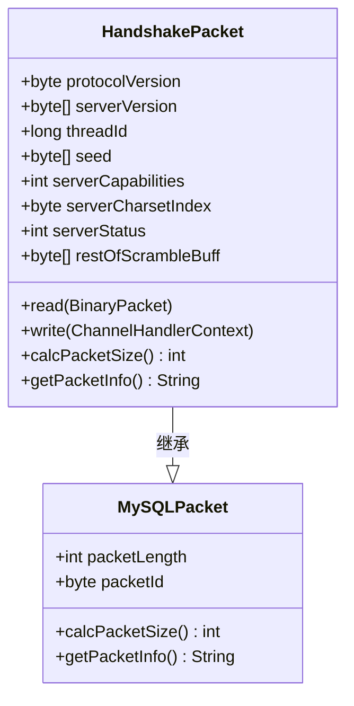
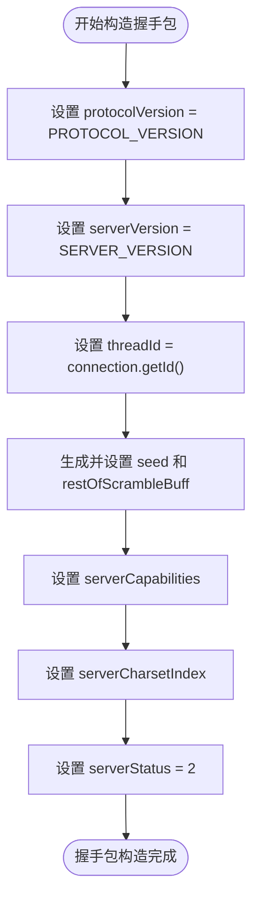
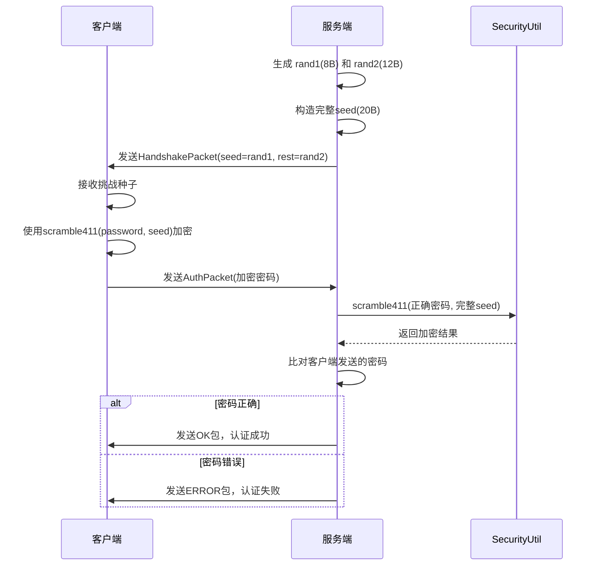
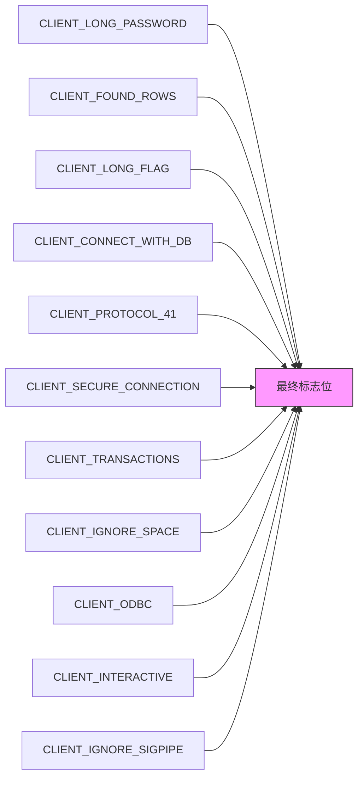
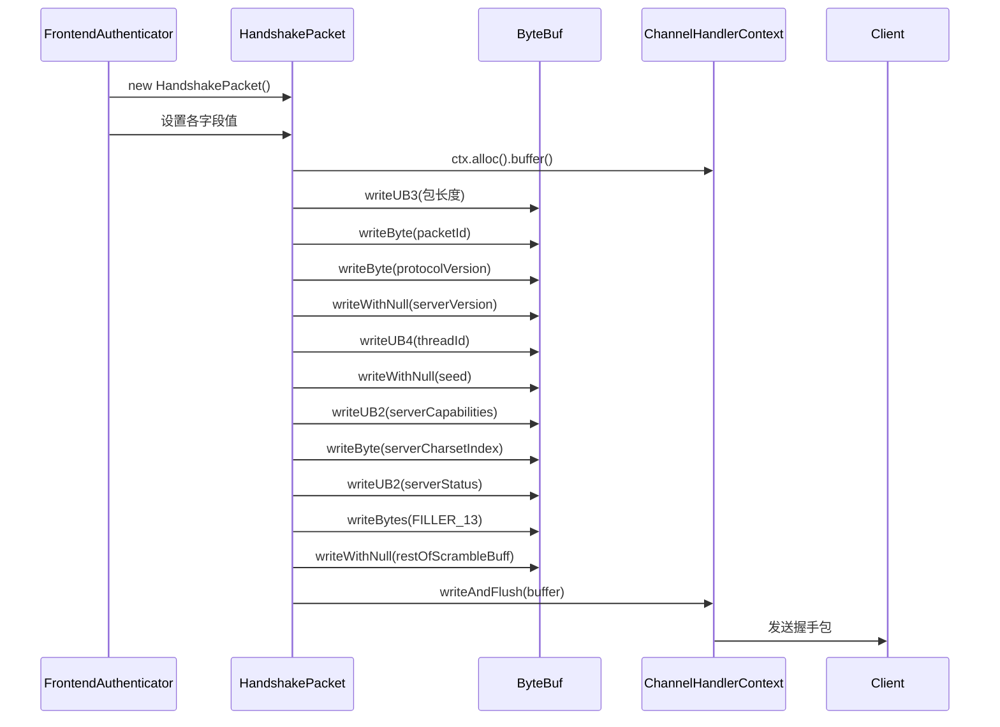

# 握手流程

<cite>
**本文档中引用的文件**  
- [HandshakePacket.java](file://src/main/java/alchemystar/freedom/engine/net/proto/mysql/HandshakePacket.java)
- [FrontendAuthenticator.java](file://src/main/java/alchemystar/freedom/engine/net/handler/frontend/FrontendAuthenticator.java)
- [Versions.java](file://src/main/java/alchemystar/freedom/engine/net/proto/util/Versions.java)
- [Capabilities.java](file://src/main/java/alchemystar/freedom/engine/net/proto/util/Capabilities.java)
- [CharsetUtil.java](file://src/main/java/alchemystar/freedom/engine/net/proto/util/CharsetUtil.java)
- [SystemConfig.java](file://src/main/java/alchemystar/freedom/config/SystemConfig.java)
- [FrontendConnection.java](file://src/main/java/alchemystar/freedom/engine/net/handler/frontend/FrontendConnection.java)
- [RandomUtil.java](file://src/main/java/alchemystar/freedom/engine/net/proto/util/RandomUtil.java)
- [SecurityUtil.java](file://src/main/java/alchemystar/freedom/engine/net/proto/util/SecurityUtil.java)
</cite>

## 目录
1. [握手流程概述](#握手流程概述)
2. [HandshakePacket结构详解](#handshakepacket结构详解)
3. [字段赋值逻辑分析](#字段赋值逻辑分析)
4. [挑战种子生成与安全认证](#挑战种子生成与安全认证)
5. [服务端能力标志位配置](#服务端能力标志位配置)
6. [字符集协商机制](#字符集协商机制)
7. [Netty序列化与发送机制](#netty序列化与发送机制)
8. [异常处理方案](#异常处理方案)
9. [性能优化建议](#性能优化建议)

## 握手流程概述

Freedom数据库的握手流程是客户端与服务端建立连接的第一步，通过`HandshakePacket`完成协议版本协商、身份认证准备和连接初始化。该流程由`FrontendAuthenticator`在`channelActive`事件触发时启动，构造并发送握手包，等待客户端响应认证信息。

**Section sources**
- [FrontendAuthenticator.java](file://src/main/java/alchemystar/freedom/engine/net/handler/frontend/FrontendAuthenticator.java#L45-L75)

## HandshakePacket结构详解

`HandshakePacket`类继承自`MySQLPacket`，封装了MySQL协议握手阶段所需的所有字段。其结构严格遵循MySQL 4.1+协议规范，包含协议版本、服务器版本、线程ID、挑战种子等关键信息。

**Diagram sources**
- [HandshakePacket.java](file://src/main/java/alchemystar/freedom/engine/net/proto/mysql/HandshakePacket.java#L12-L76)

**Section sources**
- [HandshakePacket.java](file://src/main/java/alchemystar/freedom/engine/net/proto/mysql/HandshakePacket.java#L12-L76)

## 字段赋值逻辑分析

握手包各字段的赋值遵循严格的逻辑规则，确保协议兼容性和系统一致性。

### protocolVersion
协议版本固定为10，表示MySQL 4.1协议版本，定义在`Versions`接口中。

### serverVersion
服务器版本字符串为"5.1.1-freedom"，同样由`Versions`接口提供，用于标识服务端版本信息。

### threadId
线程ID实际为前端连接对象的唯一标识`id`，通过`FrontendConnection.getId()`获取，用于在多连接环境中区分不同会话。

### serverStatus
服务端状态固定设置为2，表示服务器处于正常运行状态，支持自动提交事务模式。

**Diagram sources**
- [FrontendAuthenticator.java](file://src/main/java/alchemystar/freedom/engine/net/handler/frontend/FrontendAuthenticator.java#L50-L75)
- [Versions.java](file://src/main/java/alchemystar/freedom/engine/net/proto/util/Versions.java#L8-L12)

**Section sources**
- [FrontendAuthenticator.java](file://src/main/java/alchemystar/freedom/engine/net/handler/frontend/FrontendAuthenticator.java#L50-L75)
- [Versions.java](file://src/main/java/alchemystar/freedom/engine/net/proto/util/Versions.java#L8-L12)

## 挑战种子生成与安全认证

挑战种子（Seed）是安全认证的核心，采用双段随机数拼接方式生成，增强安全性。

### 种子生成机制
- 生成两个独立的随机字节数组：`rand1`（8字节）和`rand2`（12字节）
- 将`rand1`赋值给`HandshakePacket.seed`字段
- 将`rand2`赋值给`HandshakePacket.restOfScrambleBuff`字段
- 内部保存完整种子`seed`（20字节）用于后续密码验证

### 安全认证流程
客户端使用该种子对密码进行`scramble411`算法加密，服务端使用相同算法验证。`SecurityUtil.scramble411()`方法实现MySQL 4.1协议的挑战-响应认证机制，有效防止密码明文传输。

**Diagram sources**
- [FrontendAuthenticator.java](file://src/main/java/alchemystar/freedom/engine/net/handler/frontend/FrontendAuthenticator.java#L55-L65)
- [SecurityUtil.java](file://src/main/java/alchemystar/freedom/engine/net/proto/util/SecurityUtil.java#L1-L50)

**Section sources**
- [FrontendAuthenticator.java](file://src/main/java/alchemystar/freedom/engine/net/handler/frontend/FrontendAuthenticator.java#L55-L65)
- [RandomUtil.java](file://src/main/java/alchemystar/freedom/engine/net/proto/util/RandomUtil.java#L1-L20)
- [SecurityUtil.java](file://src/main/java/alchemystar/freedom/engine/net/proto/util/SecurityUtil.java#L1-L50)

## 服务端能力标志位配置

`serverCapabilities`字段通过位运算组合多个功能标志，告知客户端服务端支持的能力集。

### 核心能力配置
- `CLIENT_LONG_PASSWORD`: 支持长密码
- `CLIENT_FOUND_ROWS`: 返回匹配行数而非影响行数
- `CLIENT_LONG_FLAG`: 获取所有列标志
- `CLIENT_CONNECT_WITH_DB`: 允许连接时指定数据库
- `CLIENT_PROTOCOL_41`: 支持4.1协议
- `CLIENT_SECURE_CONNECTION`: 支持安全连接（4.1认证）
- `CLIENT_TRANSACTIONS`: 支持事务

### 配置策略
通过`getServerCapabilities()`方法动态计算标志位，采用位或运算（`|=`）组合所需功能。当前实现中禁用了压缩、SSL等高级功能，聚焦核心数据库操作能力。

**Diagram sources**
- [Capabilities.java](file://src/main/java/alchemystar/freedom/engine/net/proto/util/Capabilities.java#L1-L85)
- [FrontendAuthenticator.java](file://src/main/java/alchemystar/freedom/engine/net/handler/frontend/FrontendAuthenticator.java#L120-L145)

**Section sources**
- [FrontendAuthenticator.java](file://src/main/java/alchemystar/freedom/engine/net/handler/frontend/FrontendAuthenticator.java#L120-L145)
- [Capabilities.java](file://src/main/java/alchemystar/freedom/engine/net/proto/util/Capabilities.java#L1-L85)

## 字符集协商机制

字符集协商通过`serverCharsetIndex`字段实现，采用默认配置优先策略。

### 默认字符集
系统默认字符集定义在`SystemConfig.DEFAULT_CHARSET`中，当前配置为"gbk"。

### 索引映射
通过`CharsetUtil`工具类实现字符集名称与索引的双向映射：
- `CharsetUtil.getIndex(String charset)`：将字符集名称转换为MySQL协议索引
- `CharsetUtil.getCharset(int index)`：将索引转换为字符集名称

### 协商流程
1. 从`FrontendConnection`获取客户端请求的字符集索引
2. 若未指定，则使用系统默认字符集"gbk"的索引
3. 将索引值写入`serverCharsetIndex`字段发送给客户端

**Section sources**
- [SystemConfig.java](file://src/main/java/alchemystar/freedom/config/SystemConfig.java#L35-L37)
- [CharsetUtil.java](file://src/main/java/alchemystar/freedom/engine/net/proto/util/CharsetUtil.java#L1-L131)
- [FrontendAuthenticator.java](file://src/main/java/alchemystar/freedom/engine/net/handler/frontend/FrontendAuthenticator.java#L70-L71)
- [FrontendConnection.java](file://src/main/java/alchemystar/freedom/engine/net/handler/frontend/FrontendConnection.java#L150-L160)

## Netty序列化与发送机制

握手包的序列化和发送完全基于Netty框架的`ChannelHandlerContext`实现高效I/O操作。

### 序列化流程
1. 通过`ctx.alloc().buffer()`分配ByteBuf
2. 调用`BufferUtil.writeUB3()`写入包长度
3. 逐字段写入协议数据
4. 使用`writeAndFlush()`一次性发送并刷新

### 关键优化
- **缓冲区预分配**：Netty的PooledByteBufAllocator自动管理内存池
- **零拷贝写入**：直接操作ByteBuf，避免中间对象创建
- **直接I/O**：`writeAndFlush()`直接提交到网络层，不使用额外线程池

**Diagram sources**
- [HandshakePacket.java](file://src/main/java/alchemystar/freedom/engine/net/proto/mysql/HandshakePacket.java#L78-L106)
- [FrontendAuthenticator.java](file://src/main/java/alchemystar/freedom/engine/net/handler/frontend/FrontendAuthenticator.java#L75-L76)

**Section sources**
- [HandshakePacket.java](file://src/main/java/alchemystar/freedom/engine/net/proto/mysql/HandshakePacket.java#L78-L106)

## 异常处理方案

握手阶段的异常处理主要针对客户端未响应和协议不匹配情况。

### 客户端未响应
- 设置`AUTH_TIMEOUT = 15秒`，超时后自动关闭连接
- 通过`FrontendConnection.getAuthTimeout()`获取超时阈值

### 协议版本不匹配
- 服务端固定使用`PROTOCOL_VERSION = 10`
- 客户端必须支持该版本，否则连接将被拒绝
- 未显式处理版本不匹配，依赖客户端兼容性

### 认证失败处理
- `checkPassword()`方法验证密码
- 失败时调用`failure()`发送`ER_ACCESS_DENIED_ERROR`
- 记录错误日志并关闭连接

**Section sources**
- [FrontendAuthenticator.java](file://src/main/java/alchemystar/freedom/engine/net/handler/frontend/FrontendAuthenticator.java#L147-L173)
- [FrontendConnection.java](file://src/main/java/alchemystar/freedom/engine/net/handler/frontend/FrontendConnection.java#L290-L300)

## 性能优化建议

### 缓冲区预分配策略
- Netty的`PooledByteBufAllocator`自动实现缓冲区池化
- `HandshakePacket.write()`中默认分配256字节，避免频繁扩容
- 建议根据实际握手包大小（约100-150字节）调整初始容量

### 内存优化
- 复用`FILLER_13`静态字节数组，避免重复创建
- 使用`BufferUtil`工具类的静态写入方法，减少对象创建

### 连接管理
- 实现`IDLE_TIME_OUT = 36小时`的空闲超时机制
- 定期执行空闲检查，释放无效连接资源

**Section sources**
- [HandshakePacket.java](file://src/main/java/alchemystar/freedom/engine/net/proto/mysql/HandshakePacket.java#L10-L11)
- [FrontendAuthenticator.java](file://src/main/java/alchemystar/freedom/engine/net/handler/frontend/FrontendAuthenticator.java#L78-L80)
- [SystemConfig.java](file://src/main/java/alchemystar/freedom/config/SystemConfig.java#L30-L33)