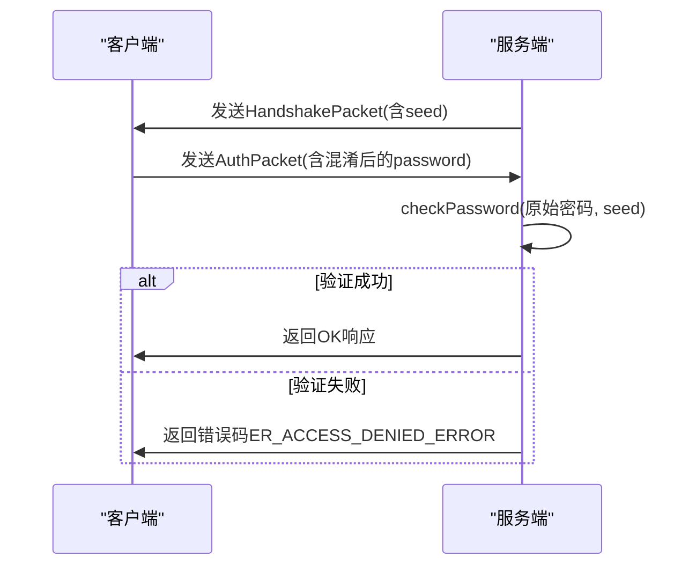
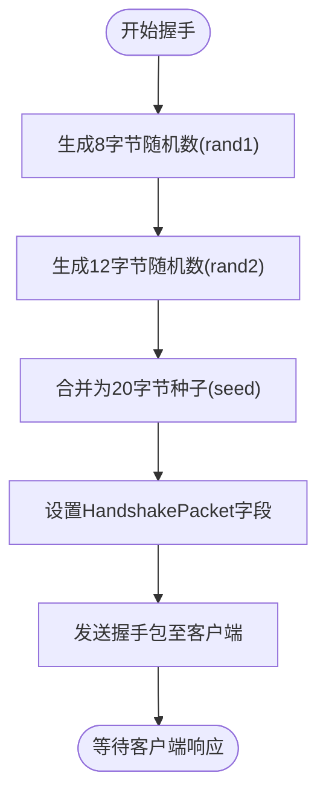
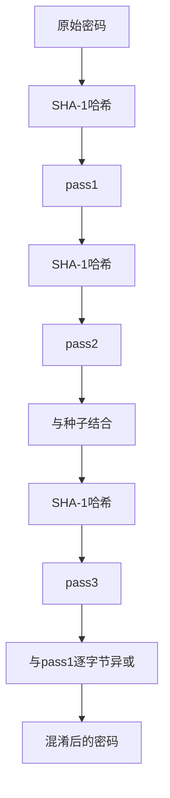
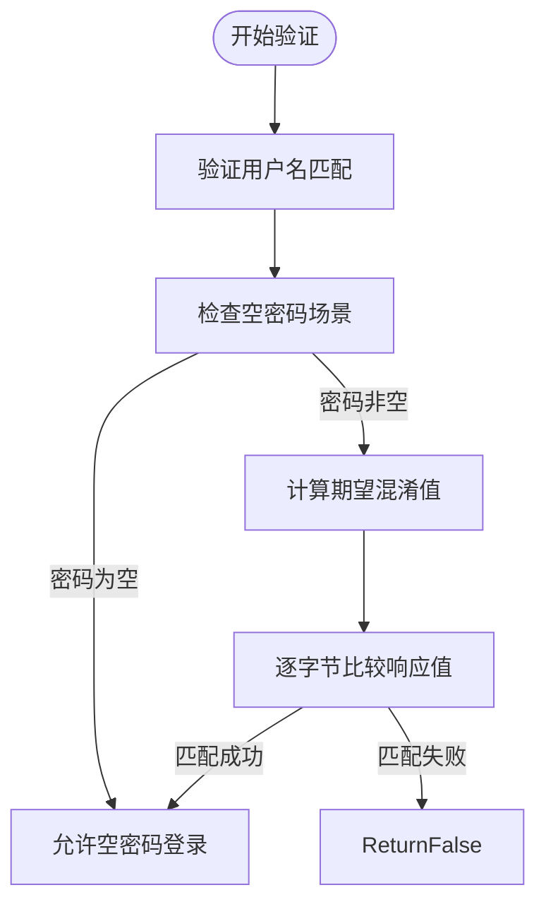
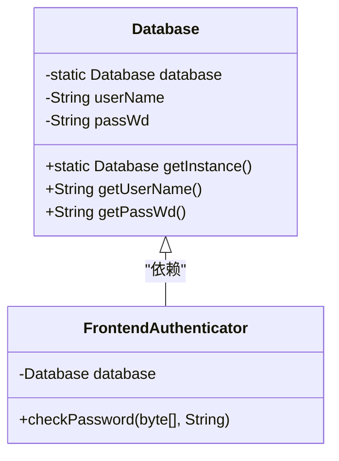

# 密码验证流程

<cite>
**Referenced Files in This Document**   
- [AuthPacket.java](file://src/main/java/alchemystar/freedom/engine/net/proto/mysql/AuthPacket.java)
- [FrontendAuthenticator.java](file://src/main/java/alchemystar/freedom/engine/net/handler/frontend/FrontendAuthenticator.java)
- [Database.java](file://src/main/java/alchemystar/freedom/engine/Database.java)
- [SecurityUtil.java](file://src/main/java/alchemystar/freedom/engine/net/proto/util/SecurityUtil.java)
- [HandshakePacket.java](file://src/main/java/alchemystar/freedom/engine/net/proto/mysql/HandshakePacket.java)
- [RandomUtil.java](file://src/main/java/alchemystar/freedom/engine/net/proto/util/RandomUtil.java)
- [FrontendConnection.java](file://src/main/java/alchemystar/freedom/engine/net/handler/frontend/FrontendConnection.java)
</cite>

## 目录
1. [认证流程概述](#认证流程概述)
2. [握手阶段与种子生成](#握手阶段与种子生成)
3. [客户端密码混淆计算](#客户端密码混淆计算)
4. [服务端验证逻辑分析](#服务端验证逻辑分析)
5. [数据库单例与凭证存储](#数据库单例与凭证存储)
6. [异常场景排查指南](#异常场景排查指南)
7. [安全配置最佳实践](#安全配置最佳实践)

## 认证流程概述

Freedom数据库采用基于scramble411算法的挑战-响应式安全认证机制，通过非对称加密方式确保密码在传输过程中的安全性。该流程分为两个核心阶段：握手阶段和认证阶段。在握手阶段，服务端生成随机种子并发送给客户端；在认证阶段，客户端使用该种子对密码进行混淆处理后提交，服务端通过相同的算法计算期望值进行比对。

**Diagram sources**
- [FrontendAuthenticator.java](file://src/main/java/alchemystar/freedom/engine/net/handler/frontend/FrontendAuthenticator.java#L50-L173)
- [HandshakePacket.java](file://src/main/java/alchemystar/freedom/engine/net/proto/mysql/HandshakePacket.java#L1-L78)

**Section sources**
- [FrontendAuthenticator.java](file://src/main/java/alchemystar/freedom/engine/net/handler/frontend/FrontendAuthenticator.java#L1-L173)
- [AuthPacket.java](file://src/main/java/alchemystar/freedom/engine/net/proto/mysql/AuthPacket.java#L1-L120)

## 握手阶段与种子生成

在认证流程的初始阶段，`FrontendAuthenticator`通过`channelActive`方法触发握手过程。系统使用`RandomUtil.randomBytes()`方法生成两个随机字节数组（8字节和12字节），合并构成20字节的认证种子（seed）。该种子被分割填充至`HandshakePacket`的`seed`字段（前8字节）和`restOfScrambleBuff`字段（后12字节），随握手包一同发送给客户端。

**Diagram sources**
- [FrontendAuthenticator.java](file://src/main/java/alchemystar/freedom/engine/net/handler/frontend/FrontendAuthenticator.java#L55-L75)
- [RandomUtil.java](file://src/main/java/alchemystar/freedom/engine/net/proto/util/RandomUtil.java#L1-L51)

**Section sources**
- [FrontendAuthenticator.java](file://src/main/java/alchemystar/freedom/engine/net/handler/frontend/FrontendAuthenticator.java#L50-L85)
- [RandomUtil.java](file://src/main/java/alchemystar/freedom/engine/net/proto/util/RandomUtil.java#L1-L51)

## 客户端密码混淆计算

客户端接收到包含种子的握手包后，使用scramble411算法对原始密码进行混淆处理。该算法基于SHA-1哈希函数，执行三重哈希运算：首先对原始密码进行SHA-1哈希得到pass1，再对pass1进行SHA-1哈希得到pass2，最后将种子与pass2进行哈希运算得到pass3。最终结果通过将pass3与pass1进行逐字节异或运算生成，确保即使传输被截获也无法反向推导出原始密码。

**Diagram sources**
- [SecurityUtil.java](file://src/main/java/alchemystar/freedom/engine/net/proto/util/SecurityUtil.java#L1-L25)
- [AuthPacket.java](file://src/main/java/alchemystar/freedom/engine/net/proto/mysql/AuthPacket.java#L1-L120)

**Section sources**
- [SecurityUtil.java](file://src/main/java/alchemystar/freedom/engine/net/proto/util/SecurityUtil.java#L1-L25)
- [AuthPacket.java](file://src/main/java/alchemystar/freedom/engine/net/proto/mysql/AuthPacket.java#L1-L120)

## 服务端验证逻辑分析

服务端的密码验证核心由`FrontendAuthenticator.checkPassword()`方法实现。该方法首先从`Database`单例中获取存储的用户名和密码，进行基础匹配验证。对于非空密码场景，系统调用`SecurityUtil.scramble411()`方法，使用数据库中存储的原始密码和握手阶段生成的种子重新计算期望的混淆值。通过逐字节比较客户端提交的响应与期望值，确保认证过程的精确性。

**Diagram sources**
- [FrontendAuthenticator.java](file://src/main/java/alchemystar/freedom/engine/net/handler/frontend/FrontendAuthenticator.java#L120-L170)
- [SecurityUtil.java](file://src/main/java/alchemystar/freedom/engine/net/proto/util/SecurityUtil.java#L1-L25)

**Section sources**
- [FrontendAuthenticator.java](file://src/main/java/alchemystar/freedom/engine/net/handler/frontend/FrontendAuthenticator.java#L120-L170)
- [SecurityUtil.java](file://src/main/java/alchemystar/freedom/engine/net/proto/util/SecurityUtil.java#L1-L25)

## 数据库单例与凭证存储

系统通过`Database`类实现单例模式管理全局配置，其中包含默认的用户名`pay`和密码`MiraCle`。该单例在静态代码块中初始化，确保整个应用生命周期内凭证信息的一致性。`FrontendAuthenticator`通过`Database.getInstance()`获取实例，调用`getUserName()`和`getPassWd()`方法进行凭证比对。这种设计既保证了配置的集中管理，又通过单例模式避免了多实例导致的状态不一致问题。

**Diagram sources**
- [Database.java](file://src/main/java/alchemystar/freedom/engine/Database.java#L1-L79)
- [FrontendAuthenticator.java](file://src/main/java/alchemystar/freedom/engine/net/handler/frontend/FrontendAuthenticator.java#L1-L173)

**Section sources**
- [Database.java](file://src/main/java/alchemystar/freedom/engine/Database.java#L1-L79)
- [FrontendAuthenticator.java](file://src/main/java/alchemystar/freedom/engine/net/handler/frontend/FrontendAuthenticator.java#L100-L130)

## 异常场景排查指南

| 异常类型 | 可能原因 | 排查步骤 |
|--------|--------|--------|
| **密码错误** | 客户端密码与数据库存储不符 | 1. 确认客户端输入密码正确 2. 检查`Database.java`中`passWd`字段值 3. 验证scramble411算法实现一致性 |
| **空密码处理异常** | 空密码逻辑判断错误 | 1. 检查`checkPassword()`中空值判断逻辑 2. 验证`pass == null`和`password == null`的处理分支 |
| **加密算法异常** | SHA-1算法不可用 | 1. 检查JVM环境是否支持SHA-1 2. 验证`SecurityUtil.java`中`NoSuchAlgorithmException`捕获逻辑 3. 确认JCE策略文件完整性 |
| **连接超时** | 握手阶段未完成 | 1. 检查`AUTH_TIMEOUT`常量值 2. 验证网络延迟是否超过15秒 3. 确认`channelActive`事件正常触发 |

**Section sources**
- [FrontendAuthenticator.java](file://src/main/java/alchemystar/freedom/engine/net/handler/frontend/FrontendAuthenticator.java#L120-L170)
- [SecurityUtil.java](file://src/main/java/alchemystar/freedom/engine/net/proto/util/SecurityUtil.java#L1-L25)
- [Database.java](file://src/main/java/alchemystar/freedom/engine/Database.java#L1-L79)

## 安全配置最佳实践

1. **密码策略强化**：避免使用默认凭证`pay|MiraCle`，应在生产环境中通过`setUserName()`和`setPassWd()`方法配置强密码
2. **算法安全性**：定期评估scramble411算法的安全性，考虑升级至更现代的加密算法如scramble512
3. **种子随机性**：确保`RandomUtil`生成的种子具有足够的熵值，防止预测性攻击
4. **错误处理**：在`failure()`方法中避免泄露过多信息，防止通过错误消息进行密码猜测
5. **会话管理**：结合`FrontendConnection`的`lastActiveTime`实现会话超时机制，防止长期未操作的连接被滥用

**Section sources**
- [Database.java](file://src/main/java/alchemystar/freedom/engine/Database.java#L1-L79)
- [FrontendAuthenticator.java](file://src/main/java/alchemystar/freedom/engine/net/handler/frontend/FrontendAuthenticator.java#L150-L170)
- [FrontendConnection.java](file://src/main/java/alchemystar/freedom/engine/net/handler/frontend/FrontendConnection.java#L1-L321)