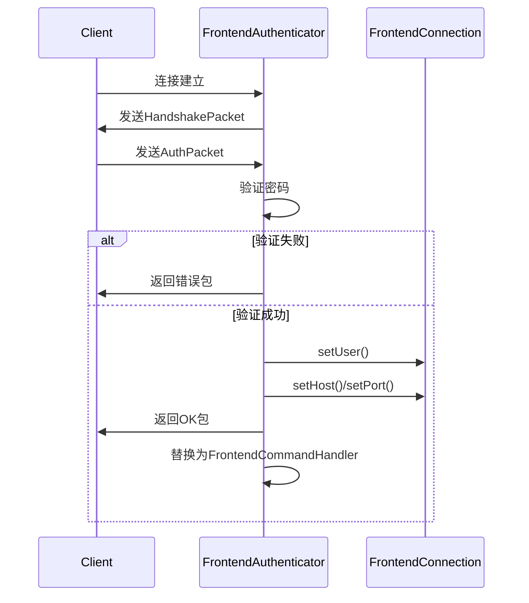

# 数据库连接初始化

<cite>
**本文档引用的文件**  
- [AuthPacket.java](file://src/main/java/alchemystar/freedom/engine/net/proto/mysql/AuthPacket.java)
- [FrontendAuthenticator.java](file://src/main/java/alchemystar/freedom/engine/net/handler/frontend/FrontendAuthenticator.java)
- [FrontendConnection.java](file://src/main/java/alchemystar/freedom/engine/net/handler/frontend/FrontendConnection.java)
- [Capabilities.java](file://src/main/java/alchemystar/freedom/engine/net/proto/util/Capabilities.java)
- [HandshakePacket.java](file://src/main/java/alchemystar/freedom/engine/net/proto/mysql/HandshakePacket.java)
- [Database.java](file://src/main/java/alchemystar/freedom/engine/Database.java)
- [Session.java](file://src/main/java/alchemystar/freedom/engine/session/Session.java)
</cite>

## 目录
1. [引言](#引言)
2. [认证包结构与database字段语义](#认证包结构与database字段语义)
3. [会话建立流程与初始上下文构建](#会话建立流程与初始上下文构建)
4. [CLIENT_CONNECT_WITH_DB能力标志的作用](#client_connect_with_db能力标志的作用)
5. [自动切换Schema的设计意图与扩展点](#自动切换schema的设计意图与扩展点)
6. [数据库不存在或权限不足的处理行为](#数据库不存在或权限不足的处理行为)
7. [调试方法与日志分析](#调试方法与日志分析)
8. [总结](#总结)

## 引言
本文档详细说明Freedom数据库在连接初始化阶段的认证流程，重点分析客户端在认证请求中如何通过`AuthPacket`指定默认数据库，以及服务端如何处理该请求。文档涵盖`FrontendAuthenticator`的认证逻辑、`FrontendConnection`的会话上下文构建、`CLIENT_CONNECT_WITH_DB`能力标志的启用机制，以及当前实现中关于自动切换Schema的设计意图与潜在扩展点。

## 认证包结构与database字段语义

`AuthPacket`类定义了MySQL客户端在连接时发送的认证数据包结构。其中`database`字段用于在连接阶段指定客户端希望使用的默认数据库（schema）。该字段仅在客户端设置了`CLIENT_CONNECT_WITH_DB`能力标志时才会被解析和使用。

在`AuthPacket.read()`方法中，系统首先读取客户端能力标志`clientFlags`，然后通过位运算判断是否启用了`CLIENT_CONNECT_WITH_DB`标志。如果启用且数据包中仍有剩余字节，则调用`readStringWithNull()`读取数据库名称并赋值给`database`字段。

该字段的语义是：客户端在建立连接时主动声明其默认操作数据库，避免连接后立即执行`USE database_name`命令，从而优化连接初始化流程。

**Section sources**
- [AuthPacket.java](file://src/main/java/alchemystar/freedom/engine/net/proto/mysql/AuthPacket.java#L43-L118)

## 会话建立流程与初始上下文构建

连接初始化流程始于`FrontendAuthenticator.channelActive()`方法，该方法在Netty通道激活时发送`HandshakePacket`握手包。握手包中通过`getServerCapabilities()`方法设置了`CLIENT_CONNECT_WITH_DB`能力标志，表明服务器支持客户端在认证时指定数据库。

当客户端返回`AuthPacket`后，`channelRead()`方法处理认证逻辑：
1. 调用`checkPassword()`验证用户名密码
2. 验证通过后，调用`source.setUser()`设置会话用户
3. 调用`source.setHost()`和`source.setPort()`记录客户端IP和端口
4. 最终调用`success()`方法，将管道处理器替换为`FrontendCommandHandler`，进入命令处理阶段



**Diagram sources**
- [FrontendAuthenticator.java](file://src/main/java/alchemystar/freedom/engine/net/handler/frontend/FrontendAuthenticator.java#L37-L172)
- [FrontendConnection.java](file://src/main/java/alchemystar/freedom/engine/net/handler/frontend/FrontendConnection.java#L228-L302)

**Section sources**
- [FrontendAuthenticator.java](file://src/main/java/alchemystar/freedom/engine/net/handler/frontend/FrontendAuthenticator.java#L37-L172)
- [FrontendConnection.java](file://src/main/java/alchemystar/freedom/engine/net/handler/frontend/FrontendConnection.java#L228-L302)

## CLIENT_CONNECT_WITH_DB能力标志的作用

`CLIENT_CONNECT_WITH_DB`是MySQL协议中的一个能力标志（Capability Flag），其值为8。当服务器在`HandshakePacket`中声明支持该标志时，客户端可以在`AuthPacket`中包含数据库名称。

在`FrontendAuthenticator.getServerCapabilities()`方法中，该标志被显式启用：
```java
flag |= Capabilities.CLIENT_CONNECT_WITH_DB;
```

这表示Freedom数据库服务器允许客户端在连接时指定默认数据库。客户端通过在连接字符串中添加数据库名（如`jdbc:mysql://host:port/dbname`）来触发此行为。服务器在收到`AuthPacket`后，会解析其中的`database`字段，并可据此初始化会话的默认schema。

**Section sources**
- [FrontendAuthenticator.java](file://src/main/java/alchemystar/freedom/engine/net/handler/frontend/FrontendAuthenticator.java#L104-L123)
- [Capabilities.java](file://src/main/java/alchemystar/freedom/engine/net/proto/util/Capabilities.java#L0-L85)

## 自动切换Schema的设计意图与扩展点

在`FrontendAuthenticator.channelRead()`方法中，存在一段被注释的代码：
```java
// todo
// if(!StringUtils.isEmpty(authPacket.database)) {
//     source.setSchema(authPacket.database);
// }
```

这段TODO注释揭示了当前实现的设计意图：在认证成功后，自动将客户端指定的数据库设置为会话的当前schema。虽然当前版本尚未实现此功能，但代码结构已预留了扩展点。

潜在的扩展实现应包括：
1. 在`FrontendConnection`类中添加`setSchema(String schema)`方法
2. 在`Database`类中验证指定数据库是否存在且用户有访问权限
3. 在`Session`初始化时加载对应数据库的元数据

此设计可提升用户体验，使客户端无需在连接后手动执行`USE`命令即可直接操作目标数据库。

**Section sources**
- [FrontendAuthenticator.java](file://src/main/java/alchemystar/freedom/engine/net/handler/frontend/FrontendAuthenticator.java#L74-L102)

## 数据库不存在或权限不足的处理行为

当前实现中，尽管`database`字段被解析，但尚未进行实际的schema切换或验证。因此，当客户端指定的数据库不存在或用户无访问权限时，系统不会在连接阶段返回错误。

预期的正确行为应为：
1. 在`channelRead()`中解注TODO代码
2. 调用`Database.getInstance().validateSchemaAccess(authPacket.database, authPacket.user)`进行权限验证
3. 若验证失败，调用`failure()`返回相应的错误码（如`ER_BAD_DB_ERROR`或`ER_DBACCESS_DENIED_ERROR`）

目前系统仅验证用户名密码，数据库级别的访问控制需在后续SQL执行阶段由`SqlExecutor`处理。

**Section sources**
- [FrontendAuthenticator.java](file://src/main/java/alchemystar/freedom/engine/net/handler/frontend/FrontendAuthenticator.java#L74-L102)
- [Database.java](file://src/main/java/alchemystar/freedom/engine/Database.java)
- [Session.java](file://src/main/java/alchemystar/freedom/engine/session/Session.java)

## 调试方法与日志分析

调试连接初始化问题时，可重点关注以下日志和断点：
1. `FrontendAuthenticator.channelActive()`：确认握手包是否正确发送
2. `AuthPacket.read()`：检查`database`字段是否被正确解析
3. `FrontendAuthenticator.checkPassword()`：验证认证逻辑
4. `FrontendConnection`的setter方法：确认用户、主机、端口是否正确设置

关键日志输出位于`FrontendAuthenticator`的`logger`，错误信息通过`failure()`方法记录。可通过设置日志级别为DEBUG来跟踪完整的认证流程。

**Section sources**
- [FrontendAuthenticator.java](file://src/main/java/alchemystar/freedom/engine/net/handler/frontend/FrontendAuthenticator.java#L125-L172)
- [FrontendTailHandler.java](file://src/main/java/alchemystar/freedom/engine/net/handler/frontend/FrontendTailHandler.java)

## 总结
Freedom数据库的连接初始化流程遵循MySQL协议规范，通过`AuthPacket`支持客户端在认证时指定默认数据库。服务器通过`CLIENT_CONNECT_WITH_DB`能力标志表明对此功能的支持。当前实现已解析`database`字段，但尚未实现自动schema切换，相关逻辑被标记为TODO，为未来功能扩展预留了清晰的代码路径。建议后续版本实现完整的数据库访问验证，以提升安全性和用户体验。