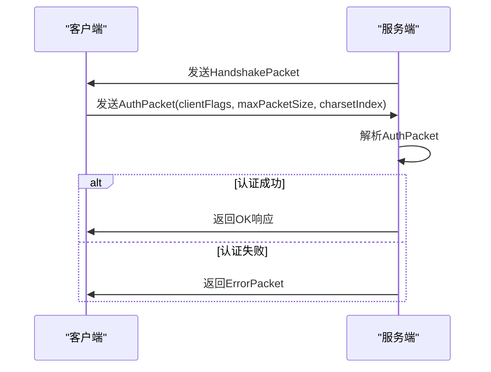
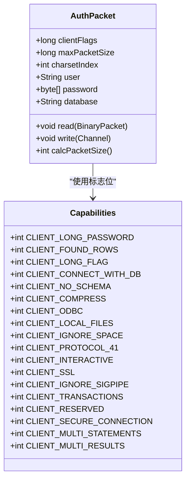
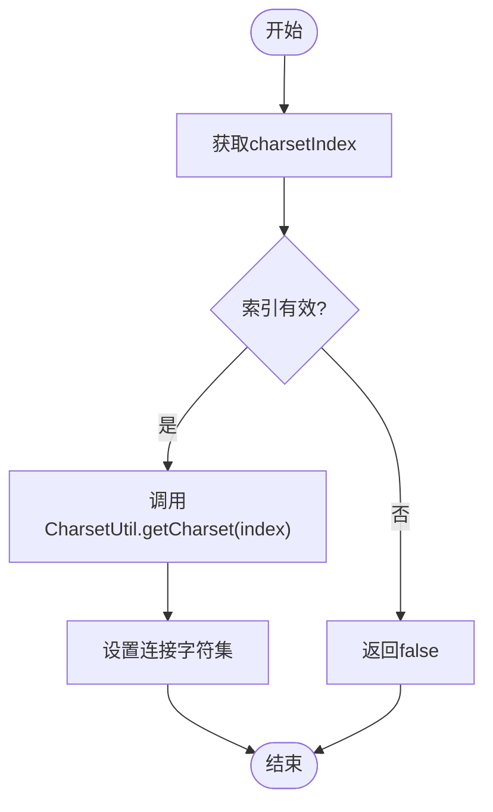

# 能力协商

<cite>
**本文档中引用的文件**   
- [AuthPacket.java](file://src/main/java/alchemystar/freedom/engine/net/proto/mysql/AuthPacket.java)
- [Capabilities.java](file://src/main/java/alchemystar/freedom/engine/net/proto/util/Capabilities.java)
- [FrontendAuthenticator.java](file://src/main/java/alchemystar/freedom/engine/net/handler/frontend/FrontendAuthenticator.java)
- [CharsetUtil.java](file://src/main/java/alchemystar/freedom/engine/net/proto/util/CharsetUtil.java)
- [HandshakePacket.java](file://src/main/java/alchemystar/freedom/engine/net/proto/mysql/HandshakePacket.java)
- [FrontendConnection.java](file://src/main/java/alchemystar/freedom/engine/net/handler/frontend/FrontendConnection.java)
</cite>

## 目录
1. [引言](#引言)
2. [核心组件分析](#核心组件分析)
3. [能力协商流程](#能力协商流程)
4. [关键标志位解析](#关键标志位解析)
5. [服务端能力生成逻辑](#服务端能力生成逻辑)
6. [最大包大小协商机制](#最大包大小协商机制)
7. [字符集索引传递与兼容性处理](#字符集索引传递与兼容性处理)
8. [错误处理与调试建议](#错误处理与调试建议)
9. [结论](#结论)

## 引言
本文档旨在详细说明Freedom数据库客户端能力协商机制的技术实现，重点聚焦于连接初始化阶段`AuthPacket`中`clientFlags`字段的解析与服务端响应策略。通过分析`FrontendAuthenticator.getSeverCapabilities()`方法，阐述服务端支持的能力集合生成逻辑，并解释`maxPacketSize`参数在通信过程中的限制作用及协商机制。同时，描述`charsetIndex`字符集索引的传递与兼容性处理流程，提供当客户端请求不支持的能力时的错误处理建议和调试方法。

## 核心组件分析

本文档涉及的核心组件包括认证数据包`AuthPacket`、能力标志接口`Capabilities`、前端认证处理器`FrontendAuthenticator`以及字符集工具类`CharsetUtil`。这些组件共同实现了客户端与服务端之间的能力协商机制。

**本文档中引用的文件**   
- [AuthPacket.java](file://src/main/java/alchemystar/freedom/engine/net/proto/mysql/AuthPacket.java)
- [Capabilities.java](file://src/main/java/alchemystar/freedom/engine/net/proto/util/Capabilities.java)
- [FrontendAuthenticator.java](file://src/main/java/alchemystar/freedom/engine/net/handler/frontend/FrontendAuthenticator.java)
- [CharsetUtil.java](file://src/main/java/alchemystar/freedom/engine/net/proto/util/CharsetUtil.java)

## 能力协商流程

客户端与服务端的能力协商发生在连接初始化阶段，具体流程如下：

1. 服务端发送`HandshakePacket`握手包，包含服务端支持的基本信息和能力标志。
2. 客户端收到握手包后，构造`AuthPacket`认证包，填充`clientFlags`、`maxPacketSize`、`charsetIndex`等字段，并发送给服务端。
3. 服务端通过`FrontendAuthenticator`接收并解析`AuthPacket`，根据客户端请求的能力进行验证和响应。
4. 若认证通过，则建立连接；否则返回错误信息。



**图示来源**
- [HandshakePacket.java](file://src/main/java/alchemystar/freedom/engine/net/proto/mysql/HandshakePacket.java#L1-L78)
- [AuthPacket.java](file://src/main/java/alchemystar/freedom/engine/net/proto/mysql/AuthPacket.java#L1-L119)
- [FrontendAuthenticator.java](file://src/main/java/alchemystar/freedom/engine/net/handler/frontend/FrontendAuthenticator.java#L1-L173)

**本节来源**
- [HandshakePacket.java](file://src/main/java/alchemystar/freedom/engine/net/proto/mysql/HandshakePacket.java#L1-L78)
- [AuthPacket.java](file://src/main/java/alchemystar/freedom/engine/net/proto/mysql/AuthPacket.java#L1-L119)
- [FrontendAuthenticator.java](file://src/main/java/alchemystar/freedom/engine/net/handler/frontend/FrontendAuthenticator.java#L1-L173)

## 关键标志位解析

在`AuthPacket`中，`clientFlags`字段用于表示客户端支持的各种能力。以下是几个关键标志位的含义及其作用：

- **CLIENT_CONNECT_WITH_DB**: 允许客户端在连接时指定数据库。若该标志被设置，客户端可在认证包中包含数据库名称。
- **CLIENT_PROTOCOL_41**: 表示客户端支持MySQL 4.1协议版本，启用更安全的认证机制和扩展功能。
- **CLIENT_SECURE_CONNECTION**: 启用新的安全连接协议，使用更安全的密码加密方式（如scramble411算法）。

这些标志位通过位运算进行组合，在连接初始化时由客户端声明其支持的功能。



**图示来源**
- [Capabilities.java](file://src/main/java/alchemystar/freedom/engine/net/proto/util/Capabilities.java#L1-L85)
- [AuthPacket.java](file://src/main/java/alchemystar/freedom/engine/net/proto/mysql/AuthPacket.java#L1-L119)

**本节来源**
- [Capabilities.java](file://src/main/java/alchemystar/freedom/engine/net/proto/util/Capabilities.java#L1-L85)
- [AuthPacket.java](file://src/main/java/alchemystar/freedom/engine/net/proto/mysql/AuthPacket.java#L1-L119)

## 服务端能力生成逻辑

服务端通过`FrontendAuthenticator.getServerCapabilities()`方法生成其支持的能力集合。该方法通过按位或操作将多个能力标志组合成一个整数值，作为`HandshakePacket`中的`serverCapabilities`字段发送给客户端。

```java
protected int getServerCapabilities() {
    int flag = 0;
    flag |= Capabilities.CLIENT_LONG_PASSWORD;
    flag |= Capabilities.CLIENT_FOUND_ROWS;
    flag |= Capabilities.CLIENT_LONG_FLAG;
    flag |= Capabilities.CLIENT_CONNECT_WITH_DB;
    flag |= Capabilities.CLIENT_ODBC;
    flag |= Capabilities.CLIENT_IGNORE_SPACE;
    flag |= Capabilities.CLIENT_PROTOCOL_41;
    flag |= Capabilities.CLIENT_INTERACTIVE;
    flag |= Capabilities.CLIENT_IGNORE_SIGPIPE;
    flag |= Capabilities.CLIENT_TRANSACTIONS;
    flag |= Capabilities.CLIENT_SECURE_CONNECTION;
    return flag;
}
```

此方法明确启用了连接时指定数据库、使用4.1协议、安全连接等关键功能，确保与现代客户端的兼容性。

**本节来源**
- [FrontendAuthenticator.java](file://src/main/java/alchemystar/freedom/engine/net/handler/frontend/FrontendAuthenticator.java#L130-L150)

## 最大包大小协商机制

`maxPacketSize`参数定义了客户端能够处理的最大数据包尺寸。在`AuthPacket`中，客户端将其支持的最大包大小告知服务端。服务端虽接收该值，但在当前实现中并未强制限制通信过程中的包大小。该参数主要用于客户端自我约束，避免发送超过自身处理能力的数据包。

**本节来源**
- [AuthPacket.java](file://src/main/java/alchemystar/freedom/engine/net/proto/mysql/AuthPacket.java#L1-L119)

## 字符集索引传递与兼容性处理

字符集通过`charsetIndex`字段进行传递。客户端在`AuthPacket`中发送其期望的字符集索引，服务端通过`CharsetUtil`类进行解析和验证。

`CharsetUtil`维护了两个静态映射：
- `INDEX_TO_CHARSET`: 将索引映射到字符集名称
- `CHARSET_TO_INDEX`: 将字符集名称映射到索引

服务端调用`CharsetUtil.getCharset(int index)`方法根据索引获取字符集名称，并通过`FrontendConnection.setCharsetIndex(int ci)`方法设置连接的字符集。若索引无效，则返回false，表示不支持该字符集。



**图示来源**
- [CharsetUtil.java](file://src/main/java/alchemystar/freedom/engine/net/proto/util/CharsetUtil.java#L1-L131)
- [FrontendConnection.java](file://src/main/java/alchemystar/freedom/engine/net/handler/frontend/FrontendConnection.java#L1-L320)

**本节来源**
- [CharsetUtil.java](file://src/main/java/alchemystar/freedom/engine/net/proto/util/CharsetUtil.java#L1-L131)
- [FrontendConnection.java](file://src/main/java/alchemystar/freedom/engine/net/handler/frontend/FrontendConnection.java#L1-L320)

## 错误处理与调试建议

当客户端请求不支持的能力时，服务端应返回适当的错误信息。例如：
- 若密码验证失败，调用`failure(ErrorCode.ER_ACCESS_DENIED_ERROR, "Access denied")`
- 若字符集不支持，返回`ER_UNKNOWN_CHARACTER_SET`错误
- 若数据库不存在，返回`ER_BAD_DB_ERROR`错误

调试建议：
1. 检查`clientFlags`是否包含服务端不支持的标志位
2. 验证`charsetIndex`是否在`CharsetUtil.INDEX_TO_CHARSET`范围内
3. 确认`maxPacketSize`是否合理
4. 使用日志记录`FrontendAuthenticator`中的认证过程，便于追踪问题

**本节来源**
- [FrontendAuthenticator.java](file://src/main/java/alchemystar/freedom/engine/net/handler/frontend/FrontendAuthenticator.java#L1-L173)
- [FrontendConnection.java](file://src/main/java/alchemystar/freedom/engine/net/handler/frontend/FrontendConnection.java#L1-L320)

## 结论

Freedom数据库的能力协商机制通过`AuthPacket`中的`clientFlags`、`maxPacketSize`和`charsetIndex`字段实现客户端与服务端的功能匹配。服务端通过`FrontendAuthenticator.getServerCapabilities()`明确声明支持的能力集合，确保连接的安全性和兼容性。字符集处理依赖于`CharsetUtil`的双向映射机制，保证了字符编码的正确解析。对于不支持的请求，系统提供了清晰的错误反馈机制，便于问题定位与调试。