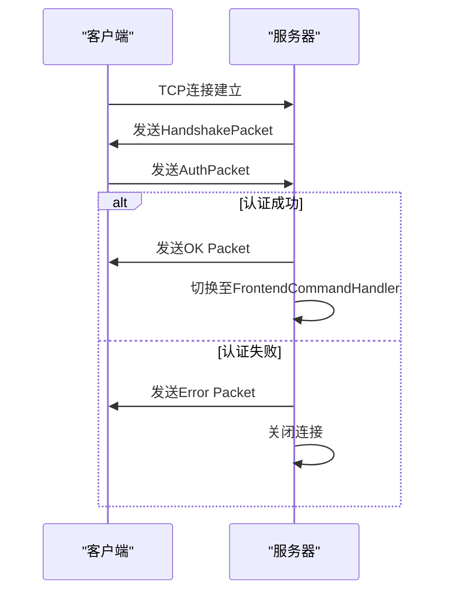
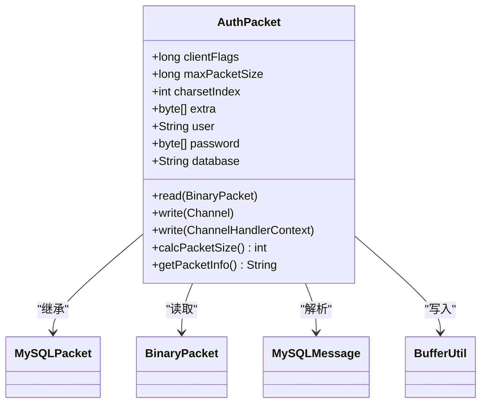
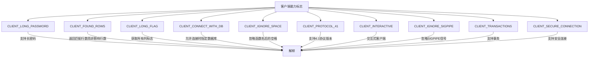
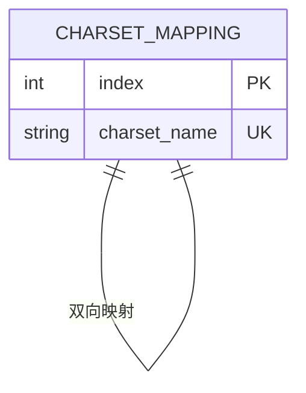
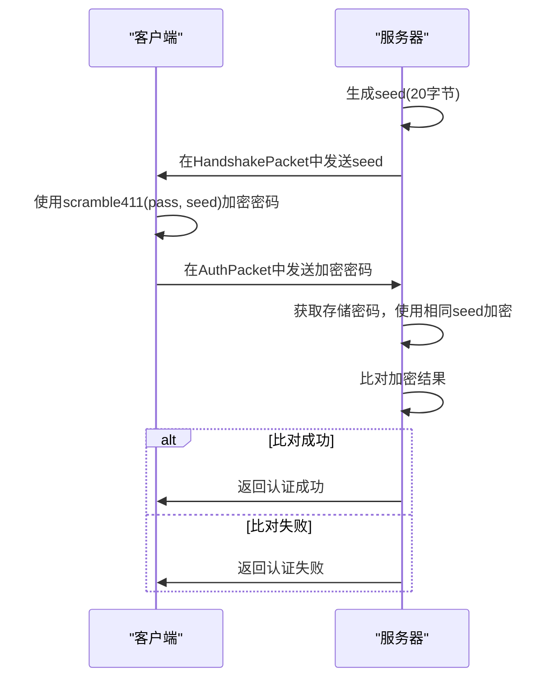
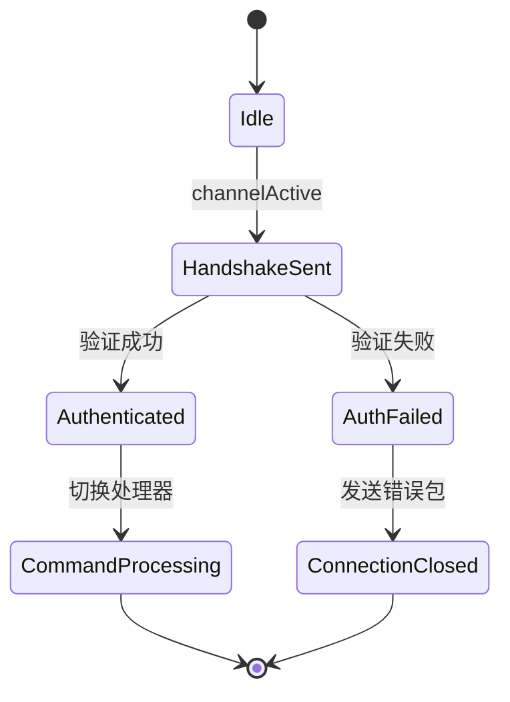

# 认证机制

<cite>
**本文档引用的文件**  
- [AuthPacket.java](file://src/main/java/alchemystar/freedom/engine/net/proto/mysql/AuthPacket.java)
- [FrontendAuthenticator.java](file://src/main/java/alchemystar/freedom/engine/net/handler/frontend/FrontendAuthenticator.java)
- [Capabilities.java](file://src/main/java/alchemystar/freedom/engine/net/proto/util/Capabilities.java)
- [SecurityUtil.java](file://src/main/java/alchemystar/freedom/engine/net/proto/util/SecurityUtil.java)
- [HandshakePacket.java](file://src/main/java/alchemystar/freedom/engine/net/proto/mysql/HandshakePacket.java)
- [Versions.java](file://src/main/java/alchemystar/freedom/engine/net/proto/util/Versions.java)
- [CharsetUtil.java](file://src/main/java/alchemystar/freedom/engine/net/proto/util/CharsetUtil.java)
- [FrontendConnection.java](file://src/main/java/alchemystar/freedom/engine/net/handler/frontend/FrontendConnection.java)
</cite>

## 目录
1. [引言](#引言)
2. [认证流程概览](#认证流程概览)
3. [AuthPacket结构解析](#authpacket结构解析)
4. [客户端能力标志(clientFlags)详解](#客户端能力标志clientflags详解)
5. [最大报文尺寸协商机制](#最大报文尺寸协商机制)
6. [字符集索引兼容性处理](#字符集索引兼容性处理)
7. [密码加密传输与比对逻辑](#密码加密传输与比对逻辑)
8. [数据库自动切换行为](#数据库自动切换行为)
9. [认证状态机实现](#认证状态机实现)
10. [认证失败排查指南](#认证失败排查指南)

## 引言
Freedom数据库的认证机制基于MySQL协议实现，采用标准的握手-认证流程确保连接的安全性与兼容性。本技术文档深入解析认证过程中的核心组件与关键流程，重点分析AuthPacket报文结构、客户端能力协商、密码安全验证等机制，为开发者提供完整的认证体系技术参考。

## 认证流程概览

**图示来源**
- [FrontendAuthenticator.java](file://src/main/java/alchemystar/freedom/engine/net/handler/frontend/FrontendAuthenticator.java#L35-L72)
- [HandshakePacket.java](file://src/main/java/alchemystar/freedom/engine/net/proto/mysql/HandshakePacket.java#L40-L76)
- [AuthPacket.java](file://src/main/java/alchemystar/freedom/engine/net/proto/mysql/AuthPacket.java#L76-L118)
- [OkPacket.java](file://src/main/java/alchemystar/freedom/engine/net/proto/mysql/OkPacket.java#L50-L70)

**本节来源**
- [FrontendAuthenticator.java](file://src/main/java/alchemystar/freedom/engine/net/handler/frontend/FrontendAuthenticator.java#L35-L102)

## AuthPacket结构解析

**图示来源**
- [AuthPacket.java](file://src/main/java/alchemystar/freedom/engine/net/proto/mysql/AuthPacket.java#L0-L43)
- [MySQLPacket.java](file://src/main/java/alchemystar/freedom/engine/net/proto/MySQLPacket.java)

**本节来源**
- [AuthPacket.java](file://src/main/java/alchemystar/freedom/engine/net/proto/mysql/AuthPacket.java#L0-L43)

## 客户端能力标志clientFlags详解

**图示来源**
- [Capabilities.java](file://src/main/java/alchemystar/freedom/engine/net/proto/util/Capabilities.java#L0-L50)
- [FrontendAuthenticator.java](file://src/main/java/alchemystar/freedom/engine/net/handler/frontend/FrontendAuthenticator.java#L104-L123)

**本节来源**
- [Capabilities.java](file://src/main/java/alchemystar/freedom/engine/net/proto/util/Capabilities.java#L0-L84)
- [FrontendAuthenticator.java](file://src/main/java/alchemystar/freedom/engine/net/handler/frontend/FrontendAuthenticator.java#L104-L123)

## 最大报文尺寸协商机制
在认证过程中，`maxPacketSize`字段用于协商客户端与服务器之间可处理的最大报文尺寸。客户端在AuthPacket中声明其支持的最大报文大小，服务器根据自身配置和客户端声明的值进行协商。该机制确保双方在后续通信中不会因报文过大而导致传输失败，提高协议的健壮性和兼容性。

**本节来源**
- [AuthPacket.java](file://src/main/java/alchemystar/freedom/engine/net/proto/mysql/AuthPacket.java#L7-L11)

## 字符集索引兼容性处理
字符集索引通过`charsetIndex`字段进行协商，服务器在HandshakePacket中发送支持的字符集索引，客户端在AuthPacket中回应使用的字符集索引。系统通过`CharsetUtil`工具类实现字符集名称与索引的双向映射，支持包括latin1、utf-8、gbk等常见字符集，确保多语言环境下的数据正确传输与解析。

**图示来源**
- [CharsetUtil.java](file://src/main/java/alchemystar/freedom/engine/net/proto/util/CharsetUtil.java#L105-L130)
- [FrontendConnection.java](file://src/main/java/alchemystar/freedom/engine/net/handler/frontend/FrontendConnection.java#L180-L200)

**本节来源**
- [CharsetUtil.java](file://src/main/java/alchemystar/freedom/engine/net/proto/util/CharsetUtil.java#L0-L40)
- [FrontendConnection.java](file://src/main/java/alchemystar/freedom/engine/net/handler/frontend/FrontendConnection.java#L180-L200)

## 密码加密传输与比对逻辑
密码字段采用scramble算法进行安全传输与验证。服务器生成随机种子(seed)，客户端使用该种子对密码进行scramble411算法加密后传输。服务器端获取存储的明文密码，使用相同种子进行加密，将结果与客户端传输的加密密码进行逐字节比对，实现安全的密码验证。

**图示来源**
- [FrontendAuthenticator.java](file://src/main/java/alchemystar/freedom/engine/net/handler/frontend/FrontendAuthenticator.java#L125-L172)
- [SecurityUtil.java](file://src/main/java/alchemystar/freedom/engine/net/proto/util/SecurityUtil.java#L0-L52)

**本节来源**
- [SecurityUtil.java](file://src/main/java/alchemystar/freedom/engine/net/proto/util/SecurityUtil.java#L0-L52)
- [FrontendAuthenticator.java](file://src/main/java/alchemystar/freedom/engine/net/handler/frontend/FrontendAuthenticator.java#L125-L172)

## 数据库自动切换行为
当客户端在连接时指定了数据库（通过`CLIENT_CONNECT_WITH_DB`标志启用），服务器会在认证成功后自动执行数据库切换操作。AuthPacket中的`database`字段包含目标数据库名称，系统会将其设置为当前连接的默认数据库，实现连接初始化时的自动上下文切换。

**本节来源**
- [AuthPacket.java](file://src/main/java/alchemystar/freedom/engine/net/proto/mysql/AuthPacket.java#L35-L43)
- [FrontendAuthenticator.java](file://src/main/java/alchemystar/freedom/engine/net/handler/frontend/FrontendAuthenticator.java#L85-L90)

## 认证状态机实现
认证状态机由`FrontendAuthenticator`类实现，作为Netty管道中的处理器管理认证生命周期。状态机从`channelActive`事件开始，发送握手包；在`channelRead`中接收认证包，验证用户凭证；成功时通过`ctx.pipeline().replace`切换至`FrontendCommandHandler`，进入命令处理状态；失败时发送错误响应并关闭连接。

**图示来源**
- [FrontendAuthenticator.java](file://src/main/java/alchemystar/freedom/engine/net/handler/frontend/FrontendAuthenticator.java#L35-L102)
- [FrontendConnection.java](file://src/main/java/alchemystar/freedom/engine/net/handler/frontend/FrontendConnection.java#L250-L270)

**本节来源**
- [FrontendAuthenticator.java](file://src/main/java/alchemystar/freedom/engine/net/handler/frontend/FrontendAuthenticator.java#L35-L172)

## 认证失败排查指南

| 错误类型 | 可能原因 | 解决方案 |
|---------|--------|---------|
| 密码错误 | 密码不匹配 | 检查用户名密码是否正确，确认密码加密方式 |
| 用户不存在 | 用户名错误 | 确认服务器配置的用户名，检查大小写敏感性 |
| 字符集不支持 | 客户端请求的字符集服务器不支持 | 检查CharsetUtil映射表，确认字符集索引有效性 |
| 连接超时 | 未在规定时间内完成认证 | 检查网络状况，确认客户端及时响应握手包 |
| 协议版本不兼容 | 客户端协议版本与服务器不匹配 | 确认客户端支持CLIENT_PROTOCOL_41标志 |

**本节来源**
- [FrontendAuthenticator.java](file://src/main/java/alchemystar/freedom/engine/net/handler/frontend/FrontendAuthenticator.java#L150-L172)
- [ErrorCode.java](file://src/main/java/alchemystar/freedom/engine/net/proto/util/ErrorCode.java)
- [FrontendConnection.java](file://src/main/java/alchemystar/freedom/engine/net/handler/frontend/FrontendConnection.java#L140-L160)