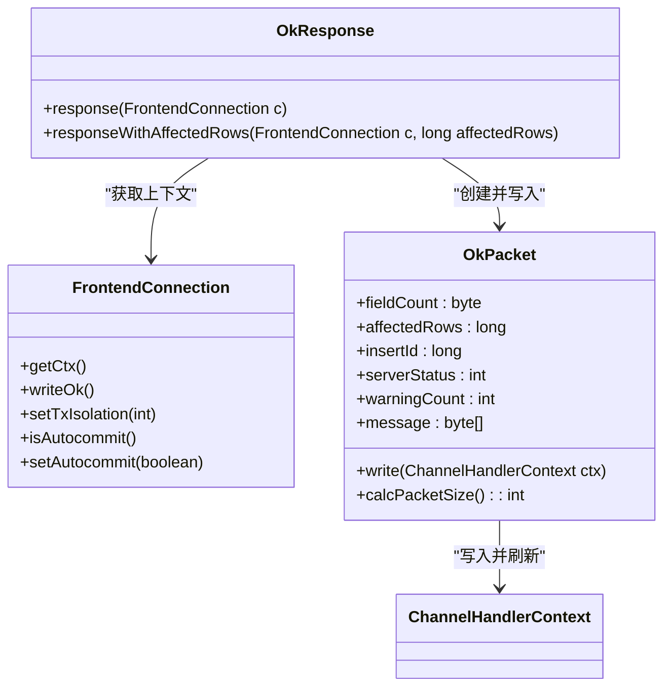
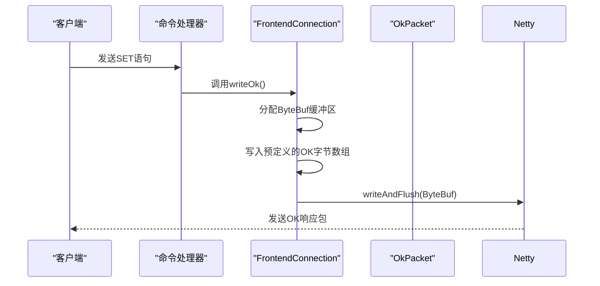
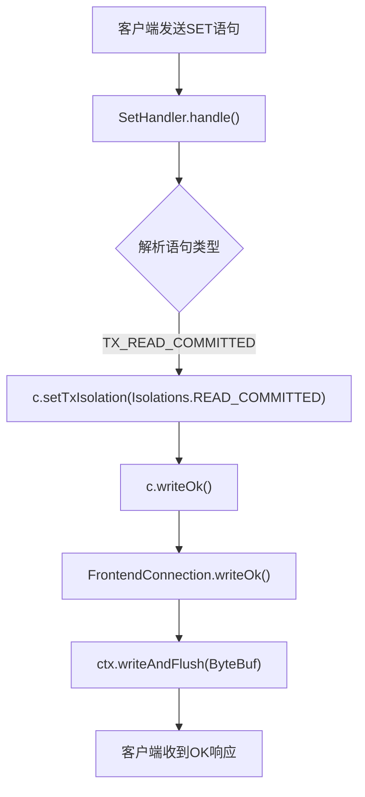

# OK响应

<cite>
**本文档中引用的文件**  
- [OkResponse.java](file://src/main/java/alchemystar/freedom/engine/net/response/OkResponse.java)
- [OkPacket.java](file://src/main/java/alchemystar/freedom/engine/net/proto/mysql/OkPacket.java)
- [FrontendConnection.java](file://src/main/java/alchemystar/freedom/engine/net/handler/frontend/FrontendConnection.java)
- [SetHandler.java](file://src/main/java/alchemystar/freedom/engine/net/handler/frontend/SetHandler.java)
</cite>

## 目录
1. [简介](#简介)
2. [核心组件分析](#核心组件分析)
3. [OK响应实现机制](#ok响应实现机制)
4. [writeOk()方法调用流程](#writeok方法调用流程)
5. [事务隔离级别设置与响应链路](#事务隔离级别设置与响应链路)
6. [Netty ChannelHandlerContext的作用](#netty-channelhandlercontext的作用)
7. [性能优化建议](#性能优化建议)
8. [结论](#结论)

## 简介
在Freedom数据库系统中，当客户端执行SQL语句并成功完成操作时，服务端需要向客户端返回一个表示操作成功的响应包——即OK响应。该响应通过`OkPacket`结构体封装，并由`OkResponse`类负责构建和发送。本文将深入分析OK响应的实现机制，重点阐述`OkResponse`类如何通过`OkPacket`向客户端返回操作成功状态，解析`writeOk()`方法的调用流程，结合`SetHandler`等实际使用场景展示事务隔离级别设置后的完整响应链路，并探讨Netty框架中`ChannelHandlerContext`在响应写入过程中的关键作用。

## 核心组件分析

### OkResponse类
`OkResponse`类是OK响应的核心处理类，提供静态方法用于向客户端发送标准OK响应或包含影响行数的响应。



**图示来源**  
- [OkResponse.java](file://src/main/java/alchemystar/freedom/engine/net/response/OkResponse.java#L1-L25)
- [OkPacket.java](file://src/main/java/alchemystar/freedom/engine/net/proto/mysql/OkPacket.java#L1-L70)
- [FrontendConnection.java](file://src/main/java/alchemystar/freedom/engine/net/handler/frontend/FrontendConnection.java#L1-L320)

**本节来源**  
- [OkResponse.java](file://src/main/java/alchemystar/freedom/engine/net/response/OkResponse.java#L1-L25)
- [OkPacket.java](file://src/main/java/alchemystar/freedom/engine/net/proto/mysql/OkPacket.java#L1-L70)

## OK响应实现机制
`OkResponse`类通过两个静态方法实现不同类型的OK响应：
- `response(FrontendConnection c)`：发送最简OK响应，不携带额外信息。
- `responseWithAffectedRows(FrontendConnection c, long affectedRows)`：发送包含影响行数的OK响应。

这两个方法均会创建一个`OkPacket`实例，设置相关字段后调用其`write()`方法完成响应发送。`OkPacket`继承自`MySQLPacket`，遵循MySQL协议规范，包含以下关键字段：
- `fieldCount`：始终为0x00，标识这是一个OK包。
- `affectedRows`：受影响的行数，用于INSERT、UPDATE、DELETE等语句。
- `insertId`：自增主键值，若无则为0。
- `serverStatus`：服务器状态标志位，如自动提交状态、事务状态等。
- `warningCount`：警告数量。
- `message`：可选的消息内容。

这些字段在响应生成时被正确填充，确保客户端能够准确理解操作结果。

**本节来源**  
- [OkResponse.java](file://src/main/java/alchemystar/freedom/engine/net/response/OkResponse.java#L1-L25)
- [OkPacket.java](file://src/main/java/alchemystar/freedom/engine/net/proto/mysql/OkPacket.java#L1-L70)

## writeOk()方法调用流程
`writeOk()`方法是`FrontendConnection`类中用于快速发送简单OK响应的便捷方法。其调用流程如下：



具体实现位于`FrontendConnection.java`中：

```java
public void writeOk() {
    ByteBuf byteBuf = ctx.alloc().buffer(OkPacket.OK.length).writeBytes(OkPacket.OK);
    ctx.writeAndFlush(byteBuf);
}
```

该方法直接使用预定义的`OkPacket.OK`字节数组（长度为11字节），避免了动态构造包头和字段的开销，提高了响应效率。此方式适用于无需携带动态信息（如affectedRows）的场景。

**图示来源**  
- [FrontendConnection.java](file://src/main/java/alchemystar/freedom/engine/net/handler/frontend/FrontendConnection.java#L115-L118)
- [OkPacket.java](file://src/main/java/alchemystar/freedom/engine/net/proto/mysql/OkPacket.java#L14-L14)

**本节来源**  
- [FrontendConnection.java](file://src/main/java/alchemystar/freedom/engine/net/handler/frontend/FrontendConnection.java#L115-L118)

## 事务隔离级别设置与响应链路
以`SetHandler`为例，当客户端执行`SET TRANSACTION ISOLATION LEVEL READ COMMITTED`语句时，完整的响应链路如下：



具体代码逻辑如下：
1. `SetHandler.handle()`接收SQL语句并解析。
2. 根据解析结果调用`c.setTxIsolation(Isolations.READ_COMMITTED)`更新连接的事务隔离级别。
3. 调用`c.writeOk()`发送成功响应。
4. `FrontendConnection.writeOk()`方法将预定义的OK字节数组写入Netty通道。
5. 客户端接收到OK包，确认事务隔离级别已成功设置。

此链路展示了从SQL解析到状态更新再到响应返回的完整过程，体现了系统各组件间的协作关系。

**图示来源**  
- [SetHandler.java](file://src/main/java/alchemystar/freedom/engine/net/handler/frontend/SetHandler.java#L39-L54)
- [FrontendConnection.java](file://src/main/java/alchemystar/freedom/engine/net/handler/frontend/FrontendConnection.java#L115-L118)

**本节来源**  
- [SetHandler.java](file://src/main/java/alchemystar/freedom/engine/net/handler/frontend/SetHandler.java#L39-L54)
- [FrontendConnection.java](file://src/main/java/alchemystar/freedom/engine/net/handler/frontend/FrontendConnection.java#L115-L118)

## Netty ChannelHandlerContext的作用
`ChannelHandlerContext`在响应写入过程中扮演着至关重要的角色。它是Netty框架中表示通道处理器上下文的对象，提供了向通道写入数据的能力。

在`OkPacket.write()`方法中：
```java
public void write(ChannelHandlerContext ctx) {
    ByteBuf buffer = ctx.alloc().buffer();
    // 填充缓冲区...
    ctx.writeAndFlush(buffer);
}
```
`ctx.alloc().buffer()`用于分配内存缓冲区，`ctx.writeAndFlush(buffer)`将缓冲区数据写入网络通道并立即刷新。Netty的事件驱动模型确保了数据的异步非阻塞传输，同时通过`writeAndFlush`保证了响应的及时性和可靠性。

此外，`ChannelHandlerContext`还维护了通道的状态和配置，确保响应数据能够正确路由到对应的客户端连接。

**本节来源**  
- [OkPacket.java](file://src/main/java/alchemystar/freedom/engine/net/proto/mysql/OkPacket.java#L50-L65)

## 性能优化建议
为提升OK响应的性能，建议采取以下措施：

### 减少小包发送
对于频繁发送的简单OK响应（如`writeOk()`），使用预定义字节数组可避免每次构造包的开销。但若存在大量连续的小包发送，应考虑合并响应或启用TCP_NODELAY选项以减少网络开销。

### 合理利用缓冲区
`OkPacket.write()`方法中使用`ctx.alloc().buffer()`动态分配缓冲区。建议根据实际包大小预估合理容量，避免缓冲区扩容带来的性能损耗。例如，可基于`calcPacketSize()`结果预先分配足够空间。

### 优化内存管理
Netty的`ByteBuf`支持池化内存分配。确保Netty配置启用了`PooledByteBufAllocator`，以减少频繁内存分配与回收的GC压力。

### 异步写入与批量刷新
在高并发场景下，可适当延迟`writeAndFlush`调用，累积多个响应后批量刷新，降低系统调用频率。但需权衡延迟与实时性需求。

**本节来源**  
- [OkPacket.java](file://src/main/java/alchemystar/freedom/engine/net/proto/mysql/OkPacket.java#L50-L65)
- [FrontendConnection.java](file://src/main/java/alchemystar/freedom/engine/net/handler/frontend/FrontendConnection.java#L115-L118)

## 结论
Freedom数据库通过`OkResponse`类和`OkPacket`结构实现了高效可靠的OK响应机制。系统支持两种响应模式：轻量级的`writeOk()`用于快速确认，以及携带详细信息的`responseWithAffectedRows()`用于DML操作反馈。结合`SetHandler`等实际场景，展示了从命令解析到状态更新再到响应返回的完整链路。Netty的`ChannelHandlerContext`确保了响应数据的可靠传输。通过合理利用预定义字节数组、优化缓冲区管理和内存分配策略，可进一步提升系统的响应性能和吞吐能力。