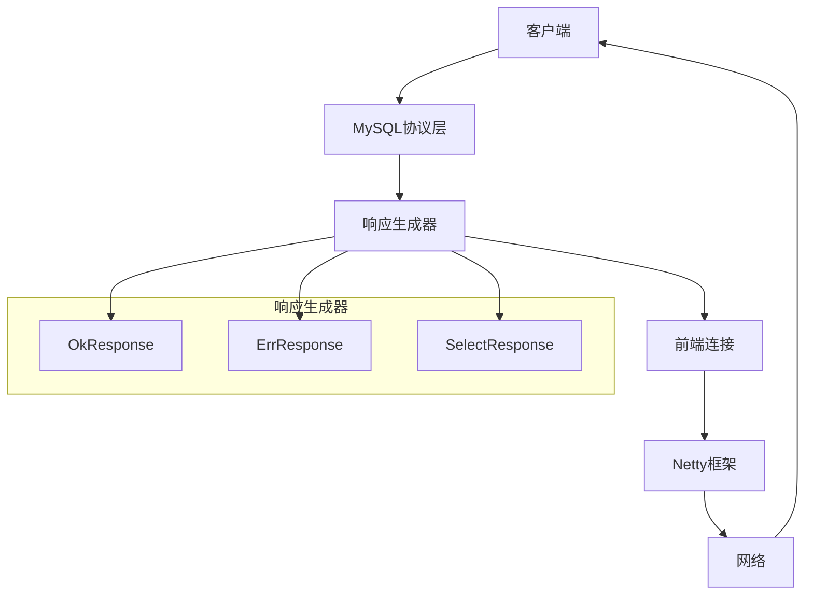
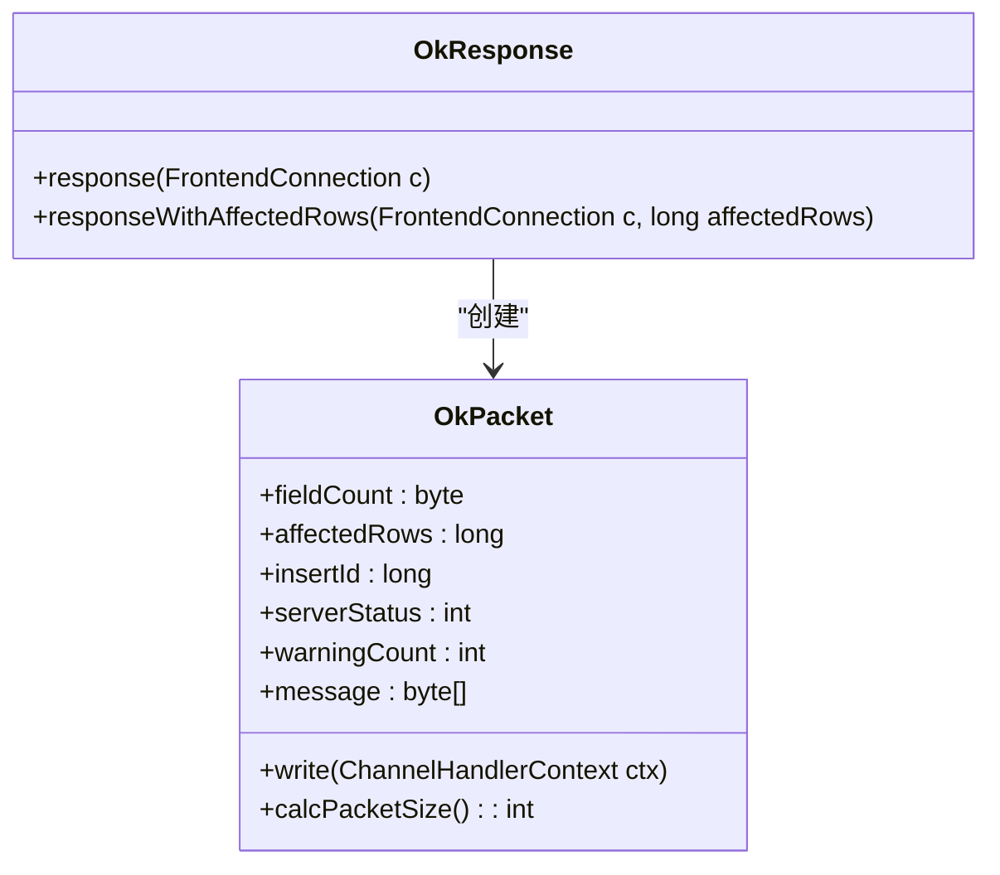
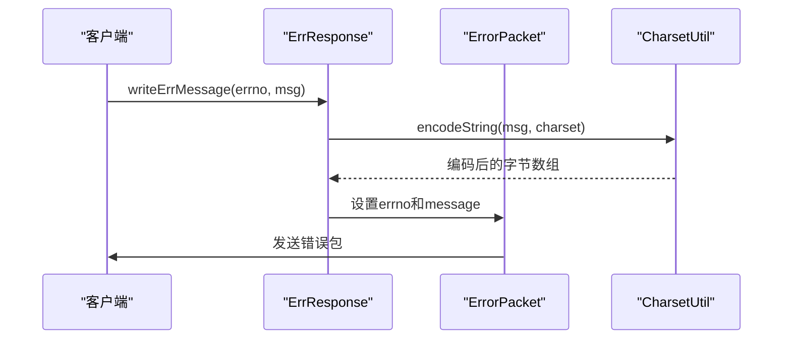
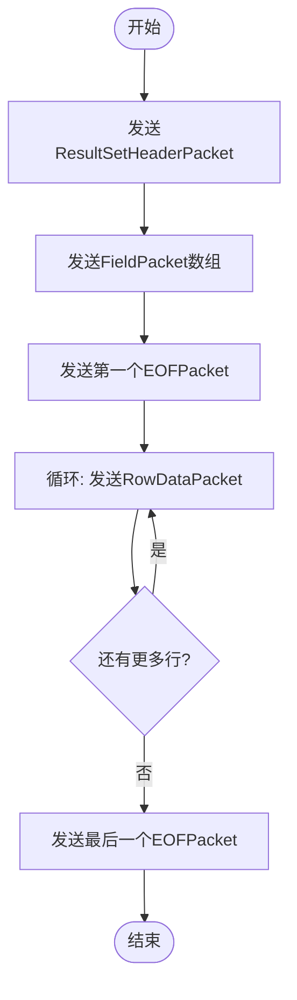
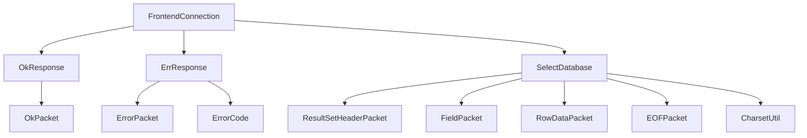

# 响应机制

<cite>
**本文档引用的文件**
- [OkResponse.java](file://src/main/java/alchemystar/freedom/engine/net/response/OkResponse.java)
- [ErrResponse.java](file://src/main/java/alchemystar/freedom/engine/net/response/ErrResponse.java)
- [SelectDatabase.java](file://src/main/java/alchemystar/freedom/engine/net/response/SelectDatabase.java)
- [FrontendConnection.java](file://src/main/java/alchemystar/freedom/engine/net/handler/frontend/FrontendConnection.java)
- [OkPacket.java](file://src/main/java/alchemystar/freedom/engine/net/proto/mysql/OkPacket.java)
- [ErrorPacket.java](file://src/main/java/alchemystar/freedom/engine/net/proto/mysql/ErrorPacket.java)
- [ResultSetHeaderPacket.java](file://src/main/java/alchemystar/freedom/engine/net/proto/mysql/ResultSetHeaderPacket.java)
- [FieldPacket.java](file://src/main/java/alchemystar/freedom/engine/net/proto/mysql/FieldPacket.java)
- [RowDataPacket.java](file://src/main/java/alchemystar/freedom/engine/net/proto/mysql/RowDataPacket.java)
- [EOFPacket.java](file://src/main/java/alchemystar/freedom/engine/net/proto/mysql/EOFPacket.java)
- [ErrorCode.java](file://src/main/java/alchemystar/freedom/engine/net/proto/util/ErrorCode.java)
- [CharsetUtil.java](file://src/main/java/alchemystar/freedom/engine/net/proto/util/CharsetUtil.java)
- [README.md](file://README.md)
</cite>

## 目录
1. [简介](#简介)
2. [项目结构](#项目结构)
3. [核心组件](#核心组件)
4. [架构概述](#架构概述)
5. [详细组件分析](#详细组件分析)
6. [依赖分析](#依赖分析)
7. [性能考虑](#性能考虑)
8. [故障排除指南](#故障排除指南)
9. [结论](#结论)

## 简介
Freedom数据库实现了完整的MySQL协议响应机制，能够处理各种客户端请求并返回标准的MySQL协议包。本系统基于Netty框架构建，通过精心设计的响应类和协议包结构，实现了对OK响应、错误响应和结果集响应的高效处理。响应机制的核心在于正确构造符合MySQL协议规范的数据包，并通过Netty的异步I/O能力高效发送到客户端。系统特别关注了字符集适配、错误码处理和大结果集流式传输等关键问题，确保了与MySQL客户端的完全兼容性。

## 项目结构
Freedom数据库的响应机制主要集中在`engine/net`目录下，形成了清晰的分层架构。协议相关的数据包定义位于`proto/mysql`包中，包括各种响应包的实现；响应处理逻辑集中在`response`包中，提供了针对不同SQL命令的响应生成器；前端连接管理在`handler/frontend`包中，负责与客户端的交互。这种分层设计使得协议实现、业务逻辑和网络传输各司其职，提高了代码的可维护性和扩展性。

```mermaid
graph TB
subgraph "响应机制"
Response[response]
Proto[proto]
Handler[handler]
end
Response --> Proto : "依赖"
Handler --> Response : "调用"
Proto --> Util : "使用"
subgraph "协议包"
OkPacket[OkPacket]
ErrorPacket[ErrorPacket]
ResultSetHeaderPacket[ResultSetHeaderPacket]
FieldPacket[FieldPacket]
RowDataPacket[RowDataPacket]
EOFPacket[EOFPacket]
end
Proto --> OkPacket
Proto --> ErrorPacket
Proto --> ResultSetHeaderPacket
Proto --> FieldPacket
Proto --> RowDataPacket
Proto --> EOFPacket
```

**图示来源**
- [OkPacket.java](file://src/main/java/alchemystar/freedom/engine/net/proto/mysql/OkPacket.java)
- [ErrorPacket.java](file://src/main/java/alchemystar/freedom/engine/net/proto/mysql/ErrorPacket.java)
- [ResultSetHeaderPacket.java](file://src/main/java/alchemystar/freedom/engine/net/proto/mysql/ResultSetHeaderPacket.java)

**本节来源**
- [src/main/java/alchemystar/freedom/engine/net](file://src/main/java/alchemystar/freedom/engine/net)

## 核心组件
Freedom数据库的响应机制由多个核心组件构成，主要包括OkResponse用于处理成功操作的响应，ErrResponse用于处理错误情况，以及SelectDatabase等各类结果集响应生成器。这些组件协同工作，确保了对各种SQL命令的正确响应。系统通过FrontendConnection类管理客户端连接状态，并提供了writeOk()和writeErrMessage()等便捷方法来发送响应。协议包的实现严格遵循MySQL协议规范，包括包头、长度编码和序列ID等关键要素。

**本节来源**
- [OkResponse.java](file://src/main/java/alchemystar/freedom/engine/net/response/OkResponse.java)
- [ErrResponse.java](file://src/main/java/alchemystar/freedom/engine/net/response/ErrResponse.java)
- [FrontendConnection.java](file://src/main/java/alchemystar/freedom/engine/net/handler/frontend/FrontendConnection.java)

## 架构概述
Freedom数据库的响应架构采用分层设计，最底层是MySQL协议包的实现，中间层是响应生成器，最上层是前端连接处理器。当接收到客户端请求时，系统首先解析命令，然后根据命令类型调用相应的响应生成器，最后通过前端连接将响应包发送给客户端。整个过程充分利用了Netty的异步非阻塞特性，确保了高并发场景下的性能表现。对于结果集响应，系统采用了缓冲区累积策略，先将所有响应包写入缓冲区，最后一次性发送，减少了网络I/O次数。



**图示来源**
- [OkResponse.java](file://src/main/java/alchemystar/freedom/engine/net/response/OkResponse.java)
- [ErrResponse.java](file://src/main/java/alchemystar/freedom/engine/net/response/ErrResponse.java)
- [SelectDatabase.java](file://src/main/java/alchemystar/freedom/engine/net/response/SelectDatabase.java)

## 详细组件分析

### OkResponse分析
OkResponse组件负责生成标准的OK响应包，用于响应USE、BEGIN、COMMIT等成功执行的SQL命令。系统提供了多个重载的response方法，可以根据需要包含affectedRows和lastInsertId等信息。OkPacket的构造遵循MySQL协议规范，包括正确的包头、长度编码和字段值。对于简单的OK响应，系统甚至使用预定义的字节数组来提高性能。



**图示来源**
- [OkResponse.java](file://src/main/java/alchemystar/freedom/engine/net/response/OkResponse.java)
- [OkPacket.java](file://src/main/java/alchemystar/freedom/engine/net/proto/mysql/OkPacket.java)

**本节来源**
- [OkResponse.java](file://src/main/java/alchemystar/freedom/engine/net/response/OkResponse.java)
- [OkPacket.java](file://src/main/java/alchemystar/freedom/engine/net/proto/mysql/OkPacket.java)

### ErrResponse分析
ErrResponse组件负责构造错误响应，包含错误码、SQL状态和错误消息。系统通过ErrorCode接口定义了完整的MySQL错误码体系，确保了与标准MySQL服务器的兼容性。错误消息会根据客户端指定的字符集进行编码，保证了多语言环境下的正确显示。ErrorPacket的构造严格遵循MySQL协议，包括0xFF的字段计数标识、两字节的错误码和可选的SQL状态标记。



**图示来源**
- [ErrResponse.java](file://src/main/java/alchemystar/freedom/engine/net/response/ErrResponse.java)
- [ErrorPacket.java](file://src/main/java/alchemystar/freedom/engine/net/proto/mysql/ErrorPacket.java)
- [CharsetUtil.java](file://src/main/java/alchemystar/freedom/engine/net/proto/util/CharsetUtil.java)

**本节来源**
- [ErrResponse.java](file://src/main/java/alchemystar/freedom/engine/net/response/ErrResponse.java)
- [ErrorPacket.java](file://src/main/java/alchemystar/freedom/engine/net/proto/mysql/ErrorPacket.java)

### 结果集响应分析
结果集响应是MySQL协议中最复杂的部分，Freedom通过ResultSetHeaderPacket、FieldPacket、RowDataPacket和EOFPacket四个基本组件来构建完整的结果集。响应流程严格按照协议规定的顺序：先发送结果集头部，然后是字段定义，接着是行数据，最后以EOF包结束。对于多行结果集，系统采用累积缓冲区的策略，先将所有包写入同一个ByteBuf，最后一次性发送，提高了网络传输效率。



**图示来源**
- [SelectDatabase.java](file://src/main/java/alchemystar/freedom/engine/net/response/SelectDatabase.java)
- [ResultSetHeaderPacket.java](file://src/main/java/alchemystar/freedom/engine/net/proto/mysql/ResultSetHeaderPacket.java)
- [FieldPacket.java](file://src/main/java/alchemystar/freedom/engine/net/proto/mysql/FieldPacket.java)
- [RowDataPacket.java](file://src/main/java/alchemystar/freedom/engine/net/proto/mysql/RowDataPacket.java)
- [EOFPacket.java](file://src/main/java/alchemystar/freedom/engine/net/proto/mysql/EOFPacket.java)

**本节来源**
- [SelectDatabase.java](file://src/main/java/alchemystar/freedom/engine/net/response/SelectDatabase.java)
- [ResultSetHeaderPacket.java](file://src/main/java/alchemystar/freedom/engine/net/proto/mysql/ResultSetHeaderPacket.java)

## 依赖分析
Freedom数据库的响应机制依赖于多个核心模块的协同工作。netty框架提供了底层的网络I/O能力，mysql协议包实现了标准的协议解析和构造，charsetutil负责字符集转换，errorcode提供了完整的错误码体系。这些依赖关系形成了一个稳定的响应处理管道，从接收到请求到发送响应，每个环节都由专门的组件负责，确保了系统的可靠性和可维护性。



**图示来源**
- [FrontendConnection.java](file://src/main/java/alchemystar/freedom/engine/net/handler/frontend/FrontendConnection.java)
- [OkResponse.java](file://src/main/java/alchemystar/freedom/engine/net/response/OkResponse.java)
- [ErrResponse.java](file://src/main/java/alchemystar/freedom/engine/net/response/ErrResponse.java)
- [SelectDatabase.java](file://src/main/java/alchemystar/freedom/engine/net/response/SelectDatabase.java)

**本节来源**
- [src/main/java/alchemystar/freedom/engine/net](file://src/main/java/alchemystar/freedom/engine/net)

## 性能考虑
在响应机制的设计中，性能是一个关键考量因素。系统通过多种方式优化了响应性能：使用预定义的OK字节数组避免重复构造；采用累积缓冲区策略减少网络I/O次数；利用Netty的零拷贝特性提高数据传输效率。对于大结果集，建议采用流式处理方式，逐行发送而不是一次性加载所有数据到内存，这可以显著降低内存占用并提高响应速度。此外，合理的缓冲区大小设置和对象池技术也能进一步提升系统性能。

## 故障排除指南
当遇到响应相关的问题时，可以从以下几个方面进行排查：检查错误码是否符合MySQL标准；验证字符集编码是否正确；确认响应包的顺序是否符合协议要求；检查缓冲区管理是否存在内存泄漏。对于结果集响应，特别要注意EOF包的正确使用，确保在行数据发送完毕后发送最后一个EOF包。调试时可以使用MySQL客户端工具连接并执行简单命令，观察返回的响应包是否符合预期。

**本节来源**
- [README.md](file://README.md)
- [FrontendConnection.java](file://src/main/java/alchemystar/freedom/engine/net/handler/frontend/FrontendConnection.java)

## 结论
Freedom数据库的响应机制通过精心设计的类结构和严格的协议实现，提供了与MySQL完全兼容的响应能力。系统不仅正确实现了OK响应、错误响应和结果集响应等各种响应类型，还通过高效的缓冲区管理和Netty集成确保了良好的性能表现。未来可以进一步优化大结果集的流式处理能力，增加对更多MySQL特性的支持，使系统更加完善和强大。