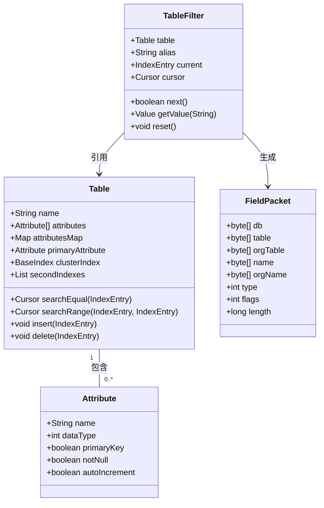
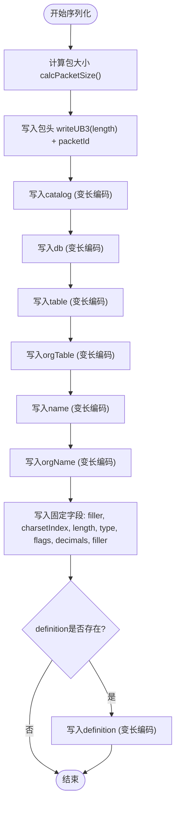
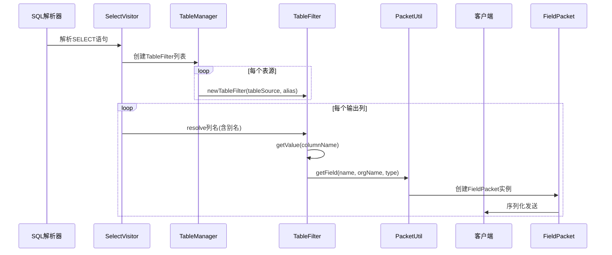

# 字段定义

<cite>
**本文档引用的文件**  
- [FieldPacket.java](file://src/main/java/alchemystar/freedom/engine/net/proto/mysql/FieldPacket.java)
- [Fields.java](file://src/main/java/alchemystar/freedom/engine/net/proto/util/Fields.java)
- [Table.java](file://src/main/java/alchemystar/freedom/meta/Table.java)
- [PacketUtil.java](file://src/main/java/alchemystar/freedom/engine/net/proto/util/PacketUtil.java)
- [TableFilter.java](file://src/main/java/alchemystar/freedom/sql/select/TableFilter.java)
</cite>

## 目录
1. [引言](#引言)
2. [FieldPacket结构与字段元信息填充](#fieldpacket结构与字段元信息填充)
3. [Fields工具类在字段属性标准化中的作用](#fields工具类在字段属性标准化中的作用)
4. [Table元数据模型与字段信息来源](#table元数据模型与字段信息来源)
5. [FieldPacket序列化与变长编码策略](#fieldpacket序列化与变长编码策略)
6. [多表连接查询中的字段别名映射](#多表连接查询中的字段别名映射)
7. [结论](#结论)

## 引言
在数据库通信协议中，查询结果的列元信息描述是客户端理解返回数据结构的关键。本项目通过`FieldPacket`类实现MySQL协议中的字段描述包，完整承载了schema、表名、列名、数据类型等核心元信息。本文将深入分析`FieldPacket`如何构建和传输这些元信息，探讨`Fields`工具类对字段类型的标准化定义，结合`Table`元数据模型说明字段信息的来源，并解析其序列化过程中的变长编码与字符集处理机制。此外，还将讨论在多表连接查询场景下，字段别名与原始列名之间的映射关系及其在`TableFilter`中的实现逻辑。

## FieldPacket结构与字段元信息填充

`FieldPacket`类继承自`MySQLPacket`，用于封装MySQL协议中描述查询结果列结构的字段包。该类包含多个字节数组字段，分别对应于数据库元信息的不同维度：

- **catalog**：数据库目录名称，默认为`def`
- **db**：所属数据库名
- **table**：表名（可能为别名）
- **orgTable**：原始表名
- **name**：列名（可能为别名）
- **orgName**：原始列名
- **charsetIndex**：字符集索引
- **length**：字段最大长度
- **type**：字段数据类型
- **flags**：字段标志位（如是否允许NULL、是否为主键等）
- **decimals**：小数位数
- **definition**：字段定义信息（可选）

在查询响应生成过程中，这些字段通过`readBody`方法从`MySQLMessage`中解析填充，或通过`PacketUtil`工具类直接构造。例如，在`SelectResponse`等响应类中，会调用`PacketUtil.getField()`方法创建`FieldPacket`实例，并根据实际列信息设置`name`、`orgName`、`type`等属性。

**Section sources**  
- [FieldPacket.java](file://src/main/java/alchemystar/freedom/engine/net/proto/mysql/FieldPacket.java#L1-L116)

## Fields工具类在字段属性标准化中的作用

`Fields`接口定义了MySQL协议中所有字段类型和标志位的常量值，起到了字段属性标准化的核心作用。该接口分为两个主要部分：

### 字段数据类型定义
```java
int FIELD_TYPE_TINY = 1;
int FIELD_TYPE_SHORT = 2;
int FIELD_TYPE_LONG = 3;
int FIELD_TYPE_LONGLONG = 8;
int FIELD_TYPE_VARCHAR = 15;
int FIELD_TYPE_BLOB = 252;
int FIELD_TYPE_STRING = 254;
```
这些常量与MySQL协议中的字段类型一一对应，确保了类型标识的统一性。

### 字段标志位定义
```java
int NOT_NULL_FLAG = 0x0001;
int PRI_KEY_FLAG = 0x0002;
int UNIQUE_KEY_FLAG = 0x0004;
int BLOB_FLAG = 0x0010;
int UNSIGNED_FLAG = 0x0020;
int AUTO_INCREMENT_FLAG = 0x0200;
```
标志位可用于描述字段约束和特性，如是否非空、是否为主键、是否自增等。

在实际使用中，`SelectExecutor`等执行器会根据`Table`的`Attribute`信息，结合`Fields`中的常量来设置`FieldPacket`的`type`和`flags`字段，从而实现元信息的准确传递。

**Section sources**  
- [Fields.java](file://src/main/java/alchemystar/freedom/engine/net/proto/util/Fields.java#L1-L52)

## Table元数据模型与字段信息来源

`Table`类是数据库表的元数据模型，承载了表结构的完整定义。其核心字段包括：

- **name**：表名
- **attributes**：属性数组，即列定义
- **attributesMap**：列名到索引的映射
- **primaryAttribute**：主键列
- **clusterIndex**：聚簇索引
- **secondIndexes**：二级索引列表

其中，`Attribute`类定义了每列的具体属性，如列名、数据类型、是否为主键、是否允许NULL等。当执行查询时，`SelectExecutor`会通过`TableFilter`获取`Table`对象，并遍历其`attributes`数组，提取每列的名称和类型信息。

`TableFilter`作为查询执行中的表过滤器，实现了`ColumnResolver`接口，能够根据列名解析出对应的值。它通过`getTable()`方法获取底层`Table`实例，并利用`getAttributeIndex()`定位列的位置，从而为`FieldPacket`提供`orgName`和`type`等原始信息。



**Diagram sources**  
- [Table.java](file://src/main/java/alchemystar/freedom/meta/Table.java#L1-L172)  
- [TableFilter.java](file://src/main/java/alchemystar/freedom/sql/select/TableFilter.java#L1-L278)

**Section sources**  
- [Table.java](file://src/main/java/alchemystar/freedom/meta/Table.java#L1-L172)  
- [TableFilter.java](file://src/main/java/alchemystar/freedom/sql/select/TableFilter.java#L1-L278)

## FieldPacket序列化与变长编码策略

`FieldPacket`的序列化过程由`writeBuf`和`writeBody`方法完成，遵循MySQL协议的变长编码规则。其核心策略如下：

### 变长编码处理
所有字符串字段（如`catalog`、`db`、`name`等）均采用变长编码方式写入：
- 若字段为空，则写入`0x00`
- 否则先写入长度编码（使用`BufferUtil.writeWithLength`），再写入实际字节数据

长度编码规则：
- 长度 < 251：单字节表示
- 251 ≤ 长度 < 65536：前缀`0xFC` + 两字节长度
- 65536 ≤ 长度 < 16777216：前缀`0xFD` + 三字节长度
- 长度 ≥ 16777216：前缀`0xFE` + 八字节长度

### 字符集处理
`FieldPacket`默认使用`Cp1252`字符集进行编码。`PacketUtil.encode()`方法负责将Java字符串转换为指定字符集的字节数组。若编码失败，则回退到平台默认编码。

### 包头与固定字段
- `packetLength`：通过`calcPacketSize()`计算总长度，并以3字节无符号整数写入
- `packetId`：包序列号，单字节
- 固定字段区：包含`charsetIndex`(2字节)、`length`(4字节)、`type`(1字节)、`flags`(2字节)、`decimals`(1字节)及2字节填充



**Diagram sources**  
- [FieldPacket.java](file://src/main/java/alchemystar/freedom/engine/net/proto/mysql/FieldPacket.java#L1-L116)  
- [PacketUtil.java](file://src/main/java/alchemystar/freedom/engine/net/proto/util/PacketUtil.java#L1-L68)

**Section sources**  
- [FieldPacket.java](file://src/main/java/alchemystar/freedom/engine/net/proto/mysql/FieldPacket.java#L1-L116)  
- [PacketUtil.java](file://src/main/java/alchemystar/freedom/engine/net/proto/util/PacketUtil.java#L1-L68)

## 多表连接查询中的字段别名映射

在多表连接查询中，字段别名（alias）与原始列名（orgName）的映射关系至关重要。系统通过`TableFilter`类实现这一机制：

### 别名处理流程
1. **SQL解析阶段**：`SelectVisitor`解析`SELECT`语句，识别字段别名
2. **TableFilter构建**：`TableManager.newTableFilter()`为每个表源创建`TableFilter`，并设置`alias`
3. **列名解析**：`TableFilter.getValue(String columnName)`根据当前`alias`解析列名
4. **FieldPacket生成**：若存在别名，则`name`字段使用别名，`orgName`保留原始列名

### 映射实现机制
`TableFilter`通过`getMap()`方法处理`SQLPropertyExpr`和`SQLIdentifierExpr`表达式：
- 对于`SQLPropertyExpr`（如`t1.name`），检查其`owner`是否匹配当前`alias`
- 对于`SQLIdentifierExpr`（如`name`），直接使用列名（适用于单表或无歧义引用）

这种设计确保了在`SELECT t1.name AS n1, t2.name AS n2 FROM t1, t2`这类查询中，能正确生成两个`FieldPacket`，分别具有`name="n1"`/`orgName="name"`和`name="n2"`/`orgName="name"`的映射关系。



**Diagram sources**  
- [TableFilter.java](file://src/main/java/alchemystar/freedom/sql/select/TableFilter.java#L1-L278)  
- [PacketUtil.java](file://src/main/java/alchemystar/freedom/engine/net/proto/util/PacketUtil.java#L1-L68)

**Section sources**  
- [TableFilter.java](file://src/main/java/alchemystar/freedom/sql/select/TableFilter.java#L1-L278)

## 结论
本文深入分析了Freedom数据库系统中字段元信息的描述机制。`FieldPacket`作为MySQL协议字段描述的核心载体，通过`catalog`、`db`、`table`、`name`、`type`等字段完整表达了查询结果的列结构。`Fields`工具类提供了标准化的类型与标志定义，确保了协议兼容性。字段信息源自`Table`元数据模型，并通过`TableFilter`在查询执行过程中进行解析和映射。序列化时采用变长编码策略，并结合`PacketUtil`和`CharsetUtil`处理字符集转换。在多表连接场景下，系统通过`alias`机制实现了字段别名与原始列名的正确映射，保障了复杂查询结果的可读性与准确性。这一整套机制体现了协议层与存储层的紧密协作，为高效、标准的数据库通信奠定了基础。