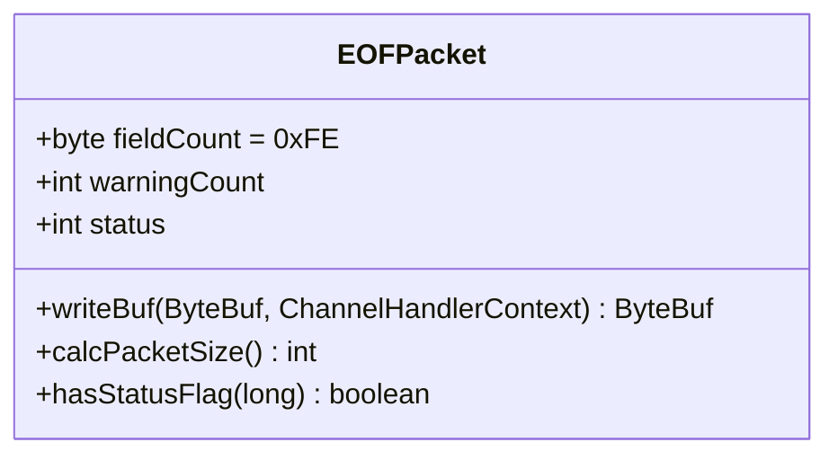
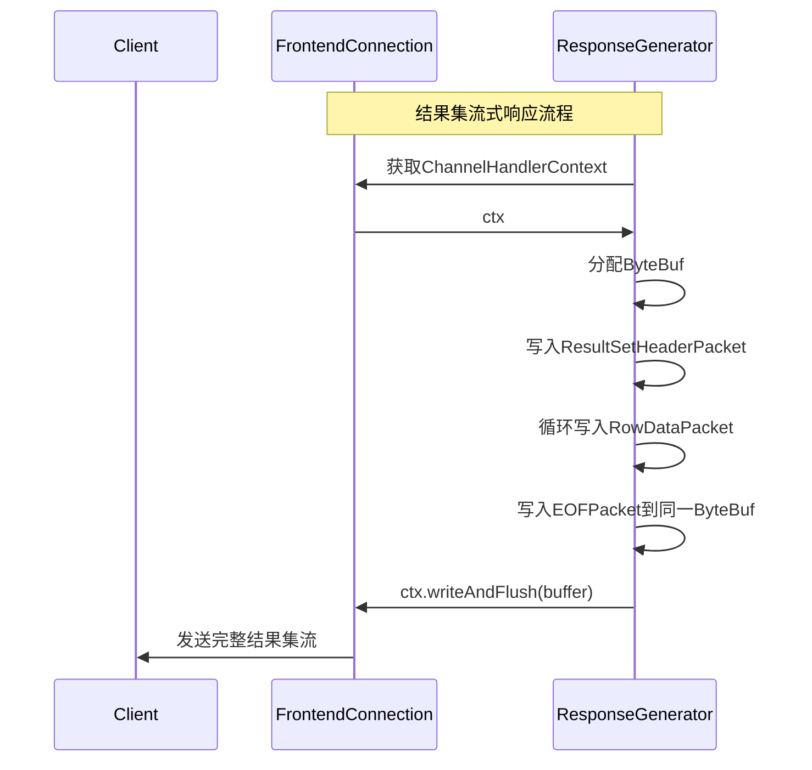
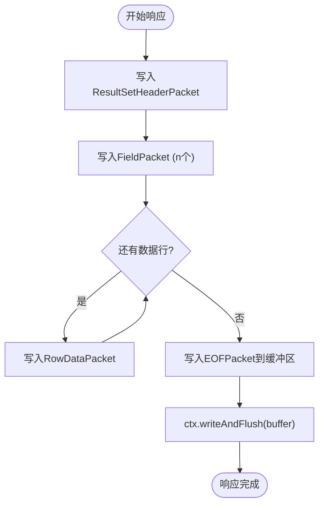

# 结束标记处理

<cite>
**本文档引用文件**  
- [EOFPacket.java](file://src/main/java/alchemystar/freedom/engine/net/proto/mysql/EOFPacket.java)
- [OkPacket.java](file://src/main/java/alchemystar/freedom/engine/net/proto/mysql/OkPacket.java)
- [RowDataPacket.java](file://src/main/java/alchemystar/freedom/engine/net/proto/mysql/RowDataPacket.java)
- [ResultSetHeaderPacket.java](file://src/main/java/alchemystar/freedom/engine/net/proto/mysql/ResultSetHeaderPacket.java)
- [JdbcVariableResponse.java](file://src/main/java/alchemystar/freedom/engine/net/response/jdbc/JdbcVariableResponse.java)
- [BufferUtil.java](file://src/main/java/alchemystar/freedom/engine/net/proto/util/BufferUtil.java)
- [FrontendConnection.java](file://src/main/java/alchemystar/freedom/engine/net/handler/frontend/FrontendConnection.java)
</cite>

## 目录
1. [引言](#引言)
2. [EOFPacket与OkPacket语义区分](#eofpacket与okpacket语义区分)
3. [EOFPacket结构与字段生成逻辑](#eofpacket结构与字段生成逻辑)
4. [结果集流式传输中的写入时机与flush策略](#结果集流式传输中的写入时机与flush策略)
5. [客户端行为影响分析](#客户端行为影响分析)
6. [完整响应流程示例](#完整响应流程示例)
7. [结论](#结论)

## 引言
在MySQL协议中，EOFPacket用于标识结果集的结束，是流式查询响应的关键组成部分。本文件旨在阐明EOFPacket在结果集流式传输中的终止信号作用，明确其与OkPacket的语义区别，并结合Netty框架下的ChannelHandlerContext机制，详细说明其写入时机和flush策略，以确保结果集的完整性。

**Section sources**
- [EOFPacket.java](file://src/main/java/alchemystar/freedom/engine/net/proto/mysql/EOFPacket.java#L1-L62)
- [OkPacket.java](file://src/main/java/alchemystar/freedom/engine/net/proto/mysql/OkPacket.java#L1-L70)

## EOFPacket与OkPacket语义区分
EOFPacket和OkPacket虽然都用于表示操作完成，但其应用场景和语义有本质区别：

- **EOFPacket**：专用于**查询语句**（如SELECT）的结果集末尾，表示字段定义和行数据已全部发送完毕。它出现在`ResultSetHeaderPacket`和多个`RowDataPacket`之后，作为结果集流的终止标志。
- **OkPacket**：用于**非查询语句**（如INSERT、UPDATE、DELETE、SET等）执行成功后的响应，携带影响行数、插入ID等执行结果信息。

这种区分保证了客户端能够正确解析不同类型的SQL语句响应，避免混淆结果集流的结束与非查询语句的成功确认。

**Section sources**
- [EOFPacket.java](file://src/main/java/alchemystar/freedom/engine/net/proto/mysql/EOFPacket.java#L1-L62)
- [OkPacket.java](file://src/main/java/alchemystar/freedom/engine/net/proto/mysql/OkPacket.java#L1-L70)

## EOFPacket结构与字段生成逻辑
EOFPacket的结构遵循MySQL协议规范，其核心字段包括：

**Diagram sources**
- [EOFPacket.java](file://src/main/java/alchemystar/freedom/engine/net/proto/mysql/EOFPacket.java#L1-L62)

### 字段说明
- **fieldCount**: 固定为`0xFE`，作为EOFPacket的标识符。
- **warningCount**: 表示执行过程中产生的警告数量。该值由服务器在执行查询后统计生成，反映SQL执行的潜在问题。
- **status**: 服务器状态标志位，包含如`SERVER_MORE_RESULTS_EXISTS`、`SERVER_QUERY_NO_GOOD_INDEX_USED`等状态。其值由服务器根据当前会话状态和查询执行情况动态设置。

这些字段的生成逻辑通常在响应构造阶段完成，例如在`JdbcVariableResponse`等响应类中初始化EOFPacket实例并设置相应状态。

**Section sources**
- [EOFPacket.java](file://src/main/java/alchemystar/freedom/engine/net/proto/mysql/EOFPacket.java#L1-L62)
- [JdbcVariableResponse.java](file://src/main/java/alchemystar/freedom/engine/net/response/jdbc/JdbcVariableResponse.java#L35-L51)

## 结果集流式传输中的写入时机与flush策略
在Netty框架下，EOFPacket的写入时机和flush策略对于保证结果集完整性至关重要。整个流程如下：

**Diagram sources**
- [JdbcVariableResponse.java](file://src/main/java/alchemystar/freedom/engine/net/response/jdbc/JdbcVariableResponse.java#L35-L51)
- [RowDataPacket.java](file://src/main/java/alchemystar/freedom/engine/net/proto/mysql/RowDataPacket.java#L43-L91)
- [FrontendConnection.java](file://src/main/java/alchemystar/freedom/engine/net/handler/frontend/FrontendConnection.java#L300-L319)

### 写入时机
EOFPacket必须在所有`RowDataPacket`之后、任何后续响应之前写入。它标志着当前结果集的终结。例如，在`JdbcVariableResponse.response()`方法中，EOFPacket在字段定义和数据行之后被写入缓冲区。

### flush策略
关键策略是**延迟flush**：将`ResultSetHeaderPacket`、所有`RowDataPacket`和`EOFPacket`写入同一个`ByteBuf`，最后调用一次`ctx.writeAndFlush(buffer)`。这种策略确保了：
1. **原子性**：整个结果集作为一个完整的TCP包或连续包序列发送，避免被其他响应数据截断。
2. **性能**：减少系统调用和上下文切换开销。
3. **顺序性**：Netty保证同一`ChannelHandlerContext`上的写入操作按顺序执行。

直接对每个Packet调用`writeAndFlush`会导致网络碎片化和潜在的顺序错乱。

**Section sources**
- [JdbcVariableResponse.java](file://src/main/java/alchemystar/freedom/engine/net/response/jdbc/JdbcVariableResponse.java#L35-L51)
- [RowDataPacket.java](file://src/main/java/alchemystar/freedom/engine/net/proto/mysql/RowDataPacket.java#L43-L91)
- [FrontendConnection.java](file://src/main/java/alchemystar/freedom/engine/net/handler/frontend/FrontendConnection.java#L300-L319)

## 客户端行为影响分析
EOFPacket中的`warningCount`和`serverStatus`字段直接影响客户端的行为：

- **warningCount > 0**: 客户端应检查并记录警告信息，可能需要向用户提示潜在问题。
- **serverStatus标志位**:
  - `SERVER_MORE_RESULTS_EXISTS`: 表示存在更多结果集（如存储过程输出多个结果），客户端应继续读取下一个结果集。
  - `SERVER_QUERY_WAS_SLOW`: 表示查询执行较慢，可用于性能监控。
  - `SERVER_STATUS_AUTOCOMMIT`: 反映当前事务的自动提交状态。

客户端通过`hasStatusFlag()`方法（如`EOFPacket`中实现）来检测这些状态位，从而决定后续的交互逻辑。

**Section sources**
- [EOFPacket.java](file://src/main/java/alchemystar/freedom/engine/net/proto/mysql/EOFPacket.java#L1-L62)

## 完整响应流程示例
一个典型的SELECT查询响应流程如下：

此流程确保了结果集的完整性和协议的正确性。

**Diagram sources**
- [JdbcVariableResponse.java](file://src/main/java/alchemystar/freedom/engine/net/response/jdbc/JdbcVariableResponse.java#L35-L51)
- [RowDataPacket.java](file://src/main/java/alchemystar/freedom/engine/net/proto/mysql/RowDataPacket.java#L43-L91)

## 结论
EOFPacket是MySQL协议中结果集流式传输的终止信号，与用于非查询语句响应的OkPacket有明确的语义区分。其`warningCount`和`serverStatus`字段提供了重要的执行上下文信息。在Netty实现中，通过将EOFPacket与结果集的其他部分写入同一缓冲区并进行一次性flush，可以有效保证结果集的完整性、顺序性和传输效率。正确的实现对于构建稳定可靠的数据库代理或中间件至关重要。