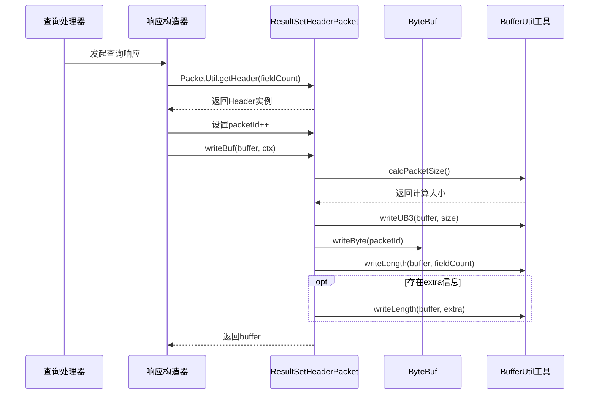
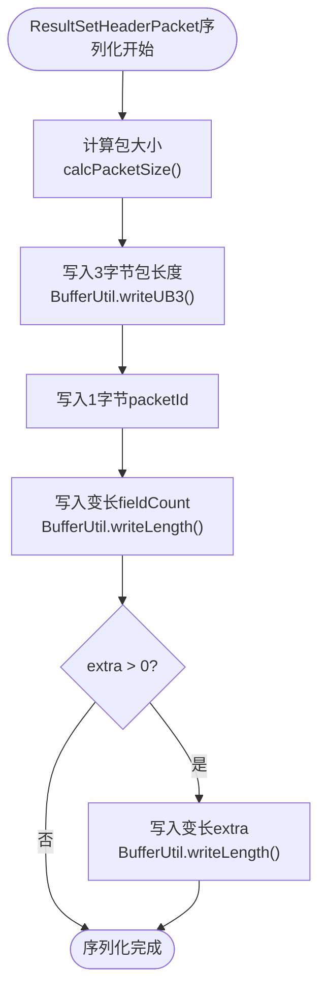

# 结果集头部

<cite>
**本文档中引用的文件**   
- [ResultSetHeaderPacket.java](file://src/main/java/alchemystar/freedom/engine/net/proto/mysql/ResultSetHeaderPacket.java)
- [BufferUtil.java](file://src/main/java/alchemystar/freedom/engine/net/proto/util/BufferUtil.java)
- [SelectResponse.java](file://src/main/java/alchemystar/freedom/engine/net/response/SelectResponse.java)
- [ShowTables.java](file://src/main/java/alchemystar/freedom/engine/net/response/ShowTables.java)
- [MySQLPacket.java](file://src/main/java/alchemystar/freedom/engine/net/proto/MySQLPacket.java)
- [MySQLMessage.java](file://src/main/java/alchemystar/freedom/engine/net/proto/mysql/MySQLMessage.java)
- [PacketUtil.java](file://src/main/java/alchemystar/freedom/engine/net/proto/util/PacketUtil.java)
</cite>

## 目录
1. [引言](#引言)
2. [核心组件分析](#核心组件分析)
3. [ResultSetHeaderPacket结构与初始化流程](#resultsetheaderpacket结构与初始化流程)
4. [fieldCount与extra字段语义解析](#fieldcount与extra字段语义解析)
5. [MySQL协议包编码机制](#mysql协议包编码机制)
6. [BufferUtil在变长整数写入中的作用](#bufferutil在变长整数写入中的作用)
7. [结果集头部构造代码示例](#结果集头部构造代码示例)
8. [异常场景分析](#异常场景分析)
9. [结论](#结论)

## 引言
在Freedom数据库系统中，`ResultSetHeaderPacket`是实现MySQL协议兼容性的重要组成部分，负责在查询响应过程中传递结果集的元信息。该数据包作为结果集响应流的第一个包，承载着字段数量、附加信息等关键元数据，直接影响客户端对后续数据包的解析逻辑。本文将深入解析`ResultSetHeaderPacket`在Freedom数据库中的作用机制、初始化流程及其与MySQL协议规范的兼容性实现。

## 核心组件分析

`ResultSetHeaderPacket`作为MySQL协议响应体系的核心组件之一，继承自`MySQLPacket`基类，封装了结果集头部信息的序列化与反序列化逻辑。其主要职责包括：定义结果集的基本结构（字段数量）、携带可选的扩展信息（extra字段）、遵循MySQL协议的编码规范进行网络传输。

**Section sources**
- [ResultSetHeaderPacket.java](file://src/main/java/alchemystar/freedom/engine/net/proto/mysql/ResultSetHeaderPacket.java#L1-L53)

## ResultSetHeaderPacket结构与初始化流程

`ResultSetHeaderPacket`的结构严格遵循MySQL协议规范，包含以下核心字段：
- `packetLength`：包长度，由`BufferUtil.writeUB3`方法写入3字节
- `packetId`：包序列号，单字节递增标识
- `fieldCount`：结果集字段数量，采用变长整数编码
- `extra`：可选的额外信息字段，同样采用变长整数编码

初始化流程始于查询处理器（如`SelectResponse`或`ShowTables`）创建响应实例时，通过`PacketUtil.getHeader(fieldCount)`工厂方法生成`ResultSetHeaderPacket`实例，并设置初始`packetId`值。随后在响应写入阶段，调用`writeBuf`方法完成序列化。



**Diagram sources **
- [ResultSetHeaderPacket.java](file://src/main/java/alchemystar/freedom/engine/net/proto/mysql/ResultSetHeaderPacket.java#L1-L53)
- [SelectResponse.java](file://src/main/java/alchemystar/freedom/engine/net/response/SelectResponse.java#L1-L152)
- [ShowTables.java](file://src/main/java/alchemystar/freedom/engine/net/response/ShowTables.java#L1-L82)

**Section sources**
- [ResultSetHeaderPacket.java](file://src/main/java/alchemystar/freedom/engine/net/proto/mysql/ResultSetHeaderPacket.java#L1-L53)
- [SelectResponse.java](file://src/main/java/alchemystar/freedom/engine/net/response/SelectResponse.java#L1-L152)

## fieldCount与extra字段语义解析

### fieldCount字段语义
`fieldCount`字段表示结果集中包含的列（字段）数量，是客户端解析后续`FieldPacket`序列的基础依据。其取值逻辑如下：
- 对于`SELECT`查询：等于查询语句中SELECT子句的字段数量
- 对于`SHOW`类查询（如`SHOW TABLES`）：通常为1（如"TABLES"列）
- 特殊函数查询（如`VERSION()`）：为1

该字段采用MySQL协议定义的变长整数（LengthEncodedInteger）编码，通过`BufferUtil.writeLength`方法写入。

### extra字段语义
`extra`字段为可选的附加信息字段，在Freedom数据库的当前实现中主要用于携带影响结果集处理的元数据。其存在性通过`mm.hasRemaining()`判断，仅在数据包剩余字节非空时读取。典型应用场景包括：
- 携带影响结果集处理的标志位
- 传递服务器状态信息
- 兼容MySQL协议的特定扩展

当`extra`值大于0时，才会在序列化时写入该字段，体现了协议的紧凑性设计。

**Section sources**
- [ResultSetHeaderPacket.java](file://src/main/java/alchemystar/freedom/engine/net/proto/mysql/ResultSetHeaderPacket.java#L1-L53)
- [ShowTables.java](file://src/main/java/alchemystar/freedom/engine/net/response/ShowTables.java#L1-L82)

## MySQL协议包编码机制

`ResultSetHeaderPacket`严格遵循MySQL网络协议的编码规范，其包结构如下表所示：

| 字段 | 长度 | 类型 | 说明 |
|------|------|------|------|
| packetLength | 3字节 | UB3 | 包体长度（不包括自身） |
| packetId | 1字节 | uint8 | 包序列号，每连接递增 |
| fieldCount | 变长 | LengthEncodedInteger | 字段数量 |
| extra | 变长 | LengthEncodedInteger | 可选的额外信息 |

包长度（packetLength）使用UB3（Unsigned Integer with 3 bytes）编码，最大可表示16MB（0xFFFFFF）的数据包。`packetId`从0开始，每发送一个包递增1，用于包的顺序校验和分片重组。



**Diagram sources **
- [ResultSetHeaderPacket.java](file://src/main/java/alchemystar/freedom/engine/net/proto/mysql/ResultSetHeaderPacket.java#L1-L53)
- [BufferUtil.java](file://src/main/java/alchemystar/freedom/engine/net/proto/util/BufferUtil.java#L1-L143)

## BufferUtil在UB3和变长整数写入中的关键作用

`BufferUtil`工具类是Freedom数据库网络协议编码的核心，提供了对MySQL协议数据类型的底层支持。

### UB3编码实现
`writeUB3`方法将32位整数按小端序写入3个字节：
```java
public static final void writeUB3(ByteBuf buffer, int i) {
    buffer.writeByte((byte) (i & 0xff));
    buffer.writeByte((byte) (i >>> 8));
    buffer.writeByte((byte) (i >>> 16));
}
```
此方法确保`packetLength`字段符合MySQL协议的UB3编码要求。

### 变长整数（LengthEncodedInteger）写入
`writeLength`方法实现了MySQL协议的变长整数编码，根据数值大小自动选择最优编码方式：
- < 251：1字节直接存储
- < 65536：3字节（0xFC + 2字节长度）
- < 16777216：4字节（0xFD + 3字节长度）
- ≥ 16777216：9字节（0xFE + 8字节长度）

这种编码方式在保证数值范围的同时，最大限度地节省了网络带宽。

**Section sources**
- [BufferUtil.java](file://src/main/java/alchemystar/freedom/engine/net/proto/util/BufferUtil.java#L1-L143)
- [ResultSetHeaderPacket.java](file://src/main/java/alchemystar/freedom/engine/net/proto/mysql/ResultSetHeaderPacket.java#L1-L53)

## 结果集头部构造代码示例

以下代码展示了`ResultSetHeaderPacket`在`SelectResponse`中的典型构造流程：

```java
// 创建SelectResponse实例
SelectResponse response = new SelectResponse(3); // 3个字段

// 内部构造逻辑
public SelectResponse(Integer fieldCount) {
    this.fieldCount = fieldCount;
    // 通过工厂方法获取Header
    header = PacketUtil.getHeader(fieldCount);
    // 递增并设置packetId
    header.packetId = ++packetId;
    // ... 其他初始化
}
```

在响应写入时：
```java
// 写入结果集头部
buffer = header.writeBuf(buffer, c.getCtx());
```

此过程自动计算包大小、写入UB3长度、packetId及变长的fieldCount，完成标准的MySQL结果集头部构造。

**Section sources**
- [SelectResponse.java](file://src/main/java/alchemystar/freedom/engine/net/response/SelectResponse.java#L1-L152)
- [ResultSetHeaderPacket.java](file://src/main/java/alchemystar/freedom/engine/net/proto/mysql/ResultSetHeaderPacket.java#L1-L53)

## 异常场景分析

当`ResultSetHeaderPacket`构造不完整时，可能导致严重的客户端解析错误：

### 包长度计算错误
若`calcPacketSize()`方法计算错误，导致写入的`packetLength`与实际数据长度不符，客户端将：
- 读取不足：等待超时，连接挂起
- 读取过多：解析到下一个包的数据，导致协议状态机错乱

### packetId不连续
`packetId`未正确递增会导致：
- 客户端丢弃"乱序"包
- 分片重组失败
- 连接被重置

### fieldCount值错误
错误的`fieldCount`值将直接导致：
- 客户端多读或少读`FieldPacket`
- 结果集元数据与实际数据不匹配
- 查询结果解析完全错误

### extra字段处理不当
在`read`方法中，若未正确检查`mm.hasRemaining()`，可能导致：
- 数组越界异常
- 读取到不属于当前包的数据
- 协议解析崩溃

**Section sources**
- [ResultSetHeaderPacket.java](file://src/main/java/alchemystar/freedom/engine/net/proto/mysql/ResultSetHeaderPacket.java#L1-L53)
- [BufferUtil.java](file://src/main/java/alchemystar/freedom/engine/net/proto/util/BufferUtil.java#L1-L143)

## 结论
`ResultSetHeaderPacket`在Freedom数据库中扮演着结果集响应的"导航器"角色，其正确实现是保证MySQL协议兼容性的基石。通过对`fieldCount`和`extra`字段的精确控制，结合`BufferUtil`对UB3和变长整数的标准化编码，Freedom数据库能够高效、可靠地向客户端传递查询结果的元信息。开发者在处理此类协议包时，必须严格遵循MySQL规范，确保包长度、序列号和字段计数的准确性，以避免引发客户端解析层面的连锁故障。