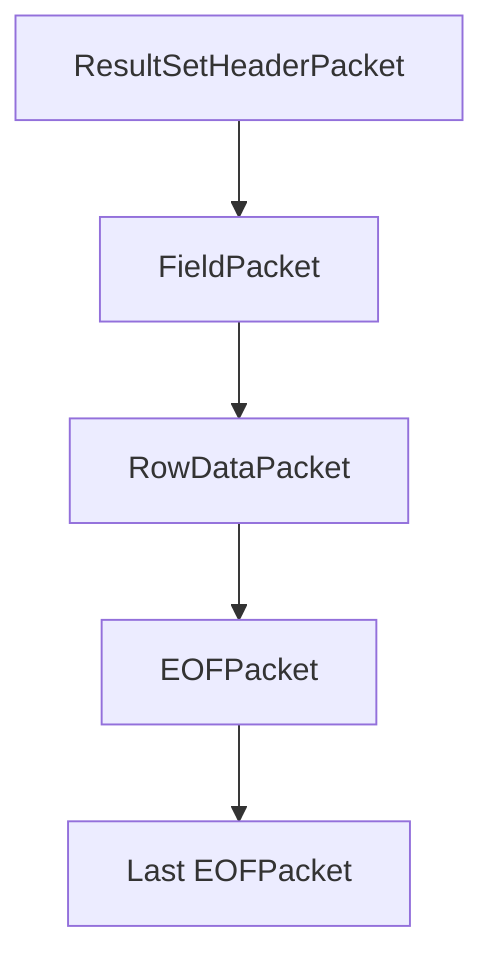
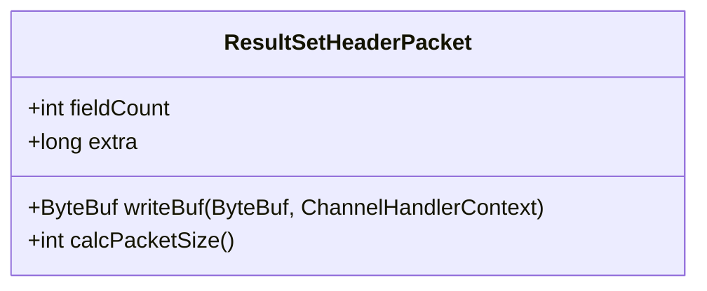
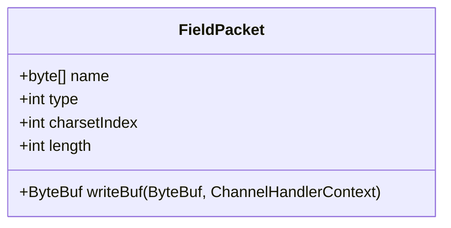
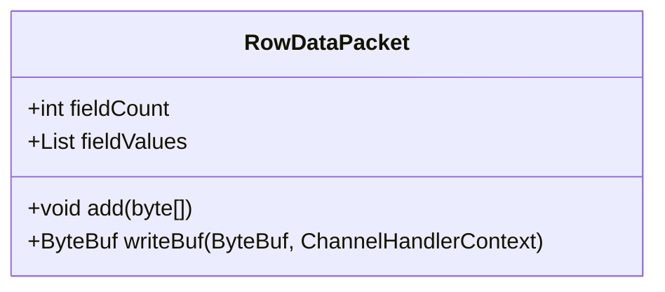
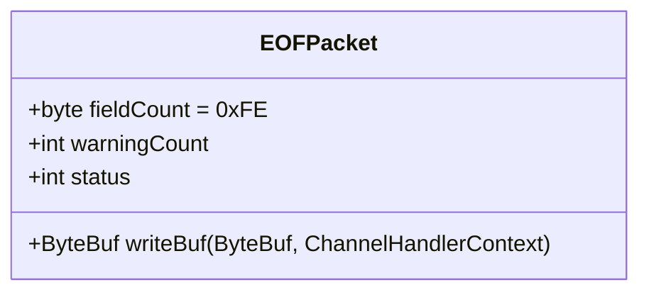
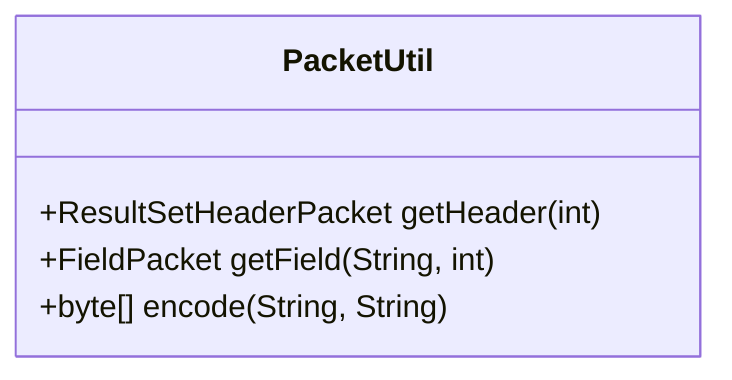

# 结果集构造

<cite>
**本文档中引用的文件**  
- [SelectDatabase.java](file://src/main/java/alchemystar/freedom/engine/net/response/SelectDatabase.java)
- [SelectTxResponse.java](file://src/main/java/alchemystar/freedom/engine/net/response/SelectTxResponse.java)
- [ResultSetHeaderPacket.java](file://src/main/java/alchemystar/freedom/engine/net/proto/mysql/ResultSetHeaderPacket.java)
- [FieldPacket.java](file://src/main/java/alchemystar/freedom/engine/net/proto/mysql/FieldPacket.java)
- [RowDataPacket.java](file://src/main/java/alchemystar/freedom/engine/net/proto/mysql/RowDataPacket.java)
- [EOFPacket.java](file://src/main/java/alchemystar/freedom/engine/net/proto/mysql/EOFPacket.java)
- [PacketUtil.java](file://src/main/java/alchemystar/freedom/engine/net/proto/util/PacketUtil.java)
- [FrontendConnection.java](file://src/main/java/alchemystar/freedom/engine/net/handler/frontend/FrontendConnection.java)
</cite>

## 目录
1. [简介](#简介)
2. [结果集构造流程](#结果集构造流程)
3. [协议包结构解析](#协议包结构解析)
4. [PacketUtil工具类分析](#packetutil工具类分析)
5. [大数据量流式输出策略](#大数据量流式输出策略)
6. [高级优化方案](#高级优化方案)
7. [结论](#结论)

## 简介
Freedom数据库在处理SELECT查询时，需构造符合MySQL协议的结果集响应。本文以`SelectDatabase`和`SelectTxResponse`为例，系统化说明从查询执行到结果序列化的全过程，涵盖结果集头部、字段定义、行数据及结束标记的组装时序与协议规范。

**Section sources**
- [SelectDatabase.java](file://src/main/java/alchemystar/freedom/engine/net/response/SelectDatabase.java#L1-L53)
- [SelectTxResponse.java](file://src/main/java/alchemystar/freedom/engine/net/response/SelectTxResponse.java#L1-L54)

## 结果集构造流程
结果集响应的构造遵循MySQL文本协议的四段式结构：结果集头部 → 字段定义 → 行数据 → EOF标记。该流程在`SelectDatabase`和`SelectTxResponse`中体现为统一的响应模式。

**Diagram sources**
- [ResultSetHeaderPacket.java](file://src/main/java/alchemystar/freedom/engine/net/proto/mysql/ResultSetHeaderPacket.java#L1-L54)
- [FieldPacket.java](file://src/main/java/alchemystar/freedom/engine/net/proto/mysql/FieldPacket.java#L1-L117)
- [RowDataPacket.java](file://src/main/java/alchemystar/freedom/engine/net/proto/mysql/RowDataPacket.java#L1-L93)
- [EOFPacket.java](file://src/main/java/alchemystar/freedom/engine/net/proto/mysql/EOFPacket.java#L1-L63)

**Section sources**
- [SelectDatabase.java](file://src/main/java/alchemystar/freedom/engine/net/response/SelectDatabase.java#L33-L52)
- [SelectTxResponse.java](file://src/main/java/alchemystar/freedom/engine/net/response/SelectTxResponse.java#L33-L52)

## 协议包结构解析

### ResultSetHeaderPacket
结果集头部包定义字段数量，是结果集的起始标识。其结构包含包长度、包ID和字段计数。

**Diagram sources**
- [ResultSetHeaderPacket.java](file://src/main/java/alchemystar/freedom/engine/net/proto/mysql/ResultSetHeaderPacket.java#L1-L54)

### FieldPacket
字段定义包描述查询结果的列信息，包括名称、类型、字符集等元数据。

**Diagram sources**
- [FieldPacket.java](file://src/main/java/alchemystar/freedom/engine/net/proto/mysql/FieldPacket.java#L1-L117)

### RowDataPacket
行数据包封装实际查询结果，支持变长字段编码，通过长度前缀标识字段边界。

**Diagram sources**
- [RowDataPacket.java](file://src/main/java/alchemystar/freedom/engine/net/proto/mysql/RowDataPacket.java#L1-L93)

### EOFPacket
EOF包标记结果集的逻辑边界，用于分隔字段定义与行数据，以及标识结果集结束。

**Diagram sources**
- [EOFPacket.java](file://src/main/java/alchemystar/freedom/engine/net/proto/mysql/EOFPacket.java#L1-L63)

## PacketUtil工具类分析
`PacketUtil`提供结果集组件的工厂方法，简化协议包的创建过程，确保编码一致性。

**Diagram sources**
- [PacketUtil.java](file://src/main/java/alchemystar/freedom/engine/net/proto/util/PacketUtil.java#L1-L69)

**Section sources**
- [PacketUtil.java](file://src/main/java/alchemystar/freedom/engine/net/proto/util/PacketUtil.java#L0-L42)
- [SelectDatabase.java](file://src/main/java/alchemystar/freedom/engine/net/response/SelectDatabase.java#L15-L25)

## 大数据量流式输出策略
为避免内存溢出，应采用流式输出机制，逐行生成并发送`RowDataPacket`，而非在内存中累积全部结果。通过`FrontendConnection`的`ChannelHandlerContext`直接写入Netty缓冲区，实现边处理边传输。

**Section sources**
- [SelectResponse.java](file://src/main/java/alchemystar/freedom/engine/net/response/SelectResponse.java#L71-L95)
- [RowDataPacket.java](file://src/main/java/alchemystar/freedom/engine/net/proto/mysql/RowDataPacket.java#L43-L91)

## 高级优化方案

### 结果集压缩
启用`CLIENT_COMPRESS`能力后，可在传输层对结果集进行压缩，减少网络带宽消耗。

### 分页传输
通过`LIMIT`和`OFFSET`实现分页查询，结合游标机制，支持客户端按需获取数据块。

**Section sources**
- [Capabilities.java](file://src/main/java/alchemystar/freedom/engine/net/proto/util/Capabilities.java#L0-L50)
- [SelectResponse.java](file://src/main/java/alchemystar/freedom/engine/net/response/SelectResponse.java#L0-L40)

## 结论
Freedom数据库通过标准化的四段式协议包组装流程，实现了兼容MySQL协议的结果集响应。`PacketUtil`工具类提升了协议包构造的可靠性，而流式输出与分页机制为大数据量场景提供了有效的内存与性能优化方案。