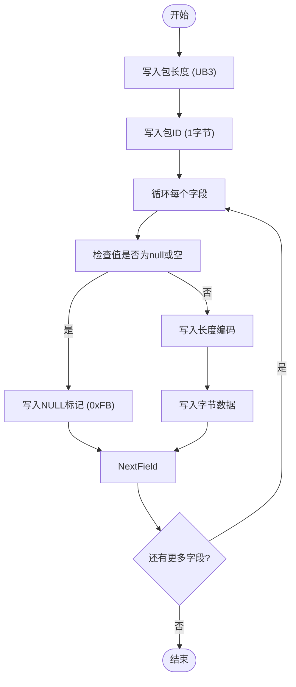
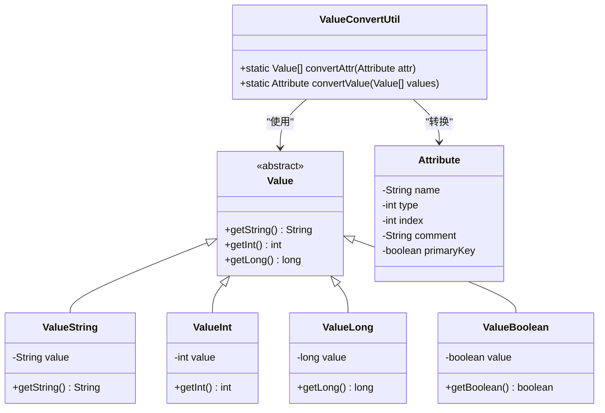
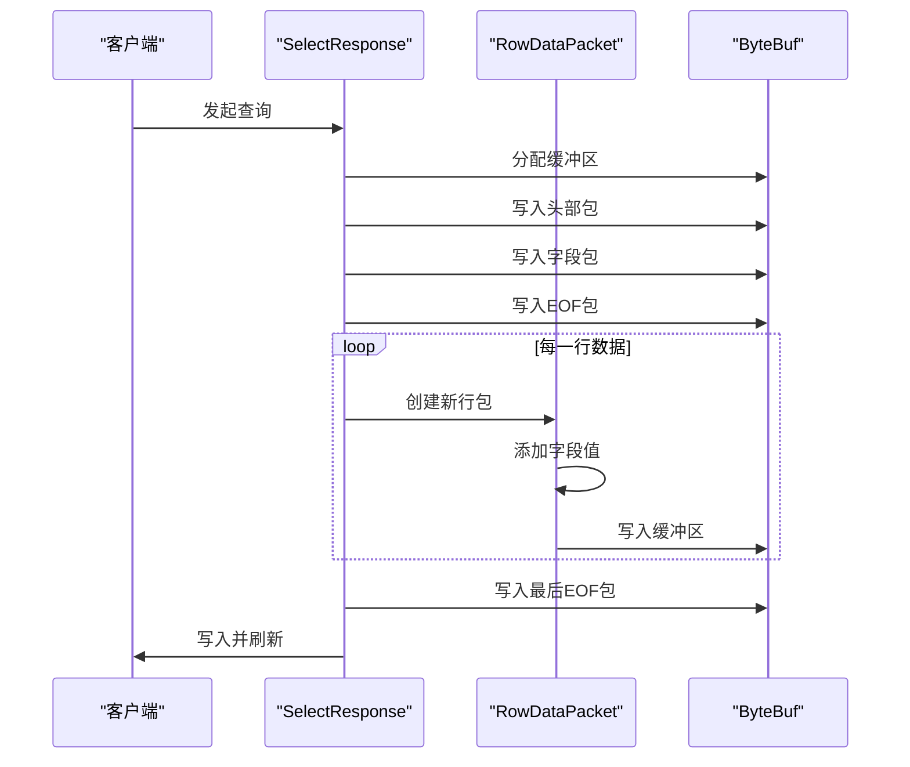
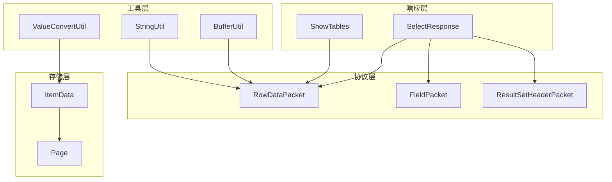
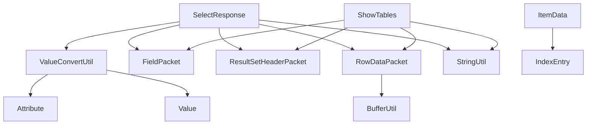

# 行数据封装

<cite>
**本文档引用的文件**  
- [RowDataPacket.java](file://src/main/java/alchemystar/freedom/engine/net/proto/mysql/RowDataPacket.java)
- [ItemData.java](file://src/main/java/alchemystar/freedom/store/item/ItemData.java)
- [ValueConvertUtil.java](file://src/main/java/alchemystar/freedom/util/ValueConvertUtil.java)
- [SelectResponse.java](file://src/main/java/alchemystar/freedom/engine/net/response/SelectResponse.java)
- [ShowTables.java](file://src/main/java/alchemystar/freedom/engine/net/response/ShowTables.java)
- [FieldPacket.java](file://src/main/java/alchemystar/freedom/engine/net/proto/mysql/FieldPacket.java)
- [ResultSetHeaderPacket.java](file://src/main/java/alchemystar/freedom/engine/net/proto/mysql/ResultSetHeaderPacket.java)
- [BufferUtil.java](file://src/main/java/alchemystar/freedom/engine/net/proto/util/BufferUtil.java)
- [StringUtil.java](file://src/main/java/alchemystar/freedom/engine/net/proto/util/StringUtil.java)
- [FrontendConnection.java](file://src/main/java/alchemystar/freedom/engine/net/handler/frontend/FrontendConnection.java)
</cite>

## 目录
1. [引言](#引言)
2. [核心组件分析](#核心组件分析)
3. [行数据序列化流程](#行数据序列化流程)
4. [类型转换机制](#类型转换机制)
5. [响应类中的流式处理](#响应类中的流式处理)
6. [大数据集的分块优化](#大数据集的分块优化)
7. [架构概览](#架构概览)
8. [依赖分析](#依赖分析)
9. [结论](#结论)

## 引言
本文档系统性地阐述了 `RowDataPacket` 如何将存储层的 `ItemData` 转换为符合 MySQL 协议的行数据格式。详细描述了每一列值的序列化过程，包括 NULL 值处理、字符串编码、数值类型转换等。同时分析了 `ValueConvertUtil` 在 Java 类型到 MySQL 类型映射中的桥梁作用，并结合 `SelectResponse` 和 `ShowTables` 等响应类，展示批量行数据写入的流式处理机制，探讨大数据集下分块发送的内存优化策略。

## 核心组件分析

### RowDataPacket 结构
`RowDataPacket` 是实现 MySQL 协议行数据封装的核心类，负责将字段值序列化为网络传输格式。其主要字段包括：
- `fieldCount`：字段数量
- `fieldValues`：字段值的字节数组列表
- `fieldStrings`：字段值的字符串表示列表

该类通过 `writeBuf` 方法将字段值写入 Netty 的 `ByteBuf` 缓冲区，支持流式写入。

**Section sources**
- [RowDataPacket.java](file://src/main/java/alchemystar/freedom/engine/net/proto/mysql/RowDataPacket.java#L0-L92)

### ItemData 存储结构
`ItemData` 是存储层的数据单元，封装了从索引条目 `IndexEntry` 中提取的实际数据。其结构包含：
- `indexEntry`：索引条目引用
- `offset`：在页中的偏移量
- `length`：数据长度

通过 `write` 方法将数据写入 `Page` 页结构中，实现与存储页的交互。

**Section sources**
- [ItemData.java](file://src/main/java/alchemystar/freedom/store/item/ItemData.java#L0-L57)

### ValueConvertUtil 类型转换工具
`ValueConvertUtil` 提供了 Java 类型与数据库值类型之间的转换功能，主要方法包括：
- `convertAttr`：将 `Attribute` 属性转换为 `Value` 数组
- `convertValue`：将 `Value` 数组还原为 `Attribute` 对象

该工具在元数据与协议层之间起到桥梁作用。

**Section sources**
- [ValueConvertUtil.java](file://src/main/java/alchemystar/freedom/util/ValueConvertUtil.java#L0-L37)

## 行数据序列化流程

### 序列化过程
`RowDataPacket` 的序列化过程遵循 MySQL 协议规范，具体步骤如下：
1. 写入包长度（3 字节）
2. 写入包 ID（1 字节）
3. 遍历每个字段值：
   - 若值为 null 或空，写入 NULL 标记（0xFB）
   - 否则写入长度编码，再写入实际字节数据

**Diagram sources**
- [RowDataPacket.java](file://src/main/java/alchemystar/freedom/engine/net/proto/mysql/RowDataPacket.java#L43-L91)
- [BufferUtil.java](file://src/main/java/alchemystar/freedom/engine/net/proto/util/BufferUtil.java)

**Section sources**
- [RowDataPacket.java](file://src/main/java/alchemystar/freedom/engine/net/proto/mysql/RowDataPacket.java#L43-L91)

### NULL 值处理
当字段值为 null 或长度为 0 时，使用特殊标记 `NULL_MARK`（0xFB）表示，而非写入空字符串或长度前缀。

### 字符串编码
字符串通过 `StringUtil.encode` 方法进行字符集编码，确保客户端与服务器之间的字符集兼容性。

**Section sources**
- [StringUtil.java](file://src/main/java/alchemystar/freedom/engine/net/proto/util/StringUtil.java)
- [SelectResponse.java](file://src/main/java/alchemystar/freedom/engine/net/response/SelectResponse.java#L71-L95)

## 类型转换机制

### Java 类型到 MySQL 类型映射
`ValueConvertUtil` 实现了 Java 对象与数据库值之间的转换，支持以下类型：
- `ValueString` ↔ String
- `ValueInt` ↔ Integer
- `ValueLong` ↔ Long
- `ValueBoolean` ↔ Boolean

**Diagram sources**
- [ValueConvertUtil.java](file://src/main/java/alchemystar/freedom/util/ValueConvertUtil.java#L0-L37)
- [Value.java](file://src/main/java/alchemystar/freedom/meta/value/Value.java)
- [Attribute.java](file://src/main/java/alchemystar/freedom/meta/Attribute.java)

**Section sources**
- [ValueConvertUtil.java](file://src/main/java/alchemystar/freedom/util/ValueConvertUtil.java#L0-L37)

### 字段类型映射
`SelectResponse.convertValueTypeToFieldType` 方法将内部值类型转换为 MySQL 协议字段类型：
- `Value.BOOLEAN` → `FIELD_TYPE_BIT`
- `Value.INT` → `FIELD_TYPE_INT24`
- `Value.LONG` → `FIELD_TYPE_LONG`
- `Value.STRING` → `FIELD_TYPE_STRING`

**Section sources**
- [SelectResponse.java](file://src/main/java/alchemystar/freedom/engine/net/response/SelectResponse.java#L97-L151)

## 响应类中的流式处理

### SelectResponse 流式写入
`SelectResponse` 类实现了查询结果的流式响应，通过 `response` 方法逐步写入：
1. 写入结果集头部包
2. 写入字段定义包
3. 写入 EOF 包
4. 遍历每一行数据，创建 `RowDataPacket` 并写入
5. 写入结束 EOF 包

**Diagram sources**
- [SelectResponse.java](file://src/main/java/alchemystar/freedom/engine/net/response/SelectResponse.java#L71-L151)
- [RowDataPacket.java](file://src/main/java/alchemystar/freedom/engine/net/proto/mysql/RowDataPacket.java)

**Section sources**
- [SelectResponse.java](file://src/main/java/alchemystar/freedom/engine/net/response/SelectResponse.java#L71-L151)

### ShowTables 响应实现
`ShowTables` 类展示了系统表信息的响应流程，其结构与 `SelectResponse` 类似，但为静态定义：
- 固定单字段 "TABLES"
- 从 `TableManager.tableMap` 获取表名列表
- 逐行写入表名

**Section sources**
- [ShowTables.java](file://src/main/java/alchemystar/freedom/engine/net/response/ShowTables.java#L0-L82)

## 大数据集的分块优化

### 内存优化策略
对于大数据集，系统采用分块发送策略以避免内存溢出：
- 使用流式 `ByteBuf` 缓冲区
- 逐行生成并写入 `RowDataPacket`
- 及时刷新缓冲区到网络通道
- 避免一次性加载所有结果到内存

### 分块发送机制
通过 `FrontendConnection` 的上下文管理发送过程：
- 每个包递增 `packetId`
- 使用 Netty 的 `writeAndFlush` 实现异步写入
- 利用 Netty 内存池管理缓冲区

**Section sources**
- [FrontendConnection.java](file://src/main/java/alchemystar/freedom/engine/net/handler/frontend/FrontendConnection.java)
- [SelectResponse.java](file://src/main/java/alchemystar/freedom/engine/net/response/SelectResponse.java#L71-L151)

## 架构概览

**Diagram sources**
- [RowDataPacket.java](file://src/main/java/alchemystar/freedom/engine/net/proto/mysql/RowDataPacket.java)
- [SelectResponse.java](file://src/main/java/alchemystar/freedom/engine/net/response/SelectResponse.java)
- [ShowTables.java](file://src/main/java/alchemystar/freedom/engine/net/response/ShowTables.java)
- [ItemData.java](file://src/main/java/alchemystar/freedom/store/item/ItemData.java)

## 依赖分析

**Diagram sources**
- [SelectResponse.java](file://src/main/java/alchemystar/freedom/engine/net/response/SelectResponse.java)
- [ShowTables.java](file://src/main/java/alchemystar/freedom/engine/net/response/ShowTables.java)
- [RowDataPacket.java](file://src/main/java/alchemystar/freedom/engine/net/proto/mysql/RowDataPacket.java)
- [ItemData.java](file://src/main/java/alchemystar/freedom/store/item/ItemData.java)
- [ValueConvertUtil.java](file://src/main/java/alchemystar/freedom/util/ValueConvertUtil.java)

**Section sources**
- [SelectResponse.java](file://src/main/java/alchemystar/freedom/engine/net/response/SelectResponse.java)
- [ShowTables.java](file://src/main/java/alchemystar/freedom/engine/net/response/ShowTables.java)

## 结论
本文档详细分析了 `RowDataPacket` 如何将存储层的 `ItemData` 转换为 MySQL 协议兼容的行数据格式。通过 `ValueConvertUtil` 实现了 Java 类型到 MySQL 类型的映射，结合 `SelectResponse` 和 `ShowTables` 等响应类展示了批量行数据的流式处理机制。系统采用分块发送策略优化大数据集的内存使用，确保高效稳定的查询响应。整体设计遵循 MySQL 协议规范，实现了高性能的数据库通信层。