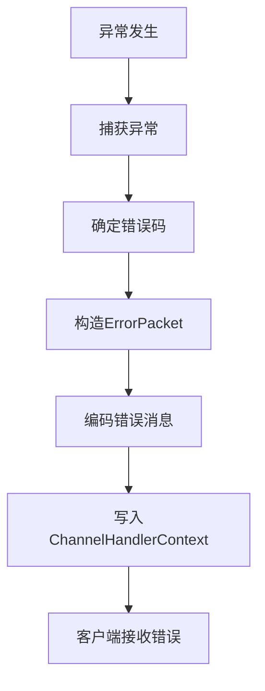
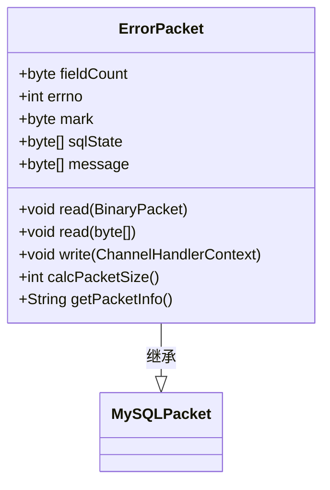
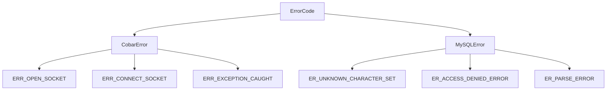
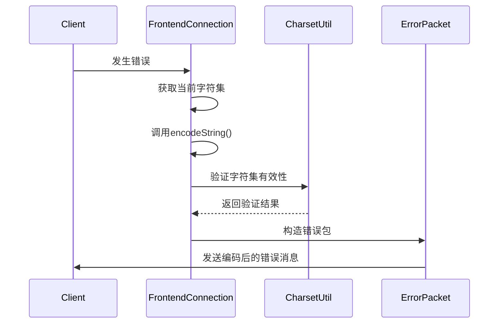
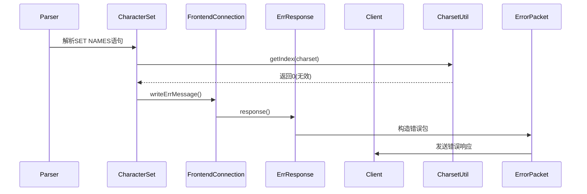
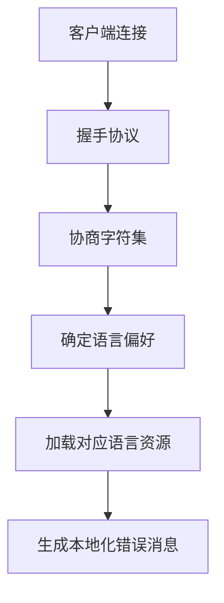

# 错误响应

<cite>
**本文档中引用的文件**  
- [ErrResponse.java](file://src/main/java/alchemystar/freedom/engine/net/response/ErrResponse.java)
- [ErrorPacket.java](file://src/main/java/alchemystar/freedom/engine/net/proto/mysql/ErrorPacket.java)
- [ErrorCode.java](file://src/main/java/alchemystar/freedom/engine/net/proto/util/ErrorCode.java)
- [UnknownCharsetException.java](file://src/main/java/alchemystar/freedom/engine/net/exception/UnknownCharsetException.java)
- [FrontendConnection.java](file://src/main/java/alchemystar/freedom/engine/net/handler/frontend/FrontendConnection.java)
- [CharsetUtil.java](file://src/main/java/alchemystar/freedom/engine/net/proto/util/CharsetUtil.java)
- [CharacterSet.java](file://src/main/java/alchemystar/freedom/engine/net/response/CharacterSet.java)
</cite>

## 目录
1. [简介](#简介)
2. [错误响应机制概述](#错误响应机制概述)
3. [核心组件分析](#核心组件分析)
4. [错误码分类与映射规则](#错误码分类与映射规则)
5. [字符集编码对错误消息的影响](#字符集编码对错误消息的影响)
6. [异常处理链路分析](#异常处理链路分析)
7. [安全性考量](#安全性考量)
8. [错误码扩展指南](#错误码扩展指南)
9. [国际化支持建议](#国际化支持建议)
10. [结论](#结论)

## 简介
Freedom数据库实现了符合MySQL协议的错误响应机制，通过`ErrResponse`类和`ErrorPacket`结构向客户端返回标准化的错误信息。本文档深入解析该机制的设计与实现，重点分析从异常捕获到错误包构造的完整流程，探讨错误码体系、字符集处理、安全防护等关键设计。

## 错误响应机制概述

Freedom数据库的错误响应机制基于MySQL协议规范，通过构造`ErrorPacket`对象并写入Netty通道上下文实现错误信息的传输。整个机制由`ErrResponse`工具类、`ErrorPacket`协议包、`ErrorCode`常量接口和前端连接管理共同构成。



**图示来源**  
- [ErrResponse.java](file://src/main/java/alchemystar/freedom/engine/net/response/ErrResponse.java#L1-L22)
- [ErrorPacket.java](file://src/main/java/alchemystar/freedom/engine/net/proto/mysql/ErrorPacket.java#L1-L81)

## 核心组件分析

### ErrResponse类
`ErrResponse`是错误响应的核心工具类，提供静态方法`response()`用于向客户端发送错误信息。该方法接收前端连接对象和错误消息字符串，构造并发送错误包。

**组件来源**  
- [ErrResponse.java](file://src/main/java/alchemystar/freedom/engine/net/response/ErrResponse.java#L1-L22)

### ErrorPacket类
`ErrorPacket`继承自`MySQLPacket`，实现了MySQL协议中的错误包格式。包含错误号(errno)、SQL状态标记(mark)、SQL状态码(sqlState)和错误消息(message)等字段，并提供`write()`方法将数据写入Netty通道。



**图示来源**  
- [ErrorPacket.java](file://src/main/java/alchemystar/freedom/engine/net/proto/mysql/ErrorPacket.java#L1-L81)

### FrontendConnection类
前端连接类管理客户端会话状态，提供`writeErrMessage()`方法作为错误响应的入口点之一。该方法允许指定错误码和消息内容，增强了错误处理的灵活性。

**组件来源**  
- [FrontendConnection.java](file://src/main/java/alchemystar/freedom/engine/net/handler/frontend/FrontendConnection.java#L1-L321)

## 错误码分类与映射规则

### 错误码体系
错误码定义在`ErrorCode`接口中，分为两大类：
- **Cobar错误码**：以3000+开头，用于系统级错误
- **MySQL错误码**：以1000+开头，兼容MySQL标准错误码



**图示来源**  
- [ErrorCode.java](file://src/main/java/alchemystar/freedom/engine/net/proto/util/ErrorCode.java#L1-L523)

### 映射规则
错误码与具体异常类型的映射遵循以下原则：
1. **标准兼容性**：使用MySQL标准错误码确保客户端兼容性
2. **语义准确性**：选择最能描述错误本质的错误码
3. **层次化设计**：系统级错误使用Cobar专用错误码

## 字符集编码对错误消息的影响

### 字符集处理机制
错误消息的编码由`FrontendConnection`的字符集设置决定。`writeErrMessage()`方法调用`encodeString()`工具方法进行字符编码转换。



**图示来源**  
- [FrontendConnection.java](file://src/main/java/alchemystar/freedom/engine/net/handler/frontend/FrontendConnection.java#L1-L321)
- [CharsetUtil.java](file://src/main/java/alchemystar/freedom/engine/net/proto/util/CharsetUtil.java#L1-L131)

### 字符集异常处理
当客户端请求的字符集不被支持时，系统抛出`UnknownCharsetException`，并返回相应的错误码。

**组件来源**  
- [UnknownCharsetException.java](file://src/main/java/alchemystar/freedom/engine/net/exception/UnknownCharsetException.java#L1-L27)
- [CharsetUtil.java](file://src/main/java/alchemystar/freedom/engine/net/proto/util/CharsetUtil.java#L1-L131)

## 异常处理链路分析

### 未知字符集异常处理流程
以`UnknownCharsetException`为例，展示从异常捕获到错误响应的完整链路：



**图示来源**  
- [CharacterSet.java](file://src/main/java/alchemystar/freedom/engine/net/response/CharacterSet.java#L1-L133)
- [FrontendConnection.java](file://src/main/java/alchemystar/freedom/engine/net/handler/frontend/FrontendConnection.java#L1-L321)
- [ErrResponse.java](file://src/main/java/alchemystar/freedom/engine/net/response/ErrResponse.java#L1-L22)

### 全局异常处理
`FrontendTailHandler`作为Netty管道的末端处理器，捕获所有未处理的异常并转换为错误响应。

**组件来源**  
- [FrontendTailHandler.java](file://src/main/java/alchemystar/freedom/engine/net/handler/frontend/FrontendTailHandler.java#L1-L32)

## 安全性考量

### 敏感信息保护
系统在错误处理中采取以下措施避免敏感信息泄露：
1. **异常消息过滤**：不直接暴露底层异常的详细信息
2. **标准化错误消息**：使用预定义的错误模板而非原始异常消息
3. **日志分离**：详细错误信息仅记录在服务端日志中

### 错误信息最小化
遵循"最少披露"原则，只向客户端返回必要的错误信息，防止攻击者利用错误信息进行系统探测。

## 错误码扩展指南

### 扩展原则
1. **保持兼容性**：新增错误码不应与现有MySQL标准冲突
2. **语义清晰**：错误码名称应准确描述错误类型
3. **分类管理**：系统级错误使用3000+范围，业务错误使用1000+范围

### 扩展示例
```java
// 在ErrorCode接口中添加新错误码
int ER_CUSTOM_VALIDATION_ERROR = 3050;
int ER_DATA_INTEGRITY_VIOLATION = 3051;
```

## 国际化支持建议

### 当前局限
目前错误消息为硬编码字符串，缺乏多语言支持能力。

### 改进建议
1. **引入资源文件**：为不同语言创建属性文件
2. **动态消息生成**：根据客户端语言偏好选择错误消息
3. **字符集协商**：在握手阶段确定通信字符集



## 结论
Freedom数据库的错误响应机制设计合理，严格遵循MySQL协议规范，通过分层架构实现了错误处理的灵活性和可维护性。建议未来版本加强国际化支持，完善错误码文档，并增加更精细的错误分类，以提升系统的可用性和安全性。