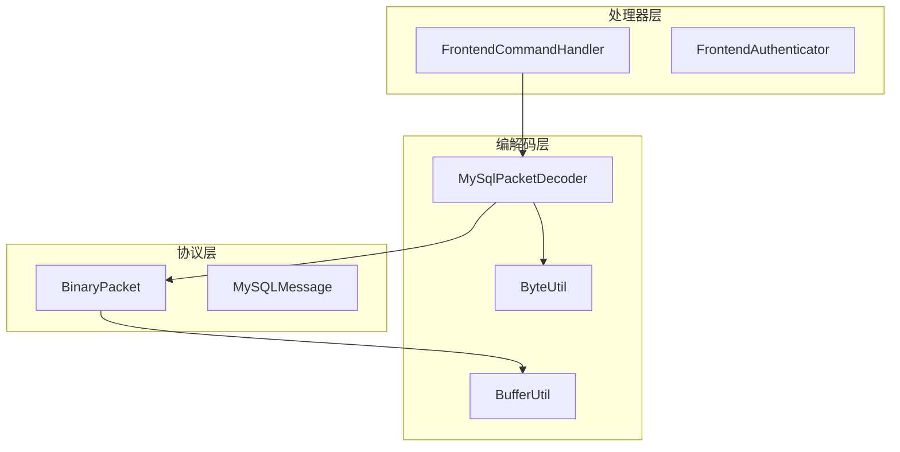
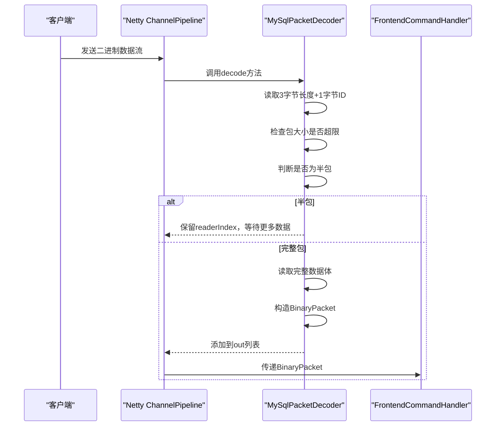
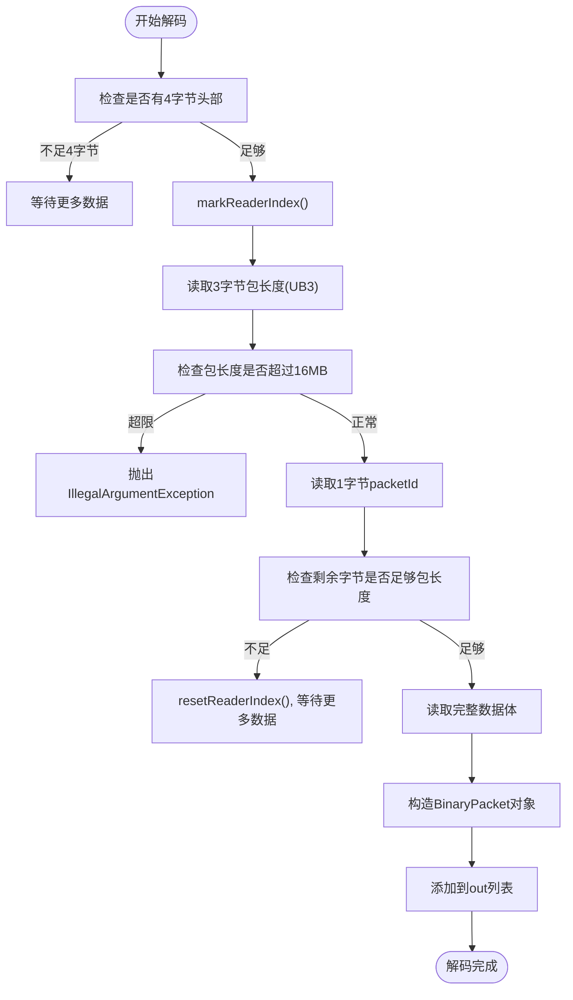
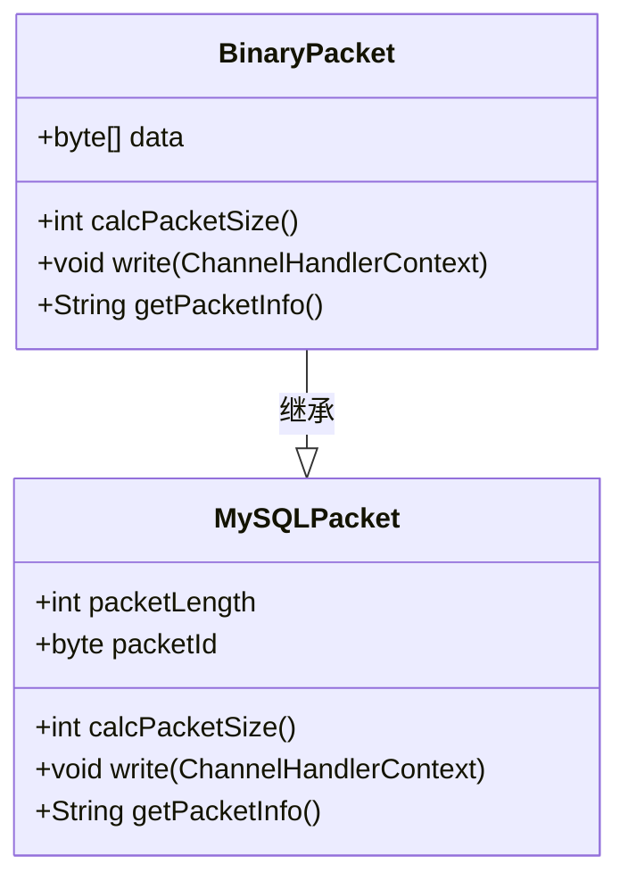

# 消息编解码

<cite>
**本文档引用文件**  
- [MySqlPacketDecoder.java](file://src/main/java/alchemystar/freedom/engine/net/codec/MySqlPacketDecoder.java)
- [BinaryPacket.java](file://src/main/java/alchemystar/freedom/engine/net/proto/mysql/BinaryPacket.java)
- [ByteUtil.java](file://src/main/java/alchemystar/freedom/engine/net/proto/util/ByteUtil.java)
- [BufferUtil.java](file://src/main/java/alchemystar/freedom/engine/net/proto/util/BufferUtil.java)
</cite>

## 目录
1. [引言](#引言)
2. [项目结构概述](#项目结构概述)
3. [核心组件分析](#核心组件分析)
4. [架构概览](#架构概览)
5. [详细组件分析](#详细组件分析)
6. [依赖关系分析](#依赖关系分析)
7. [性能考量](#性能考量)
8. [故障排查指南](#故障排查指南)
9. [结论](#结论)

## 引言
本文档深入解析Freedom数据库中基于Netty框架实现的MySQL协议二进制帧解析机制，重点聚焦于`MySqlPacketDecoder`解码器的设计与实现。文档将详细阐述其如何处理3字节包长度和1字节序列ID的读取逻辑，说明半包处理（mark/reset）与粘包拆分机制，并解释UB3整数读取、最大包大小限制等关键设计。同时，结合`BinaryPacket`数据结构和底层字节操作工具类，全面揭示消息编解码的内部原理。

## 项目结构概述
Freedom数据库的网络通信模块位于`engine/net`目录下，采用分层设计，主要包括编解码层、协议层、处理器层和响应层。其中，`codec`包负责消息的编码与解码，`proto/mysql`包定义了MySQL协议相关的数据包结构，`handler/frontend`包处理前端连接与命令分发。



**Diagram sources**
- [MySqlPacketDecoder.java](file://src/main/java/alchemystar/freedom/engine/net/codec/MySqlPacketDecoder.java#L1-L62)
- [BinaryPacket.java](file://src/main/java/alchemystar/freedom/engine/net/proto/mysql/BinaryPacket.java#L1-L42)

**Section sources**
- [MySqlPacketDecoder.java](file://src/main/java/alchemystar/freedom/engine/net/codec/MySqlPacketDecoder.java#L1-L62)
- [BinaryPacket.java](file://src/main/java/alchemystar/freedom/engine/net/proto/mysql/BinaryPacket.java#L1-L42)

## 核心组件

本文档的核心组件包括：
- **MySqlPacketDecoder**: 基于Netty的`ByteToMessageDecoder`实现，负责从字节流中解析出完整的MySQL数据包。
- **BinaryPacket**: 封装MySQL协议外层结构的数据结构，包含包长度、序列ID和数据体。
- **ByteUtil**: 提供无符号3字节整数（UB3）的读取功能。
- **BufferUtil**: 提供UB3的写入功能，用于编码过程。

**Section sources**
- [MySqlPacketDecoder.java](file://src/main/java/alchemystar/freedom/engine/net/codec/MySqlPacketDecoder.java#L1-L62)
- [BinaryPacket.java](file://src/main/java/alchemystar/freedom/engine/net/proto/mysql/BinaryPacket.java#L1-L42)
- [ByteUtil.java](file://src/main/java/alchemystar/freedom/engine/net/proto/util/ByteUtil.java)
- [BufferUtil.java](file://src/main/java/alchemystar/freedom/engine/net/proto/util/BufferUtil.java)

## 架构概览

Freedom数据库的消息编解码架构基于Netty的ChannelPipeline机制，采用责任链模式处理网络数据流。当客户端发送数据时，字节流首先进入`MySqlPacketDecoder`进行解码，成功解析出`BinaryPacket`后传递给后续处理器进行业务逻辑处理。



**Diagram sources**
- [MySqlPacketDecoder.java](file://src/main/java/alchemystar/freedom/engine/net/codec/MySqlPacketDecoder.java#L18-L62)
- [FrontendCommandHandler.java](file://src/main/java/alchemystar/freedom/engine/net/handler/frontend/FrontendCommandHandler.java)

## 详细组件分析

### MySqlPacketDecoder 解码机制分析

`MySqlPacketDecoder`继承自Netty的`ByteToMessageDecoder`，利用其累积缓冲区特性处理TCP粘包与半包问题。其核心逻辑在`decode`方法中实现。

#### 解码流程图


**Diagram sources**
- [MySqlPacketDecoder.java](file://src/main/java/alchemystar/freedom/engine/net/codec/MySqlPacketDecoder.java#L18-L62)

#### 半包与粘包处理机制
`MySqlPacketDecoder`通过Netty的`markReaderIndex()`和`resetReaderIndex()`机制实现半包处理。当输入缓冲区数据不足以构成完整包时，解码器会回退读取指针，等待下一批数据到达，从而避免数据丢失。对于粘包情况，Netty的累积缓冲区会自动将多个TCP包合并，解码器逐个解析出独立的`BinaryPacket`。

**Section sources**
- [MySqlPacketDecoder.java](file://src/main/java/alchemystar/freedom/engine/net/codec/MySqlPacketDecoder.java#L18-L62)

### BinaryPacket 数据结构设计

`BinaryPacket`类继承自`MySQLPacket`，封装了MySQL协议的外层结构，包含三个核心字段：
- `packetLength`: 包体长度（3字节UB3）
- `packetId`: 序列ID（1字节）
- `data`: 包体数据（byte数组）

该设计将协议头与数据体分离，便于后续解析和处理。



**Diagram sources**
- [BinaryPacket.java](file://src/main/java/alchemystar/freedom/engine/net/proto/mysql/BinaryPacket.java#L12-L41)

**Section sources**
- [BinaryPacket.java](file://src/main/java/alchemystar/freedom/engine/net/proto/mysql/BinaryPacket.java#L1-L42)

### UB3整数与过载保护

#### UB3读取实现
`ByteUtil.readUB3(ByteBuf)`方法从`ByteBuf`中读取3个字节并组合成一个无符号24位整数。其核心逻辑为：
```java
(int) (((b[2] & 0xff) << 16) | ((b[1] & 0xff) << 8) | (b[0] & 0xff))
```
该方法确保了对MySQL协议中3字节长度字段的正确解析。

#### 过载保护策略
解码器设置了`maxPacketSize = 16 * 1024 * 1024`（16MB）的上限。当读取的包长度超过此值时，立即抛出`IllegalArgumentException`，防止恶意客户端发送超大包导致内存溢出或服务拒绝。

**Section sources**
- [MySqlPacketDecoder.java](file://src/main/java/alchemystar/freedom/engine/net/codec/MySqlPacketDecoder.java#L18-L62)
- [ByteUtil.java](file://src/main/java/alchemystar/freedom/engine/net/proto/util/ByteUtil.java)

### 字节缓冲区操作底层细节

#### BufferUtil与ByteUtil工具类
- `BufferUtil.writeUB3(ByteBuf, int)`: 将整数按小端序写入`ByteBuf`，用于编码过程。
- `ByteUtil.readUB3(ByteBuf)`: 从`ByteBuf`读取3字节并解析为整数，用于解码过程。

这两个工具类封装了底层字节操作，提高了代码的可读性和复用性。

**Section sources**
- [BufferUtil.java](file://src/main/java/alchemystar/freedom/engine/net/proto/util/BufferUtil.java)
- [ByteUtil.java](file://src/main/java/alchemystar/freedom/engine/net/proto/util/ByteUtil.java)

## 依赖关系分析

```mermaid
graph TD
MySqlPacketDecoder --> ByteUtil : "调用readUB3()"
MySqlPacketDecoder --> BinaryPacket : "创建实例"
BinaryPacket --> BufferUtil : "调用writeUB3()"
FrontendCommandHandler --> MySqlPacketDecoder : "作为ChannelHandler"
```

**Diagram sources**
- [MySqlPacketDecoder.java](file://src/main/java/alchemystar/freedom/engine/net/codec/MySqlPacketDecoder.java#L18-L62)
- [BinaryPacket.java](file://src/main/java/alchemystar/freedom/engine/net/proto/mysql/BinaryPacket.java#L1-L42)

**Section sources**
- [MySqlPacketDecoder.java](file://src/main/java/alchemystar/freedom/engine/net/codec/MySqlPacketDecoder.java#L1-L62)
- [BinaryPacket.java](file://src/main/java/alchemystar/freedom/engine/net/proto/mysql/BinaryPacket.java#L1-L42)

## 性能考量

- **内存效率**: `BinaryPacket.data`直接使用`in.readBytes().array()`，避免了额外的数组拷贝，但需确保数据后续不会被修改。
- **CPU效率**: UB3读取使用位运算，性能高效。
- **网络效率**: 半包处理机制减少了不必要的数据复制和解析尝试。
- **异常处理**: 对超大包的快速拒绝避免了无效的内存分配和处理。

## 故障排查指南

### 常见网络异常处理
- **半包**: 解码器自动处理，无需额外操作。
- **超大包**: 抛出`IllegalArgumentException`，日志中会记录"Packet size over the limit"错误。
- **空数据包**: 当`packet.data`为空或长度为0时，会记录错误日志。

### 调试建议
- 启用Netty的`LoggingHandler`观察原始字节流。
- 检查`MySqlPacketDecoder`的日志输出，特别是错误和异常信息。
- 使用Wireshark等工具抓包，验证客户端发送的数据格式是否符合MySQL协议。

**Section sources**
- [MySqlPacketDecoder.java](file://src/main/java/alchemystar/freedom/engine/net/codec/MySqlPacketDecoder.java#L18-L62)

## 结论
Freedom数据库的`MySqlPacketDecoder`实现了高效、安全的MySQL协议二进制帧解析。通过Netty的累积缓冲区和mark/reset机制，优雅地解决了TCP粘包与半包问题。结合`BinaryPacket`数据结构和`ByteUtil`/`BufferUtil`工具类，构建了清晰的编解码体系。16MB的过载保护策略有效防止了资源耗尽攻击。整体设计简洁高效，体现了良好的网络编程实践。