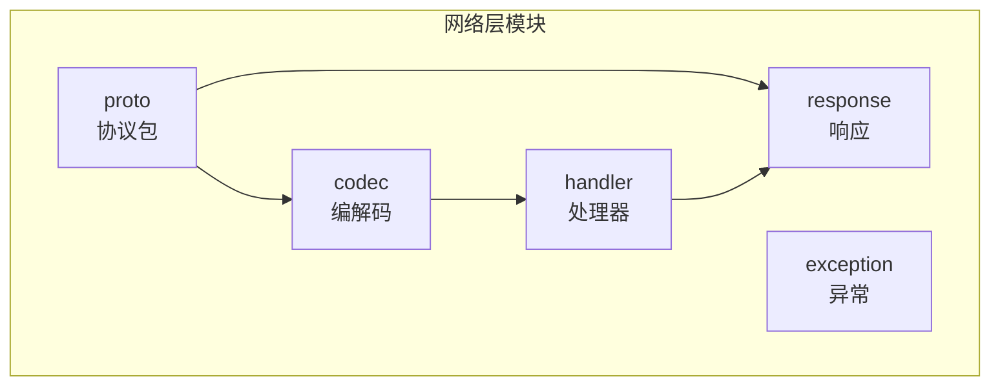
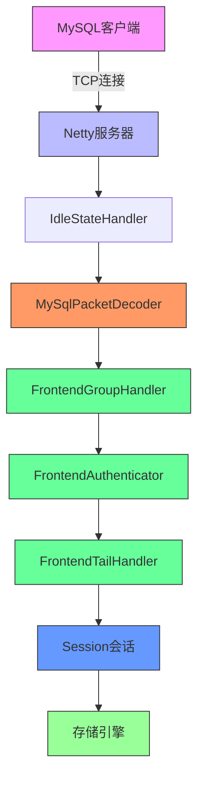
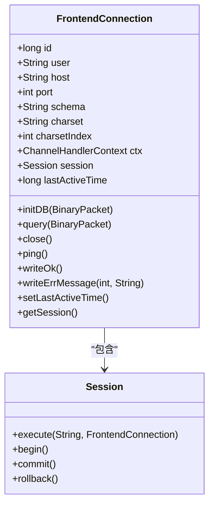
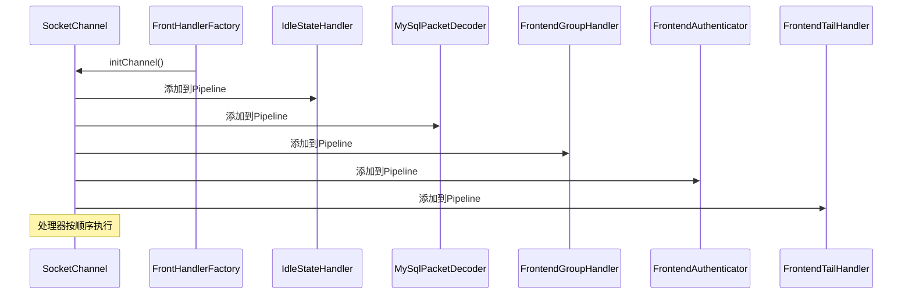
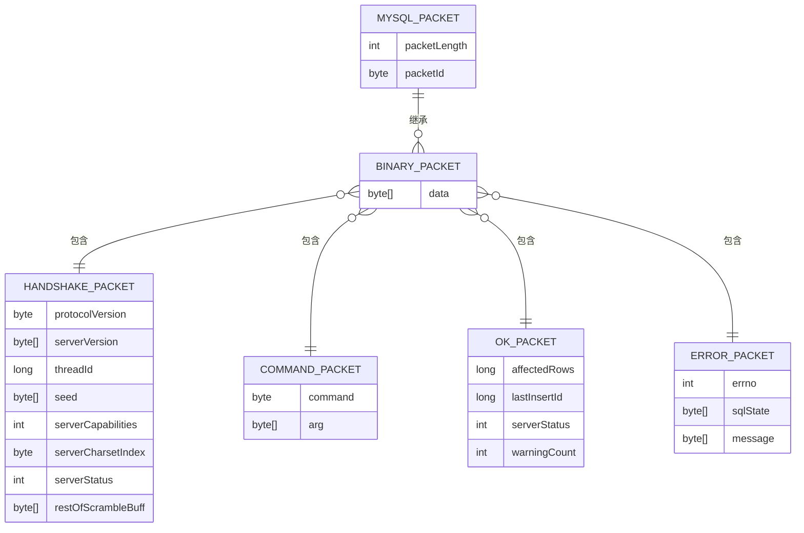
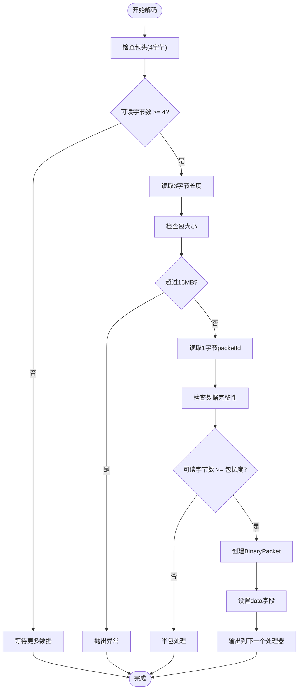
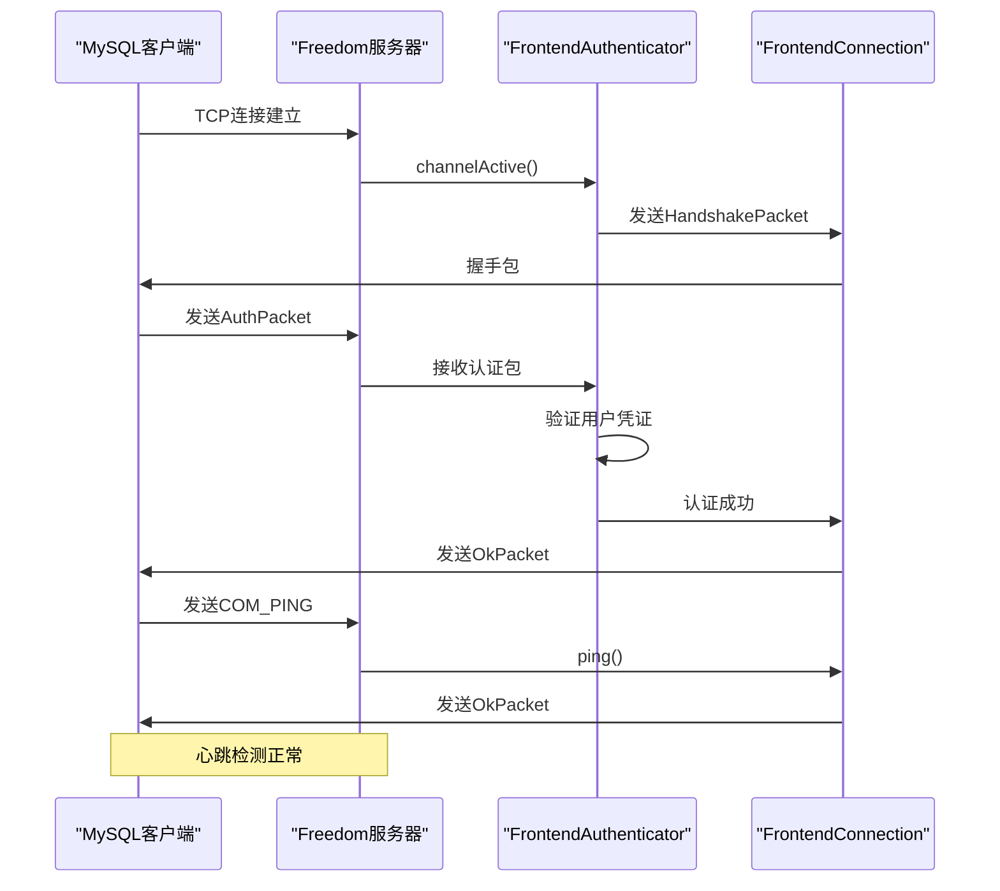
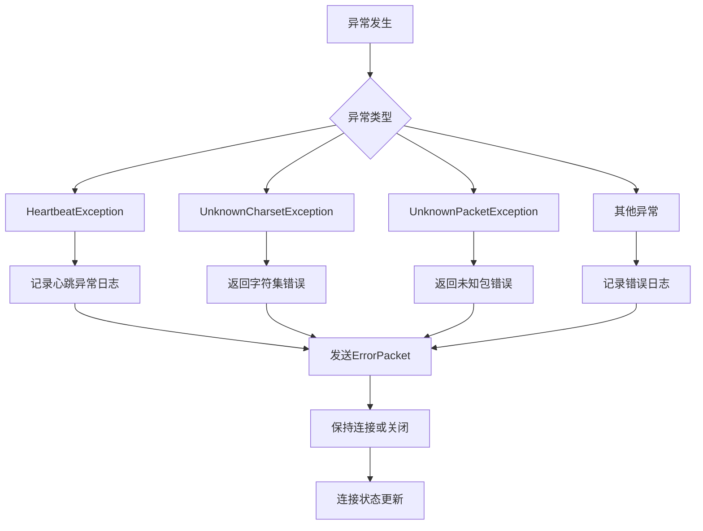
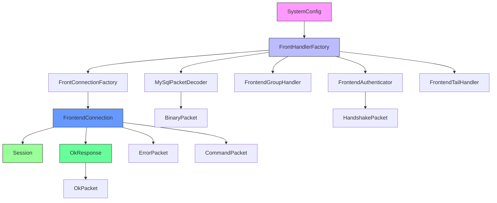

# 网络层

<cite>
**本文档中引用的文件**  
- [FrontendConnection.java](file://src/main/java/alchemystar/freedom/engine/net/handler/frontend/FrontendConnection.java)
- [FrontHandlerFactory.java](file://src/main/java/alchemystar/freedom/engine/net/handler/factory/FrontHandlerFactory.java)
- [MySqlPacketDecoder.java](file://src/main/java/alchemystar/freedom/engine/net/codec/MySqlPacketDecoder.java)
- [HandshakePacket.java](file://src/main/java/alchemystar/freedom/engine/net/proto/mysql/HandshakePacket.java)
- [CommandPacket.java](file://src/main/java/alchemystar/freedom/engine/net/proto/mysql/CommandPacket.java)
- [OkPacket.java](file://src/main/java/alchemystar/freedom/engine/net/proto/mysql/OkPacket.java)
- [ErrorPacket.java](file://src/main/java/alchemystar/freedom/engine/net/proto/mysql/ErrorPacket.java)
- [BinaryPacket.java](file://src/main/java/alchemystar/freedom/engine/net/proto/mysql/BinaryPacket.java)
- [MySQLPacket.java](file://src/main/java/alchemystar/freedom/engine/net/proto/MySQLPacket.java)
- [OkResponse.java](file://src/main/java/alchemystar/freedom/engine/net/response/OkResponse.java)
- [Session.java](file://src/main/java/alchemystar/freedom/engine/session/Session.java)
- [SystemConfig.java](file://src/main/java/alchemystar/freedom/config/SystemConfig.java)
</cite>

## 目录
1. [简介](#简介)
2. [项目结构](#项目结构)
3. [核心组件](#核心组件)
4. [架构概览](#架构概览)
5. [详细组件分析](#详细组件分析)
6. [依赖分析](#依赖分析)
7. [性能考虑](#性能考虑)
8. [故障排除指南](#故障排除指南)
9. [结论](#结论)

## 简介
Freedom数据库的网络层基于Netty框架构建，实现了与MySQL协议兼容的通信机制。该文档详细阐述了网络层的核心架构，重点分析了客户端连接管理、协议编解码、认证流程和响应处理机制。通过深入解析关键类和交互时序，为理解系统网络通信提供了全面的技术参考。

## 项目结构
Freedom数据库的网络层代码位于`src/main/java/alchemystar/freedom/engine/net`目录下，采用分层设计，各子模块职责明确：

- **codec**: 包含MySQL协议数据包的解码器
- **exception**: 网络层异常定义
- **handler**: 处理器实现，包括前端和后端处理器
- **proto**: MySQL协议数据包的具体实现
- **response**: 响应处理逻辑

这种模块化设计使得网络层具有良好的可维护性和扩展性。

**Diagram sources**
- [src/main/java/alchemystar/freedom/engine/net](file://src/main/java/alchemystar/freedom/engine/net)

**Section sources**
- [src/main/java/alchemystar/freedom/engine/net](file://src/main/java/alchemystar/freedom/engine/net)

## 核心组件
网络层的核心组件包括FrontendConnection、FrontHandlerFactory、MySqlPacketDecoder以及各类MySQL协议包实现。这些组件协同工作，实现了完整的MySQL协议通信能力。

**Section sources**
- [FrontendConnection.java](file://src/main/java/alchemystar/freedom/engine/net/handler/frontend/FrontendConnection.java)
- [FrontHandlerFactory.java](file://src/main/java/alchemystar/freedom/engine/net/handler/factory/FrontHandlerFactory.java)
- [MySqlPacketDecoder.java](file://src/main/java/alchemystar/freedom/engine/net/codec/MySqlPacketDecoder.java)

## 架构概览
Freedom数据库网络层采用Netty作为底层通信框架，通过责任链模式组织处理器，实现了高性能、可扩展的MySQL协议兼容服务。

**Diagram sources**
- [FrontHandlerFactory.java](file://src/main/java/alchemystar/freedom/engine/net/handler/factory/FrontHandlerFactory.java)
- [MySqlPacketDecoder.java](file://src/main/java/alchemystar/freedom/engine/net/codec/MySqlPacketDecoder.java)
- [FrontendConnection.java](file://src/main/java/alchemystar/freedom/engine/net/handler/frontend/FrontendConnection.java)

## 详细组件分析

### FrontendConnection连接管理
FrontendConnection类负责管理客户端连接的整个生命周期，包括连接状态维护、会话绑定和基本操作处理。

**Diagram sources**
- [FrontendConnection.java](file://src/main/java/alchemystar/freedom/engine/net/handler/frontend/FrontendConnection.java)
- [Session.java](file://src/main/java/alchemystar/freedom/engine/session/Session.java)

**Section sources**
- [FrontendConnection.java](file://src/main/java/alchemystar/freedom/engine/net/handler/frontend/FrontendConnection.java)

### FrontHandlerFactory责任链模式
FrontHandlerFactory使用责任链模式组织ChannelHandler，确保请求按预定顺序处理。

**Diagram sources**
- [FrontHandlerFactory.java](file://src/main/java/alchemystar/freedom/engine/net/handler/factory/FrontHandlerFactory.java)

**Section sources**
- [FrontHandlerFactory.java](file://src/main/java/alchemystar/freedom/engine/net/handler/factory/FrontHandlerFactory.java)

### MySQL协议包编解码
网络层实现了完整的MySQL协议包编解码机制，包括握手包、命令包和响应包。

#### 协议包结构

**Diagram sources**
- [MySQLPacket.java](file://src/main/java/alchemystar/freedom/engine/net/proto/MySQLPacket.java)
- [BinaryPacket.java](file://src/main/java/alchemystar/freedom/engine/net/proto/mysql/BinaryPacket.java)
- [HandshakePacket.java](file://src/main/java/alchemystar/freedom/engine/net/proto/mysql/HandshakePacket.java)
- [CommandPacket.java](file://src/main/java/alchemystar/freedom/engine/net/proto/mysql/CommandPacket.java)
- [OkPacket.java](file://src/main/java/alchemystar/freedom/engine/net/proto/mysql/OkPacket.java)
- [ErrorPacket.java](file://src/main/java/alchemystar/freedom/engine/net/proto/mysql/ErrorPacket.java)

#### 数据包解码流程

**Diagram sources**
- [MySqlPacketDecoder.java](file://src/main/java/alchemystar/freedom/engine/net/codec/MySqlPacketDecoder.java)

**Section sources**
- [MySqlPacketDecoder.java](file://src/main/java/alchemystar/freedom/engine/net/codec/MySqlPacketDecoder.java)

### 连接认证与心跳检测
网络层实现了完整的连接认证流程和心跳检测机制。

**Diagram sources**
- [FrontendAuthenticator.java](file://src/main/java/alchemystar/freedom/engine/net/handler/frontend/FrontendAuthenticator.java)
- [FrontendConnection.java](file://src/main/java/alchemystar/freedom/engine/net/handler/frontend/FrontendConnection.java)
- [HandshakePacket.java](file://src/main/java/alchemystar/freedom/engine/net/proto/mysql/HandshakePacket.java)

### 异常处理机制
网络层提供了完善的异常处理机制，确保系统稳定运行。

**Section sources**
- [FrontendConnection.java](file://src/main/java/alchemystar/freedom/engine/net/handler/frontend/FrontendConnection.java)
- [FrontendAuthenticator.java](file://src/main/java/alchemystar/freedom/engine/net/handler/frontend/FrontendAuthenticator.java)

## 依赖分析
网络层组件之间存在明确的依赖关系，形成了清晰的调用链。

**Diagram sources**
- [FrontHandlerFactory.java](file://src/main/java/alchemystar/freedom/engine/net/handler/factory/FrontHandlerFactory.java)
- [FrontendConnection.java](file://src/main/java/alchemystar/freedom/engine/net/handler/frontend/FrontendConnection.java)
- [SystemConfig.java](file://src/main/java/alchemystar/freedom/config/SystemConfig.java)

**Section sources**
- [FrontHandlerFactory.java](file://src/main/java/alchemystar/freedom/engine/net/handler/factory/FrontHandlerFactory.java)
- [FrontendConnection.java](file://src/main/java/alchemystar/freedom/engine/net/handler/frontend/FrontendConnection.java)

## 性能考虑
网络层在设计时充分考虑了性能因素，采用了多项优化策略。

- **连接池配置**: 通过SystemConfig配置连接池参数，优化资源利用
- **零拷贝**: 使用Netty的ByteBuf实现零拷贝数据传输
- **对象池**: 复用协议包对象，减少GC压力
- **异步处理**: 基于Netty的事件驱动模型实现异步非阻塞I/O
- **批量写入**: 合并小包写入，减少系统调用次数

这些优化策略共同确保了网络层的高性能和低延迟。

## 故障排除指南
### 常见问题及解决方案

| 问题现象 | 可能原因 | 解决方案 |
|---------|---------|---------|
| 客户端无法连接 | 服务未启动或端口被占用 | 检查服务状态和端口占用情况 |
| 认证失败 | 用户名或密码错误 | 验证凭证正确性 |
| 连接超时 | 网络延迟或防火墙限制 | 检查网络配置和防火墙规则 |
| 字符集错误 | 客户端与服务器字符集不匹配 | 统一字符集设置 |
| 心跳检测失败 | 连接空闲超时 | 调整IDLE_CHECK_INTERVAL参数 |

**Section sources**
- [FrontendConnection.java](file://src/main/java/alchemystar/freedom/engine/net/handler/frontend/FrontendConnection.java)
- [SystemConfig.java](file://src/main/java/alchemystar/freedom/config/SystemConfig.java)

## 结论
Freedom数据库的网络层通过基于Netty的架构设计，成功实现了高性能、高可靠的MySQL协议兼容通信。系统采用责任链模式组织处理器，确保了请求处理的有序性和可扩展性。通过详细的协议包实现和完善的异常处理机制，保证了与MySQL客户端的兼容性和系统的稳定性。未来可进一步优化连接池管理和协议解析性能，提升系统整体吞吐量。