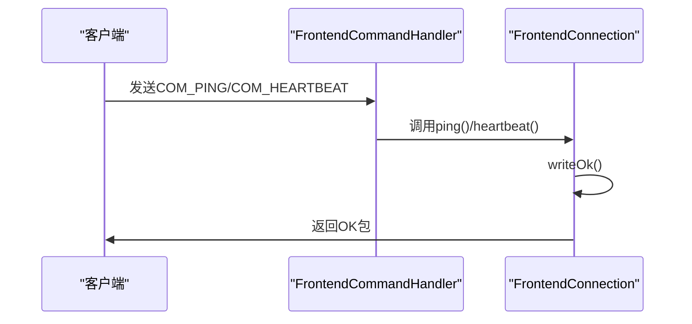
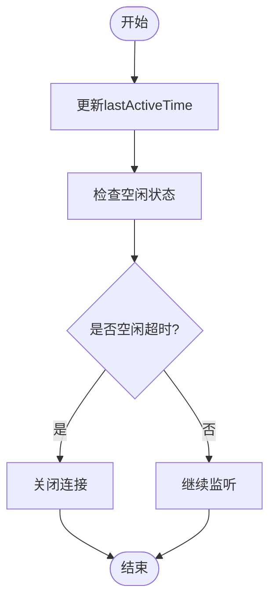
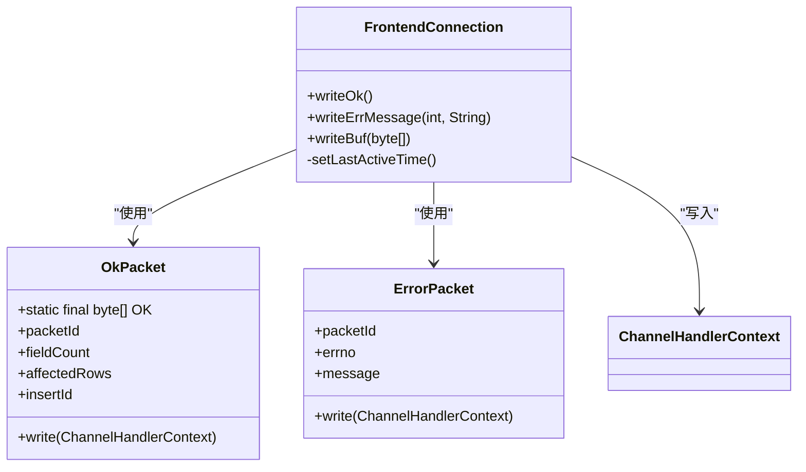
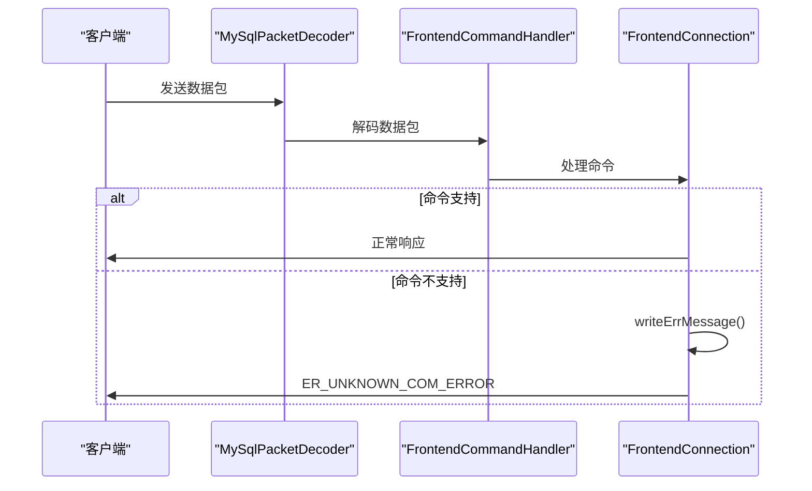

# 心跳检测与异常处理

<cite>
**本文档引用文件**   
- [FrontendConnection.java](file://src/main/java/alchemystar/freedom/engine/net/handler/frontend/FrontendConnection.java)
- [FrontendCommandHandler.java](file://src/main/java/alchemystar/freedom/engine/net/handler/frontend/FrontendCommandHandler.java)
- [MySqlPacketDecoder.java](file://src/main/java/alchemystar/freedom/engine/net/codec/MySqlPacketDecoder.java)
- [OkPacket.java](file://src/main/java/alchemystar/freedom/engine/net/proto/mysql/OkPacket.java)
- [ErrorPacket.java](file://src/main/java/alchemystar/freedom/engine/net/proto/mysql/ErrorPacket.java)
- [ErrorCode.java](file://src/main/java/alchemystar/freedom/engine/net/proto/util/ErrorCode.java)
- [UnknownPacketException.java](file://src/main/java/alchemystar/freedom/engine/net/exception/UnknownPacketException.java)
- [OkResponse.java](file://src/main/java/alchemystar/freedom/engine/net/response/OkResponse.java)
- [ErrResponse.java](file://src/main/java/alchemystar/freedom/engine/net/response/ErrResponse.java)
- [SystemConfig.java](file://src/main/java/alchemystar/freedom/config/SystemConfig.java)
</cite>

## 目录
1. [心跳检测机制](#心跳检测机制)
2. [lastActiveTime字段与连接超时判断](#lastactivetime字段与连接超时判断)
3. [响应方法实现原理](#响应方法实现原理)
4. [异常处理机制](#异常处理机制)
5. [连接稳定性优化建议](#连接稳定性优化建议)

## 心跳检测机制

心跳检测机制通过`FrontendConnection`类中的`ping()`和`heartbeat()`方法实现，用于维持客户端与服务器之间的长连接。当客户端发送COM_PING或COM_HEARTBEAT命令时，Netty框架通过`FrontendCommandHandler`的`channelRead()`方法接收并处理这些命令。

**Diagram sources**
- [FrontendCommandHandler.java](file://src/main/java/alchemystar/freedom/engine/net/handler/frontend/FrontendCommandHandler.java#L50-L60)
- [FrontendConnection.java](file://src/main/java/alchemystar/freedom/engine/net/handler/frontend/FrontendConnection.java#L100-L110)

**Section sources**
- [FrontendConnection.java](file://src/main/java/alchemystar/freedom/engine/net/handler/frontend/FrontendConnection.java#L100-L110)
- [FrontendCommandHandler.java](file://src/main/java/alchemystar/freedom/engine/net/handler/frontend/FrontendCommandHandler.java#L50-L60)

## lastActiveTime字段与连接超时判断

`lastActiveTime`字段记录了连接最后一次活跃的时间戳，其更新时机和连接空闲超时判断逻辑如下：

1. 每次接收到客户端请求时，`FrontendCommandHandler`的`channelRead()`方法会调用`setLastActiveTime()`更新时间戳
2. Netty的IdleStateHandler定期触发IdleStateEvent事件
3. 当空闲时间超过`SystemConfig.IDLE_TIME_OUT`（36小时）时，连接将被关闭

**Diagram sources**
- [FrontendConnection.java](file://src/main/java/alchemystar/freedom/engine/net/handler/frontend/FrontendConnection.java#L300-L310)
- [FrontendCommandHandler.java](file://src/main/java/alchemystar/freedom/engine/net/handler/frontend/FrontendCommandHandler.java#L80-L90)
- [SystemConfig.java](file://src/main/java/alchemystar/freedom/config/SystemConfig.java#L30-L35)

**Section sources**
- [FrontendConnection.java](file://src/main/java/alchemystar/freedom/engine/net/handler/frontend/FrontendConnection.java#L300-L310)
- [FrontendCommandHandler.java](file://src/main/java/alchemystar/freedom/engine/net/handler/frontend/FrontendCommandHandler.java#L80-L90)

## 响应方法实现原理

`writeOk`和`writeErrMessage`等响应方法负责封装MySQL协议包并写入Netty通道，其工作原理如下：

### OK响应实现
`writeOk()`方法创建一个预定义的OK数据包并直接写入通道，该数据包包含标准的MySQL OK包头信息。

### 错误响应实现
`writeErrMessage()`方法创建ErrorPacket对象，设置错误码、错误消息等属性，并通过Netty通道发送。

**Diagram sources**
- [FrontendConnection.java](file://src/main/java/alchemystar/freedom/engine/net/handler/frontend/FrontendConnection.java#L115-L140)
- [OkPacket.java](file://src/main/java/alchemystar/freedom/engine/net/proto/mysql/OkPacket.java#L10-L20)
- [ErrorPacket.java](file://src/main/java/alchemystar/freedom/engine/net/proto/mysql/ErrorPacket.java)

**Section sources**
- [FrontendConnection.java](file://src/main/java/alchemystar/freedom/engine/net/handler/frontend/FrontendConnection.java#L115-L140)
- [OkPacket.java](file://src/main/java/alchemystar/freedom/engine/net/proto/mysql/OkPacket.java#L10-L20)

## 异常处理机制

### UnknownPacketException异常处理
当接收到未知或不支持的MySQL命令时，系统会抛出`UnknownPacketException`异常。该异常继承自RuntimeException，用于标识数据包解析过程中的错误。

**Diagram sources**
- [UnknownPacketException.java](file://src/main/java/alchemystar/freedom/engine/net/exception/UnknownPacketException.java)
- [FrontendCommandHandler.java](file://src/main/java/alchemystar/freedom/engine/net/handler/frontend/FrontendCommandHandler.java#L70-L75)
- [ErrorCode.java](file://src/main/java/alchemystar/freedom/engine/net/proto/util/ErrorCode.java#L1047)

**Section sources**
- [UnknownPacketException.java](file://src/main/java/alchemystar/freedom/engine/net/exception/UnknownPacketException.java)
- [FrontendCommandHandler.java](file://src/main/java/alchemystar/freedom/engine/net/handler/frontend/FrontendCommandHandler.java#L70-L75)

### 错误信息构造规则
当异常发生时，系统使用`ErrorCode`接口中定义的错误码构造错误信息：
- `ErrorCode.ER_UNKNOWN_COM_ERROR`(1047)：未知命令错误
- `ErrorCode.ER_NOT_ALLOWED_COMMAND`：不允许的命令
- `ErrorCode.ER_UNKNOWN_CHARACTER_SET`：未知字符集

错误信息通过`writeErrMessage()`方法封装成MySQL ErrorPacket格式返回给客户端。

## 连接稳定性优化建议

1. **合理设置空闲超时时间**：根据实际业务需求调整`SystemConfig.IDLE_TIME_OUT`参数
2. **定期心跳检测**：客户端应定期发送PING命令保持连接活跃
3. **异常监控**：监控`UnknownPacketException`等异常，及时发现协议兼容性问题
4. **连接池管理**：实现连接池机制，避免频繁创建和销毁连接
5. **错误重试机制**：对网络异常实现适当的重试策略

**Section sources**
- [SystemConfig.java](file://src/main/java/alchemystar/freedom/config/SystemConfig.java#L30-L35)
- [FrontendConnection.java](file://src/main/java/alchemystar/freedom/engine/net/handler/frontend/FrontendConnection.java)
- [FrontendCommandHandler.java](file://src/main/java/alchemystar/freedom/engine/net/handler/frontend/FrontendCommandHandler.java)