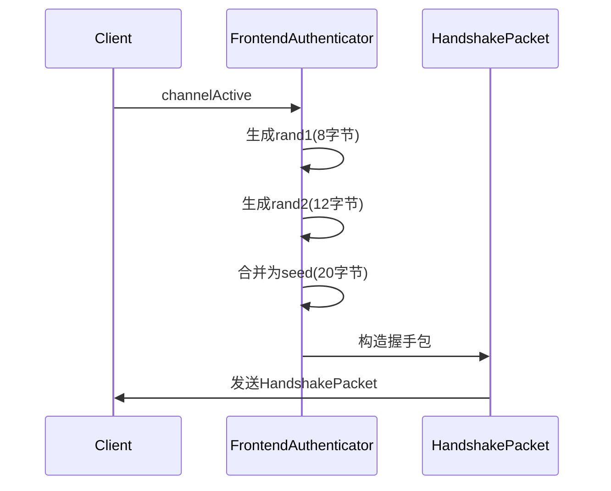
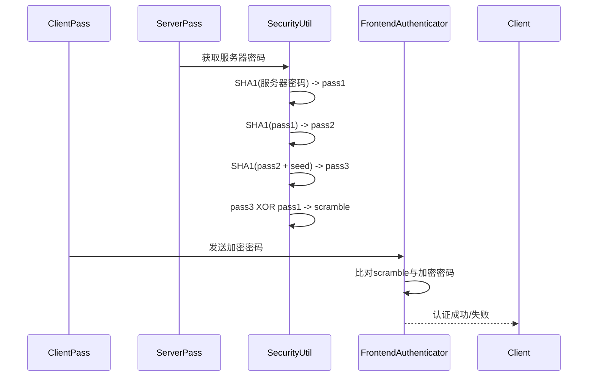
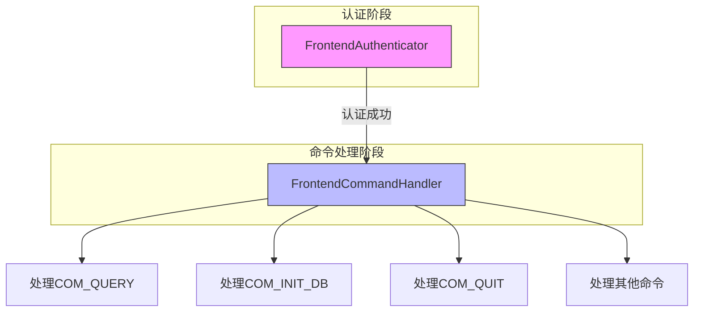
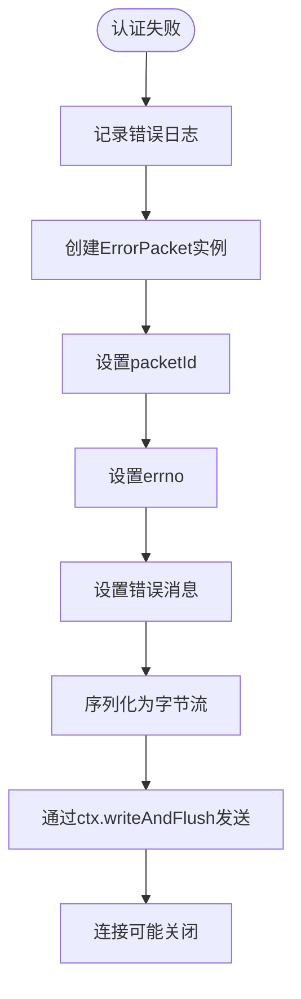

# 认证流程实现

<cite>
**本文档中引用的文件**  
- [FrontendAuthenticator.java](file://src/main/java/alchemystar/freedom/engine/net/handler/frontend/FrontendAuthenticator.java)
- [HandshakePacket.java](file://src/main/java/alchemystar/freedom/engine/net/proto/mysql/HandshakePacket.java)
- [AuthPacket.java](file://src/main/java/alchemystar/freedom/engine/net/proto/mysql/AuthPacket.java)
- [SecurityUtil.java](file://src/main/java/alchemystar/freedom/engine/net/proto/util/SecurityUtil.java)
- [ErrorPacket.java](file://src/main/java/alchemystar/freedom/engine/net/proto/mysql/ErrorPacket.java)
- [FrontendCommandHandler.java](file://src/main/java/alchemystar/freedom/engine/net/handler/frontend/FrontendCommandHandler.java)
- [FrontendConnection.java](file://src/main/java/alchemystar/freedom/engine/net/handler/frontend/FrontendConnection.java)
- [MySqlPacketDecoder.java](file://src/main/java/alchemystar/freedom/engine/net/codec/MySqlPacketDecoder.java)
- [Database.java](file://src/main/java/alchemystar/freedom/engine/Database.java)
</cite>

## 目录
1. [挑战-响应认证机制概述](#挑战-响应认证机制概述)  
2. [握手包生成与随机种子发送](#握手包生成与随机种子发送)  
3. [认证包解析与客户端信息提取](#认证包解析与客户端信息提取)  
4. [密码验证机制分析](#密码验证机制分析)  
5. [认证成功后的处理器替换](#认证成功后的处理器替换)  
6. [认证失败处理流程](#认证失败处理流程)  
7. [数据包结构与协议解析](#数据包结构与协议解析)  

## 挑战-响应认证机制概述

该系统实现了基于挑战-响应（Challenge-Response）机制的MySQL兼容认证流程。该机制通过非对称加密方式避免在网络中明文传输密码，提升安全性。整个流程分为四个阶段：服务器发送握手包（包含随机种子）、客户端返回认证包（包含加密密码）、服务器验证密码、认证结果处理。该机制符合MySQL 4.1+协议规范，使用SHA1哈希算法进行密码比对。

**Section sources**  
- [FrontendAuthenticator.java](file://src/main/java/alchemystar/freedom/engine/net/handler/frontend/FrontendAuthenticator.java#L1-L20)

## 握手包生成与随机种子发送

在`FrontendAuthenticator`的`channelActive`事件中，系统生成并发送`HandshakePacket`。该过程首先生成两个随机字节数组：`rand1`（8字节）和`rand2`（12字节），合并为20字节的随机种子（seed）。此种子用于后续客户端密码加密。`HandshakePacket`包含协议版本、服务器版本、线程ID、服务器能力标志、字符集索引、服务器状态及剩余混淆缓冲区（restOfScrambleBuff）等字段。该包通过Netty的`ChannelHandlerContext`写入并刷新到客户端，启动认证流程。



**Diagram sources**  
- [FrontendAuthenticator.java](file://src/main/java/alchemystar/freedom/engine/net/handler/frontend/FrontendAuthenticator.java#L45-L75)
- [HandshakePacket.java](file://src/main/java/alchemystar/freedom/engine/net/proto/mysql/HandshakePacket.java#L1-L30)

**Section sources**  
- [FrontendAuthenticator.java](file://src/main/java/alchemystar/freedom/engine/net/handler/frontend/FrontendAuthenticator.java#L45-L80)
- [HandshakePacket.java](file://src/main/java/alchemystar/freedom/engine/net/proto/mysql/HandshakePacket.java#L1-L40)

## 认证包解析与客户端信息提取

客户端接收到`HandshakePacket`后，使用其携带的随机种子对密码进行加密，并构造`AuthPacket`发送回服务器。`FrontendAuthenticator`通过`channelRead`方法接收并解析该包。`AuthPacket.read()`方法从`BinaryPacket`中提取客户端标志位（clientFlags）、最大包大小（maxPacketSize）、字符集索引（charsetIndex）、用户名称（user）和加密密码（password）。若客户端标志位包含`CLIENT_CONNECT_WITH_DB`，则进一步提取数据库名称（database）。解析过程依赖`MySQLMessage`类提供的字节读取方法，如`readUB4()`、`readStringWithNull()`等。

```mermaid
flowchart TD
Start([开始解析AuthPacket]) --> ReadClientFlags["读取clientFlags (UB4)"]
ReadClientFlags --> ReadMaxPacketSize["读取maxPacketSize (UB4)"]
ReadMaxPacketSize --> ReadCharsetIndex["读取charsetIndex (byte)"]
ReadCharsetIndex --> SkipFiller["跳过23字节填充区"]
SkipFiller --> ReadUser["读取用户名 (以null结尾)"]
ReadUser --> ReadPassword["读取密码 (带长度前缀)"]
ReadPassword --> CheckConnectWithDB{"CLIENT_CONNECT_WITH_DB标志位?"}
CheckConnectWithDB --> |是| ReadDatabase["读取数据库名"]
CheckConnectWithDB --> |否| EndParse["解析完成"]
ReadDatabase --> EndParse
EndParse --> [返回解析结果]
```

**Diagram sources**  
- [AuthPacket.java](file://src/main/java/alchemystar/freedom/engine/net/proto/mysql/AuthPacket.java#L30-L60)

**Section sources**  
- [FrontendAuthenticator.java](file://src/main/java/alchemystar/freedom/engine/net/handler/frontend/FrontendAuthenticator.java#L85-L90)
- [AuthPacket.java](file://src/main/java/alchemystar/freedom/engine/net/proto/mysql/AuthPacket.java#L30-L70)

## 密码验证机制分析

密码验证在`FrontendAuthenticator.checkPassword`方法中实现。系统首先从`Database`单例中获取预设的用户名和密码。若用户名不匹配或密码为空但客户端提供了密码，则验证失败。核心验证逻辑使用`SecurityUtil.scramble411()`方法，该方法实现MySQL 4.1+的SHA1双哈希挑战-响应算法：  
1. 对服务器存储的明文密码进行SHA1哈希，得到`pass1`  
2. 对`pass1`再次进行SHA1哈希，得到`pass2`  
3. 将`pass2`与握手包中的随机种子（seed）拼接后进行SHA1哈希，得到`pass3`  
4. 将`pass3`的每个字节与`pass1`对应字节进行异或（XOR）运算  
5. 将运算结果与客户端发送的加密密码进行逐字节比对  

只有完全匹配才返回`true`，否则认证失败。



**Diagram sources**  
- [FrontendAuthenticator.java](file://src/main/java/alchemystar/freedom/engine/net/handler/frontend/FrontendAuthenticator.java#L110-L150)
- [SecurityUtil.java](file://src/main/java/alchemystar/freedom/engine/net/proto/util/SecurityUtil.java#L10-L30)

**Section sources**  
- [FrontendAuthenticator.java](file://src/main/java/alchemystar/freedom/engine/net/handler/frontend/FrontendAuthenticator.java#L100-L160)
- [SecurityUtil.java](file://src/main/java/alchemystar/freedom/engine/net/proto/util/SecurityUtil.java#L10-L40)

## 认证成功后的处理器替换

认证成功后，调用`success(ChannelHandlerContext ctx)`方法。该方法的核心是通过Netty的`ChannelPipeline`机制，将当前处理器`FrontendAuthenticator`替换为`FrontendCommandHandler`。调用`ctx.pipeline().replace(this, "frontCommandHandler", new FrontendCommandHandler(source))`完成替换。替换后，所有后续的客户端请求（如COM_QUERY、COM_INIT_DB等）将由`FrontendCommandHandler`处理，进入SQL解析与执行阶段。同时，服务器向客户端发送`OkPacket.AUTH_OK`字节流，表示认证通过，连接进入命令处理模式。



**Diagram sources**  
- [FrontendAuthenticator.java](file://src/main/java/alchemystar/freedom/engine/net/handler/frontend/FrontendAuthenticator.java#L162-L170)
- [FrontendCommandHandler.java](file://src/main/java/alchemystar/freedom/engine/net/handler/frontend/FrontendCommandHandler.java#L1-L15)

**Section sources**  
- [FrontendAuthenticator.java](file://src/main/java/alchemystar/freedom/engine/net/handler/frontend/FrontendAuthenticator.java#L162-L173)
- [FrontendCommandHandler.java](file://src/main/java/alchemystar/freedom/engine/net/handler/frontend/FrontendCommandHandler.java#L1-L20)

## 认证失败处理流程

当`checkPassword`验证失败时，调用`failure(int errno, String info)`方法。该方法首先记录错误日志，然后通过`FrontendConnection.writeErrMessage()`发送错误包。`writeErrMessage`方法构造一个`ErrorPacket`实例，设置其错误号（errno）、错误消息（message）和包ID。`ErrorPacket.write()`方法将错误信息序列化为MySQL协议格式的字节流，并通过`ChannelHandlerContext`发送给客户端。客户端收到后会显示相应的错误信息，如"Access denied for user"。



**Diagram sources**  
- [FrontendAuthenticator.java](file://src/main/java/alchemystar/freedom/engine/net/handler/frontend/FrontendAuthenticator.java#L175-L180)
- [ErrorPacket.java](file://src/main/java/alchemystar/freedom/engine/net/proto/mysql/ErrorPacket.java#L1-L30)
- [FrontendConnection.java](file://src/main/java/alchemystar/freedom/engine/net/handler/frontend/FrontendConnection.java#L250-L270)

**Section sources**  
- [FrontendAuthenticator.java](file://src/main/java/alchemystar/freedom/engine/net/handler/frontend/FrontendAuthenticator.java#L175-L180)
- [FrontendConnection.java](file://src/main/java/alchemystar/freedom/engine/net/handler/frontend/FrontendConnection.java#L250-L270)

## 数据包结构与协议解析

系统通过Netty的`ByteToMessageDecoder`实现MySQL协议解析。`MySqlPacketDecoder`负责解析包头（3字节长度 + 1字节包ID），并根据长度读取完整数据体。解析后的数据封装为`BinaryPacket`对象，传递给上层处理器。`MySQLMessage`类提供对`BinaryPacket.data`的便捷访问方法，如`readUB4()`读取无符号4字节整数，`readStringWithNull()`读取以null结尾的字符串。`BufferUtil`类则提供写入工具，确保数据按网络字节序正确编码。整个解析流程确保了与MySQL客户端的兼容性。

**Section sources**  
- [MySqlPacketDecoder.java](file://src/main/java/alchemystar/freedom/engine/net/codec/MySqlPacketDecoder.java#L1-L60)
- [BinaryPacket.java](file://src/main/java/alchemystar/freedom/engine/net/proto/mysql/BinaryPacket.java)
- [MySQLMessage.java](file://src/main/java/alchemystar/freedom/engine/net/proto/mysql/MySQLMessage.java)
- [BufferUtil.java](file://src/main/java/alchemystar/freedom/engine/net/proto/util/BufferUtil.java)