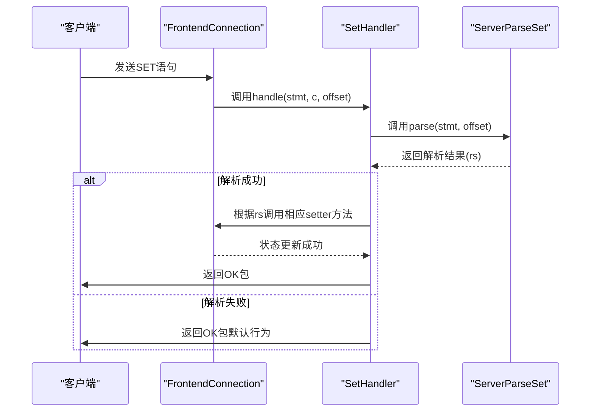
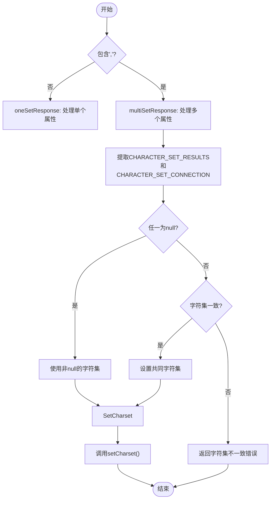
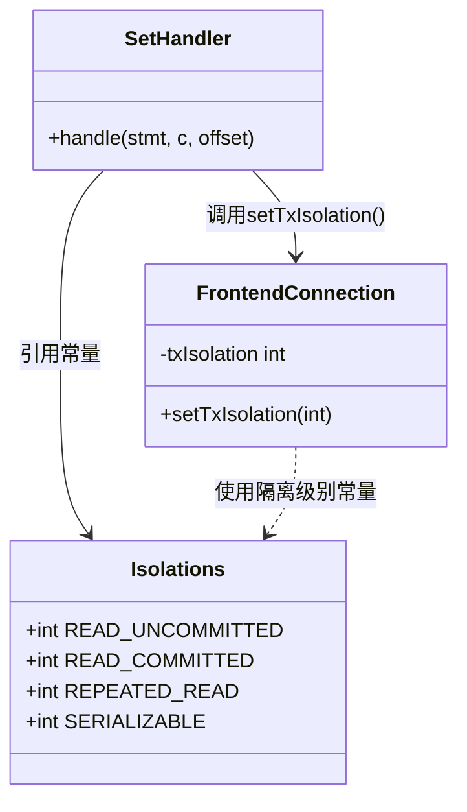

# 连接状态与配置维护

<cite>
**本文档中引用的文件**  
- [FrontendConnection.java](file://src/main/java/alchemystar/freedom/engine/net/handler/frontend/FrontendConnection.java)
- [SetHandler.java](file://src/main/java/alchemystar/freedom/engine/net/handler/frontend/SetHandler.java)
- [ServerParseSet.java](file://src/main/java/alchemystar/freedom/engine/parser/ServerParseSet.java)
- [CharsetUtil.java](file://src/main/java/alchemystar/freedom/engine/net/proto/util/CharsetUtil.java)
- [Isolations.java](file://src/main/java/alchemystar/freedom/engine/net/proto/util/Isolations.java)
- [CharacterSet.java](file://src/main/java/alchemystar/freedom/engine/net/response/CharacterSet.java)
- [Session.java](file://src/main/java/alchemystar/freedom/engine/session/Session.java)
</cite>

## 目录
1. [引言](#引言)
2. [连接状态字段详解](#连接状态字段详解)
3. [SET语句的解析与状态更新机制](#set语句的解析与状态更新机制)
4. [字符集处理策略](#字符集处理策略)
5. [事务隔离级别的设置与影响](#事务隔离级别的设置与影响)
6. [状态同步与一致性维护最佳实践](#状态同步与一致性维护最佳实践)
7. [结论](#结论)

## 引言
本文件系统化地说明了数据库前端连接（FrontendConnection）中维护的核心连接状态字段，包括host、port、schema、charset、txIsolation、autocommit等。详细阐述了这些状态如何在客户端执行USE DATABASE、SET AUTOCOMMIT、SET CHARACTER SET等命令时被更新。结合SetHandler和ServerParseSet的代码逻辑，深入分析了SET语句的解析流程与状态变更机制。同时，描述了字符集不一致时的处理策略以及事务隔离级别的设置方式及其对后端会话的影响，最后提供了状态同步与一致性维护的最佳实践建议。

## 连接状态字段详解

`FrontendConnection`类是前端连接的核心数据结构，负责维护与客户端连接相关的所有运行时状态。其关键状态字段如下：

- **host**：客户端IP地址，通过`setHost()`方法设置。
- **port**：客户端端口号，通过`setPort()`方法设置。
- **schema**：当前使用的数据库名，通过`initDB()`方法在执行`USE DATABASE`时更新。
- **charset** 和 **charsetIndex**：当前连接的字符集及其索引，通过`setCharset()`或`setCharsetIndex()`方法更新。
- **txIsolation**：当前事务隔离级别，通过`setTxIsolation()`方法设置。
- **autocommit**：自动提交模式开关，通过`setAutocommit()`方法控制。

这些字段在连接生命周期内动态变化，直接影响SQL语句的解析、执行和结果返回。

**Section sources**
- [FrontendConnection.java](file://src/main/java/alchemystar/freedom/engine/net/handler/frontend/FrontendConnection.java#L1-L320)

## SET语句的解析与状态更新机制

SET语句的处理流程涉及`ServerParseSet`、`SetHandler`和`FrontendConnection`三个核心组件的协作。

**Diagram sources**
- [SetHandler.java](file://src/main/java/alchemystar/freedom/engine/net/handler/frontend/SetHandler.java#L1-L82)
- [ServerParseSet.java](file://src/main/java/alchemystar/freedom/engine/parser/ServerParseSet.java#L1-L701)

### 解析流程
`ServerParseSet.parse()`方法通过逐字符匹配的方式识别SET语句的子类型。例如，识别`SET AUTOCOMMIT=1`时，先匹配"SET A"，再深入匹配"AUTOCOMMIT"，最后解析赋值部分（1或ON表示开启，0或OFF表示关闭）。

### 状态更新
`SetHandler.handle()`根据`ServerParseSet`返回的解析结果，调用`FrontendConnection`的相应setter方法更新状态。例如，当`rs`为`AUTOCOMMIT_ON`时，调用`c.setAutocommit(true)`。

**Section sources**
- [SetHandler.java](file://src/main/java/alchemystar/freedom/engine/net/handler/frontend/SetHandler.java#L1-L82)
- [ServerParseSet.java](file://src/main/java/alchemystar/freedom/engine/parser/ServerParseSet.java#L1-L701)

## 字符集处理策略

字符集的处理主要由`CharacterSet.response()`方法协调，支持单个和多个字符集属性的设置。

**Diagram sources**
- [CharacterSet.java](file://src/main/java/alchemystar/freedom/engine/net/response/CharacterSet.java#L1-L133)

### 冲突处理
当`CHARACTER_SET_CONNECTION`和`CHARACTER_SET_RESULTS`设置为不同值时，系统会检查两者是否一致。如果不一致，将返回`ER_UNKNOWN_CHARACTER_SET`错误，强制要求客户端保持字符集一致性，确保数据编码和解码过程的正确性。

**Section sources**
- [CharacterSet.java](file://src/main/java/alchemystar/freedom/engine/net/response/CharacterSet.java#L1-L133)

## 事务隔离级别的设置与影响

事务隔离级别的设置通过`SetHandler`和`Isolations`接口协同完成。

**Diagram sources**
- [Isolations.java](file://src/main/java/alchemystar/freedom/engine/net/proto/util/Isolations.java#L1-L15)
- [SetHandler.java](file://src/main/java/alchemystar/freedom/engine/net/handler/frontend/SetHandler.java#L1-L82)
- [FrontendConnection.java](file://src/main/java/alchemystar/freedom/engine/net/handler/frontend/FrontendConnection.java#L1-L320)

### 设置机制
当客户端执行`SET SESSION TRANSACTION ISOLATION LEVEL READ COMMITTED`时：
1. `ServerParseSet`解析出`TX_READ_COMMITTED`。
2. `SetHandler`调用`c.setTxIsolation(Isolations.READ_COMMITTED)`。
3. `FrontendConnection`更新`txIsolation`字段。

### 对后端会话的影响
虽然当前代码中`Session`类尚未直接使用`txIsolation`值，但该状态已通过`FrontendConnection`正确维护。未来可扩展`Session`或`TrxManager`，在事务开始时根据此值配置底层存储引擎的隔离级别，从而真正实现不同隔离级别的语义。

**Section sources**
- [Isolations.java](file://src/main/java/alchemystar/freedom/engine/net/proto/util/Isolations.java#L1-L15)
- [SetHandler.java](file://src/main/java/alchemystar/freedom/engine/net/handler/frontend/SetHandler.java#L1-L82)
- [FrontendConnection.java](file://src/main/java/alchemystar/freedom/engine/net/handler/frontend/FrontendConnection.java#L1-L320)

## 状态同步与一致性维护最佳实践

为了确保连接状态的准确性和一致性，应遵循以下最佳实践：

1. **原子性更新**：所有状态字段的更新都应在单个方法调用中完成，避免中间状态暴露。
2. **输入验证**：在`setCharset()`等方法中，必须验证输入的有效性（如通过`CharsetUtil.getIndex()`检查字符集是否存在）。
3. **及时响应**：状态更新成功后，应立即向客户端返回`OK`包，确保客户端能及时感知状态变更。
4. **错误处理**：对于无效的字符集或不一致的配置，应返回明确的错误码和信息，帮助客户端快速定位问题。
5. **会话绑定**：连接状态应与`Session`对象紧密绑定，在连接关闭时确保状态被正确清理。

**Section sources**
- [FrontendConnection.java](file://src/main/java/alchemystar/freedom/engine/net/handler/frontend/FrontendConnection.java#L1-L320)
- [CharsetUtil.java](file://src/main/java/alchemystar/freedom/engine/net/proto/util/CharsetUtil.java#L1-L131)

## 结论
`FrontendConnection`类有效地维护了客户端连接的核心状态。通过`SetHandler`和`ServerParseSet`的协作，系统能够精确解析并更新autocommit、txIsolation和charset等配置。字符集处理逻辑确保了连接与结果字符集的一致性，避免了数据乱码。事务隔离级别的设置机制为未来实现完整的事务语义奠定了基础。遵循状态同步的最佳实践，可以构建一个健壮、可靠的数据库连接层。