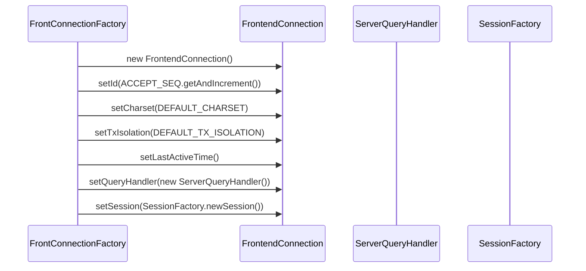
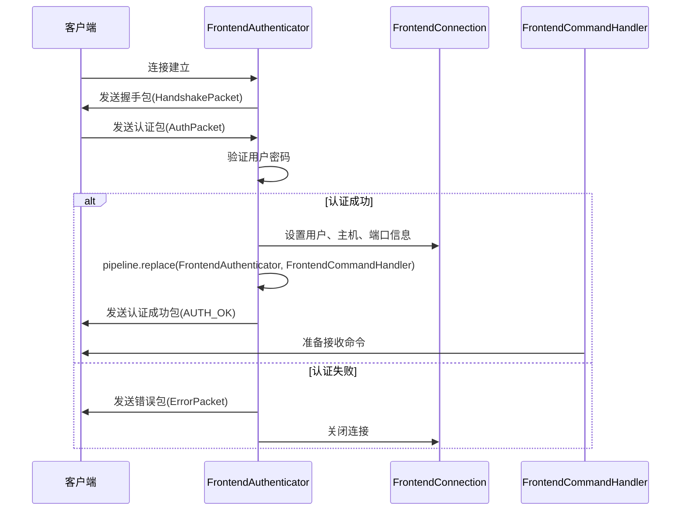
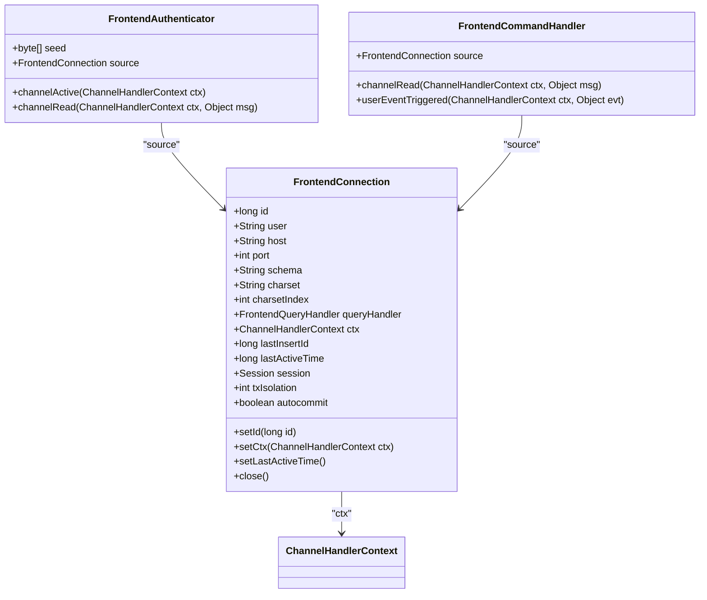
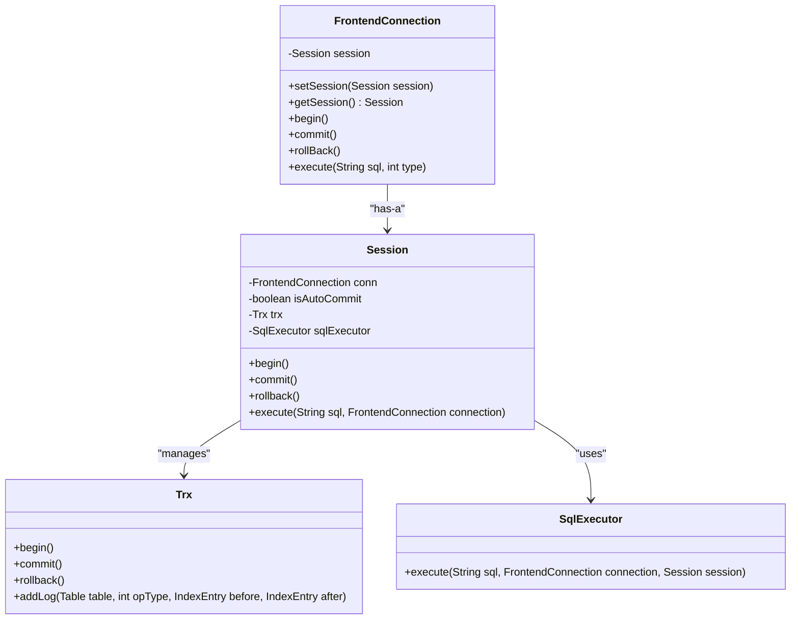
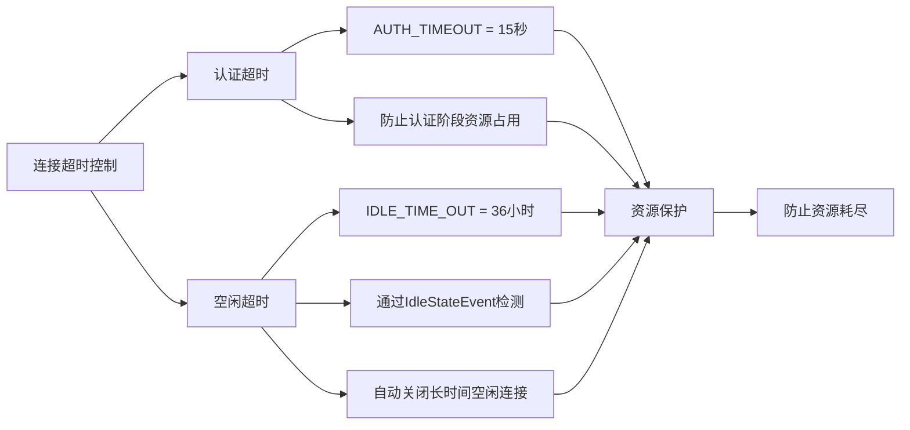

# 连接生命周期管理

<cite>
**本文档引用的文件**   
- [FrontendConnection.java](file://src/main/java/alchemystar/freedom/engine/net/handler/frontend/FrontendConnection.java)
- [FrontConnectionFactory.java](file://src/main/java/alchemystar/freedom/engine/net/handler/factory/FrontConnectionFactory.java)
- [FrontendAuthenticator.java](file://src/main/java/alchemystar/freedom/engine/net/handler/frontend/FrontendAuthenticator.java)
- [FrontendCommandHandler.java](file://src/main/java/alchemystar/freedom/engine/net/handler/frontend/FrontendCommandHandler.java)
- [SystemConfig.java](file://src/main/java/alchemystar/freedom/config/SystemConfig.java)
- [Session.java](file://src/main/java/alchemystar/freedom/engine/session/Session.java)
- [SocketConfig.java](file://src/main/java/alchemystar/freedom/config/SocketConfig.java)
</cite>

## 目录
1. [连接生命周期概述](#连接生命周期概述)
2. [连接创建与初始化](#连接创建与初始化)
3. [认证与状态转换](#认证与状态转换)
4. [连接ID与上下文管理](#连接id与上下文管理)
5. [会话关联机制](#会话关联机制)
6. [连接关闭与资源释放](#连接关闭与资源释放)
7. [连接超时控制策略](#连接超时控制策略)

## 连接生命周期概述

前端连接（FrontendConnection）是数据库系统与客户端之间的核心通信通道，负责管理客户端连接的完整生命周期。该生命周期包括连接创建、初始化、认证、命令处理和最终关闭等关键阶段。整个流程通过Netty框架的事件驱动机制实现，确保了高并发场景下的稳定性和性能。

**Section sources**
- [FrontendConnection.java](file://src/main/java/alchemystar/freedom/engine/net/handler/frontend/FrontendConnection.java#L25-L319)

## 连接创建与初始化

连接的创建由FrontConnectionFactory工厂类负责，通过getConnection()方法实例化FrontendConnection对象。工厂类采用原子计数器ACCEPT_SEQ为每个新连接生成唯一ID，确保连接标识的全局唯一性。在创建过程中，系统会初始化连接的基本属性，包括默认字符集、事务隔离级别和最后活跃时间戳。



**Diagram sources**
- [FrontConnectionFactory.java](file://src/main/java/alchemystar/freedom/engine/net/handler/factory/FrontConnectionFactory.java#L25-L38)
- [FrontendConnection.java](file://src/main/java/alchemystar/freedom/engine/net/handler/frontend/FrontendConnection.java#L25-L319)

**Section sources**
- [FrontConnectionFactory.java](file://src/main/java/alchemystar/freedom/engine/net/handler/factory/FrontConnectionFactory.java#L25-L38)
- [FrontendConnection.java](file://src/main/java/alchemystar/freedom/engine/net/handler/frontend/FrontendConnection.java#L25-L319)

## 认证与状态转换

连接认证由FrontendAuthenticator处理器负责，在channelActive事件触发时执行。处理器首先生成随机种子（seed）并发送握手包（HandshakePacket）给客户端。客户端返回认证包（AuthPacket）后，系统通过SecurityUtil.scramble411算法验证密码。认证成功后，连接状态从认证阶段转换到命令处理阶段，通过pipeline().replace()方法将FrontendAuthenticator替换为FrontendCommandHandler。



**Diagram sources**
- [FrontendAuthenticator.java](file://src/main/java/alchemystar/freedom/engine/net/handler/frontend/FrontendAuthenticator.java#L25-L173)
- [FrontendConnection.java](file://src/main/java/alchemystar/freedom/engine/net/handler/frontend/FrontendConnection.java#L25-L319)

**Section sources**
- [FrontendAuthenticator.java](file://src/main/java/alchemystar/freedom/engine/net/handler/frontend/FrontendAuthenticator.java#L25-L173)
- [FrontendConnection.java](file://src/main/java/alchemystar/freedom/engine/net/handler/frontend/FrontendConnection.java#L25-L319)

## 连接ID与上下文管理

每个FrontendConnection实例都拥有一个唯一的连接ID，由FrontConnectionFactory中的原子计数器ACCEPT_SEQ生成。连接ID在getConnection()方法中通过setId()设置，用于标识和追踪特定的客户端连接。ChannelHandlerContext的绑定发生在FrontendAuthenticator的channelActive事件处理过程中，通过setCtx()方法将Netty的上下文对象与连接实例关联，为后续的读写操作提供通道支持。



**Diagram sources**
- [FrontendConnection.java](file://src/main/java/alchemystar/freedom/engine/net/handler/frontend/FrontendConnection.java#L25-L319)
- [FrontendAuthenticator.java](file://src/main/java/alchemystar/freedom/engine/net/handler/frontend/FrontendAuthenticator.java#L25-L173)
- [FrontendCommandHandler.java](file://src/main/java/alchemystar/freedom/engine/net/handler/frontend/FrontendCommandHandler.java#L25-L89)

**Section sources**
- [FrontendConnection.java](file://src/main/java/alchemystar/freedom/engine/net/handler/frontend/FrontendConnection.java#L25-L319)
- [FrontendAuthenticator.java](file://src/main/java/alchemystar/freedom/engine/net/handler/frontend/FrontendAuthenticator.java#L25-L173)

## 会话关联机制

每个FrontendConnection在初始化数据库（initDB）或认证成功时都会关联一个独立的Session对象。Session通过SessionFactory.newSession()方法创建，并与连接实例双向绑定。Session负责管理事务状态（trx）、自动提交模式（isAutoCommit）以及SQL执行器（sqlExecutor）。当执行事务控制命令（如BEGIN、COMMIT、ROLLBACK）时，连接会委托给关联的Session进行处理。



**Diagram sources**
- [FrontendConnection.java](file://src/main/java/alchemystar/freedom/engine/net/handler/frontend/FrontendConnection.java#L25-L319)
- [Session.java](file://src/main/java/alchemystar/freedom/engine/session/Session.java#L25-L51)

**Section sources**
- [FrontendConnection.java](file://src/main/java/alchemystar/freedom/engine/net/handler/frontend/FrontendConnection.java#L25-L319)
- [Session.java](file://src/main/java/alchemystar/freedom/engine/session/Session.java#L25-L51)

## 连接关闭与资源释放

连接的关闭通过close()方法触发，该方法会记录关闭日志并调用Netty Channel的close()操作。资源释放过程是异步的，由Netty框架自动管理底层Socket资源。在关闭前，系统会通过setLastActiveTime()更新时间戳，确保连接状态的准确性。此外，FrontendCommandHandler中的IdleStateEvent监听器也会在检测到连接空闲超时时自动触发关闭操作。

```mermaid
flowchart TD
A[连接关闭触发] --> B{关闭来源}
B --> |显式调用| C[FrontendConnection.close()]
B --> |空闲超时| D[FrontendCommandHandler.userEventTriggered()]
C --> E[记录关闭日志]
D --> F[检查空闲时间 > IDLE_TIME_OUT]
F --> |是| G[调用source.close()]
E --> H[ctx.close()]
G --> H
H --> I[Netty释放Channel资源]
I --> J[连接完全关闭]
```

**Diagram sources**
- [FrontendConnection.java](file://src/main/java/alchemystar/freedom/engine/net/handler/frontend/FrontendConnection.java#L25-L319)
- [FrontendCommandHandler.java](file://src/main/java/alchemystar/freedom/engine/net/handler/frontend/FrontendCommandHandler.java#L25-L89)

**Section sources**
- [FrontendConnection.java](file://src/main/java/alchemystar/freedom/engine/net/handler/frontend/FrontendConnection.java#L25-L319)
- [FrontendCommandHandler.java](file://src/main/java/alchemystar/freedom/engine/net/handler/frontend/FrontendCommandHandler.java#L25-L89)

## 连接超时控制策略

系统实现了多层次的连接超时控制机制。首先，认证阶段设置了15秒的硬性超时限制（AUTH_TIMEOUT），防止恶意客户端长时间占用认证资源。其次，通过Netty的IdleStateHandler实现连接空闲检测，当连接在IDLE_TIME_OUT（36小时）内无任何活动时，系统会自动关闭该连接。这些策略有效防止了资源耗尽问题，确保了服务器的稳定运行。



**Diagram sources**
- [FrontendConnection.java](file://src/main/java/alchemystar/freedom/engine/net/handler/frontend/FrontendConnection.java#L25-L319)
- [SystemConfig.java](file://src/main/java/alchemystar/freedom/config/SystemConfig.java#L25-L38)
- [FrontendCommandHandler.java](file://src/main/java/alchemystar/freedom/engine/net/handler/frontend/FrontendCommandHandler.java#L25-L89)

**Section sources**
- [FrontendConnection.java](file://src/main/java/alchemystar/freedom/engine/net/handler/frontend/FrontendConnection.java#L25-L319)
- [SystemConfig.java](file://src/main/java/alchemystar/freedom/config/SystemConfig.java#L25-L38)
- [FrontendCommandHandler.java](file://src/main/java/alchemystar/freedom/engine/net/handler/frontend/FrontendCommandHandler.java#L25-L89)