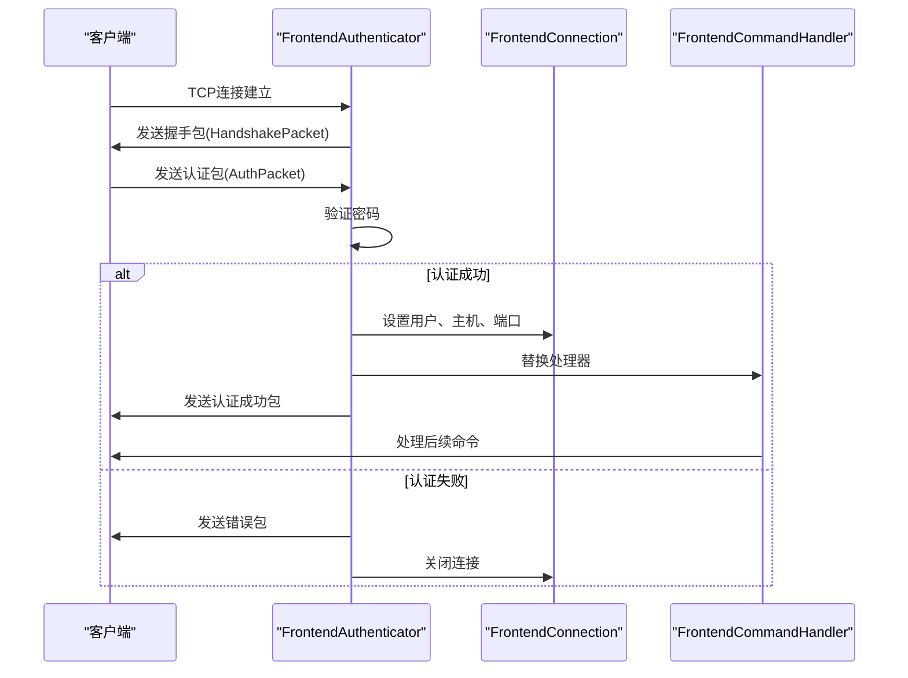
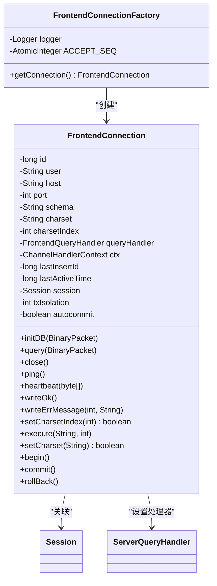
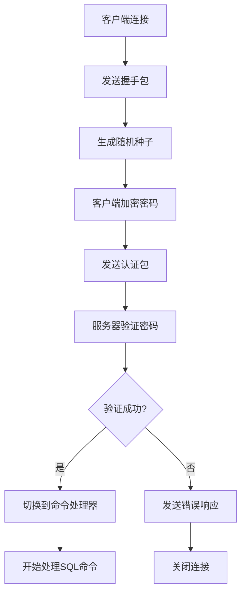
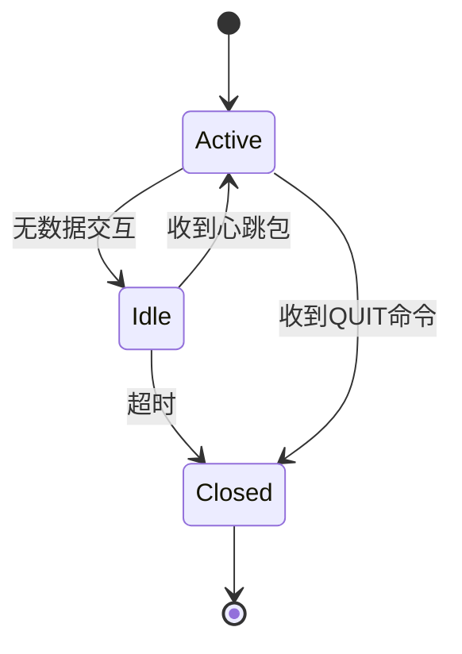

# 连接管理

<cite>
**本文档中引用的文件**   
- [FrontendConnection.java](file://src/main/java/alchemystar/freedom/engine/net/handler/frontend/FrontendConnection.java)
- [FrontConnectionFactory.java](file://src/main/java/alchemystar/freedom/engine/net/handler/factory/FrontConnectionFactory.java)
- [FrontendAuthenticator.java](file://src/main/java/alchemystar/freedom/engine/net/handler/frontend/FrontendAuthenticator.java)
- [HandshakePacket.java](file://src/main/java/alchemystar/freedom/engine/net/proto/mysql/HandshakePacket.java)
- [SocketConfig.java](file://src/main/java/alchemystar/freedom/config/SocketConfig.java)
- [FrontendCommandHandler.java](file://src/main/java/alchemystar/freedom/engine/net/handler/frontend/FrontendCommandHandler.java)
- [HeartbeatException.java](file://src/main/java/alchemystar/freedom/engine/net/exception/HeartbeatException.java)
</cite>

## 目录
1. [简介](#简介)
2. [连接生命周期管理](#连接生命周期管理)
3. [连接工厂机制](#连接工厂机制)
4. [认证流程分析](#认证流程分析)
5. [连接状态与会话关联](#连接状态与会话关联)
6. [超时控制与心跳检测](#超时控制与心跳检测)
7. [异常处理策略](#异常处理策略)
8. [性能调优与泄漏预防](#性能调优与泄漏预防)

## 简介
Freedom数据库的连接管理模块负责处理客户端连接的全生命周期，包括连接创建、认证、会话绑定和连接关闭。该模块基于Netty框架实现，采用事件驱动架构，通过一系列处理器（Handler）来管理客户端请求。核心组件包括FrontendConnection（前端连接）、FrontendAuthenticator（认证处理器）和FrontendConnectionFactory（连接工厂），共同实现了高效、安全的连接管理机制。

## 连接生命周期管理

### 连接创建与初始化
当客户端发起连接请求时，系统通过FrontendConnectionFactory创建新的FrontendConnection实例。每个连接被分配唯一的ID，并初始化基本属性，包括字符集、事务隔离级别和最后活动时间。连接创建后，立即进入认证阶段。

### 认证阶段
连接的认证过程由FrontendAuthenticator处理。在channelActive事件触发时，系统生成随机种子并发送握手包（HandshakePacket）给客户端。握手包包含协议版本、服务器版本、线程ID、能力标志、字符集信息和随机种子数据。客户端使用这些信息进行密码加密验证。

### 命令处理阶段
认证成功后，FrontendAuthenticator将通道处理器替换为FrontendCommandHandler，进入命令处理阶段。此时连接可以接收和处理各种MySQL命令，包括数据库初始化（COM_INIT_DB）、查询（COM_QUERY）、心跳（COM_HEARTBEAT）等。

### 连接关闭
连接可以通过多种方式关闭：客户端发送QUIT命令、心跳超时或系统主动关闭。关闭时，系统会记录日志并释放相关资源。



**图示来源**
- [FrontendAuthenticator.java](file://src/main/java/alchemystar/freedom/engine/net/handler/frontend/FrontendAuthenticator.java#L35-L72)
- [HandshakePacket.java](file://src/main/java/alchemystar/freedom/engine/net/proto/mysql/HandshakePacket.java#L0-L77)

**本节来源**
- [FrontendConnection.java](file://src/main/java/alchemystar/freedom/engine/net/handler/frontend/FrontendConnection.java#L0-L320)
- [FrontendAuthenticator.java](file://src/main/java/alchemystar/freedom/engine/net/handler/frontend/FrontendAuthenticator.java#L0-L173)

## 连接工厂机制

### FrontendConnectionFactory作用
FrontendConnectionFactory是FrontendConnection的工厂类，负责创建和初始化新的前端连接实例。它采用单例模式，通过原子计数器为每个新连接分配唯一ID。

### 连接实例化流程
1. 创建新的FrontendConnection对象
2. 设置查询处理器为ServerQueryHandler
3. 分配唯一连接ID
4. 初始化默认字符集和事务隔离级别
5. 设置最后活动时间为当前时间
6. 创建并绑定新的Session对象

### 线程安全设计
工厂类使用AtomicInteger确保连接ID的线程安全递增，避免在高并发场景下出现ID冲突。每个连接的创建都是独立的操作，不共享状态，保证了工厂的可伸缩性。



**图示来源**
- [FrontConnectionFactory.java](file://src/main/java/alchemystar/freedom/engine/net/handler/factory/FrontConnectionFactory.java#L0-L38)
- [FrontendConnection.java](file://src/main/java/alchemystar/freedom/engine/net/handler/frontend/FrontendConnection.java#L0-L320)

**本节来源**
- [FrontConnectionFactory.java](file://src/main/java/alchemystar/freedom/engine/net/handler/factory/FrontConnectionFactory.java#L0-L38)

## 认证流程分析

### 挑战-响应认证机制
Freedom数据库采用MySQL标准的挑战-响应认证机制。服务器生成随机种子发送给客户端，客户端使用该种子对密码进行加密后返回，服务器验证加密结果的正确性。

### 随机种子生成
系统使用RandomUtil工具类生成两个随机字节数组：
- rand1：8字节，作为握手包的seed字段
- rand2：12字节，作为握手包的restOfScrambleBuff字段
这两个数组合并形成完整的20字节种子，用于密码加密验证。

### 密码加密验证逻辑
1. 从数据库配置中获取正确的密码
2. 使用SecurityUtil.scramble411方法，将正确密码与种子进行加密运算
3. 将加密结果与客户端发送的密码进行逐字节比较
4. 如果所有字节都匹配，则认证成功

### 认证能力协商
服务器在握手包中声明支持的能力标志，包括：
- CLIENT_LONG_PASSWORD：支持长密码
- CLIENT_FOUND_ROWS：返回找到的行数而非受影响的行数
- CLIENT_PROTOCOL_41：支持4.1协议
- CLIENT_SECURE_CONNECTION：支持安全连接（加密密码）



**图示来源**
- [FrontendAuthenticator.java](file://src/main/java/alchemystar/freedom/engine/net/handler/frontend/FrontendAuthenticator.java#L35-L173)
- [SecurityUtil.java](file://src/main/java/alchemystar/freedom/engine/net/proto/util/SecurityUtil.java)

**本节来源**
- [FrontendAuthenticator.java](file://src/main/java/alchemystar/freedom/engine/net/handler/frontend/FrontendAuthenticator.java#L0-L173)

## 连接状态与会话关联

### 连接状态维护
FrontendConnection类维护了连接的关键状态信息：
- **host/port**：客户端IP地址和端口号，通过InetSocketAddress获取
- **schema**：当前使用的数据库模式，通过COM_INIT_DB命令设置
- **charset**：字符集信息，包括字符集名称和索引
- **txIsolation**：事务隔离级别
- **autocommit**：自动提交状态

### 会话绑定机制
每个FrontendConnection在初始化时都会创建并绑定一个Session对象：
```java
session = SessionFactory.newSession(this);
```
这种设计实现了连接与会话的紧密耦合，确保每个连接都有独立的会话上下文。会话对象负责管理事务状态、执行SQL语句和维护用户权限信息。

### 状态同步策略
连接状态的变更会同步到会话层。例如，当执行BEGIN、COMMIT、ROLLBACK命令时，不仅会修改连接的事务状态，还会调用会话对象的相应方法：
- begin() → session.begin()
- commit() → session.commit()
- rollBack() → session.rollback()

**本节来源**
- [FrontendConnection.java](file://src/main/java/alchemystar/freedom/engine/net/handler/frontend/FrontendConnection.java#L0-L320)
- [SessionFactory.java](file://src/main/java/alchemystar/freedom/engine/session/SessionFactory.java)

## 超时控制与心跳检测

### 认证超时控制
系统设置了15秒的认证超时时间：
```java
private static final long AUTH_TIMEOUT = 15 * 1000L;
```
如果客户端在15秒内未完成认证，连接将被自动关闭，防止资源被长时间占用。

### 心跳检测机制
系统通过Netty的IdleStateHandler实现心跳检测。FrontendCommandHandler监听IdleStateEvent事件，当连接空闲时间超过配置的IDLE_TIME_OUT（通过SystemConfig配置）时，自动关闭连接。

### 心跳命令处理
客户端可以发送COM_HEARTBEAT命令来维持连接活跃状态。处理逻辑如下：
```java
public void heartbeat(byte[] data) {
    writeOk();
}
```
服务器简单地返回OK包，不进行任何复杂处理，确保心跳操作的高效性。

### 连接保活策略
- 客户端定期发送心跳包
- 服务器更新连接的最后活动时间
- 空闲连接超时自动关闭
- 支持PING命令检测连接可用性



**图示来源**
- [FrontendConnection.java](file://src/main/java/alchemystar/freedom/engine/net/handler/frontend/FrontendConnection.java#L0-L320)
- [FrontendCommandHandler.java](file://src/main/java/alchemystar/freedom/engine/net/handler/frontend/FrontendCommandHandler.java#L0-L89)

**本节来源**
- [FrontendConnection.java](file://src/main/java/alchemystar/freedom/engine/net/handler/frontend/FrontendConnection.java#L0-L320)
- [FrontendCommandHandler.java](file://src/main/java/alchemystar/freedom/engine/net/handler/frontend/FrontendCommandHandler.java#L0-L89)

## 异常处理策略

### 认证异常处理
当认证失败时，系统执行以下操作：
1. 记录错误日志
2. 发送错误响应包给客户端
3. 关闭连接

```java
protected void failure(int errno, String info) {
    logger.error(source.toString() + info);
    source.writeErrMessage((byte) 2, errno, info);
}
```

### 连接异常处理
系统定义了专门的HeartbeatException异常类，用于处理心跳相关的异常情况。该异常继承自RuntimeException，包含多个构造函数以支持不同的错误场景。

### 错误响应机制
系统提供统一的错误响应方法：
```java
public void writeErrMessage(int errno, String msg) {
    writeErrMessage((byte) 1, errno, msg);
}
```
错误响应包含错误号、错误消息和字符集编码信息，确保客户端能够正确解析错误内容。

### 命令异常处理
对于不支持的命令，系统统一返回"Unknown command"错误：
```java
source.writeErrMessage(ErrorCode.ER_UNKNOWN_COM_ERROR, "Unknown command");
```

**本节来源**
- [FrontendAuthenticator.java](file://src/main/java/alchemystar/freedom/engine/net/handler/frontend/FrontendAuthenticator.java#L0-L173)
- [HeartbeatException.java](file://src/main/java/alchemystar/freedom/engine/net/exception/HeartbeatException.java#L0-L27)

## 性能调优与泄漏预防

### 连接泄漏预防
1. **超时机制**：所有连接都有明确的超时策略，包括认证超时和空闲超时
2. **资源释放**：连接关闭时确保释放所有相关资源
3. **连接池监控**：通过连接ID和日志跟踪连接生命周期

### 性能优化建议
1. **Socket参数调优**：
   - Frontend_Socket_Recv_Buf: 4MB 接收缓冲区
   - Frontend_Socket_Send_Buf: 1MB 发送缓冲区
   - SO_TIMEOUT: 600秒 空闲超时

2. **减少对象创建**：
   - 重用ByteBuf对象
   - 缓存常用响应包（如OkPacket）

3. **异步处理**：
   - I/O操作直接在Netty线程中完成，避免线程池开销

### 监控与诊断
1. **连接日志**：记录每个连接的创建和关闭信息
2. **性能指标**：监控连接数、活跃连接数、认证成功率
3. **慢查询检测**：通过最后活动时间识别长时间运行的查询

### 最佳实践
1. 客户端应使用连接池管理连接
2. 及时关闭不再使用的连接
3. 合理设置连接超时时间
4. 定期清理长时间空闲的连接

**本节来源**
- [SocketConfig.java](file://src/main/java/alchemystar/freedom/config/SocketConfig.java#L0-L16)
- [FrontendConnection.java](file://src/main/java/alchemystar/freedom/engine/net/handler/frontend/FrontendConnection.java#L0-L320)
- [FrontendCommandHandler.java](file://src/main/java/alchemystar/freedom/engine/net/handler/frontend/FrontendCommandHandler.java#L0-L89)