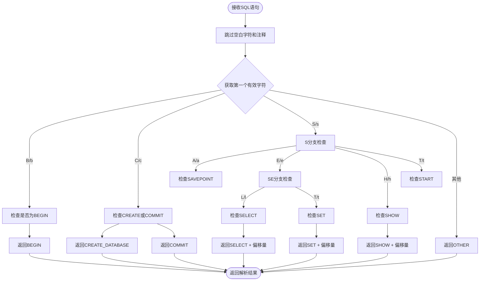
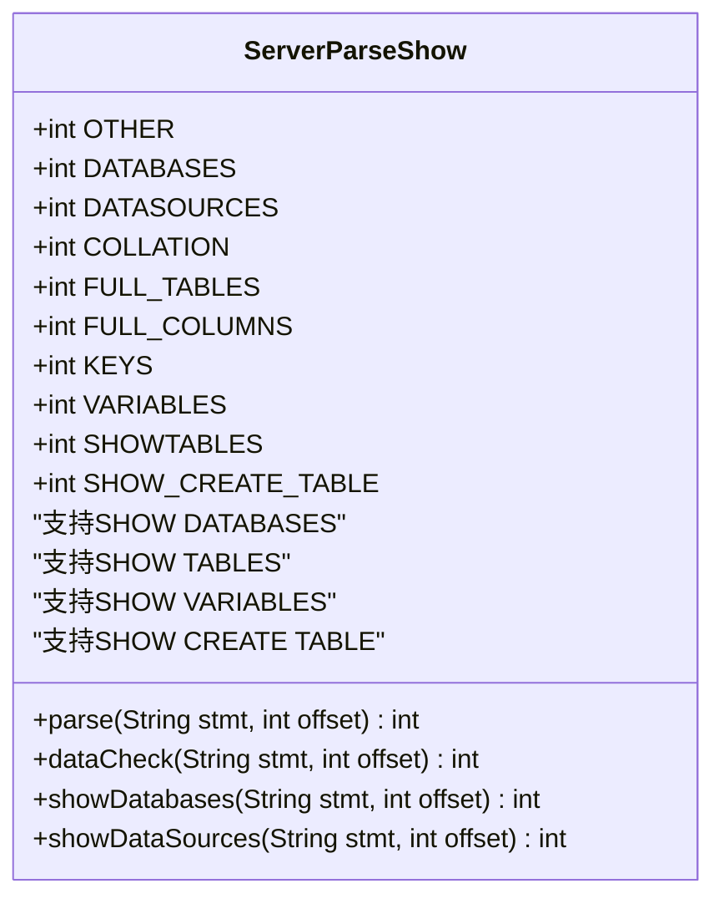
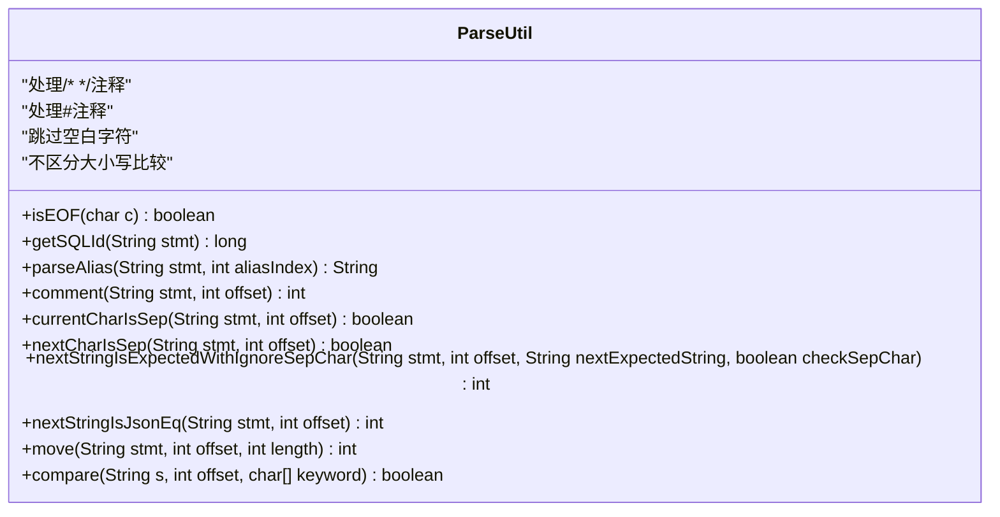
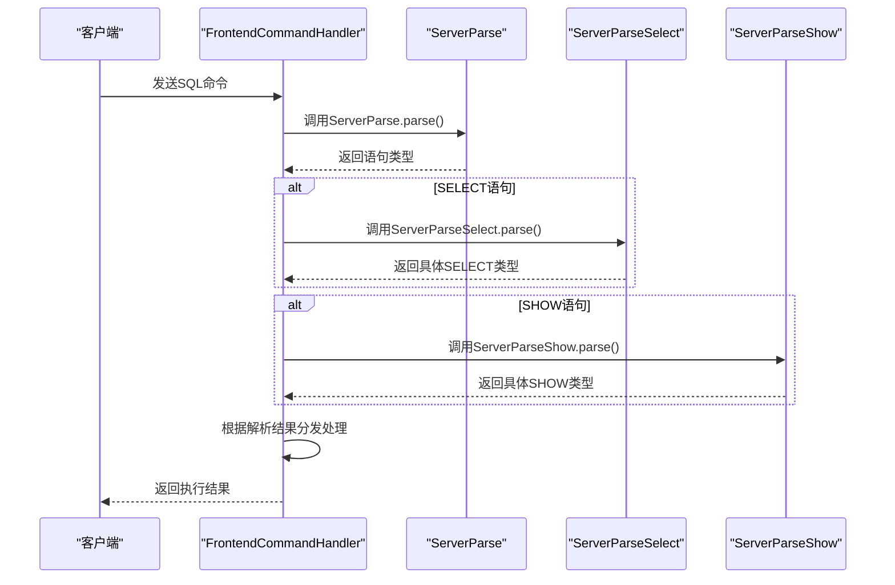

# SQL解析

<cite>
**本文档引用的文件**  
- [ServerParse.java](file://src/main/java/alchemystar/freedom/engine/parser/ServerParse.java)
- [ServerParseSelect.java](file://src/main/java/alchemystar/freedom/engine/parser/ServerParseSelect.java)
- [ServerParseShow.java](file://src/main/java/alchemystar/freedom/engine/parser/ServerParseShow.java)
- [ServerParseSet.java](file://src/main/java/alchemystar/freedom/engine/parser/ServerParseSet.java)
- [ParseUtil.java](file://src/main/java/alchemystar/freedom/engine/parser/util/ParseUtil.java)
</cite>

## 目录
1. [引言](#引言)
2. [核心解析机制](#核心解析机制)
3. [ServerParse主解析器](#serverparse主解析器)
4. [子解析器实现](#子解析器实现)
5. [ParseUtil工具类](#parseutil工具类)
6. [解析流程时序图](#解析流程时序图)
7. [错误处理机制](#错误处理机制)
8. [总结](#总结)

## 引言
SQL解析模块是数据库系统的核心组件之一，负责将原始SQL命令字符串解析为可执行的操作指令。本系统采用分层解析架构，以`ServerParse`为核心调度器，通过多个专用子解析器（如`ServerParseSelect`、`ServerParseShow`等）实现对不同SQL语句类型的精确识别与处理。该设计实现了高效率的语法分析和良好的可扩展性。

## 核心解析机制
SQL解析模块采用前缀匹配和状态机相结合的解析策略，通过对SQL语句的前缀关键字进行逐字符比对，快速识别语句类型并分发到相应的处理逻辑。整个解析过程不依赖外部解析库，完全由自定义代码实现，确保了高性能和低延迟。

**Section sources**
- [ServerParse.java](file://src/main/java/alchemystar/freedom/engine/parser/ServerParse.java#L1-L450)

## ServerParse主解析器

`ServerParse`类作为SQL解析的入口点，定义了所有支持的SQL语句类型常量，并实现了基于首字母的快速分发机制。解析器首先跳过空白字符和注释，然后根据第一个有效字符进入相应的检查分支。

当识别出特定语句类型后，`ServerParse`返回预定义的整型常量（如`ServerParse.SELECT`、`ServerParse.COMMIT`等），这些返回值直接驱动后续的执行流程。对于需要进一步解析的语句，还会返回偏移量信息，指示子解析器应从何处开始处理。

**Diagram sources**
- [ServerParse.java](file://src/main/java/alchemystar/freedom/engine/parser/ServerParse.java#L1-L450)

**Section sources**
- [ServerParse.java](file://src/main/java/alchemystar/freedom/engine/parser/ServerParse.java#L1-L450)

## 子解析器实现

### SELECT语句解析
`ServerParseSelect`专门处理SELECT语句的各种变体，包括`SELECT VERSION()`、`SELECT DATABASE()`、`SELECT USER()`等特殊函数调用，以及`SELECT @@version_comment`等系统变量查询。

该解析器通过检查SELECT后的标识符来确定具体类型，并使用`skipAlias`、`skipAs`等辅助方法正确处理别名和AS关键字，确保能够准确识别语句的结束位置。

**Section sources**
- [ServerParseSelect.java](file://src/main/java/alchemystar/freedom/engine/parser/ServerParseSelect.java#L1-L449)

### SHOW语句解析
`ServerParseShow`负责解析SHOW命令，支持`SHOW DATABASES`、`SHOW TABLES`、`SHOW VARIABLES`等多种形式。解析器通过完整的字符串匹配来区分不同的SHOW命令，例如通过`startsWith("SHOW CREATE TABLE")`来识别表创建语句。

**Diagram sources**
- [ServerParseShow.java](file://src/main/java/alchemystar/freedom/engine/parser/ServerParseShow.java#L1-L128)

**Section sources**
- [ServerParseShow.java](file://src/main/java/alchemystar/freedom/engine/parser/ServerParseShow.java#L1-L128)

### SET语句解析
`ServerParseSet`处理SET命令的各种形式，包括事务隔离级别设置、字符集配置和自动提交模式切换。解析器能够识别`SET AUTOCOMMIT=1`、`SET NAMES utf8`、`SET TRANSACTION ISOLATION LEVEL`等复杂语法结构。

对于事务隔离级别的设置，解析器实现了多层嵌套检查，依次验证`TRANSACTION`、`ISOLATION`、`LEVEL`等关键字的存在，然后根据最后的隔离级别名称返回相应的常量。

**Section sources**
- [ServerParseSet.java](file://src/main/java/alchemystar/freedom/engine/parser/ServerParseSet.java#L1-L702)

## ParseUtil工具类

`ParseUtil`提供了SQL解析所需的基础工具方法，包括注释处理、字符串比较、空白字符跳过等功能。这些工具方法被所有解析器共享使用，确保了代码的复用性和一致性。

关键方法包括：
- `comment()`：处理SQL注释（`/* */`和`#`）
- `isEOF()`：判断字符是否为语句结束符
- `move()`：跳过空白字符和注释
- `compare()`：不区分大小写的字符串比较
- `nextStringIsExpectedWithIgnoreSepChar()`：在忽略分隔符的情况下匹配期望字符串

**Diagram sources**
- [ParseUtil.java](file://src/main/java/alchemystar/freedom/engine/parser/util/ParseUtil.java#L1-L317)

**Section sources**
- [ParseUtil.java](file://src/main/java/alchemystar/freedom/engine/parser/util/ParseUtil.java#L1-L317)

## 解析流程时序图

**Diagram sources**
- [ServerParse.java](file://src/main/java/alchemystar/freedom/engine/parser/ServerParse.java#L1-L450)
- [ServerParseSelect.java](file://src/main/java/alchemystar/freedom/engine/parser/ServerParseSelect.java#L1-L449)
- [ServerParseShow.java](file://src/main/java/alchemystar/freedom/engine/parser/ServerParseShow.java#L1-L128)

## 错误处理机制
SQL解析模块具有完善的错误处理机制。当遇到无法识别的语句时，各解析器会返回`OTHER`常量，表示该语句类型不受支持。解析器在匹配关键字时会严格检查后续字符是否为分隔符，避免部分匹配导致的误判。

对于复杂的语句结构（如SET TRANSACTION），解析器采用逐步验证的方式，只有当所有关键字都正确匹配时才返回成功结果。任何中间步骤的失败都会导致返回`OTHER`，确保解析结果的准确性。

**Section sources**
- [ServerParse.java](file://src/main/java/alchemystar/freedom/engine/parser/ServerParse.java#L1-L450)
- [ServerParseSet.java](file://src/main/java/alchemystar/freedom/engine/parser/ServerParseSet.java#L1-L702)

## 总结
SQL解析模块通过`ServerParse`核心类实现了高效的SQL语句分类，利用多个专用子解析器处理特定语句类型，结合`ParseUtil`工具类提供基础解析功能，形成了一个完整、高效且易于扩展的解析体系。该设计不仅保证了解析的准确性，还通过返回预定义常量的方式简化了后续执行流程的控制逻辑。