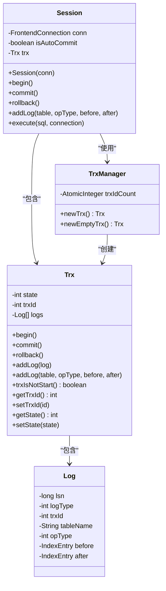
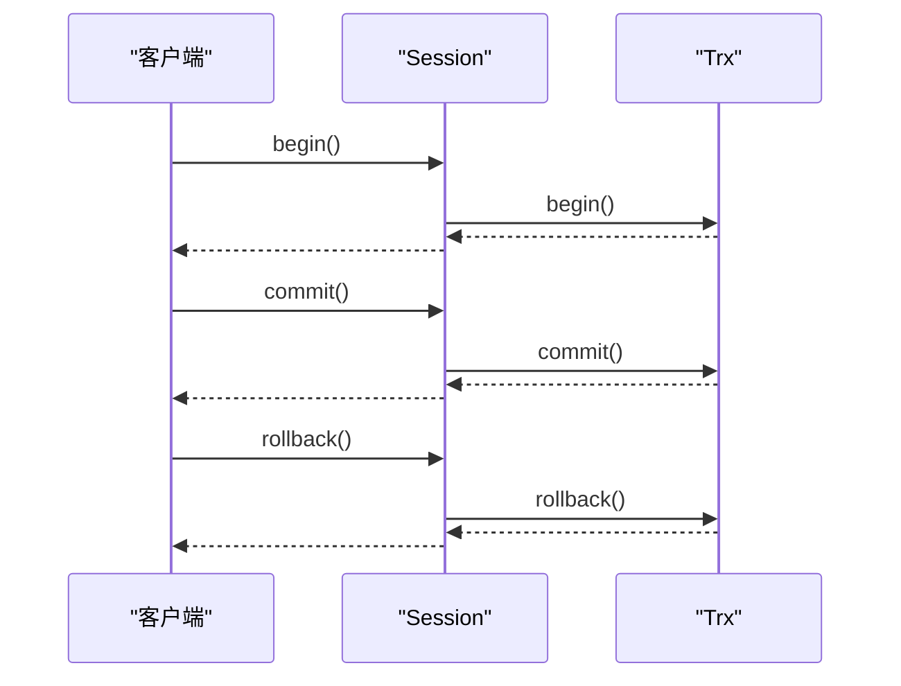
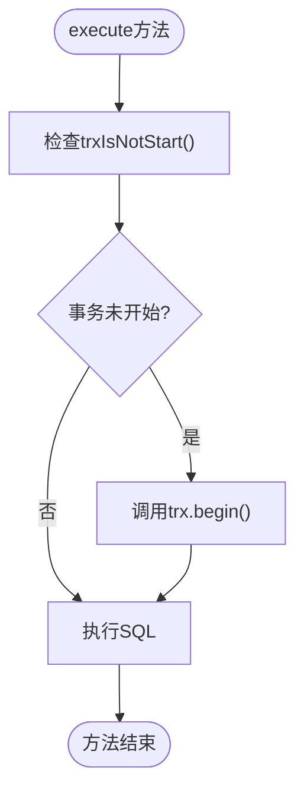
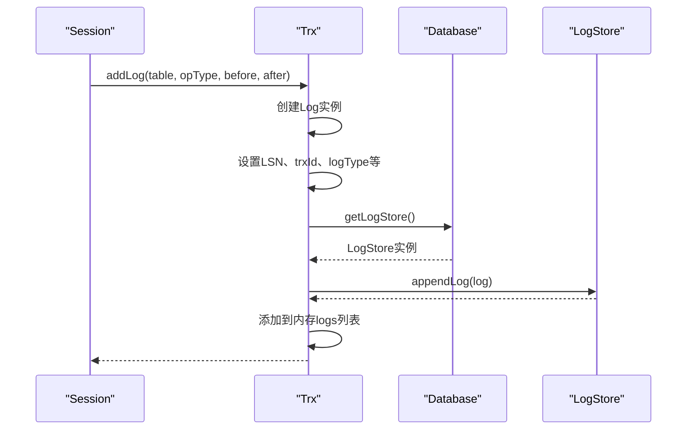
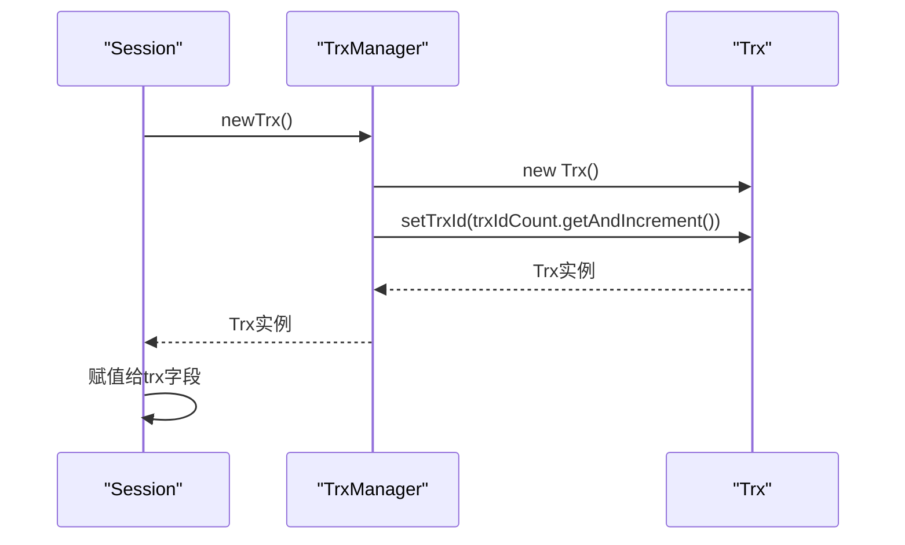
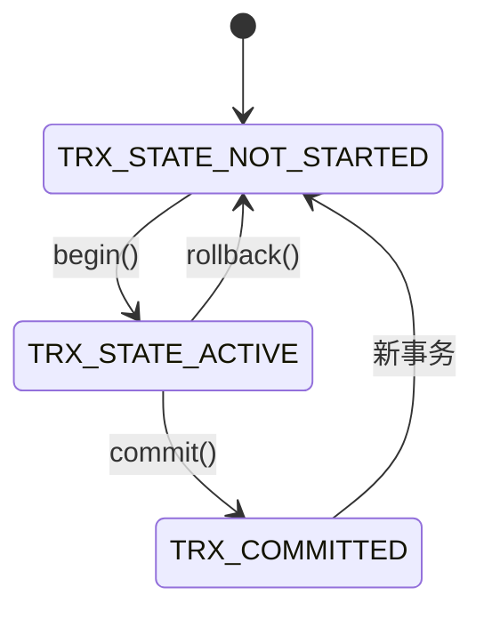
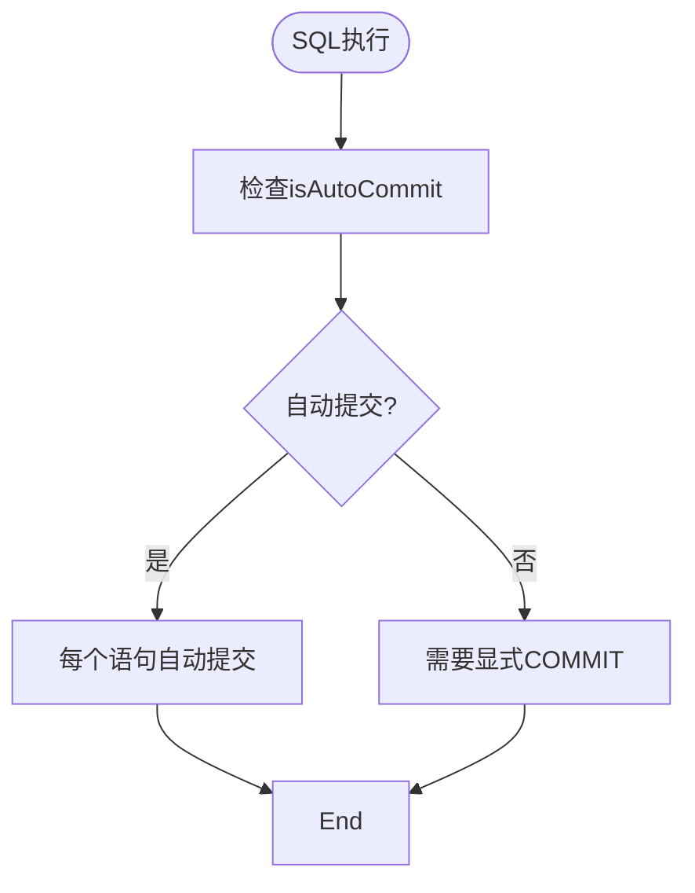
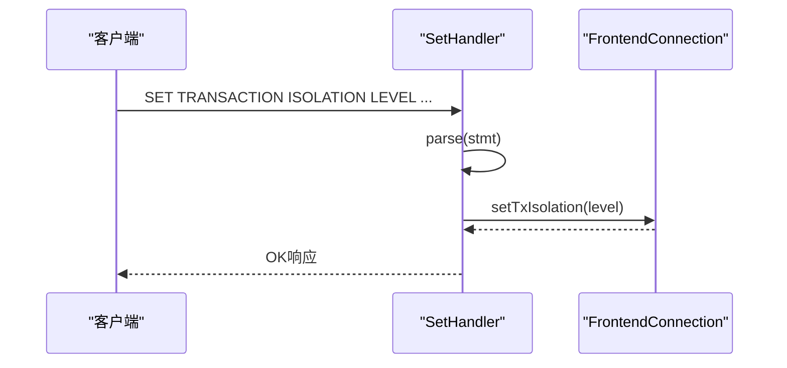

# 会话与事务集成

<cite>
**本文档中引用的文件**  
- [Session.java](file://src/main/java/alchemystar/freedom/engine/session/Session.java)
- [Trx.java](file://src/main/java/alchemystar/freedom/transaction/Trx.java)
- [TrxManager.java](file://src/main/java/alchemystar/freedom/transaction/TrxManager.java)
- [TrxState.java](file://src/main/java/alchemystar/freedom/transaction/TrxState.java)
- [Log.java](file://src/main/java/alchemystar/freedom/transaction/log/Log.java)
- [LogType.java](file://src/main/java/alchemystar/freedom/transaction/log/LogType.java)
- [SetHandler.java](file://src/main/java/alchemystar/freedom/engine/net/handler/frontend/SetHandler.java)
- [ServerParseSet.java](file://src/main/java/alchemystar/freedom/engine/parser/ServerParseSet.java)
</cite>

## 目录
1. [引言](#引言)
2. [会话与事务集成架构](#会话与事务集成架构)
3. [Trx字段代理机制](#trx字段代理机制)
4. [自动事务启动逻辑](#自动事务启动逻辑)
5. [日志记录与事务管理](#日志记录与事务管理)
6. [事务管理器与会话创建](#事务管理器与会话创建)
7. [事务状态维护](#事务状态维护)
8. [显式事务与自动提交模式](#显式事务与自动提交模式)
9. [事务隔离级别的传递与应用](#事务隔离级别的传递与应用)
10. [结论](#结论)

## 引言
本文档详细阐述了会话层与事务系统的深度集成机制。以Session类中的trx字段为核心，分析其如何代理事务的begin、commit、rollback操作，并在execute方法中实现自动事务启动逻辑。说明addLog方法如何将数据变更记录传递给事务系统进行日志管理。解析TrxManager在会话创建时分配事务实例的策略，以及事务状态在会话上下文中的维护方式。结合代码示例展示显式事务控制与自动提交模式的实现差异，并讨论事务隔离级别在会话中的传递与应用。

## 会话与事务集成架构
会话与事务系统的集成架构基于代理模式和状态管理机制，通过Session类持有Trx事务实例，实现对事务生命周期的完整控制。该架构确保了数据库操作的原子性、一致性和持久性。

**图示来源**  
- [Session.java](file://src/main/java/alchemystar/freedom/engine/session/Session.java#L1-L50)
- [Trx.java](file://src/main/java/alchemystar/freedom/transaction/Trx.java#L1-L119)
- [TrxManager.java](file://src/main/java/alchemystar/freedom/transaction/TrxManager.java#L1-L22)
- [Log.java](file://src/main/java/alchemystar/freedom/transaction/log/Log.java#L1-L150)

**本节来源**  
- [Session.java](file://src/main/java/alchemystar/freedom/engine/session/Session.java#L1-L50)
- [Trx.java](file://src/main/java/alchemystar/freedom/transaction/Trx.java#L1-L119)

## Trx字段代理机制
Session类通过trx字段代理事务的核心操作，包括事务的开始、提交和回滚。这种代理机制实现了会话层与事务层的解耦，同时保持了操作的透明性。

**图示来源**  
- [Session.java](file://src/main/java/alchemystar/freedom/engine/session/Session.java#L20-L34)
- [Trx.java](file://src/main/java/alchemystar/freedom/transaction/Trx.java#L20-L74)

**本节来源**  
- [Session.java](file://src/main/java/alchemystar/freedom/engine/session/Session.java#L20-L34)
- [Trx.java](file://src/main/java/alchemystar/freedom/transaction/Trx.java#L20-L74)

## 自动事务启动逻辑
在execute方法中，通过trxIsNotStart判断实现自动事务启动逻辑。当事务尚未开始时，自动调用begin方法启动事务，确保每个SQL执行都在事务上下文中进行。

**图示来源**  
- [Session.java](file://src/main/java/alchemystar/freedom/engine/session/Session.java#L48-L50)
- [Trx.java](file://src/main/java/alchemystar/freedom/transaction/Trx.java#L60-L65)

**本节来源**  
- [Session.java](file://src/main/java/alchemystar/freedom/engine/session/Session.java#L48-L50)

## 日志记录与事务管理
addLog方法将数据变更记录传递给事务系统进行日志管理，确保事务的持久性和可恢复性。日志记录包含操作类型、表名、前后镜像等关键信息。

**图示来源**  
- [Session.java](file://src/main/java/alchemystar/freedom/engine/session/Session.java#L46-L47)
- [Trx.java](file://src/main/java/alchemystar/freedom/transaction/Trx.java#L39-L58)
- [Log.java](file://src/main/java/alchemystar/freedom/transaction/log/Log.java#L1-L150)

**本节来源**  
- [Trx.java](file://src/main/java/alchemystar/freedom/transaction/Trx.java#L39-L58)

## 事务管理器与会话创建
TrxManager在会话创建时负责分配事务实例，通过原子计数器生成唯一的事务ID，确保事务的全局唯一性。

**图示来源**  
- [Session.java](file://src/main/java/alchemystar/freedom/engine/session/Session.java#L18-L20)
- [TrxManager.java](file://src/main/java/alchemystar/freedom/transaction/TrxManager.java#L1-L22)
- [Trx.java](file://src/main/java/alchemystar/freedom/transaction/Trx.java#L1-L119)

**本节来源**  
- [Session.java](file://src/main/java/alchemystar/freedom/engine/session/Session.java#L18-L20)
- [TrxManager.java](file://src/main/java/alchemystar/freedom/transaction/TrxManager.java#L1-L22)

## 事务状态维护
事务状态在会话上下文中通过TrxState枚举进行维护，包括未开始、进行中、已提交等状态，确保事务生命周期的正确管理。

**图示来源**  
- [TrxState.java](file://src/main/java/alchemystar/freedom/transaction/TrxState.java#L1-L17)
- [Trx.java](file://src/main/java/alchemystar/freedom/transaction/Trx.java#L10-L11)
- [Trx.java](file://src/main/java/alchemystar/freedom/transaction/Trx.java#L60-L74)

**本节来源**  
- [TrxState.java](file://src/main/java/alchemystar/freedom/transaction/TrxState.java#L1-L17)
- [Trx.java](file://src/main/java/alchemystar/freedom/transaction/Trx.java#L10-L11)

## 显式事务与自动提交模式
系统支持显式事务控制（BEGIN/COMMIT）和自动提交模式两种事务管理方式，通过isAutoCommit标志位进行区分和控制。

**图示来源**  
- [Session.java](file://src/main/java/alchemystar/freedom/engine/session/Session.java#L17-L18)
- [SetHandler.java](file://src/main/java/alchemystar/freedom/engine/net/handler/frontend/SetHandler.java#L23-L61)
- [ServerParseSet.java](file://src/main/java/alchemystar/freedom/engine/parser/ServerParseSet.java#L82-L113)

**本节来源**  
- [Session.java](file://src/main/java/alchemystar/freedom/engine/session/Session.java#L17-L18)
- [SetHandler.java](file://src/main/java/alchemystar/freedom/engine/net/handler/frontend/SetHandler.java#L23-L61)

## 事务隔离级别的传递与应用
事务隔离级别通过SET TRANSACTION ISOLATION LEVEL语句在会话中进行设置和传递，确保事务的一致性需求得到满足。

**图示来源**  
- [SetHandler.java](file://src/main/java/alchemystar/freedom/engine/net/handler/frontend/SetHandler.java#L23-L61)
- [ServerParseSet.java](file://src/main/java/alchemystar/freedom/engine/parser/ServerParseSet.java#L377-L543)
- [FrontendConnection.java](file://src/main/java/alchemystar/freedom/engine/net/handler/frontend/FrontendConnection.java)

**本节来源**  
- [SetHandler.java](file://src/main/java/alchemystar/freedom/engine/net/handler/frontend/SetHandler.java#L23-L61)
- [ServerParseSet.java](file://src/main/java/alchemystar/freedom/engine/parser/ServerParseSet.java#L377-L543)

## 结论
会话层与事务系统的深度集成通过Trx字段代理机制实现了事务操作的透明化管理。自动事务启动逻辑确保了每个SQL执行都在事务上下文中进行。日志记录机制保证了事务的持久性和可恢复性。TrxManager通过原子计数器分配唯一的事务ID。事务状态在会话上下文中得到正确维护。系统支持显式事务控制和自动提交模式两种方式，并通过SET语句实现事务隔离级别的传递与应用。这种集成架构确保了数据库操作的ACID特性，为应用程序提供了可靠的事务管理能力。