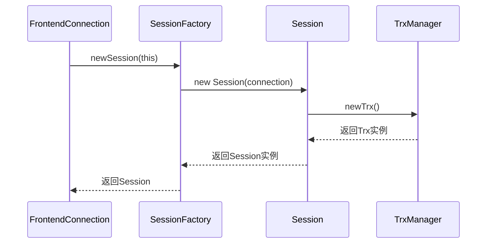
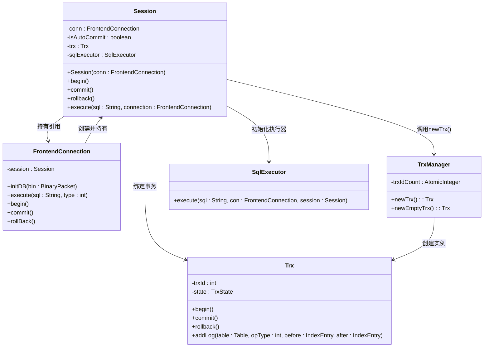
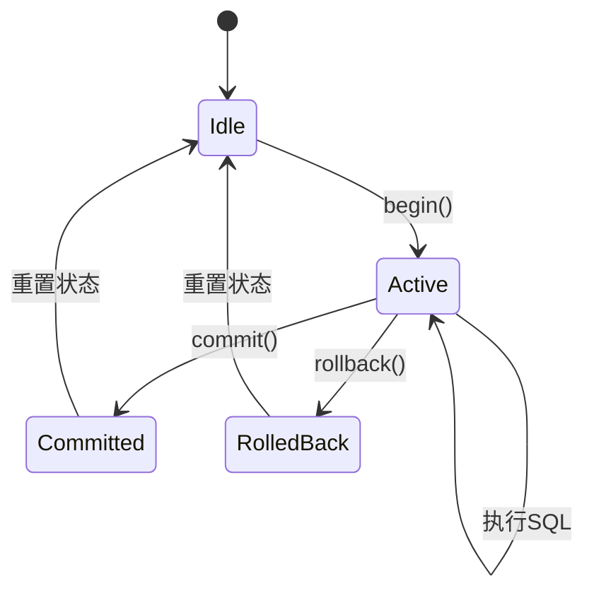
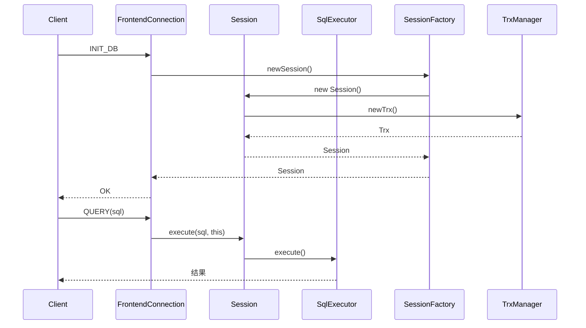

# 会话生命周期

<cite>
**本文档引用文件**  
- [Session.java](file://src/main/java/alchemystar/freedom/engine/session/Session.java)
- [SessionFactory.java](file://src/main/java/alchemystar/freedom/engine/session/SessionFactory.java)
- [FrontendConnection.java](file://src/main/java/alchemystar/freedom/engine/net/handler/frontend/FrontendConnection.java)
- [TrxManager.java](file://src/main/java/alchemystar/freedom/transaction/TrxManager.java)
- [SqlExecutor.java](file://src/main/java/alchemystar/freedom/sql/SqlExecutor.java)
- [Trx.java](file://src/main/java/alchemystar/freedom/transaction/Trx.java)
</cite>

## 目录
1. [引言](#引言)
2. [会话创建机制](#会话创建机制)
3. [会话构造与事务初始化](#会话构造与事务初始化)
4. [会话执行流程](#会话执行流程)
5. [事务管理与生命周期控制](#事务管理与生命周期控制)
6. [会话资源分配与回收](#会话资源分配与回收)
7. [前端连接对会话的控制逻辑](#前端连接对会话的控制逻辑)
8. [异常情况下的会话清理机制](#异常情况下的会话清理机制)
9. [总结](#总结)

## 引言
本文深入解析数据库系统中会话（Session）的完整生命周期管理机制。重点阐述会话如何通过SessionFactory创建、与前端连接（FrontendConnection）建立关联、事务初始化过程、SQL执行流程、事务提交/回滚以及最终销毁的全过程。结合代码分析会话资源的分配与回收策略，包括SqlExecutor的初始化和事务对象的绑定，并说明FrontendConnection在连接生命周期中对会话的控制逻辑。

## 会话创建机制

会话的创建由`SessionFactory`类的静态方法`newSession`触发，该方法接收一个`FrontendConnection`实例作为参数，并返回一个新创建的`Session`对象。此机制实现了会话与前端网络连接的绑定，确保每个客户端连接拥有独立的会话上下文。



**Diagram sources**  
- [SessionFactory.java](file://src/main/java/alchemystar/freedom/engine/session/SessionFactory.java#L1-L15)
- [Session.java](file://src/main/java/alchemystar/freedom/engine/session/Session.java#L1-L52)

**Section sources**  
- [SessionFactory.java](file://src/main/java/alchemystar/freedom/engine/session/SessionFactory.java#L1-L15)

## 会话构造与事务初始化

当`Session`对象被构造时，其构造函数接收`FrontendConnection`实例并完成以下关键初始化操作：
1. 保存对前端连接的引用，用于后续响应客户端
2. 调用`TrxManager.newTrx()`创建并绑定一个新的事务对象（Trx）
3. 初始化`SqlExecutor`实例，用于SQL语句的解析与执行

事务初始化过程中，`TrxManager`使用原子计数器为每个新事务分配唯一ID，确保事务的全局唯一性。



**Diagram sources**  
- [Session.java](file://src/main/java/alchemystar/freedom/engine/session/Session.java#L1-L52)
- [TrxManager.java](file://src/main/java/alchemystar/freedom/transaction/TrxManager.java#L1-L23)

**Section sources**  
- [Session.java](file://src/main/java/alchemystar/freedom/engine/session/Session.java#L1-L52)
- [TrxManager.java](file://src/main/java/alchemystar/freedom/transaction/TrxManager.java#L1-L23)

## 会话执行流程

会话的SQL执行流程由`execute`方法驱动，其核心逻辑如下：
1. 检查当前事务是否已启动，若未启动则自动调用`trx.begin()`
2. 将SQL语句和连接信息传递给`SqlExecutor`进行解析和执行
3. `SqlExecutor`根据SQL类型（SELECT/INSERT/UPDATE/DELETE）调用相应的执行器

该流程确保了所有SQL操作都在事务上下文中执行，即使在自动提交模式下也会隐式开启事务。

```mermaid
flowchart TD
A[execute(sql, connection)] --> B{trxIsNotStart?}
B --> |是| C[trx.begin()]
B --> |否| D[继续]
C --> D
D --> E[sqlExecutor.execute()]
E --> F{SQL类型判断}
F --> |CREATE| G[CreateExecutor]
F --> |INSERT| H[InsertExecutor]
F --> |SELECT| I[SelectExecutor]
F --> |DELETE| J[DeleteExecutor]
G --> K[执行并响应]
H --> K
I --> K
J --> K
K --> L[返回结果]
```

**Diagram sources**  
- [Session.java](file://src/main/java/alchemystar/freedom/engine/session/Session.java#L1-L52)
- [SqlExecutor.java](file://src/main/java/alchemystar/freedom/sql/SqlExecutor.java#L1-L51)

**Section sources**  
- [Session.java](file://src/main/java/alchemystar/freedom/engine/session/Session.java#L1-L52)
- [SqlExecutor.java](file://src/main/java/alchemystar/freedom/sql/SqlExecutor.java#L1-L51)

## 事务管理与生命周期控制

会话提供了标准的事务控制接口：`begin()`、`commit()`和`rollback()`。这些方法直接委托给内部的`Trx`对象执行，实现了事务状态的转换。

在自动提交模式下（默认），每个SQL语句执行后会自动提交；在显式事务模式下，需要客户端发送`BEGIN`命令开启事务，然后通过`COMMIT`或`ROLLBACK`结束事务。



**Section sources**  
- [Session.java](file://src/main/java/alchemystar/freedom/engine/session/Session.java#L1-L52)

## 会话资源分配与回收

会话在创建时分配以下核心资源：
- **事务对象（Trx）**：通过`TrxManager.newTrx()`创建，包含事务ID、状态和日志缓冲区
- **SQL执行器（SqlExecutor）**：作为实例字段初始化，复用Druid SQL解析器
- **连接引用**：持有对`FrontendConnection`的强引用，用于响应客户端

资源回收主要通过`FrontendConnection.close()`触发，当连接关闭时，关联的会话对象将被垃圾回收，其持有的资源也随之释放。

**Section sources**  
- [Session.java](file://src/main/java/alchemystar/freedom/engine/session/Session.java#L1-L52)
- [SqlExecutor.java](file://src/main/java/alchemystar/freedom/sql/SqlExecutor.java#L1-L51)

## 前端连接对会话的控制逻辑

`FrontendConnection`在连接生命周期中对会话进行直接控制：
- **连接建立时**：通过`initDB`方法调用`SessionFactory.newSession(this)`创建会话
- **SQL执行时**：通过`execute`方法将SQL语句转发给会话处理
- **事务控制时**：`begin()`、`commit()`、`rollback()`方法直接调用会话的对应方法
- **连接关闭时**：通过`close()`方法终止连接，会话随连接失效而被回收

这种设计实现了网络层与会话层的清晰分离，同时保持了必要的控制耦合。



**Diagram sources**  
- [FrontendConnection.java](file://src/main/java/alchemystar/freedom/engine/net/handler/frontend/FrontendConnection.java#L1-L320)
- [Session.java](file://src/main/java/alchemystar/freedom/engine/session/Session.java#L1-L52)

**Section sources**  
- [FrontendConnection.java](file://src/main/java/alchemystar/freedom/engine/net/handler/frontend/FrontendConnection.java#L1-L320)

## 异常情况下的会话清理机制

当前代码实现中，会话清理主要依赖于前端连接的生命周期管理：
- 当网络连接异常断开时，Netty框架触发`channelInactive`事件，最终调用`FrontendConnection.close()`
- 连接关闭后，对会话的引用被释放，会话对象进入可回收状态
- 事务管理器未显式提供超时清理机制，但通过连接层的超时设置（如`AUTH_TIMEOUT`）间接控制会话生命周期

建议增强事务超时检测和空闲会话回收机制，以防止资源泄漏。

**Section sources**  
- [FrontendConnection.java](file://src/main/java/alchemystar/freedom/engine/net/handler/frontend/FrontendConnection.java#L1-L320)
- [Session.java](file://src/main/java/alchemystar/freedom/engine/session/Session.java#L1-L52)

## 总结

本文档详细解析了会话的完整生命周期管理机制。会话通过`SessionFactory.newSession`创建，与`FrontendConnection`建立一对一关联。在构造过程中，会话初始化事务对象（通过`TrxManager.newTrx`）和SQL执行器，为后续操作做好准备。整个生命周期中，会话负责事务管理、SQL执行和资源协调，而前端连接负责网络通信和会话控制。异常情况下，会话清理依赖于连接层的关闭机制。该设计实现了清晰的职责分离，为数据库系统的稳定运行提供了基础保障。