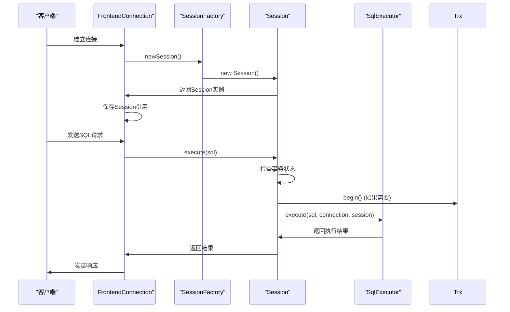
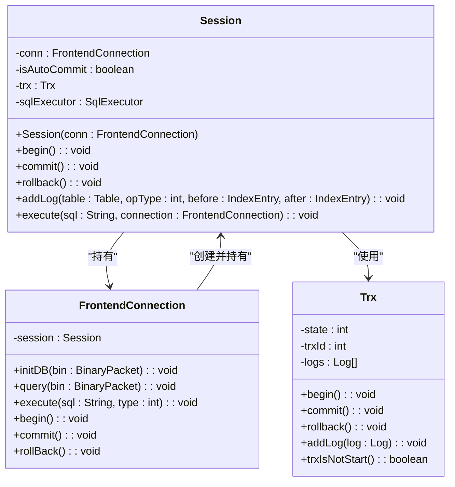
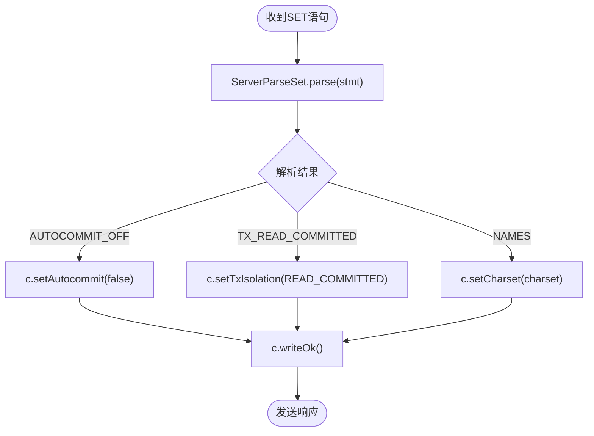
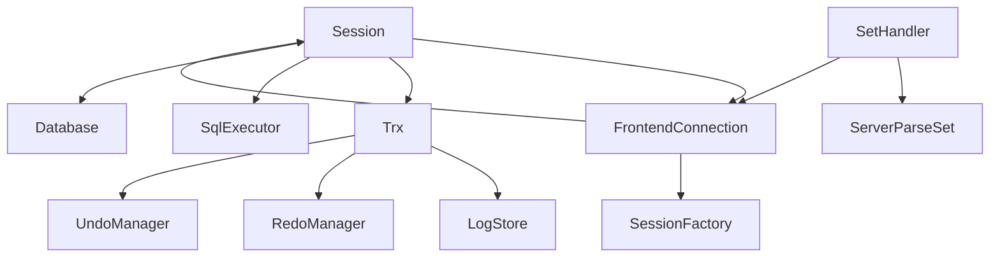

# 会话管理

<cite>
**本文档中引用的文件**  
- [Session.java](file://src/main/java/alchemystar/freedom/engine/session/Session.java)
- [SessionFactory.java](file://src/main/java/alchemystar/freedom/engine/session/SessionFactory.java)
- [FrontendConnection.java](file://src/main/java/alchemystar/freedom/engine/net/handler/frontend/FrontendConnection.java)
- [SetHandler.java](file://src/main/java/alchemystar/freedom/engine/net/handler/frontend/SetHandler.java)
- [ServerParseSet.java](file://src/main/java/alchemystar/freedom/engine/parser/ServerParseSet.java)
- [Trx.java](file://src/main/java/alchemystar/freedom/transaction/Trx.java)
</cite>

## 目录
1. [简介](#简介)
2. [项目结构](#项目结构)
3. [核心组件](#核心组件)
4. [架构概述](#架构概述)
5. [详细组件分析](#详细组件分析)
6. [依赖分析](#依赖分析)
7. [性能考虑](#性能考虑)
8. [故障排除指南](#故障排除指南)
9. [结论](#结论)

## 简介
本文档全面介绍Freedom数据库系统中会话管理组件的设计与实现。以`Session`类为核心，说明其如何封装客户端连接的状态信息（如当前数据库、事务状态、会话变量等），并作为SQL执行的上下文容器。阐述`SessionFactory`如何创建和管理`Session`实例，以及`FrontendConnection`如何与`Session`关联。分析`Session`在SQL解析、优化、执行阶段的协调作用，包括事务控制（BEGIN/COMMIT/ROLLBACK）、变量设置（SET语句）和查询路由。结合实际代码展示会话生命周期管理、并发访问控制和资源清理机制，并讨论会话状态持久化与故障恢复的挑战。

## 项目结构
会话管理组件位于`src/main/java/alchemystar/freedom/engine/session`包中，主要包括`Session`和`SessionFactory`两个核心类。`Session`类负责维护单个客户端连接的运行时状态，而`SessionFactory`提供创建`Session`实例的工厂方法。`FrontendConnection`类位于`net/handler/frontend`包中，代表前端客户端的网络连接，并与`Session`实例关联。事务管理由`transaction`包中的`Trx`类实现，为`Session`提供事务支持。

```mermaid
graph TD
subgraph "会话管理"
Session[Session]
SessionFactory[SessionFactory]
end
subgraph "前端连接"
FrontendConnection[FrontendConnection]
end
subgraph "事务管理"
Trx[Trx]
end
SessionFactory --> Session : "创建"
FrontendConnection --> Session : "持有"
Session --> Trx : "使用"
```

**Diagram sources**
- [Session.java](file://src/main/java/alchemystar/freedom/engine/session/Session.java#L1-L51)
- [SessionFactory.java](file://src/main/java/alchemystar/freedom/engine/session/SessionFactory.java#L1-L14)
- [FrontendConnection.java](file://src/main/java/alchemystar/freedom/engine/net/handler/frontend/FrontendConnection.java#L1-L320)
- [Trx.java](file://src/main/java/alchemystar/freedom/transaction/Trx.java#L1-L119)

**Section sources**
- [Session.java](file://src/main/java/alchemystar/freedom/engine/session/Session.java#L1-L51)
- [SessionFactory.java](file://src/main/java/alchemystar/freedom/engine/session/SessionFactory.java#L1-L14)
- [FrontendConnection.java](file://src/main/java/alchemystar/freedom/engine/net/handler/frontend/FrontendConnection.java#L1-L320)

## 核心组件

`Session`类是会话管理的核心，封装了客户端连接的运行时状态，包括当前数据库、事务状态、会话变量等。它作为SQL执行的上下文容器，协调解析、优化和执行阶段的操作。`SessionFactory`负责创建`Session`实例，并将其与`FrontendConnection`关联。`FrontendConnection`代表前端客户端的网络连接，处理网络协议和客户端请求，并将请求委托给关联的`Session`进行处理。

**Section sources**
- [Session.java](file://src/main/java/alchemystar/freedom/engine/session/Session.java#L1-L51)
- [SessionFactory.java](file://src/main/java/alchemystar/freedom/engine/session/SessionFactory.java#L1-L14)
- [FrontendConnection.java](file://src/main/java/alchemystar/freedom/engine/net/handler/frontend/FrontendConnection.java#L1-L320)

## 架构概述

会话管理组件的架构围绕`Session`类构建，`Session`持有对`FrontendConnection`的引用，从而能够访问客户端连接的状态信息。当客户端建立连接并认证成功后，`FrontendConnection`通过`SessionFactory`创建一个`Session`实例。后续的SQL请求由`FrontendConnection`接收并解析，然后委托给其关联的`Session`进行执行。`Session`在执行SQL时，会根据当前的事务状态决定是否自动开启事务，并调用`SqlExecutor`执行具体的SQL语句。



**Diagram sources**
- [Session.java](file://src/main/java/alchemystar/freedom/engine/session/Session.java#L1-L51)
- [SessionFactory.java](file://src/main/java/alchemystar/freedom/engine/session/SessionFactory.java#L1-L14)
- [FrontendConnection.java](file://src/main/java/alchemystar/freedom/engine/net/handler/frontend/FrontendConnection.java#L1-L320)

## 详细组件分析

### Session类分析
`Session`类是会话状态的核心容器。它持有对`FrontendConnection`的引用，从而能够访问客户端连接的上下文信息，如当前数据库、字符集等。`Session`内部维护一个`Trx`对象，代表当前会话的事务。通过`begin()`、`commit()`和`rollback()`方法，`Session`提供对事务生命周期的控制。`execute()`方法是SQL执行的入口，它首先检查事务状态，如果事务尚未开始，则自动开启事务，然后将SQL语句委托给`SqlExecutor`执行。



**Diagram sources**
- [Session.java](file://src/main/java/alchemystar/freedom/engine/session/Session.java#L1-L51)
- [FrontendConnection.java](file://src/main/java/alchemystar/freedom/engine/net/handler/frontend/FrontendConnection.java#L1-L320)
- [Trx.java](file://src/main/java/alchemystar/freedom/transaction/Trx.java#L1-L119)

**Section sources**
- [Session.java](file://src/main/java/alchemystar/freedom/engine/session/Session.java#L1-L51)

### SessionFactory类分析
`SessionFactory`是一个简单的工厂类，提供静态方法`newSession()`来创建`Session`实例。该方法接收一个`FrontendConnection`参数，并将其传递给`Session`的构造函数。`Session`的构造函数会使用`TrxManager`创建一个新的`Trx`实例，从而为新会话初始化事务状态。

**Section sources**
- [SessionFactory.java](file://src/main/java/alchemystar/freedom/engine/session/SessionFactory.java#L1-L14)

### FrontendConnection类分析
`FrontendConnection`类代表前端客户端的网络连接。它负责处理MySQL协议的解码、客户端请求的路由以及响应的编码和发送。`FrontendConnection`在`initDB()`方法中通过`SessionFactory`创建`Session`实例，并将其保存在`session`字段中。后续的SQL请求通过`execute()`方法被委托给`Session`处理。`FrontendConnection`还提供了`begin()`、`commit()`和`rollBack()`方法，这些方法直接调用其关联`Session`的对应方法来控制事务。

**Section sources**
- [FrontendConnection.java](file://src/main/java/alchemystar/freedom/engine/net/handler/frontend/FrontendConnection.java#L1-L320)

### 事务与变量设置分析
会话管理组件支持标准的事务控制语句（BEGIN、COMMIT、ROLLBACK）和会话变量设置（SET语句）。`SetHandler`负责处理SET语句，根据`ServerParseSet`解析的结果，调用`FrontendConnection`的相应方法来设置自动提交模式、事务隔离级别或字符集。例如，当解析到`SET autocommit=0`时，`SetHandler`会调用`FrontendConnection.setAutocommit(false)`来关闭自动提交模式。



**Diagram sources**
- [SetHandler.java](file://src/main/java/alchemystar/freedom/engine/net/handler/frontend/SetHandler.java#L1-L82)
- [ServerParseSet.java](file://src/main/java/alchemystar/freedom/engine/parser/ServerParseSet.java#L1-L701)

**Section sources**
- [SetHandler.java](file://src/main/java/alchemystar/freedom/engine/net/handler/frontend/SetHandler.java#L1-L82)
- [ServerParseSet.java](file://src/main/java/alchemystar/freedom/engine/parser/ServerParseSet.java#L1-L701)

## 依赖分析

会话管理组件依赖于多个其他模块。`Session`类依赖于`FrontendConnection`获取连接上下文，依赖于`Trx`进行事务管理，依赖于`SqlExecutor`执行SQL语句。`FrontendConnection`依赖于`Session`和`SessionFactory`来管理会话状态。`SetHandler`和`ServerParseSet`协同工作，解析和处理SET语句。整个组件与`transaction`包紧密集成，以实现ACID事务保证。



**Diagram sources**
- [Session.java](file://src/main/java/alchemystar/freedom/engine/session/Session.java#L1-L51)
- [FrontendConnection.java](file://src/main/java/alchemystar/freedom/engine/net/handler/frontend/FrontendConnection.java#L1-L320)
- [SetHandler.java](file://src/main/java/alchemystar/freedom/engine/net/handler/frontend/SetHandler.java#L1-L82)
- [ServerParseSet.java](file://src/main/java/alchemystar/freedom/engine/parser/ServerParseSet.java#L1-L701)
- [Trx.java](file://src/main/java/alchemystar/freedom/transaction/Trx.java#L1-L119)

**Section sources**
- [Session.java](file://src/main/java/alchemystar/freedom/engine/session/Session.java#L1-L51)
- [FrontendConnection.java](file://src/main/java/alchemystar/freedom/engine/net/handler/frontend/FrontendConnection.java#L1-L320)
- [SetHandler.java](file://src/main/java/alchemystar/freedom/engine/net/handler/frontend/SetHandler.java#L1-L82)
- [ServerParseSet.java](file://src/main/java/alchemystar/freedom/engine/parser/ServerParseSet.java#L1-L701)

## 性能考虑
会话管理组件的设计考虑了性能因素。`Session`对象在客户端连接的生命周期内被复用，避免了频繁创建和销毁的开销。事务日志在生成时立即写入`LogStore`，确保了持久性，同时内存中的日志列表用于加速回滚操作。自动提交模式的优化减少了不必要的事务开销。然而，长事务可能会导致内存中日志列表过大，影响性能和内存使用。

## 故障排除指南
常见的会话管理问题包括连接超时、事务状态异常和SET语句解析失败。检查日志文件中的错误信息是诊断问题的第一步。确保客户端正确设置了字符集和事务隔离级别。如果遇到事务回滚失败，检查`UndoManager`的实现和日志完整性。对于高并发场景，监控会话数量和事务持续时间，以避免资源耗尽。

**Section sources**
- [FrontendConnection.java](file://src/main/java/alchemystar/freedom/engine/net/handler/frontend/FrontendConnection.java#L1-L320)
- [Trx.java](file://src/main/java/alchemystar/freedom/transaction/Trx.java#L1-L119)

## 结论
Freedom数据库的会话管理组件通过`Session`、`SessionFactory`和`FrontendConnection`的协同工作，有效地封装和管理了客户端连接的状态。它为SQL执行提供了必要的上下文，并通过与事务管理模块的集成，确保了数据的一致性和隔离性。该设计清晰、模块化，为数据库的核心功能提供了坚实的基础。