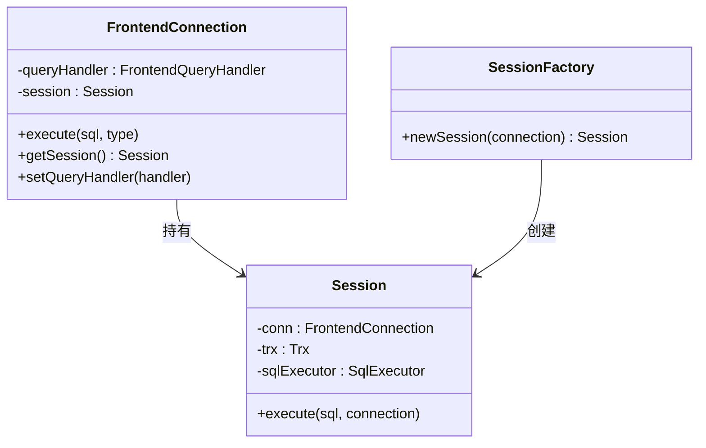
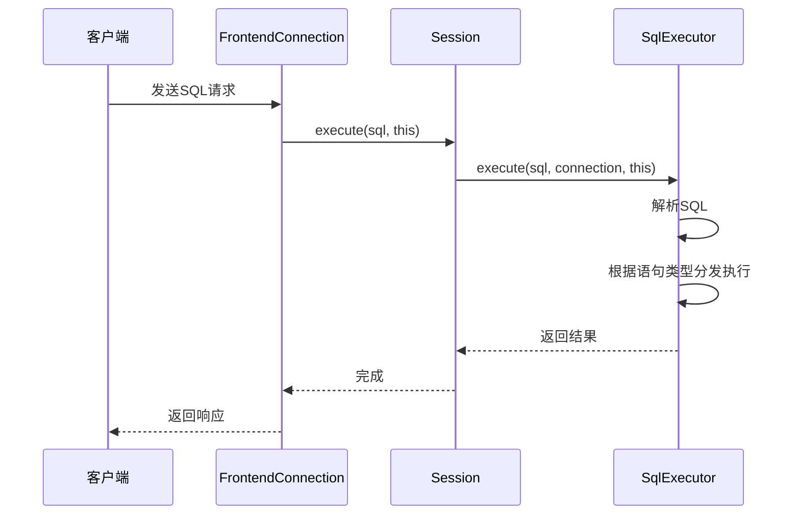
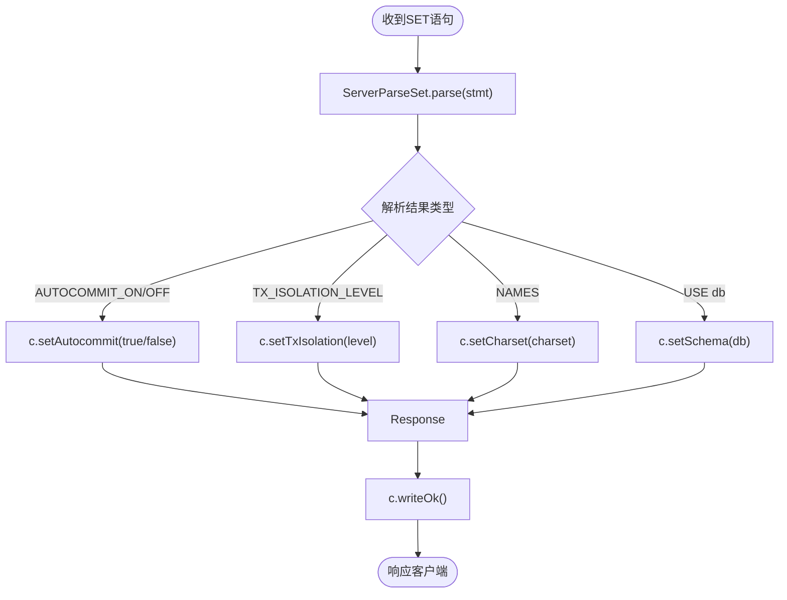
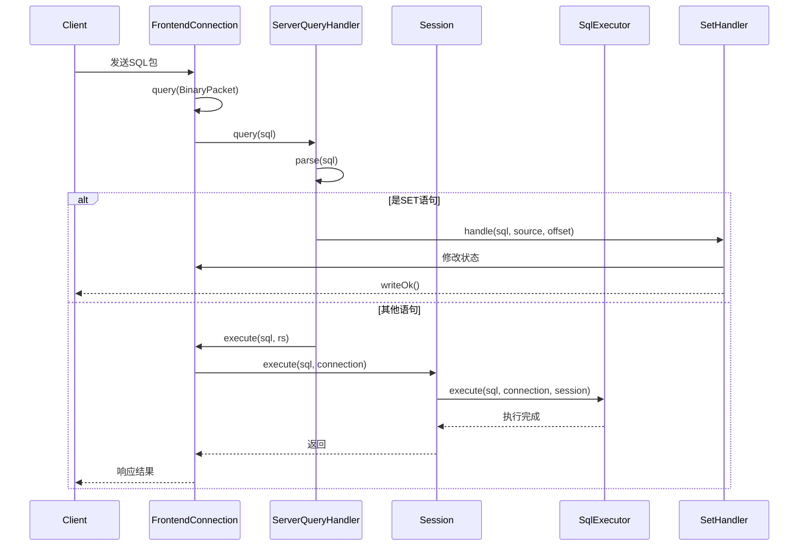
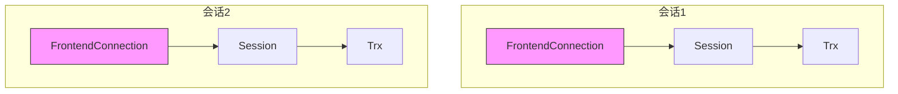

# 连接上下文管理

<cite>
**本文档中引用的文件**  
- [Session.java](file://src/main/java/alchemystar/freedom/engine/session/Session.java)
- [FrontendConnection.java](file://src/main/java/alchemystar/freedom/engine/net/handler/frontend/FrontendConnection.java)
- [SqlExecutor.java](file://src/main/java/alchemystar/freedom/sql/SqlExecutor.java)
- [ServerQueryHandler.java](file://src/main/java/alchemystar/freedom/engine/net/handler/frontend/ServerQueryHandler.java)
- [SetHandler.java](file://src/main/java/alchemystar/freedom/engine/net/handler/frontend/SetHandler.java)
- [ServerParseSet.java](file://src/main/java/alchemystar/freedom/engine/parser/ServerParseSet.java)
- [SessionFactory.java](file://src/main/java/alchemystar/freedom/engine/session/SessionFactory.java)
- [FrontConnectionFactory.java](file://src/main/java/alchemystar/freedom/engine/net/handler/factory/FrontConnectionFactory.java)
</cite>

## 目录
1. [引言](#引言)
2. [会话与连接的绑定机制](#会话与连接的绑定机制)
3. [SQL执行上下文的构建](#sql执行上下文的构建)
4. [会话级状态管理](#会话级状态管理)
5. [网络请求到会话执行的调用链](#网络请求到会话执行的调用链)
6. [并发访问与状态隔离](#并发访问与状态隔离)
7. [结论](#结论)

## 引言
在数据库系统中，会话（Session）是客户端连接与服务器执行环境之间的核心桥梁。它不仅封装了网络连接的引用，还维护了执行上下文中的各种状态信息，如当前数据库、事务隔离级别、字符集等。本文将深入分析会话如何管理连接上下文，实现网络连接与执行逻辑的绑定，并探讨其在多会话并发场景下的线程安全机制。

## 会话与连接的绑定机制

会话通过封装 `FrontendConnection` 实例，实现了网络连接与执行上下文的绑定。每个前端连接在建立时，都会通过 `SessionFactory` 创建一个对应的 `Session` 对象，并将其设置到连接中。

**图示来源**  
- [FrontendConnection.java](file://src/main/java/alchemystar/freedom/engine/net/handler/frontend/FrontendConnection.java#L1-L320)
- [Session.java](file://src/main/java/alchemystar/freedom/engine/session/Session.java#L1-L51)
- [SessionFactory.java](file://src/main/java/alchemystar/freedom/engine/session/SessionFactory.java#L1-L13)

当客户端连接建立后，`FrontConnectionFactory` 会创建 `FrontendConnection` 实例，并为其分配 `ServerQueryHandler` 和 `Session`，从而完成连接与会话的初始化绑定。

**本节来源**  
- [FrontConnectionFactory.java](file://src/main/java/alchemystar/freedom/engine/net/handler/factory/FrontConnectionFactory.java#L1-L37)
- [FrontendConnection.java](file://src/main/java/alchemystar/freedom/engine/net/handler/frontend/FrontendConnection.java#L1-L320)

## SQL执行上下文的构建

SQL语句的执行依赖于完整的执行环境，该环境由 `SqlExecutor` 组件负责构建。`Session` 的 `execute` 方法将SQL语句、连接对象和会话自身作为参数传递给 `SqlExecutor`，从而构建出完整的执行上下文。

**图示来源**  
- [Session.java](file://src/main/java/alchemystar/freedom/engine/session/Session.java#L45-L50)
- [SqlExecutor.java](file://src/main/java/alchemystar/freedom/sql/SqlExecutor.java#L1-L51)

`SqlExecutor` 接收三个关键参数：SQL语句字符串、`FrontendConnection` 连接对象和 `Session` 会话实例。这种设计使得执行器既能访问网络连接以返回结果，又能利用会话中的事务状态和上下文信息进行操作。

**本节来源**  
- [Session.java](file://src/main/java/alchemystar/freedom/engine/session/Session.java#L45-L50)
- [SqlExecutor.java](file://src/main/java/alchemystar/freedom/sql/SqlExecutor.java#L1-L51)

## 会话级状态管理

会话负责维护多个会话级别的状态变量，这些变量直接影响后续SQL语句的执行行为。其中最重要的是当前数据库（schema）、事务隔离级别和自动提交模式。

### SET语句的处理流程

当客户端执行 `SET` 语句时，请求首先由 `ServerQueryHandler` 分发至 `SetHandler.handle()` 方法。该方法调用 `ServerParseSet.parse()` 解析语句类型，并根据解析结果更新连接状态。

**图示来源**  
- [ServerQueryHandler.java](file://src/main/java/alchemystar/freedom/engine/net/handler/frontend/ServerQueryHandler.java#L1-L85)
- [SetHandler.java](file://src/main/java/alchemystar/freedom/engine/net/handler/frontend/SetHandler.java#L1-L82)
- [ServerParseSet.java](file://src/main/java/alchemystar/freedom/engine/parser/ServerParseSet.java#L1-L701)

例如，`SET autocommit=0` 会调用 `FrontendConnection.setAutocommit(false)`，从而改变当前会话的自动提交状态。此后所有DML操作都将处于显式事务中，直到执行 `COMMIT` 或 `ROLLBACK`。

**本节来源**  
- [SetHandler.java](file://src/main/java/alchemystar/freedom/engine/net/handler/frontend/SetHandler.java#L23-L61)
- [ServerParseSet.java](file://src/main/java/alchemystar/freedom/engine/parser/ServerParseSet.java#L377-L409)

## 网络请求到会话执行的调用链

从网络请求到达至SQL执行完成，整个调用链路如下：

1. Netty接收到客户端数据包，触发 `FrontendConnection` 的处理逻辑
2. `FrontendConnection.query()` 方法被调用，提取SQL语句
3. 调用 `FrontendQueryHandler.query(sql)`，实际由 `ServerQueryHandler` 实现
4. `ServerQueryHandler` 根据SQL类型分发至相应处理器（如 `SetHandler`、`SelectHandler`）
5. 对于非特殊语句，调用 `source.execute(sql, rs)` 进入通用执行路径
6. `FrontendConnection.execute()` 调用 `session.execute(sql, this)`
7. `Session.execute()` 触发 `SqlExecutor.execute()` 完成最终执行

**图示来源**  
- [FrontendConnection.java](file://src/main/java/alchemystar/freedom/engine/net/handler/frontend/FrontendConnection.java#L1-L320)
- [ServerQueryHandler.java](file://src/main/java/alchemystar/freedom/engine/net/handler/frontend/ServerQueryHandler.java#L1-L85)
- [Session.java](file://src/main/java/alchemystar/freedom/engine/session/Session.java#L1-L51)

**本节来源**  
- [FrontendConnection.java](file://src/main/java/alchemystar/freedom/engine/net/handler/frontend/FrontendConnection.java#L1-L320)
- [ServerQueryHandler.java](file://src/main/java/alchemystar/freedom/engine/net/handler/frontend/ServerQueryHandler.java#L1-L85)

## 并发访问与状态隔离

系统通过以下机制确保多会话并发访问时的状态隔离：

- **每个连接独立拥有一个Session实例**：由 `SessionFactory.newSession()` 为每个 `FrontendConnection` 创建专属会话
- **状态变量作用域限定于会话内**：如 `schema`、`autocommit`、`txIsolation` 等均定义在 `FrontendConnection` 或 `Session` 中，天然实现隔离
- **无共享可变状态**：核心状态不跨会话共享，避免竞态条件
- **线程安全的连接管理**：使用 `AtomicInteger` 生成唯一连接ID，保证线程安全

**图示来源**  
- [FrontConnectionFactory.java](file://src/main/java/alchemystar/freedom/engine/net/handler/factory/FrontConnectionFactory.java#L1-L37)
- [Session.java](file://src/main/java/alchemystar/freedom/engine/session/Session.java#L1-L51)

由于每个会话的状态完全独立，即使多个客户端同时执行 `USE db1` 和 `USE db2`，也不会相互干扰，实现了良好的隔离性。

**本节来源**  
- [FrontConnectionFactory.java](file://src/main/java/alchemystar/freedom/engine/net/handler/factory/FrontConnectionFactory.java#L1-L37)
- [FrontendConnection.java](file://src/main/java/alchemystar/freedom/engine/net/handler/frontend/FrontendConnection.java#L1-L320)

## 结论
会话在数据库系统中扮演着连接上下文管理的核心角色。它通过封装 `FrontendConnection` 实现网络连接与执行环境的绑定，利用 `SqlExecutor` 构建完整的SQL执行上下文，并维护会话级状态以影响后续操作。通过清晰的调用链路和严格的隔离机制，系统确保了多会话并发访问时的正确性和安全性。这种设计模式体现了典型的上下文驱动架构，为数据库服务的稳定运行提供了坚实基础。