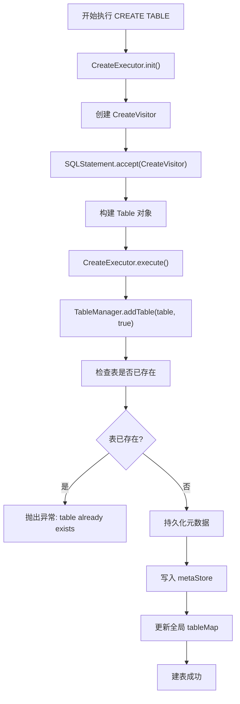
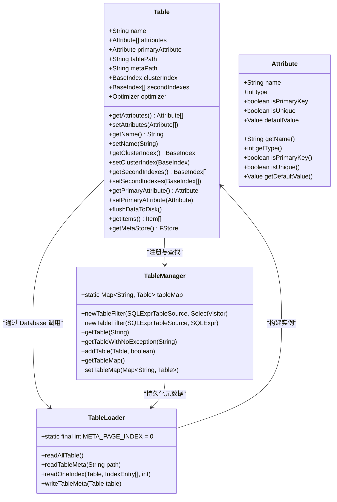
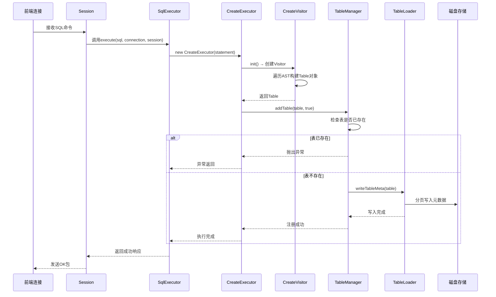
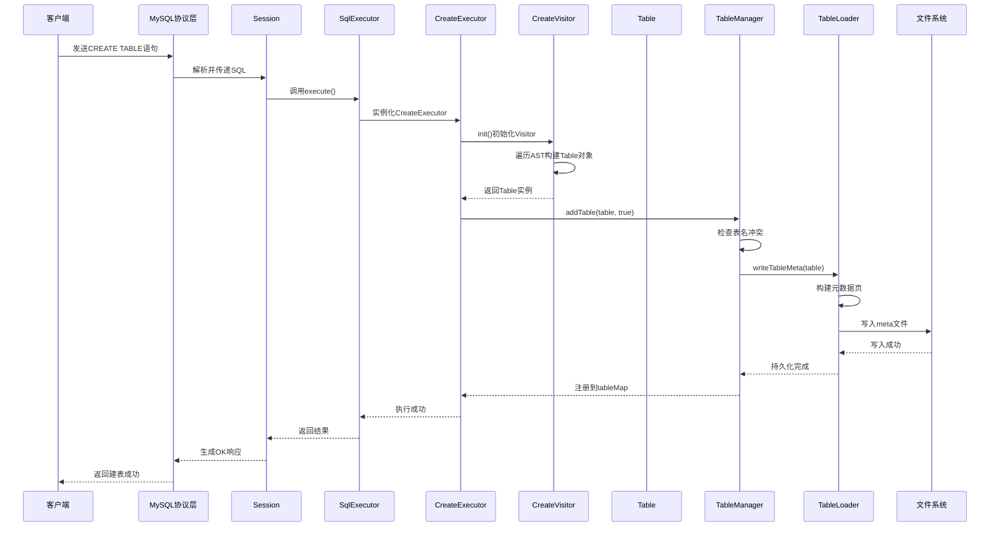

# DDL执行

<cite>
**本文档中引用的文件**  
- [CreateExecutor.java](file://src/main/java/alchemystar/freedom/sql/CreateExecutor.java)
- [CreateVisitor.java](file://src/main/java/alchemystar/freedom/sql/parser/CreateVisitor.java)
- [Table.java](file://src/main/java/alchemystar/freedom/meta/Table.java)
- [TableLoader.java](file://src/main/java/alchemystar/freedom/meta/TableLoader.java)
- [TableManager.java](file://src/main/java/alchemystar/freedom/meta/TableManager.java)
- [BPTree.java](file://src/main/java/alchemystar/freedom/index/bp/BPTree.java)
- [Trx.java](file://src/main/java/alchemystar/freedom/transaction/Trx.java)
- [TrxManager.java](file://src/main/java/alchemystar/freedom/transaction/TrxManager.java)
</cite>

## 目录
1. [简介](#简介)
2. [核心组件](#核心组件)
3. [执行流程分析](#执行流程分析)
4. [元数据构建与持久化](#元数据构建与持久化)
5. [索引结构初始化](#索引结构初始化)
6. [事务与异常处理](#事务与异常处理)
7. [时序图：建表操作完整路径](#时序图建表操作完整路径)
8. [原子性保障策略](#原子性保障策略)
9. [结论](#结论)

## 简介
本文档详细阐述了在Freedom数据库引擎中，`CREATE TABLE`等DDL语句的执行流程。重点围绕`CreateExecutor`类展开，说明其如何解析建表语句、构建表元数据对象，并通过`TableLoader`将元数据持久化到存储层。同时描述了表结构定义与索引配置之间的映射关系，以及B+树索引结构的初始化过程。结合代码逻辑，分析字段类型校验、主键约束设置和默认值处理机制。此外，还解释了执行过程中与元数据管理模块的交互方式，包括异常处理（如表已存在）和事务边界控制。最后提供完整的时序图，展示从SQL解析到元数据落盘的全过程，并讨论DDL操作的原子性保障策略。

## 核心组件

`CreateExecutor`是DDL语句执行的核心类，负责协调建表语句的解析、元数据构建和持久化。它依赖于`CreateVisitor`进行语法树遍历，生成`Table`对象，并通过`TableManager`注册表结构。

**Section sources**
- [CreateExecutor.java](file://src/main/java/alchemystar/freedom/sql/CreateExecutor.java#L10-L30)

## 执行流程分析

`CreateExecutor`的执行流程分为两个阶段：初始化和执行。

1. **初始化阶段（init）**：创建一个`CreateVisitor`实例，接受SQL语句的抽象语法树（AST），通过访问者模式遍历AST并提取建表信息，最终生成一个完整的`Table`对象。
2. **执行阶段（execute）**：调用`TableManager.addTable()`方法，将构建好的`Table`对象添加到全局表映射中，并根据参数决定是否将其持久化到磁盘。

该流程确保了建表操作的解耦：解析逻辑由`CreateVisitor`完成，而注册与持久化由`TableManager`统一管理。



**Diagram sources**
- [CreateExecutor.java](file://src/main/java/alchemystar/freedom/sql/CreateExecutor.java#L10-L30)
- [TableManager.java](file://src/main/java/alchemystar/freedom/meta/TableManager.java#L50-L70)

## 元数据构建与持久化

### 表结构定义与索引映射

`Table`类封装了表的所有元数据信息，包括：
- 表名（name）
- 字段数组（attributes）
- 主键字段（primaryAttribute）
- 聚簇索引（clusterIndex）
- 二级索引列表（secondIndexes）

字段信息通过`Attribute`类表示，包含字段名、类型、是否为主键、是否唯一、默认值等属性。这些信息在`CreateVisitor`解析DDL语句时被填充。

### 元数据持久化机制

`TableLoader`负责元数据的序列化与反序列化。其核心方法为`writeTableMeta(Table table)`，流程如下：

1. 创建一个新页面（Page）
2. 写入元数据大小和表名
3. 写入所有字段信息（Attribute）
4. 写入索引数量
5. 写入聚簇索引和所有二级索引的元数据
6. 将页面写入指定路径的`metaStore`

反向操作`readTableMeta()`则用于系统启动时加载所有表结构。



**Diagram sources**
- [Table.java](file://src/main/java/alchemystar/freedom/meta/Table.java#L1-L172)
- [TableLoader.java](file://src/main/java/alchemystar/freedom/meta/TableLoader.java#L1-L109)
- [TableManager.java](file://src/main/java/alchemystar/freedom/meta/TableManager.java#L1-L71)

## 索引结构初始化

### B+树索引实现

`BPTree`继承自`BaseIndex`，实现了B+树索引的核心功能。其主要成员包括：
- `root`：根节点
- `head`：叶子链表头
- `nodeMap`：页号到节点的映射

在创建`BPTree`实例时，会初始化一个空的根节点（同时也是叶子节点），并设置其为链表头。

### 索引初始化流程

当`TableLoader.readOneIndex()`被调用时：
1. 读取索引名称、唯一性、是否为主键等元数据
2. 构建`Attribute`数组作为索引键
3. 创建`BPTree`实例
4. 根据`isPrimaryKey`标志设置是否为主键索引
5. 若`clusterIndex`为空，则设为聚簇索引；否则加入`secondIndexes`列表

聚簇索引的叶子节点直接存储完整行数据，而二级索引仅存储索引键和主键值，通过主键回表查询。



**Diagram sources**
- [CreateExecutor.java](file://src/main/java/alchemystar/freedom/sql/CreateExecutor.java#L10-L30)
- [TableManager.java](file://src/main/java/alchemystar/freedom/meta/TableManager.java#L50-L70)
- [TableLoader.java](file://src/main/java/alchemystar/freedom/meta/TableLoader.java#L80-L109)

## 事务与异常处理

### 异常处理机制

在`TableManager.addTable()`中实现了关键的异常检测：
```java
if (tableMap.get(table.getName()) != null) {
    throw new RuntimeException("table " + table.getName() + " already exists");
}
```
此检查防止重复建表，确保表名的全局唯一性。

### 事务边界控制

尽管当前代码中DDL操作未显式包裹在事务中，但可通过`Trx`机制实现事务性DDL。`Trx`类支持记录日志（addLog）、提交（commit）和回滚（rollback）。理想情况下，建表操作应：
1. 在事务开始后执行
2. 元数据写入前记录`CREATE_TABLE`类型的日志
3. 成功则提交，失败则回滚并删除部分写入的文件

目前`CreateExecutor`直接调用持久化方法，缺乏回滚能力，属于非事务性DDL。

**Section sources**
- [TableManager.java](file://src/main/java/alchemystar/freedom/meta/TableManager.java#L50-L70)
- [Trx.java](file://src/main/java/alchemystar/freedom/transaction/Trx.java#L1-L119)
- [TrxManager.java](file://src/main/java/alchemystar/freedom/transaction/TrxManager.java#L1-L22)

## 时序图：建表操作完整路径



**Diagram sources**
- [CreateExecutor.java](file://src/main/java/alchemystar/freedom/sql/CreateExecutor.java#L10-L30)
- [TableManager.java](file://src/main/java/alchemystar/freedom/meta/TableManager.java#L50-L70)
- [TableLoader.java](file://src/main/java/alchemystar/freedom/meta/TableLoader.java#L80-L109)

## 原子性保障策略

当前实现的DDL操作**不具备原子性**，主要体现在：

1. **无事务包裹**：`CreateExecutor`直接调用`writeTableMeta()`，一旦写入中途失败，可能留下残缺的元数据文件。
2. **无回滚机制**：若建表后插入数据失败，无法自动删除已创建的表。
3. **文件系统级风险**：元数据写入依赖于文件系统的原子性，但多页写入无法保证整体原子。

### 改进建议

为实现原子性DDL，应引入事务机制：
- 使用`TrxManager.newTrx()`创建事务
- 将元数据写入操作纳入事务日志
- 提交时确保日志先落盘（WAL）
- 支持崩溃恢复时重做或撤销DDL操作

此外，可采用“两阶段提交”思想：
1. 预写阶段：将新表元数据写入临时文件
2. 提交阶段：原子性地重命名临时文件为正式文件

**Section sources**
- [Trx.java](file://src/main/java/alchemystar/freedom/transaction/Trx.java#L1-L119)
- [TableLoader.java](file://src/main/java/alchemystar/freedom/meta/TableLoader.java#L80-L109)

## 结论

`CreateExecutor`作为DDL执行的核心，完成了从SQL解析到元数据注册的桥梁作用。通过`CreateVisitor`构建`Table`对象，利用`TableManager`和`TableLoader`实现内存注册与磁盘持久化。B+树索引由`BPTree`实现，支持聚簇与二级索引的初始化。然而，当前DDL操作缺乏事务支持，存在原子性缺陷。未来应结合`Trx`事务系统，实现日志先行（WAL）和崩溃恢复机制，以提供强一致性的DDL语义保障。