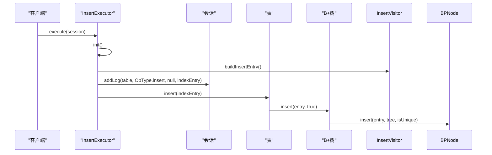
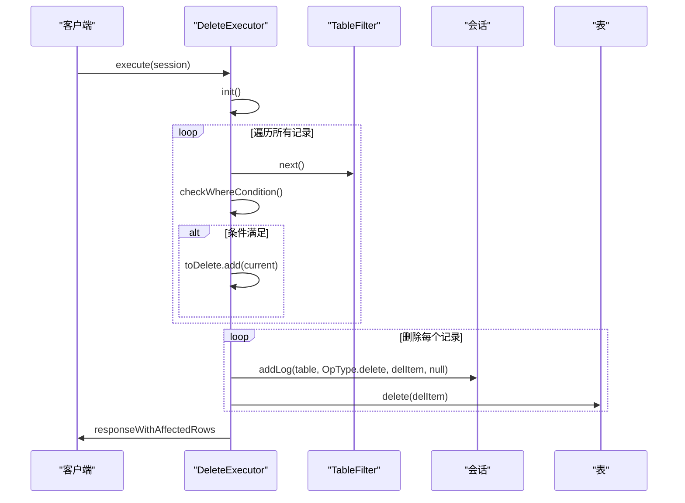
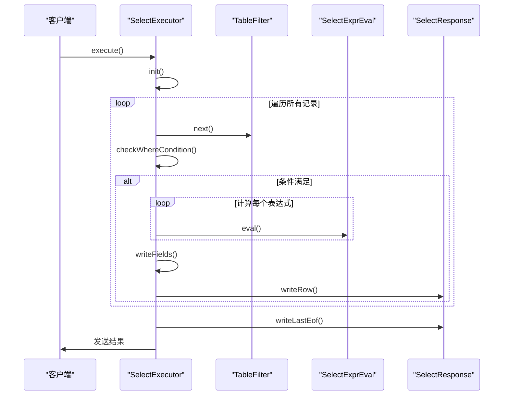
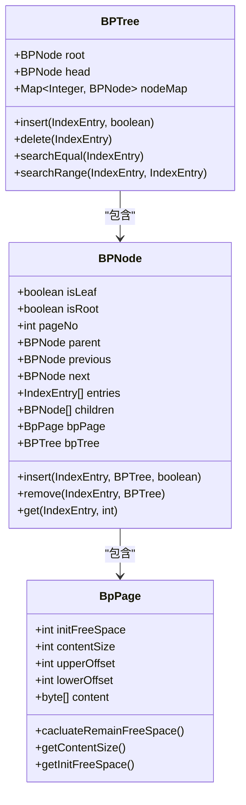
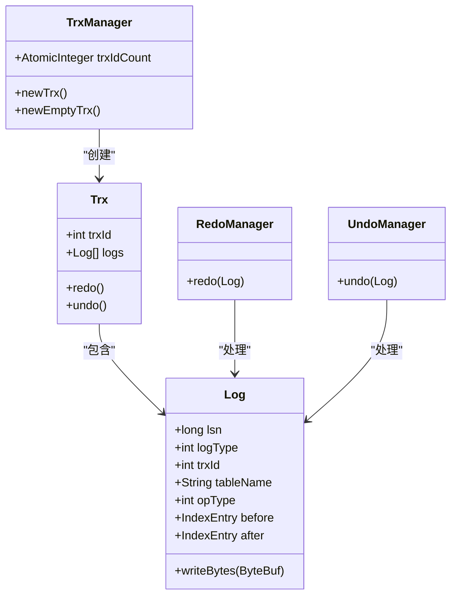
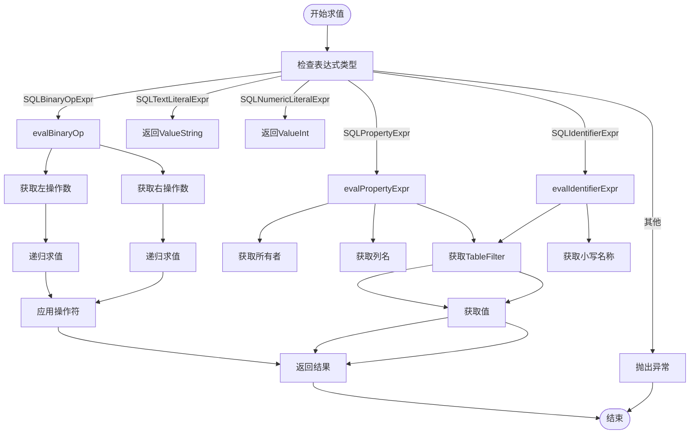
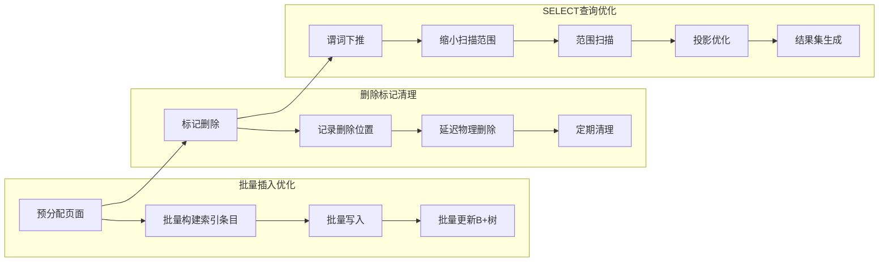

# DML执行

<cite>
**本文档中引用的文件**   
- [InsertExecutor.java](file://src/main/java/alchemystar/freedom/sql/InsertExecutor.java)
- [DeleteExecutor.java](file://src/main/java/alchemystar/freedom/sql/DeleteExecutor.java)
- [SelectExecutor.java](file://src/main/java/alchemystar/freedom/sql/SelectExecutor.java)
- [BPTree.java](file://src/main/java/alchemystar/freedom/index/bp/BPTree.java)
- [BPNode.java](file://src/main/java/alchemystar/freedom/index/bp/BPNode.java)
- [TrxManager.java](file://src/main/java/alchemystar/freedom/transaction/TrxManager.java)
- [TableFilter.java](file://src/main/java/alchemystar/freedom/sql/select/TableFilter.java)
- [SelectExprEval.java](file://src/main/java/alchemystar/freedom/sql/select/item/SelectExprEval.java)
</cite>

## 目录
1. [DML执行机制概述](#dml执行机制概述)
2. [InsertExecutor执行流程](#insertexecutor执行流程)
3. [DeleteExecutor执行流程](#deleteexecutor执行流程)
4. [SelectExecutor执行流程](#selectexecutor执行流程)
5. [B+树索引交互机制](#b树索引交互机制)
6. [事务日志管理](#事务日志管理)
7. [SQL表达式求值与错误处理](#sql表达式求值与错误处理)
8. [性能优化策略](#性能优化策略)

## DML执行机制概述

DML（数据操作语言）执行机制是数据库系统的核心功能之一，负责处理INSERT、DELETE和SELECT等数据操作语句。在Freedom数据库系统中，DML执行器通过与B+树索引的紧密交互，实现了高效的数据操作。执行器首先解析SQL语句，然后根据操作类型调用相应的执行器类，这些执行器负责将操作转换为对底层存储结构的具体操作。整个执行过程在事务上下文中进行，确保了ACID特性。

**Section sources**
- [InsertExecutor.java](file://src/main/java/alchemystar/freedom/sql/InsertExecutor.java#L1-L38)
- [DeleteExecutor.java](file://src/main/java/alchemystar/freedom/sql/DeleteExecutor.java#L1-L74)
- [SelectExecutor.java](file://src/main/java/alchemystar/freedom/sql/SelectExecutor.java#L1-L122)

## InsertExecutor执行流程

InsertExecutor负责处理INSERT语句的执行。其执行流程始于SQL语句的解析，通过InsertVisitor构建要插入的索引条目（IndexEntry）。在执行过程中，首先检查会话是否存在，如果存在则将插入操作记录到事务日志中。然后，将构建好的索引条目插入到表中。插入操作遵循"先落盘再对索引做操作"的原则，确保数据的一致性和持久性。

**Diagram sources**
- [InsertExecutor.java](file://src/main/java/alchemystar/freedom/sql/InsertExecutor.java#L12-L38)
- [Table.java](file://src/main/java/alchemystar/freedom/meta/Table.java#L64-L71)

**Section sources**
- [InsertExecutor.java](file://src/main/java/alchemystar/freedom/sql/InsertExecutor.java#L12-L38)
- [Table.java](file://src/main/java/alchemystar/freedom/meta/Table.java#L64-L71)

## DeleteExecutor执行流程

DeleteExecutor负责处理DELETE语句的执行。其执行流程包括解析SQL语句、构建表过滤器（TableFilter）、评估WHERE条件以及执行删除操作。在删除过程中，首先通过TableFilter遍历符合条件的记录，并将这些记录收集到待删除列表中。然后，对每个待删除的记录，先将其删除操作记录到事务日志中，再从表中实际删除。这种"先拿出来再删除"的策略避免了删除过程中位置变化引起的问题。

**Diagram sources**
- [DeleteExecutor.java](file://src/main/java/alchemystar/freedom/sql/DeleteExecutor.java#L22-L73)
- [Table.java](file://src/main/java/alchemystar/freedom/meta/Table.java#L73-L79)

**Section sources**
- [DeleteExecutor.java](file://src/main/java/alchemystar/freedom/sql/DeleteExecutor.java#L22-L73)
- [Table.java](file://src/main/java/alchemystar/freedom/meta/Table.java#L73-L79)

## SelectExecutor执行流程

SelectExecutor负责处理SELECT语句的执行。其执行流程包括解析SQL语句、构建表过滤器、评估WHERE条件、计算投影表达式以及生成结果集。在查询过程中，通过TableFilter遍历符合条件的记录，对每条记录评估WHERE条件，如果条件满足则计算SELECT列表中的表达式，并将结果写入响应。查询结果通过MySQL协议的响应包发送给客户端，包括字段信息、数据行和结束标记。

**Diagram sources**
- [SelectExecutor.java](file://src/main/java/alchemystar/freedom/sql/SelectExecutor.java#L21-L121)
- [TableFilter.java](file://src/main/java/alchemystar/freedom/sql/select/TableFilter.java#L40-L40)

**Section sources**
- [SelectExecutor.java](file://src/main/java/alchemystar/freedom/sql/SelectExecutor.java#L21-L121)
- [TableFilter.java](file://src/main/java/alchemystar/freedom/sql/select/TableFilter.java#L40-L40)

## B+树索引交互机制

B+树索引是Freedom数据库系统的核心数据结构，负责高效地存储和检索数据。BPTree类实现了B+树的基本操作，包括插入、删除和搜索。BPNode类表示B+树的节点，可以是内部节点或叶子节点。在插入操作中，如果节点空间不足，会触发节点分裂；在删除操作中，如果节点元素过少，会触发节点合并或借补。这种动态调整机制确保了B+树的平衡性，从而保证了O(log n)的查询性能。

**Diagram sources**
- [BPTree.java](file://src/main/java/alchemystar/freedom/index/bp/BPTree.java#L27-L276)
- [BPNode.java](file://src/main/java/alchemystar/freedom/index/bp/BPNode.java#L38-L799)

**Section sources**
- [BPTree.java](file://src/main/java/alchemystar/freedom/index/bp/BPTree.java#L27-L276)
- [BPNode.java](file://src/main/java/alchemystar/freedom/index/bp/BPNode.java#L38-L799)

## 事务日志管理

事务日志管理是确保数据库ACID特性的关键机制。TrxManager负责管理事务的生命周期，为每个事务分配唯一的事务ID。在DML操作执行时，会将操作记录到事务日志中，包括操作类型、表名、操作前后的数据状态等信息。这些日志用于实现事务的redo和undo操作，确保在系统崩溃后能够恢复到一致状态。日志记录遵循WAL（Write-Ahead Logging）原则，即在数据修改前先写入日志。

**Diagram sources**
- [TrxManager.java](file://src/main/java/alchemystar/freedom/transaction/TrxManager.java#L7-L21)
- [Log.java](file://src/main/java/alchemystar/freedom/transaction/log/Log.java#L5-L149)

**Section sources**
- [TrxManager.java](file://src/main/java/alchemystar/freedom/transaction/TrxManager.java#L7-L21)
- [Log.java](file://src/main/java/alchemystar/freedom/transaction/log/Log.java#L5-L149)

## SQL表达式求值与错误处理

SQL表达式求值是DML执行过程中的重要环节，负责计算SELECT列表中的表达式和WHERE条件中的布尔表达式。SelectExprEval类实现了表达式求值功能，支持基本的算术运算、比较运算和逻辑运算。在求值过程中，如果遇到不支持的操作或类型不匹配的情况，会抛出运行时异常。错误处理机制确保了SQL语句的正确性，防止了无效操作对数据库状态的破坏。

**Diagram sources**
- [SelectExprEval.java](file://src/main/java/alchemystar/freedom/sql/select/item/SelectExprEval.java#L31-L86)
- [WhereVisitor.java](file://src/main/java/alchemystar/freedom/sql/parser/WhereVisitor.java#L34-L65)

**Section sources**
- [SelectExprEval.java](file://src/main/java/alchemystar/freedom/sql/select/item/SelectExprEval.java#L31-L86)
- [WhereVisitor.java](file://src/main/java/alchemystar/freedom/sql/parser/WhereVisitor.java#L34-L65)

## 性能优化策略

Freedom数据库系统采用了多种性能优化策略来提高DML操作的效率。对于批量插入，系统通过预分配页面和批量写入来减少I/O开销。删除操作采用标记删除机制，延迟物理删除以避免频繁的B+树结构调整。SELECT查询通过谓词下推和范围扫描优化来缩小搜索空间，减少不必要的数据访问。此外，系统还利用B+树的有序性来优化范围查询和排序操作。

**Diagram sources**
- [README.md](file://README.md#L32-L44)
- [TableFilter.java](file://src/main/java/alchemystar/freedom/sql/select/TableFilter.java#L126-L152)

**Section sources**
- [README.md](file://README.md#L32-L44)
- [TableFilter.java](file://src/main/java/alchemystar/freedom/sql/select/TableFilter.java#L126-L152)