# 执行引擎

<cite>
**本文档引用的文件**
- [SqlExecutor.java](file://src/main/java/alchemystar/freedom/sql/SqlExecutor.java)
- [CreateExecutor.java](file://src/main/java/alchemystar/freedom/sql/CreateExecutor.java)
- [InsertExecutor.java](file://src/main/java/alchemystar/freedom/sql/InsertExecutor.java)
- [SelectExecutor.java](file://src/main/java/alchemystar/freedom/sql/SelectExecutor.java)
- [BPTree.java](file://src/main/java/alchemystar/freedom/index/bp/BPTree.java)
- [TrxManager.java](file://src/main/java/alchemystar/freedom/transaction/TrxManager.java)
- [TableManager.java](file://src/main/java/alchemystar/freedom/meta/TableManager.java)
- [Table.java](file://src/main/java/alchemystar/freedom/meta/Table.java)
- [CreateVisitor.java](file://src/main/java/alchemystar/freedom/sql/parser/CreateVisitor.java)
- [InsertVisitor.java](file://src/main/java/alchemystar/freedom/sql/parser/InsertVisitor.java)
- [SelectVisitor.java](file://src/main/java/alchemystar/freedom/sql/parser/SelectVisitor.java)
- [Session.java](file://src/main/java/alchemystar/freedom/engine/session/Session.java)
- [Trx.java](file://src/main/java/alchemystar/freedom/transaction/Trx.java)
</cite>

## 目录
1. [简介](#简介)
2. [执行引擎架构](#执行引擎架构)
3. [核心执行器分析](#核心执行器分析)
4. [执行器与存储层交互](#执行器与存储层交互)
5. [执行器与事务管理器交互](#执行器与事务管理器交互)
6. [典型SQL语句执行流程](#典型sql语句执行流程)
7. [性能瓶颈与优化策略](#性能瓶颈与优化策略)
8. [结论](#结论)

## 简介
执行引擎是数据库系统的核心组件，负责解析SQL语句并执行相应的操作。本文档深入解析执行引擎的架构设计与调度机制，以SqlExecutor为入口，详细说明各执行器的职责划分、实现细节以及与存储层和事务管理器的交互方式。

## 执行引擎架构

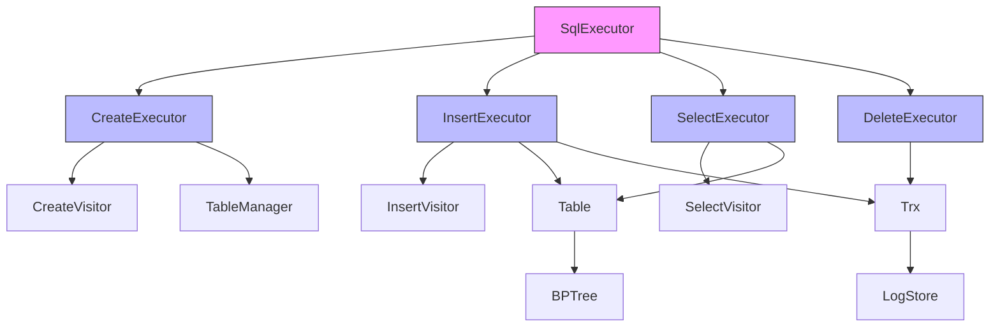

**图示来源**
- [SqlExecutor.java](file://src/main/java/alchemystar/freedom/sql/SqlExecutor.java)
- [CreateExecutor.java](file://src/main/java/alchemystar/freedom/sql/CreateExecutor.java)
- [InsertExecutor.java](file://src/main/java/alchemystar/freedom/sql/InsertExecutor.java)
- [SelectExecutor.java](file://src/main/java/alchemystar/freedom/sql/SelectExecutor.java)
- [Table.java](file://src/main/java/alchemystar/freedom/meta/Table.java)
- [BPTree.java](file://src/main/java/alchemystar/freedom/index/bp/BPTree.java)
- [Trx.java](file://src/main/java/alchemystar/freedom/transaction/Trx.java)

**本节来源**
- [SqlExecutor.java](file://src/main/java/alchemystar/freedom/sql/SqlExecutor.java#L16-L49)

## 核心执行器分析

### SqlExecutor调度机制
SqlExecutor作为执行引擎的入口点，根据SQL语句类型调度相应的执行器。它使用Druid SQL解析器解析SQL语句，并根据解析结果实例化对应的执行器。

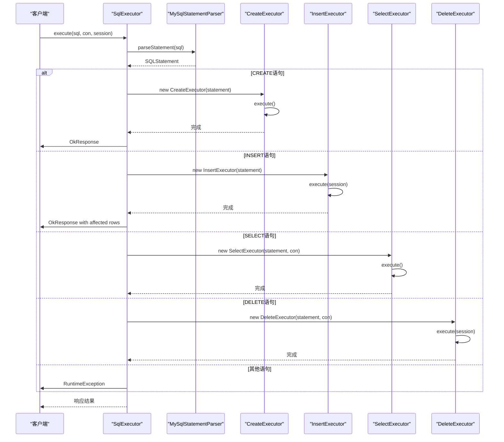

**图示来源**
- [SqlExecutor.java](file://src/main/java/alchemystar/freedom/sql/SqlExecutor.java#L16-L49)

**本节来源**
- [SqlExecutor.java](file://src/main/java/alchemystar/freedom/sql/SqlExecutor.java#L16-L49)

### CreateExecutor实现细节
CreateExecutor负责处理CREATE TABLE语句，通过CreateVisitor解析表结构定义，并使用TableManager创建新表。

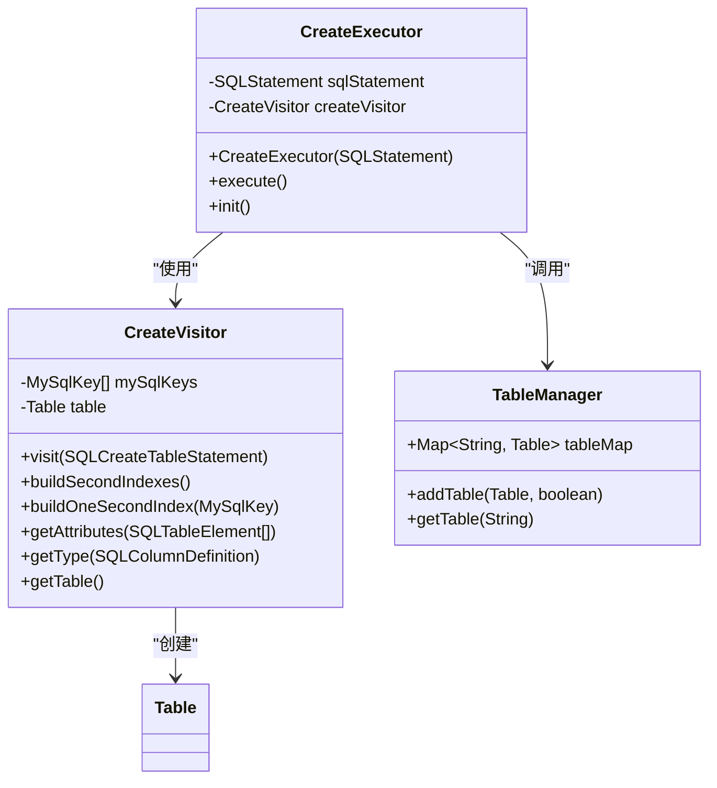

**图示来源**
- [CreateExecutor.java](file://src/main/java/alchemystar/freedom/sql/CreateExecutor.java)
- [CreateVisitor.java](file://src/main/java/alchemystar/freedom/sql/parser/CreateVisitor.java)
- [TableManager.java](file://src/main/java/alchemystar/freedom/meta/TableManager.java)

**本节来源**
- [CreateExecutor.java](file://src/main/java/alchemystar/freedom/sql/CreateExecutor.java#L10-L30)
- [CreateVisitor.java](file://src/main/java/alchemystar/freedom/sql/parser/CreateVisitor.java)

### InsertExecutor实现细节
InsertExecutor处理INSERT语句，通过InsertVisitor解析插入数据，并将数据写入表中，同时记录事务日志。

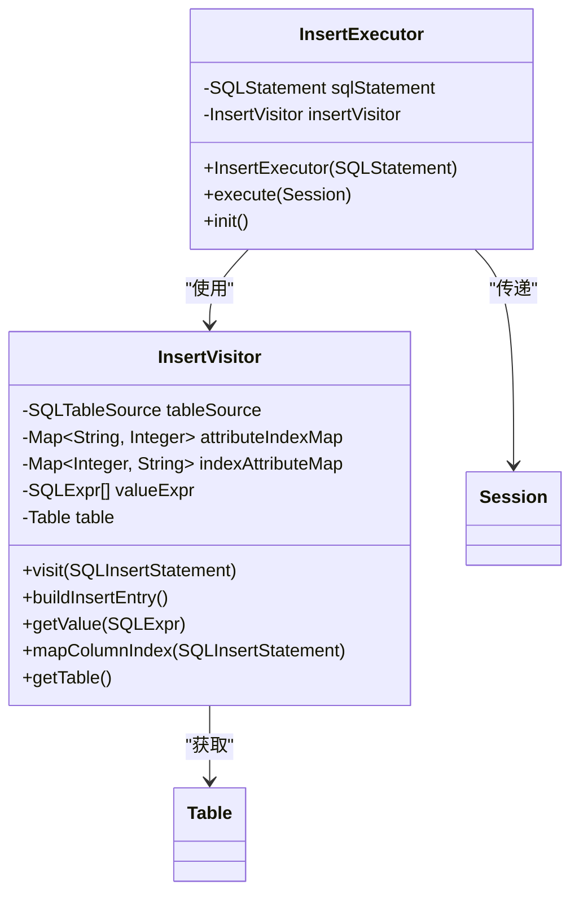

**图示来源**
- [InsertExecutor.java](file://src/main/java/alchemystar/freedom/sql/InsertExecutor.java)
- [InsertVisitor.java](file://src/main/java/alchemystar/freedom/sql/parser/InsertVisitor.java)

**本节来源**
- [InsertExecutor.java](file://src/main/java/alchemystar/freedom/sql/InsertExecutor.java#L12-L38)
- [InsertVisitor.java](file://src/main/java/alchemystar/freedom/sql/parser/InsertVisitor.java)

### SelectExecutor实现细节
SelectExecutor处理SELECT语句，通过SelectVisitor解析查询条件，并协调查询流程，生成结果集。

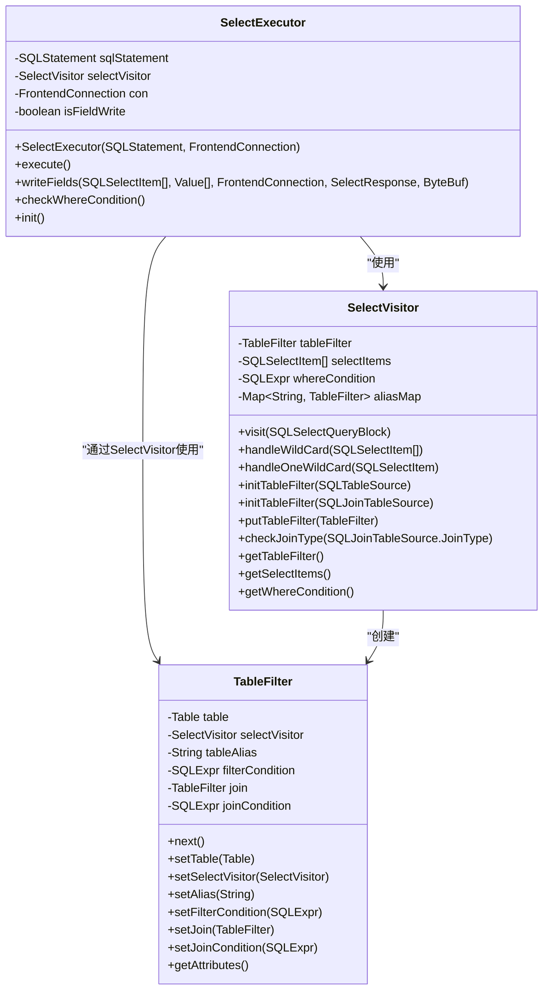

**图示来源**
- [SelectExecutor.java](file://src/main/java/alchemystar/freedom/sql/SelectExecutor.java)
- [SelectVisitor.java](file://src/main/java/alchemystar/freedom/sql/parser/SelectVisitor.java)
- [TableFilter.java](file://src/main/java/alchemystar/freedom/sql/select/TableFilter.java)

**本节来源**
- [SelectExecutor.java](file://src/main/java/alchemystar/freedom/sql/SelectExecutor.java#L21-L121)
- [SelectVisitor.java](file://src/main/java/alchemystar/freedom/sql/parser/SelectVisitor.java)

## 执行器与存储层交互

### BPTree索引结构
B+树是数据库的核心索引结构，提供高效的查找、插入和删除操作。BPTree实现了Index接口，支持等值查询、范围查询和批量操作。

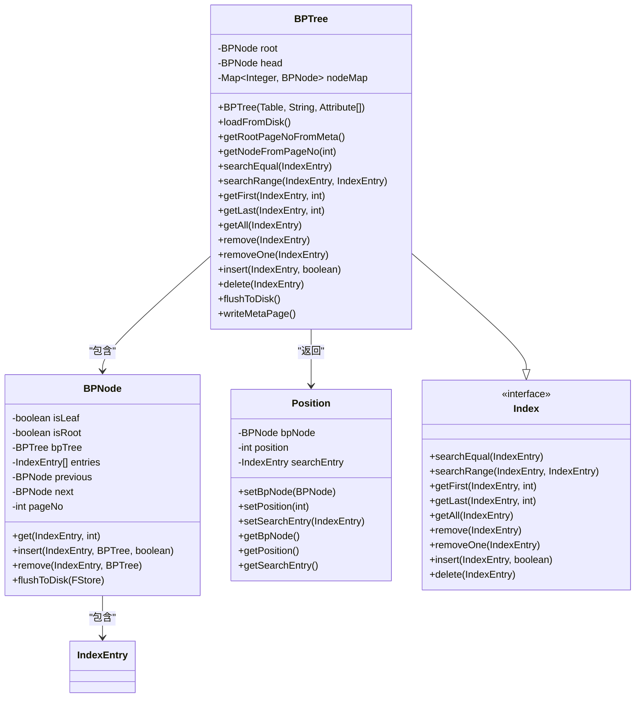

**图示来源**
- [BPTree.java](file://src/main/java/alchemystar/freedom/index/bp/BPTree.java)
- [BPNode.java](file://src/main/java/alchemystar/freedom/index/bp/BPNode.java)
- [Position.java](file://src/main/java/alchemystar/freedom/index/bp/Position.java)
- [Index.java](file://src/main/java/alchemystar/freedom/index/Index.java)

**本节来源**
- [BPTree.java](file://src/main/java/alchemystar/freedom/index/bp/BPTree.java)
- [Table.java](file://src/main/java/alchemystar/freedom/meta/Table.java)

### 表结构与数据存储
Table类封装了表的元数据和数据存储，通过聚簇索引和二级索引管理数据的物理存储。

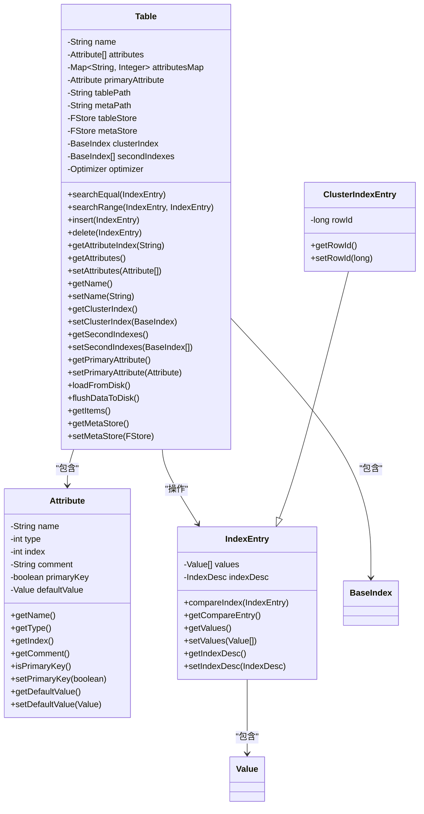

**图示来源**
- [Table.java](file://src/main/java/alchemystar/freedom/meta/Table.java)
- [Attribute.java](file://src/main/java/alchemystar/freedom/meta/Attribute.java)
- [IndexEntry.java](file://src/main/java/alchemystar/freedom/meta/IndexEntry.java)
- [ClusterIndexEntry.java](file://src/main/java/alchemystar/freedom/meta/ClusterIndexEntry.java)

**本节来源**
- [Table.java](file://src/main/java/alchemystar/freedom/meta/Table.java)
- [Attribute.java](file://src/main/java/alchemystar/freedom/meta/Attribute.java)

## 执行器与事务管理器交互

### 事务管理器架构
TrxManager负责创建和管理事务，为每个事务分配唯一的事务ID。

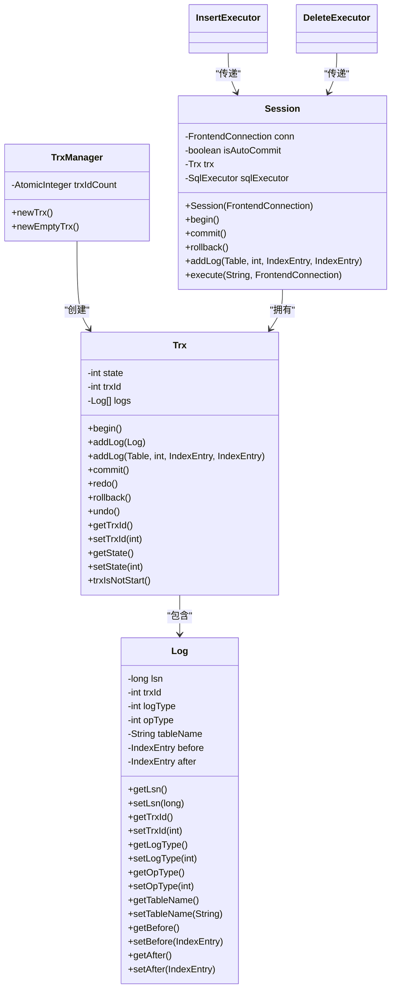

**图示来源**
- [TrxManager.java](file://src/main/java/alchemystar/freedom/transaction/TrxManager.java)
- [Trx.java](file://src/main/java/alchemystar/freedom/transaction/Trx.java)
- [Session.java](file://src/main/java/alchemystar/freedom/engine/session/Session.java)

**本节来源**
- [TrxManager.java](file://src/main/java/alchemystar/freedom/transaction/TrxManager.java)
- [Trx.java](file://src/main/java/alchemystar/freedom/transaction/Trx.java)
- [Session.java](file://src/main/java/alchemystar/freedom/engine/session/Session.java)

### 事务日志与恢复机制
事务通过日志实现ACID特性，支持崩溃恢复和事务回滚。

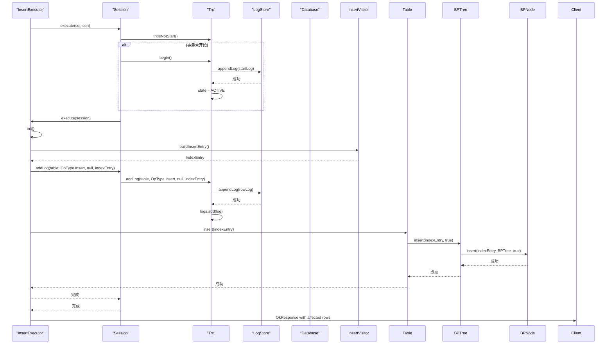

**图示来源**
- [InsertExecutor.java](file://src/main/java/alchemystar/freedom/sql/InsertExecutor.java)
- [Session.java](file://src/main/java/alchemystar/freedom/engine/session/Session.java)
- [Trx.java](file://src/main/java/alchemystar/freedom/transaction/Trx.java)
- [LogStore.java](file://src/main/java/alchemystar/freedom/store/log/LogStore.java)
- [Table.java](file://src/main/java/alchemystar/freedom/meta/Table.java)
- [BPTree.java](file://src/main/java/alchemystar/freedom/index/bp/BPTree.java)

**本节来源**
- [InsertExecutor.java](file://src/main/java/alchemystar/freedom/sql/InsertExecutor.java#L12-L38)
- [Session.java](file://src/main/java/alchemystar/freedom/engine/session/Session.java)
- [Trx.java](file://src/main/java/alchemystar/freedom/transaction/Trx.java)

## 典型SQL语句执行流程

### CREATE TABLE执行流程
CREATE TABLE语句的执行流程包括语法解析、表结构创建和元数据持久化。

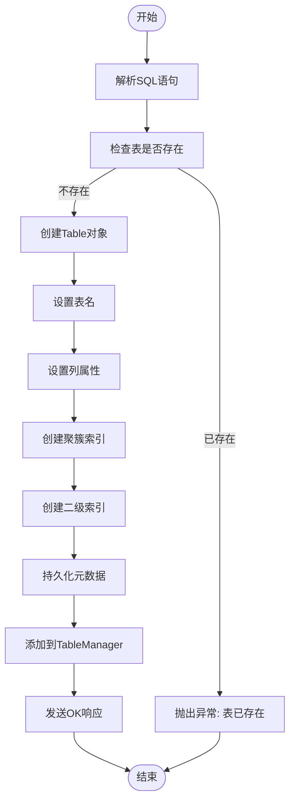

**图示来源**
- [SqlExecutor.java](file://src/main/java/alchemystar/freedom/sql/SqlExecutor.java)
- [CreateExecutor.java](file://src/main/java/alchemystar/freedom/sql/CreateExecutor.java)
- [CreateVisitor.java](file://src/main/java/alchemystar/freedom/sql/parser/CreateVisitor.java)
- [TableManager.java](file://src/main/java/alchemystar/freedom/meta/TableManager.java)

**本节来源**
- [CreateExecutor.java](file://src/main/java/alchemystar/freedom/sql/CreateExecutor.java#L10-L30)
- [CreateVisitor.java](file://src/main/java/alchemystar/freedom/sql/parser/CreateVisitor.java)

### INSERT执行流程
INSERT语句的执行流程包括语法解析、数据准备、事务日志记录和数据插入。

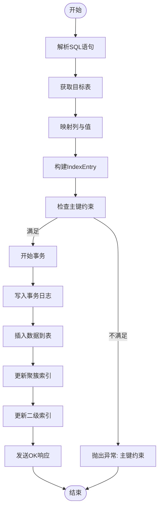

**图示来源**
- [SqlExecutor.java](file://src/main/java/alchemystar/freedom/sql/SqlExecutor.java)
- [InsertExecutor.java](file://src/main/java/alchemystar/freedom/sql/InsertExecutor.java)
- [InsertVisitor.java](file://src/main/java/alchemystar/freedom/sql/parser/InsertVisitor.java)
- [Table.java](file://src/main/java/alchemystar/freedom/meta/Table.java)
- [BPTree.java](file://src/main/java/alchemystar/freedom/index/bp/BPTree.java)

**本节来源**
- [InsertExecutor.java](file://src/main/java/alchemystar/freedom/sql/InsertExecutor.java#L12-L38)
- [InsertVisitor.java](file://src/main/java/alchemystar/freedom/sql/parser/InsertVisitor.java)

### SELECT执行流程
SELECT语句的执行流程包括语法解析、查询计划生成、数据检索和结果集生成。

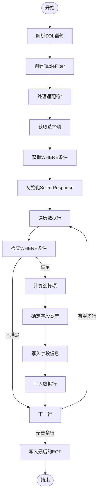

**图示来源**
- [SqlExecutor.java](file://src/main/java/alchemystar/freedom/sql/SqlExecutor.java)
- [SelectExecutor.java](file://src/main/java/alchemystar/freedom/sql/SelectExecutor.java)
- [SelectVisitor.java](file://src/main/java/alchemystar/freedom/sql/parser/SelectVisitor.java)
- [TableFilter.java](file://src/main/java/alchemystar/freedom/sql/select/TableFilter.java)
- [SelectResponse.java](file://src/main/java/alchemystar/freedom/engine/net/response/SelectResponse.java)

**本节来源**
- [SelectExecutor.java](file://src/main/java/alchemystar/freedom/sql/SelectExecutor.java#L21-L121)
- [SelectVisitor.java](file://src/main/java/alchemystar/freedom/sql/parser/SelectVisitor.java)

## 性能瓶颈与优化策略

### 性能瓶颈分析
执行引擎在高并发场景下可能遇到多种性能瓶颈，主要包括：

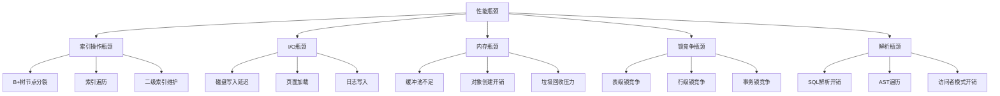

**本节来源**
- [BPTree.java](file://src/main/java/alchemystar/freedom/index/bp/BPTree.java)
- [Table.java](file://src/main/java/alchemystar/freedom/meta/Table.java)
- [Trx.java](file://src/main/java/alchemystar/freedom/transaction/Trx.java)
- [SqlExecutor.java](file://src/main/java/alchemystar/freedom/sql/SqlExecutor.java)

### 优化策略
针对上述性能瓶颈，可以采取以下优化策略：

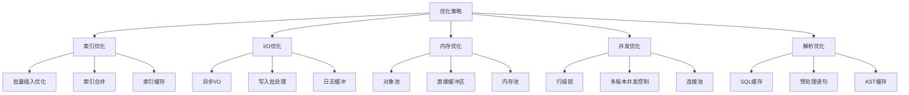

**本节来源**
- [BPTree.java](file://src/main/java/alchemystar/freedom/index/bp/BPTree.java)
- [Table.java](file://src/main/java/alchemystar/freedom/meta/Table.java)
- [Trx.java](file://src/main/java/alchemystar/freedom/transaction/Trx.java)
- [SqlExecutor.java](file://src/main/java/alchemystar/freedom/sql/SqlExecutor.java)

## 结论
执行引擎通过SqlExecutor统一调度各类执行器，实现了SQL语句的高效执行。各执行器职责明确，CreateExecutor负责表结构创建，InsertExecutor处理数据插入，SelectExecutor协调查询流程。执行器与BPTree存储层紧密协作，通过索引实现高效的数据访问。同时，执行器与Trx事务管理器集成，确保了数据的一致性和持久性。通过理解执行引擎的架构和交互机制，可以更好地优化数据库性能，解决实际应用中的性能瓶颈。