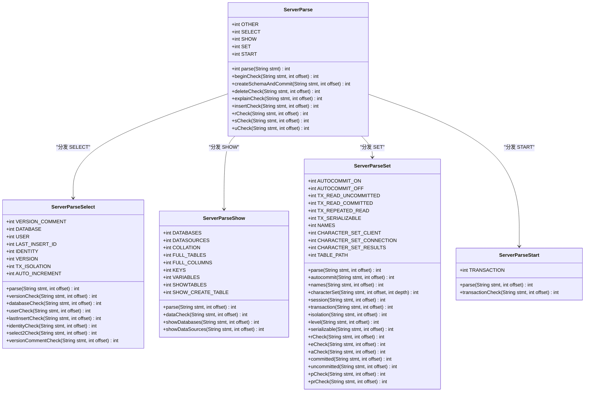
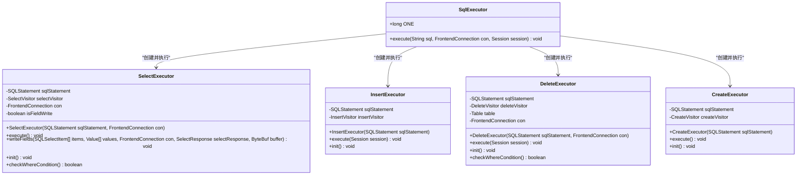
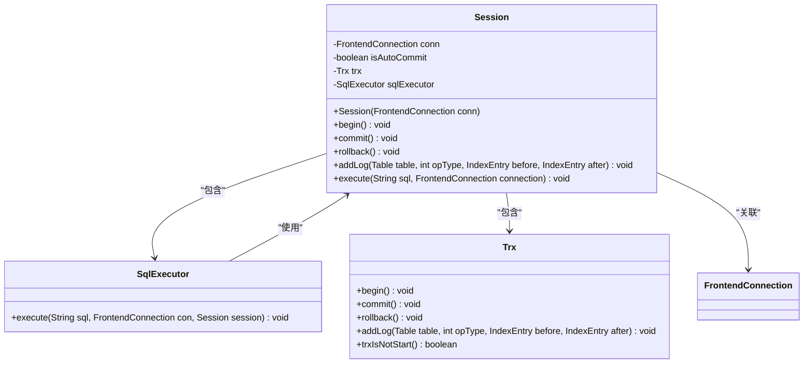
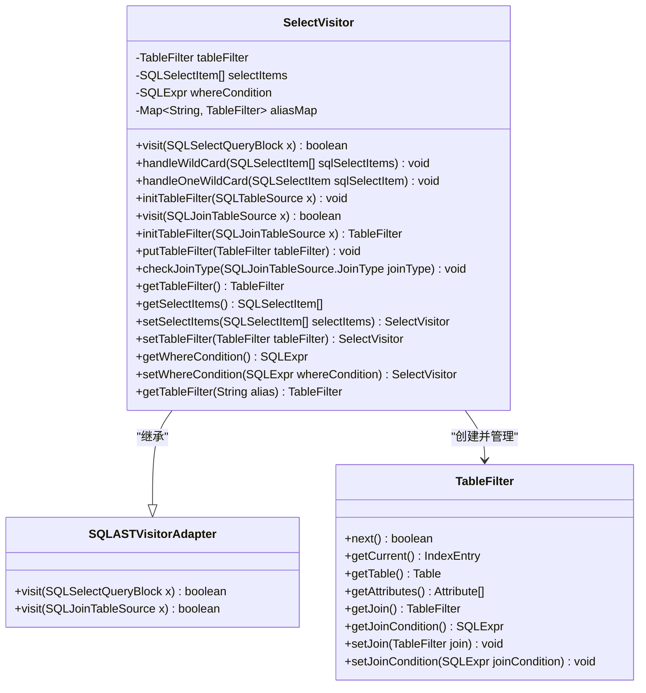
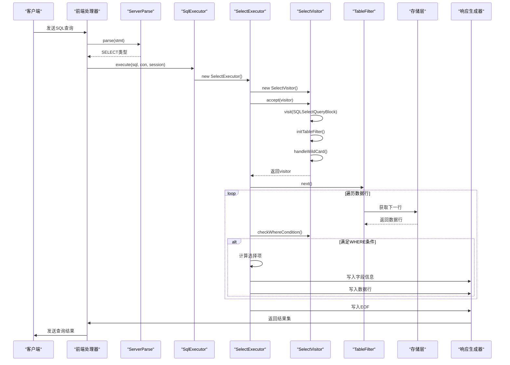
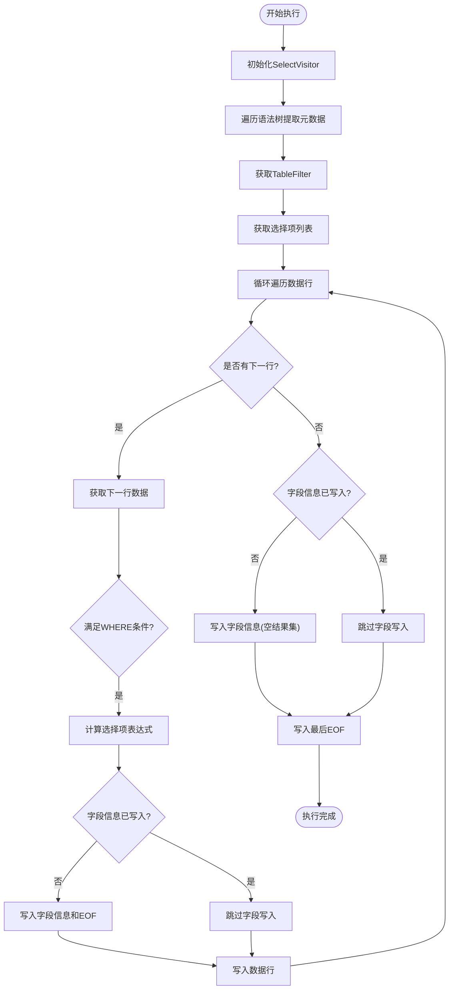
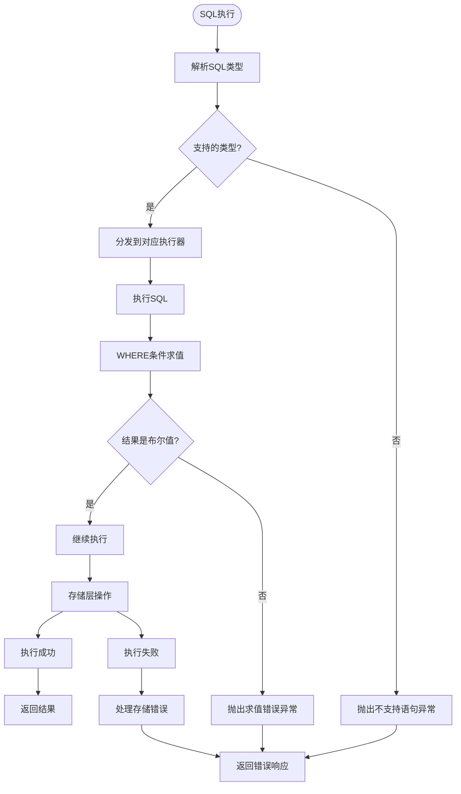

# 解析与执行层

<cite>
**本文档引用的文件**  
- [ServerParse.java](file://src/main/java/alchemystar/freedom/engine/parser/ServerParse.java)
- [SqlExecutor.java](file://src/main/java/alchemystar/freedom/sql/SqlExecutor.java)
- [Session.java](file://src/main/java/alchemystar/freedom/engine/session/Session.java)
- [SelectExecutor.java](file://src/main/java/alchemystar/freedom/sql/SelectExecutor.java)
- [InsertExecutor.java](file://src/main/java/alchemystar/freedom/sql/InsertExecutor.java)
- [DeleteExecutor.java](file://src/main/java/alchemystar/freedom/sql/DeleteExecutor.java)
- [CreateExecutor.java](file://src/main/java/alchemystar/freedom/sql/CreateExecutor.java)
- [SelectVisitor.java](file://src/main/java/alchemystar/freedom/sql/parser/SelectVisitor.java)
- [ServerParseSelect.java](file://src/main/java/alchemystar/freedom/engine/parser/ServerParseSelect.java)
- [ServerParseShow.java](file://src/main/java/alchemystar/freedom/engine/parser/ServerParseShow.java)
- [ServerParseSet.java](file://src/main/java/alchemystar/freedom/engine/parser/ServerParseSet.java)
- [ServerParseStart.java](file://src/main/java/alchemystar/freedom/engine/parser/ServerParseStart.java)
</cite>

## 目录
1. [简介](#简介)
2. [解析层架构](#解析层架构)
3. [执行层架构](#执行层架构)
4. [会话与事务管理](#会话与事务管理)
5. [SQL语法树遍历机制](#sql语法树遍历机制)
6. [典型SQL执行流程](#典型sql执行流程)
7. [执行上下文与结果集管理](#执行上下文与结果集管理)
8. [错误处理机制](#错误处理机制)
9. [性能分析与优化建议](#性能分析与优化建议)

## 简介
本文档详细描述了Freedom数据库系统中从原始SQL语句到执行结果的完整处理流程。重点分析了以ServerParse为核心的命令分发机制，SqlExecutor对不同类型SQL执行器的调度策略，以及Session在解析、优化和执行过程中的协调作用。同时深入探讨了访问者模式在SQL语法树遍历中的应用，SelectVisitor如何提取查询元数据，以及执行上下文管理、结果集生成和错误处理等核心机制。

## 解析层架构

解析层负责将原始SQL语句解析为可执行的命令类型，其核心是ServerParse类及其相关解析器。ServerParse作为主解析器，根据SQL语句的起始关键字将其分发到相应的专用解析器进行进一步处理。

**图示来源**  
- [ServerParse.java](file://src/main/java/alchemystar/freedom/engine/parser/ServerParse.java)
- [ServerParseSelect.java](file://src/main/java/alchemystar/freedom/engine/parser/ServerParseSelect.java)
- [ServerParseShow.java](file://src/main/java/alchemystar/freedom/engine/parser/ServerParseShow.java)
- [ServerParseSet.java](file://src/main/java/alchemystar/freedom/engine/parser/ServerParseSet.java)
- [ServerParseStart.java](file://src/main/java/alchemystar/freedom/engine/parser/ServerParseStart.java)

**本节来源**  
- [ServerParse.java](file://src/main/java/alchemystar/freedom/engine/parser/ServerParse.java#L1-L450)
- [ServerParseSelect.java](file://src/main/java/alchemystar/freedom/engine/parser/ServerParseSelect.java#L10-L448)
- [ServerParseShow.java](file://src/main/java/alchemystar/freedom/engine/parser/ServerParseShow.java#L9-L127)
- [ServerParseSet.java](file://src/main/java/alchemystar/freedom/engine/parser/ServerParseSet.java#L9-L700)
- [ServerParseStart.java](file://src/main/java/alchemystar/freedom/engine/parser/ServerParseStart.java#L8-L57)

## 执行层架构

执行层负责调度不同类型的SQL执行器来处理具体的SQL语句。SqlExecutor作为执行调度中心，根据解析后的SQL语句类型实例化相应的执行器（如SelectExecutor、InsertExecutor等）并调用其执行方法。

**图示来源**  
- [SqlExecutor.java](file://src/main/java/alchemystar/freedom/sql/SqlExecutor.java)
- [SelectExecutor.java](file://src/main/java/alchemystar/freedom/sql/SelectExecutor.java)
- [InsertExecutor.java](file://src/main/java/alchemystar/freedom/sql/InsertExecutor.java)
- [DeleteExecutor.java](file://src/main/java/alchemystar/freedom/sql/DeleteExecutor.java)
- [CreateExecutor.java](file://src/main/java/alchemystar/freedom/sql/CreateExecutor.java)

**本节来源**  
- [SqlExecutor.java](file://src/main/java/alchemystar/freedom/sql/SqlExecutor.java#L1-L51)
- [SelectExecutor.java](file://src/main/java/alchemystar/freedom/sql/SelectExecutor.java#L1-L123)
- [InsertExecutor.java](file://src/main/java/alchemystar/freedom/sql/InsertExecutor.java#L1-L40)
- [DeleteExecutor.java](file://src/main/java/alchemystar/freedom/sql/DeleteExecutor.java#L1-L75)
- [CreateExecutor.java](file://src/main/java/alchemystar/freedom/sql/CreateExecutor.java#L1-L32)

## 会话与事务管理

Session类负责协调解析、优化和执行过程，管理事务状态，并为SQL执行提供必要的上下文环境。它封装了前端连接、事务对象和SQL执行器，确保SQL语句在正确的会话上下文中执行。

**图示来源**  
- [Session.java](file://src/main/java/alchemystar/freedom/engine/session/Session.java)
- [SqlExecutor.java](file://src/main/java/alchemystar/freedom/sql/SqlExecutor.java)
- [Trx.java](file://src/main/java/alchemystar/freedom/transaction/Trx.java)

**本节来源**  
- [Session.java](file://src/main/java/alchemystar/freedom/engine/session/Session.java#L1-L52)

## SQL语法树遍历机制

系统采用访问者模式遍历SQL语法树，通过不同的Visitor实现类提取SQL语句的元数据。SelectVisitor是其中的核心实现，负责解析SELECT语句的各个组成部分，包括表源、选择项和WHERE条件。

**图示来源**  
- [SelectVisitor.java](file://src/main/java/alchemystar/freedom/sql/parser/SelectVisitor.java)
- [TableFilter.java](file://src/main/java/alchemystar/freedom/sql/select/TableFilter.java)

**本节来源**  
- [SelectVisitor.java](file://src/main/java/alchemystar/freedom/sql/parser/SelectVisitor.java#L1-L187)

## 典型SQL执行流程

以下时序图展示了典型SELECT语句从接收到执行完成的完整流程，包括命令解析、语法树构建、元数据提取、数据检索和结果返回等关键步骤。

**图示来源**  
- [ServerParse.java](file://src/main/java/alchemystar/freedom/engine/parser/ServerParse.java)
- [SqlExecutor.java](file://src/main/java/alchemystar/freedom/sql/SqlExecutor.java)
- [SelectExecutor.java](file://src/main/java/alchemystar/freedom/sql/SelectExecutor.java)
- [SelectVisitor.java](file://src/main/java/alchemystar/freedom/sql/parser/SelectVisitor.java)
- [TableFilter.java](file://src/main/java/alchemystar/freedom/sql/select/TableFilter.java)
- [SelectResponse.java](file://src/main/java/alchemystar/freedom/engine/net/response/SelectResponse.java)

## 执行上下文与结果集管理

执行上下文管理确保SQL执行过程中的状态一致性，结果集管理负责将查询结果格式化为MySQL协议兼容的响应包。SelectExecutor在执行过程中动态管理字段信息的写入时机，确保结果集的正确性。

**图示来源**  
- [SelectExecutor.java](file://src/main/java/alchemystar/freedom/sql/SelectExecutor.java)
- [SelectResponse.java](file://src/main/java/alchemystar/freedom/engine/net/response/SelectResponse.java)

**本节来源**  
- [SelectExecutor.java](file://src/main/java/alchemystar/freedom/sql/SelectExecutor.java#L21-L121)

## 错误处理机制

系统实现了分层的错误处理机制，从语法解析到执行过程中的各种异常都有相应的处理策略。当遇到不支持的SQL语句类型时，系统会抛出运行时异常；在WHERE条件求值时，如果结果不是布尔类型也会抛出异常。

**图示来源**  
- [SqlExecutor.java](file://src/main/java/alchemystar/freedom/sql/SqlExecutor.java)
- [SelectExecutor.java](file://src/main/java/alchemystar/freedom/sql/SelectExecutor.java)
- [DeleteExecutor.java](file://src/main/java/alchemystar/freedom/sql/DeleteExecutor.java)

**本节来源**  
- [SqlExecutor.java](file://src/main/java/alchemystar/freedom/sql/SqlExecutor.java#L1-L51)
- [SelectExecutor.java](file://src/main/java/alchemystar/freedom/sql/SelectExecutor.java#L1-L123)
- [DeleteExecutor.java](file://src/main/java/alchemystar/freedom/sql/DeleteExecutor.java#L1-L75)

## 性能分析与优化建议

通过对系统架构和执行流程的分析，提出以下性能优化建议：

1. **解析层优化**：ServerParse的字符级解析虽然精确但效率较低，建议考虑使用正则表达式或状态机优化常见SQL命令的识别速度。

2. **执行器缓存**：SqlExecutor每次执行都创建新的执行器实例，建议引入执行器对象池以减少对象创建开销。

3. **访问者模式优化**：SelectVisitor在每次执行时都重新创建和遍历语法树，建议缓存解析结果以避免重复解析。

4. **结果集生成优化**：SelectExecutor在每行数据处理时都进行字段类型判断，建议在首次迭代后缓存字段类型信息。

5. **内存管理**：系统在处理大结果集时可能产生大量临时对象，建议优化内存分配策略，减少GC压力。

6. **并行处理**：对于复杂的JOIN查询，可以考虑实现并行数据扫描和处理机制。

7. **索引优化**：加强WHERE条件中谓词的索引匹配能力，提高数据过滤效率。

8. **预编译支持**：引入SQL预编译机制，对于频繁执行的SQL语句可以显著提升性能。

**本节来源**  
- [ServerParse.java](file://src/main/java/alchemystar/freedom/engine/parser/ServerParse.java)
- [SqlExecutor.java](file://src/main/java/alchemystar/freedom/sql/SqlExecutor.java)
- [SelectExecutor.java](file://src/main/java/alchemystar/freedom/sql/SelectExecutor.java)
- [SelectVisitor.java](file://src/main/java/alchemystar/freedom/sql/parser/SelectVisitor.java)