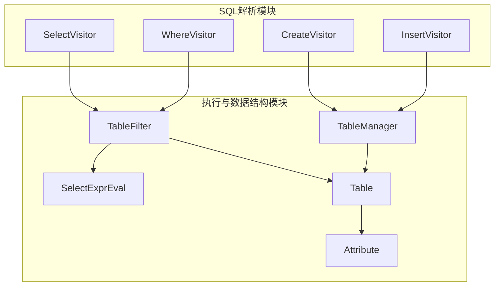
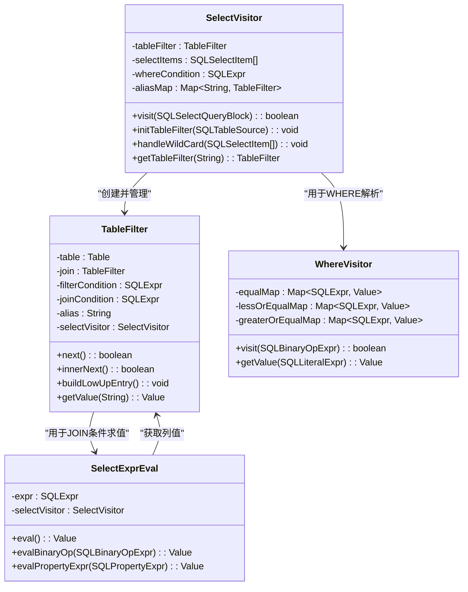
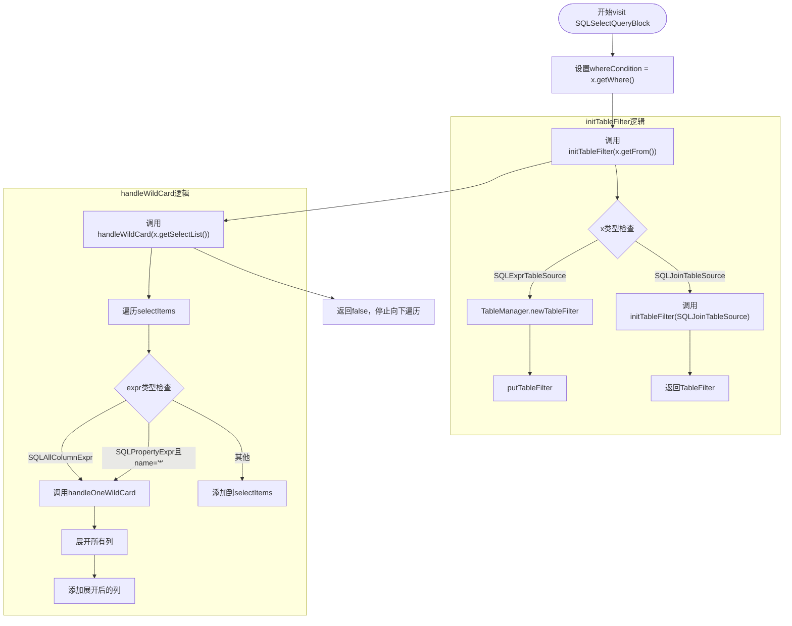
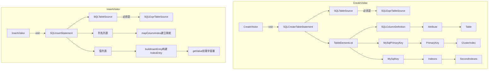
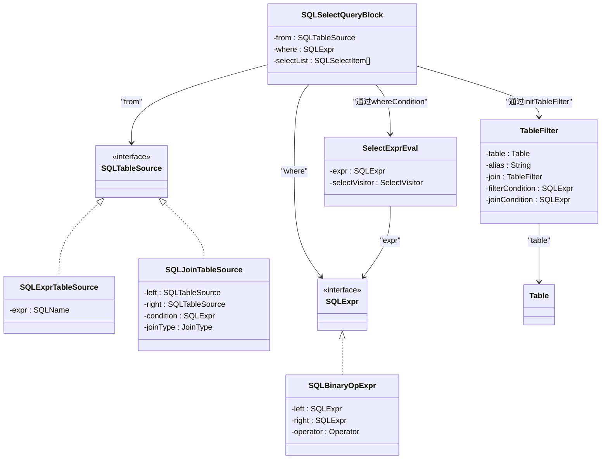

# 访问者模式应用

<cite>
**本文档中引用的文件**  
- [SelectVisitor.java](file://src/main/java/alchemystar/freedom/sql/parser/SelectVisitor.java)
- [CreateVisitor.java](file://src/main/java/alchemystar/freedom/sql/parser/CreateVisitor.java)
- [InsertVisitor.java](file://src/main/java/alchemystar/freedom/sql/parser/InsertVisitor.java)
- [WhereVisitor.java](file://src/main/java/alchemystar/freedom/sql/parser/WhereVisitor.java)
- [TableFilter.java](file://src/main/java/alchemystar/freedom/sql/select/TableFilter.java)
- [SelectExprEval.java](file://src/main/java/alchemystar/freedom/sql/select/item/SelectExprEval.java)
- [TableManager.java](file://src/main/java/alchemystar/freedom/meta/TableManager.java)
- [Attribute.java](file://src/main/java/alchemystar/freedom/meta/Attribute.java)
</cite>

## 目录
1. [引言](#引言)
2. [项目结构](#项目结构)
3. [核心组件](#核心组件)
4. [架构概述](#架构概述)
5. [详细组件分析](#详细组件分析)
6. [依赖分析](#依赖分析)
7. [性能考虑](#性能考虑)
8. [故障排除指南](#故障排除指南)
9. [结论](#结论)

## 引言
本文档系统性地解释访问者模式在SQL语法树遍历中的应用，重点以SelectVisitor为例，说明其如何通过Druid SQL AST遍历机制提取查询涉及的表名、列名、WHERE条件等元数据信息。同时对比CreateVisitor、InsertVisitor等其他访问器的实现差异，揭示不同SQL语句结构的解析需求。文档详细描述了关键访问方法的实现逻辑，以及如何将AST节点信息转换为内部数据结构，并提供语法树遍历的调试技巧和常见问题解决方案。

## 项目结构
项目采用典型的Java分层架构，核心SQL解析与执行逻辑位于`src/main/java/alchemystar/freedom`目录下。主要模块包括`sql/parser`（SQL解析器）、`sql/select`（SELECT执行器）、`meta`（元数据管理）等。SQL解析器使用Druid库构建AST，并通过访问者模式进行遍历处理。



**图示来源**  
- [SelectVisitor.java](file://src/main/java/alchemystar/freedom/sql/parser/SelectVisitor.java#L25-L185)
- [CreateVisitor.java](file://src/main/java/alchemystar/freedom/sql/parser/CreateVisitor.java#L26-L124)
- [InsertVisitor.java](file://src/main/java/alchemystar/freedom/sql/parser/InsertVisitor.java#L26-L98)
- [TableFilter.java](file://src/main/java/alchemystar/freedom/sql/select/TableFilter.java#L23-L277)
- [TableManager.java](file://src/main/java/alchemystar/freedom/meta/TableManager.java)

**本节来源**  
- [src/main/java/alchemystar/freedom/sql/parser](file://src/main/java/alchemystar/freedom/sql/parser)
- [src/main/java/alchemystar/freedom/sql/select](file://src/main/java/alchemystar/freedom/sql/select)
- [src/main/java/alchemystar/freedom/meta](file://src/main/java/alchemystar/freedom/meta)

## 核心组件
本系统的核心是基于Druid SQL AST的访问者模式实现，通过不同的Visitor类解析各类SQL语句。SelectVisitor负责提取SELECT语句的表、列、条件等信息；CreateVisitor用于解析CREATE TABLE语句并构建表结构；InsertVisitor处理INSERT语句的字段映射和值提取。这些访问器共同构成了SQL语句解析的基础。

**本节来源**  
- [SelectVisitor.java](file://src/main/java/alchemystar/freedom/sql/parser/SelectVisitor.java#L25-L185)
- [CreateVisitor.java](file://src/main/java/alchemystar/freedom/sql/parser/CreateVisitor.java#L26-L124)
- [InsertVisitor.java](file://src/main/java/alchemystar/freedom/sql/parser/InsertVisitor.java#L26-L98)

## 架构概述
系统采用访问者模式对Druid生成的SQL AST进行遍历，将语法树信息转换为内部可执行的数据结构。SelectVisitor作为核心解析器，协调TableFilter、SelectExprEval等组件完成查询解析。TableFilter代表查询中的表及其别名，SelectExprEval负责表达式求值。



**图示来源**  
- [SelectVisitor.java](file://src/main/java/alchemystar/freedom/sql/parser/SelectVisitor.java#L25-L185)
- [TableFilter.java](file://src/main/java/alchemystar/freedom/sql/select/TableFilter.java#L23-L277)
- [SelectExprEval.java](file://src/main/java/alchemystar/freedom/sql/select/item/SelectExprEval.java#L18-L117)
- [WhereVisitor.java](file://src/main/java/alchemystar/freedom/sql/parser/WhereVisitor.java#L20-L160)

## 详细组件分析

### SelectVisitor分析
SelectVisitor是SELECT语句解析的核心，继承自Druid的SQLASTVisitorAdapter，通过重写visit方法遍历AST节点。

#### 访问方法实现逻辑


**图示来源**  
- [SelectVisitor.java](file://src/main/java/alchemystar/freedom/sql/parser/SelectVisitor.java#L25-L185)

**本节来源**  
- [SelectVisitor.java](file://src/main/java/alchemystar/freedom/sql/parser/SelectVisitor.java#L25-L185)

### CreateVisitor与InsertVisitor对比
不同SQL语句的结构差异导致访问器实现的显著不同。CreateVisitor关注表结构定义，而InsertVisitor关注数据插入。



**图示来源**  
- [CreateVisitor.java](file://src/main/java/alchemystar/freedom/sql/parser/CreateVisitor.java#L26-L124)
- [InsertVisitor.java](file://src/main/java/alchemystar/freedom/sql/parser/InsertVisitor.java#L26-L98)

**本节来源**  
- [CreateVisitor.java](file://src/main/java/alchemystar/freedom/sql/parser/CreateVisitor.java#L26-L124)
- [InsertVisitor.java](file://src/main/java/alchemystar/freedom/sql/parser/InsertVisitor.java#L26-L98)

### AST节点到内部数据结构的转换
访问器将AST节点信息转换为内部数据结构，如TableFilter和SelectExprEval。



**图示来源**  
- [SelectVisitor.java](file://src/main/java/alchemystar/freedom/sql/parser/SelectVisitor.java#L25-L185)
- [TableFilter.java](file://src/main/java/alchemystar/freedom/sql/select/TableFilter.java#L23-L277)
- [SelectExprEval.java](file://src/main/java/alchemystar/freedom/sql/select/item/SelectExprEval.java#L18-L117)

**本节来源**  
- [SelectVisitor.java](file://src/main/java/alchemystar/freedom/sql/parser/SelectVisitor.java#L25-L185)
- [TableFilter.java](file://src/main/java/alchemystar/freedom/sql/select/TableFilter.java#L23-L277)
- [SelectExprEval.java](file://src/main/java/alchemystar/freedom/sql/select/item/SelectExprEval.java#L18-L117)

## 依赖分析
各组件之间存在明确的依赖关系，形成清晰的调用链。

```mermaid
graph TD
SelectVisitor --> TableManager : "创建TableFilter"
SelectVisitor --> WhereVisitor : "解析WHERE条件"
TableFilter --> Table : "获取表元数据"
TableFilter --> SelectExprEval : "求值JOIN条件"
SelectExprEval --> TableFilter : "获取列值"
CreateVisitor --> TableManager : "检查表是否存在"
InsertVisitor --> TableManager : "获取表对象"
TableManager --> Table : "管理表实例"
Table --> Attribute : "包含列定义"
style SelectVisitor fill:#f9f,stroke:#333
style TableFilter fill:#bbf,stroke:#333
style TableManager fill:#f96,stroke:#333
```

**图示来源**  
- [SelectVisitor.java](file://src/main/java/alchemystar/freedom/sql/parser/SelectVisitor.java#L25-L185)
- [TableFilter.java](file://src/main/java/alchemystar/freedom/sql/select/TableFilter.java#L23-L277)
- [TableManager.java](file://src/main/java/alchemystar/freedom/meta/TableManager.java)
- [CreateVisitor.java](file://src/main/java/alchemystar/freedom/sql/parser/CreateVisitor.java#L26-L124)
- [InsertVisitor.java](file://src/main/java/alchemystar/freedom/sql/parser/InsertVisitor.java#L26-L98)

**本节来源**  
- [SelectVisitor.java](file://src/main/java/alchemystar/freedom/sql/parser/SelectVisitor.java#L25-L185)
- [TableFilter.java](file://src/main/java/alchemystar/freedom/sql/select/TableFilter.java#L23-L277)
- [TableManager.java](file://src/main/java/alchemystar/freedom/meta/TableManager.java)
- [CreateVisitor.java](file://src/main/java/alchemystar/freedom/sql/parser/CreateVisitor.java#L26-L124)
- [InsertVisitor.java](file://src/main/java/alchemystar/freedom/sql/parser/InsertVisitor.java#L26-L98)

## 性能考虑
访问者模式通过一次性遍历AST提取所有必要信息，避免了多次遍历的开销。TableFilter的buildLowUpEntry方法通过分析WHERE条件生成索引搜索范围，实现了查询优化。然而，OR条件的存在会导致回退到全表扫描，影响性能。

## 故障排除指南
常见问题包括别名冲突、不支持的JOIN类型、不支持的数据类型等。调试时可重点关注visit方法的返回值（false表示停止遍历）、异常抛出位置以及AST节点的实际类型。

**本节来源**  
- [SelectVisitor.java](file://src/main/java/alchemystar/freedom/sql/parser/SelectVisitor.java#L25-L185)
- [CreateVisitor.java](file://src/main/java/alchemystar/freedom/sql/parser/CreateVisitor.java#L26-L124)
- [InsertVisitor.java](file://src/main/java/alchemystar/freedom/sql/parser/InsertVisitor.java#L26-L98)

## 结论
访问者模式在SQL语法树遍历中展现了出色的扩展性和维护性。通过为不同SQL语句类型实现专用的Visitor，系统能够灵活处理各种语法结构。SelectVisitor作为核心组件，成功地将复杂的SQL查询解析为可执行的内部数据结构，为后续的查询执行奠定了基础。尽管存在对复杂条件支持有限等局限，但整体设计清晰、职责分明，是SQL解析器的理想选择。