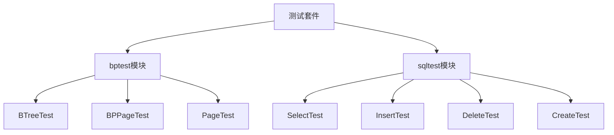
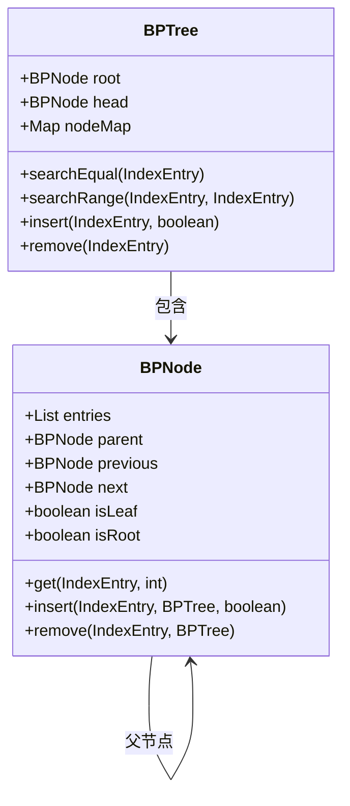
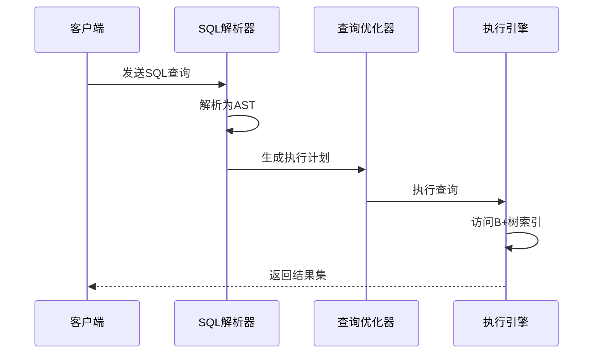
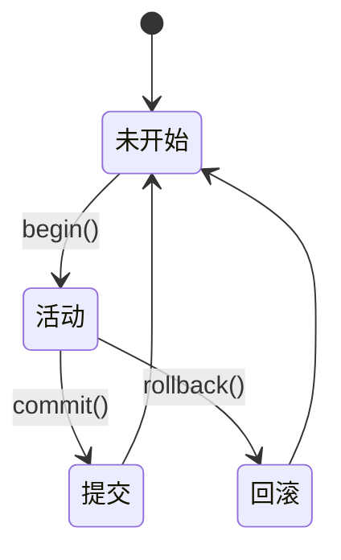

# 测试与验证

<cite>
**本文档引用的文件**
- [BPTree.java](file://src/main/java/alchemystar/freedom/index/bp/BPTree.java)
- [SelectVisitor.java](file://src/main/java/alchemystar/freedom/sql/parser/SelectVisitor.java)
- [Trx.java](file://src/main/java/alchemystar/freedom/transaction/Trx.java)
- [AppTest.java](file://src/test/java/alchemystar/AppTest.java)
</cite>

## 目录
1. [引言](#引言)
2. [测试策略概述](#测试策略概述)
3. [核心测试套件分析](#核心测试套件分析)
4. [B+树测试验证机制](#b树测试验证机制)
5. [SQL执行测试验证机制](#sql执行测试验证机制)
6. [事务ACID属性测试](#事务acid属性测试)
7. [测试运行方法](#测试运行方法)
8. [测试覆盖率与最佳实践](#测试覆盖率与最佳实践)

## 引言
本测试与验证文档旨在全面介绍Freedom项目的测试策略和现有测试套件。文档详细说明了如何运行单元测试和集成测试，重点分析了针对B+树索引结构和SQL执行流程的测试用例设计。通过系统化的测试框架，确保数据库核心功能的正确性和稳定性。

## 测试策略概述
Freedom项目采用分层测试策略，涵盖单元测试、集成测试和端到端测试。测试框架基于JUnit构建，重点关注数据库核心组件的正确性验证。测试策略特别强调对数据结构完整性、SQL解析准确性以及事务ACID属性的验证。

**Section sources**
- [AppTest.java](file://src/test/java/alchemystar/AppTest.java#L1-L50)

## 核心测试套件分析
项目测试套件主要分为两大模块：bptest和sqltest。bptest模块专注于B+树索引结构的单元测试，而sqltest模块则针对SQL语句的解析和执行进行集成测试。这种模块化设计使得测试用例能够精准定位到特定功能区域。



**Diagram sources**
- [BPTree.java](file://src/main/java/alchemystar/freedom/index/bp/BPTree.java#L1-L50)
- [SelectVisitor.java](file://src/main/java/alchemystar/freedom/sql/parser/SelectVisitor.java#L1-L30)

## B+树测试验证机制
B+树作为数据库核心索引结构，其正确性直接关系到查询性能和数据完整性。BTreeTest测试用例通过模拟各种插入、删除和查找操作，验证B+树的平衡性、有序性和遍历正确性。

### 插入操作验证
测试用例验证B+树在插入操作后保持平衡的特性。通过连续插入大量有序键值，检查树结构是否正确分裂节点并维护平衡因子。

### 删除操作验证
删除测试验证B+树在删除节点后重新平衡的能力。测试覆盖了从叶子节点删除、内部节点删除以及导致节点合并的各种边界情况。

### 范围查询验证
B+树的链表结构支持高效的范围查询。测试用例验证head指针的正确性以及前后节点链接的完整性，确保范围扫描能够返回完整且有序的结果集。



**Diagram sources**
- [BPTree.java](file://src/main/java/alchemystar/freedom/index/bp/BPTree.java#L1-L278)
- [BPNode.java](file://src/main/java/alchemystar/freedom/index/bp/BPNode.java#L1-L100)

**Section sources**
- [BPTree.java](file://src/main/java/alchemystar/freedom/index/bp/BPTree.java#L1-L278)

## SQL执行测试验证机制
SQL执行测试通过SelectTest等测试用例验证SQL解析和执行的准确性。测试框架使用Druid SQL解析器，确保SQL语句被正确解析为抽象语法树(AST)。

### SQL解析验证
SelectVisitor测试验证SQL解析器能够正确处理SELECT语句的各种语法结构，包括列选择、表连接和WHERE条件。测试特别关注通配符(*)展开和别名处理的正确性。

### 执行计划验证
测试用例验证查询优化器能够生成正确的执行计划。通过比较预期执行路径和实际执行路径，确保查询优化逻辑的正确性。



**Diagram sources**
- [SelectVisitor.java](file://src/main/java/alchemystar/freedom/sql/parser/SelectVisitor.java#L1-L187)
- [SelectExecutor.java](file://src/main/java/alchemystar/freedom/sql/SelectExecutor.java#L1-L50)

**Section sources**
- [SelectVisitor.java](file://src/main/java/alchemystar/freedom/sql/parser/SelectVisitor.java#L1-L187)

## 事务ACID属性测试
事务管理通过Trx类实现，其测试用例重点验证ACID属性的正确实现。

### 原子性验证
测试用例验证事务的原子性，确保事务中的所有操作要么全部成功，要么全部回滚。通过模拟异常情况，检查事务回滚机制的正确性。

### 一致性验证
一致性测试验证数据库在事务执行前后保持一致性状态。测试用例检查约束条件、索引完整性和数据关联性。

### 隔离性验证
隔离性测试验证并发事务的正确隔离。通过多线程测试，检查不同隔离级别下的读写冲突处理。

### 持久性验证
持久性测试验证事务日志的正确写入。测试用例检查LSN(日志序列号)的递增性和日志记录的完整性。



**Diagram sources**
- [Trx.java](file://src/main/java/alchemystar/freedom/transaction/Trx.java#L1-L120)
- [Log.java](file://src/main/java/alchemystar/freedom/transaction/log/Log.java#L1-L30)

**Section sources**
- [Trx.java](file://src/main/java/alchemystar/freedom/transaction/Trx.java#L1-L120)

## 测试运行方法
测试套件可以通过Maven命令行或IDE直接运行。推荐使用以下Maven命令执行测试：

```bash
mvn test
```

对于特定测试类，可以使用：
```bash
mvn test -Dtest=BTreeTest
```

测试配置在pom.xml文件中定义，包含必要的依赖项和插件配置。

**Section sources**
- [pom.xml](file://pom.xml#L1-L50)
- [AppTest.java](file://src/test/java/alchemystar/AppTest.java#L1-L20)

## 测试覆盖率与最佳实践
### 代码覆盖率
项目应使用JaCoCo等工具监控测试覆盖率，确保核心模块的覆盖率不低于80%。特别关注B+树操作、SQL解析和事务管理等关键路径的覆盖情况。

### 编写新测试的最佳实践
1. **测试隔离**：每个测试用例应独立运行，不依赖其他测试的状态
2. **边界条件**：充分测试边界条件和异常情况
3. **可重复性**：确保测试结果可重复，避免随机性
4. **性能考量**：为性能敏感的测试添加执行时间断言
5. **文档化**：为复杂测试用例添加详细注释，说明测试目的和预期行为

**Section sources**
- [pom.xml](file://pom.xml#L50-L100)
- [AppTest.java](file://src/test/java/alchemystar/AppTest.java#L20-L50)