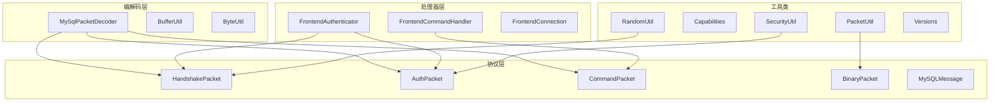
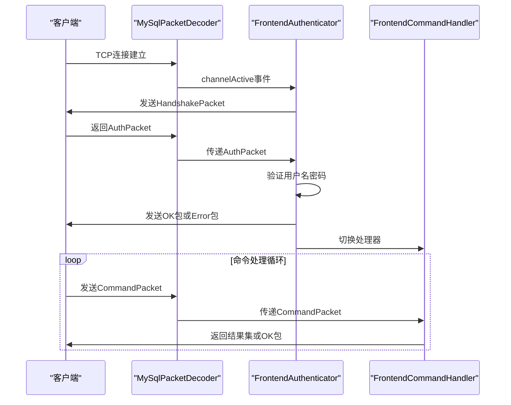
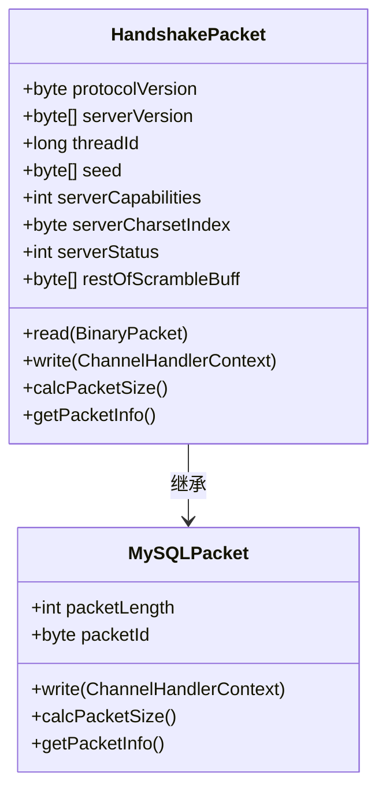
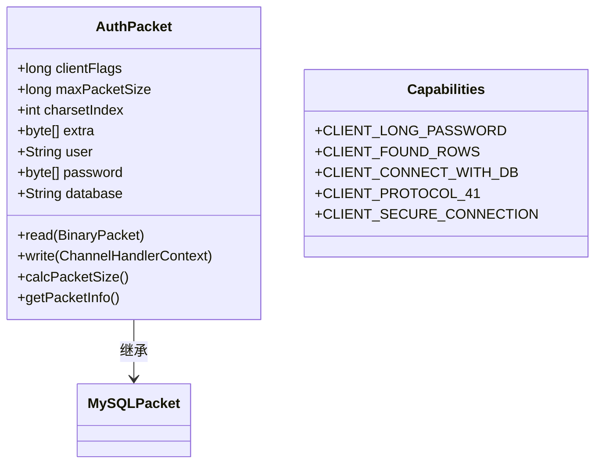
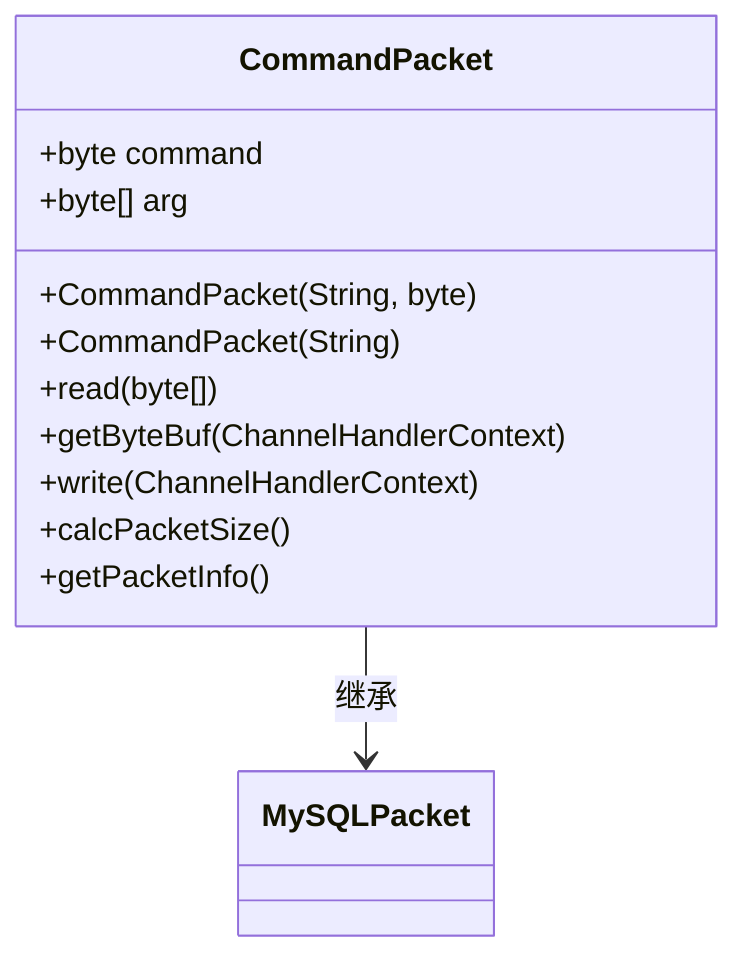
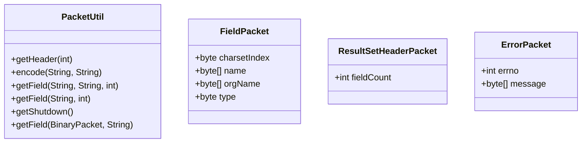

# MySQL协议实现

<cite>
**本文档中引用的文件**  
- [HandshakePacket.java](file://src/main/java/alchemystar/freedom/engine/net/proto/mysql/HandshakePacket.java)
- [AuthPacket.java](file://src/main/java/alchemystar/freedom/engine/net/proto/mysql/AuthPacket.java)
- [CommandPacket.java](file://src/main/java/alchemystar/freedom/engine/net/proto/mysql/CommandPacket.java)
- [PacketUtil.java](file://src/main/java/alchemystar/freedom/engine/net/proto/util/PacketUtil.java)
- [FrontendAuthenticator.java](file://src/main/java/alchemystar/freedom/engine/net/handler/frontend/FrontendAuthenticator.java)
- [MySqlPacketDecoder.java](file://src/main/java/alchemystar/freedom/engine/net/codec/MySqlPacketDecoder.java)
- [Capabilities.java](file://src/main/java/alchemystar/freedom/engine/net/proto/util/Capabilities.java)
- [Versions.java](file://src/main/java/alchemystar/freedom/engine/net/proto/util/Versions.java)
</cite>

## 目录
1. [简介](#简介)
2. [项目结构](#项目结构)
3. [核心组件](#核心组件)
4. [架构概述](#架构概述)
5. [详细组件分析](#详细组件分析)
6. [依赖分析](#依赖分析)
7. [性能考虑](#性能考虑)
8. [故障排除指南](#故障排除指南)
9. [结论](#结论)

## 简介
本文档详细描述了Freedom数据库对MySQL通信协议的兼容性设计。重点介绍握手包（HandshakePacket）、认证包（AuthPacket）和命令包（CommandPacket）的结构与作用机制，解析其在连接初始化、用户认证和SQL指令执行中的关键流程。同时阐述PacketUtil工具类在数据包构造、分片、校验和ID管理中的功能，并结合Netty框架说明协议数据的序列化与反序列化过程。通过时序图展示完整的客户端-服务端交互流程，并分析异常处理策略。

## 项目结构
Freedom数据库的MySQL协议实现在`engine/net`模块中，采用分层架构设计，主要包括协议编解码、前端处理器、数据包定义和工具类四大组成部分。



**Diagram sources**  
- [HandshakePacket.java](file://src/main/java/alchemystar/freedom/engine/net/proto/mysql/HandshakePacket.java)
- [AuthPacket.java](file://src/main/java/alchemystar/freedom/engine/net/proto/mysql/AuthPacket.java)
- [CommandPacket.java](file://src/main/java/alchemystar/freedom/engine/net/proto/mysql/CommandPacket.java)
- [MySqlPacketDecoder.java](file://src/main/java/alchemystar/freedom/engine/net/codec/MySqlPacketDecoder.java)
- [FrontendAuthenticator.java](file://src/main/java/alchemystar/freedom/engine/net/handler/frontend/FrontendAuthenticator.java)

**Section sources**  
- [HandshakePacket.java](file://src/main/java/alchemystar/freedom/engine/net/proto/mysql/HandshakePacket.java)
- [AuthPacket.java](file://src/main/java/alchemystar/freedom/engine/net/proto/mysql/AuthPacket.java)
- [CommandPacket.java](file://src/main/java/alchemystar/freedom/engine/net/proto/mysql/CommandPacket.java)
- [MySqlPacketDecoder.java](file://src/main/java/alchemystar/freedom/engine/net/codec/MySqlPacketDecoder.java)

## 核心组件
本系统的核心组件包括握手包、认证包、命令包以及相关的协议处理机制。这些组件共同实现了MySQL协议的基本通信能力，支持客户端连接、身份验证和SQL命令执行。

**Section sources**  
- [HandshakePacket.java](file://src/main/java/alchemystar/freedom/engine/net/proto/mysql/HandshakePacket.java)
- [AuthPacket.java](file://src/main/java/alchemystar/freedom/engine/net/proto/mysql/AuthPacket.java)
- [CommandPacket.java](file://src/main/java/alchemystar/freedom/engine/net/proto/mysql/CommandPacket.java)

## 架构概述
Freedom数据库的MySQL协议实现基于Netty框架构建，采用事件驱动的非阻塞I/O模型。整体架构分为协议编解码、前端认证、命令处理三个主要阶段。



**Diagram sources**  
- [MySqlPacketDecoder.java](file://src/main/java/alchemystar/freedom/engine/net/codec/MySqlPacketDecoder.java)
- [FrontendAuthenticator.java](file://src/main/java/alchemystar/freedom/engine/net/handler/frontend/FrontendAuthenticator.java)
- [FrontendCommandHandler.java](file://src/main/java/alchemystar/freedom/engine/net/handler/frontend/FrontendCommandHandler.java)

## 详细组件分析

### 握手包分析
握手包是MySQL协议连接初始化的第一步，由服务端主动发送给客户端，用于协商通信参数。



**Diagram sources**  
- [HandshakePacket.java](file://src/main/java/alchemystar/freedom/engine/net/proto/mysql/HandshakePacket.java)
- [MySQLPacket.java](file://src/main/java/alchemystar/freedom/engine/net/proto/MySQLPacket.java)

**Section sources**  
- [HandshakePacket.java](file://src/main/java/alchemystar/freedom/engine/net/proto/mysql/HandshakePacket.java)
- [FrontendAuthenticator.java](file://src/main/java/alchemystar/freedom/engine/net/handler/frontend/FrontendAuthenticator.java)
- [Versions.java](file://src/main/java/alchemystar/freedom/engine/net/proto/util/Versions.java)

#### 握手包字段说明
- **protocolVersion**: 协议版本号，固定为10（定义于`Versions.PROTOCOL_VERSION`）
- **serverVersion**: 服务器版本字符串，值为"5.1.1-freedom"
- **threadId**: 连接线程ID，对应`FrontendConnection`的ID
- **seed**: 随机种子，用于密码加密验证，由`RandomUtil.randomBytes(8)`生成
- **serverCapabilities**: 服务端能力标志，包含CLIENT_PROTOCOL_41、CLIENT_SECURE_CONNECTION等
- **serverCharsetIndex**: 服务器默认字符集索引
- **serverStatus**: 服务器状态，初始值为2
- **restOfScrambleBuff**: 随机种子的后半部分，12字节

#### 握手流程
1. 客户端建立TCP连接
2. 服务端触发`channelActive`事件
3. `FrontendAuthenticator`生成8字节和12字节两段随机数作为完整种子
4. 构造`HandshakePacket`并写入通道
5. 等待客户端返回认证包

### 认证包分析
认证包由客户端在收到握手包后发送，包含用户认证信息。



**Diagram sources**  
- [AuthPacket.java](file://src/main/java/alchemystar/freedom/engine/net/proto/mysql/AuthPacket.java)
- [Capabilities.java](file://src/main/java/alchemystar/freedom/engine/net/proto/util/Capabilities.java)

**Section sources**  
- [AuthPacket.java](file://src/main/java/alchemystar/freedom/engine/net/proto/mysql/AuthPacket.java)
- [FrontendAuthenticator.java](file://src/main/java/alchemystar/freedom/engine/net/handler/frontend/FrontendAuthenticator.java)
- [Database.java](file://src/main/java/alchemystar/freedom/engine/Database.java)

#### 认证包字段说明
- **clientFlags**: 客户端能力标志，决定支持的功能特性
- **maxPacketSize**: 最大数据包大小
- **charsetIndex**: 客户端请求的字符集索引
- **extra**: 预留字段，填充23字节
- **user**: 用户名
- **password**: 加密后的密码
- **database**: 请求连接的数据库名（可选）

#### 认证验证流程
1. 读取`AuthPacket`中的用户名和加密密码
2. 检查用户名是否匹配`Database.getInstance().getUserName()`
3. 使用`SecurityUtil.scramble411()`对真实密码进行相同算法加密
4. 比较加密结果与客户端发送的密码是否一致
5. 验证通过则切换处理器为`FrontendCommandHandler`，返回OK包

### 命令包分析
命令包用于承载客户端的各种SQL操作指令。



**Diagram sources**  
- [CommandPacket.java](file://src/main/java/alchemystar/freedom/engine/net/proto/mysql/CommandPacket.java)

**Section sources**  
- [CommandPacket.java](file://src/main/java/alchemystar/freedom/engine/net/proto/mysql/CommandPacket.java)
- [FrontendCommandHandler.java](file://src/main/java/alchemystar/freedom/engine/net/handler/frontend/FrontendCommandHandler.java)

#### 命令类型
- **COM_QUERY**: 执行SQL查询
- **COM_INIT_DB**: 切换数据库
- **COM_QUIT**: 断开连接
- **COM_PING**: 心跳检测

#### 序列化与反序列化
- **序列化**: 通过`getByteBuf()`方法将命令和参数写入Netty的`ByteBuf`
- **反序列化**: 通过`read()`方法从原始字节数组解析出命令类型和参数

### PacketUtil工具类分析
`PacketUtil`提供了常用数据包的构造方法和编码工具。



**Diagram sources**  
- [PacketUtil.java](file://src/main/java/alchemystar/freedom/engine/net/proto/util/PacketUtil.java)
- [FieldPacket.java](file://src/main/java/alchemystar/freedom/engine/net/proto/mysql/FieldPacket.java)
- [ResultSetHeaderPacket.java](file://src/main/java/alchemystar/freedom/engine/net/proto/mysql/ResultSetHeaderPacket.java)
- [ErrorPacket.java](file://src/main/java/alchemystar/freedom/engine/net/proto/mysql/ErrorPacket.java)

**Section sources**  
- [PacketUtil.java](file://src/main/java/alchemystar/freedom/engine/net/proto/util/PacketUtil.java)
- [CharsetUtil.java](file://src/main/java/alchemystar/freedom/engine/net/proto/util/CharsetUtil.java)

#### 主要功能
- **数据包构造**: 快速创建结果集头部、字段、错误等标准数据包
- **字符编码**: 使用Cp1252编码进行字符串转换
- **校验和管理**: 通过`calcPacketSize()`计算数据包大小
- **ID管理**: 自动分配数据包ID

## 依赖分析
系统各组件之间存在明确的依赖关系，形成了清晰的调用链路。

```mermaid
graph TD
FrontendAuthenticator --> HandshakePacket : 创建并发送
FrontendAuthenticator --> AuthPacket : 接收并验证
FrontendAuthenticator --> SecurityUtil : 密码加密验证
FrontendAuthenticator --> RandomUtil : 生成随机种子
FrontendAuthenticator --> Versions : 获取版本信息
MySqlPacketDecoder --> BinaryPacket : 解码生成
MySqlPacketDecoder --> ByteUtil : 读取UB3长度
CommandPacket --> BufferUtil : 写入数据
PacketUtil --> CharsetUtil : 获取字符集索引
AuthPacket --> Capabilities : 能力标志检查
```

**Diagram sources**  
- [FrontendAuthenticator.java](file://src/main/java/alchemystar/freedom/engine/net/handler/frontend/FrontendAuthenticator.java)
- [MySqlPacketDecoder.java](file://src/main/java/alchemystar/freedom/engine/net/codec/MySqlPacketDecoder.java)
- [PacketUtil.java](file://src/main/java/alchemystar/freedom/engine/net/proto/util/PacketUtil.java)

**Section sources**  
- [FrontendAuthenticator.java](file://src/main/java/alchemystar/freedom/engine/net/handler/frontend/FrontendAuthenticator.java)
- [MySqlPacketDecoder.java](file://src/main/java/alchemystar/freedom/engine/net/codec/MySqlPacketDecoder.java)
- [PacketUtil.java](file://src/main/java/alchemystar/freedom/engine/net/proto/util/PacketUtil.java)

## 性能考虑
- **内存优化**: 使用Netty的`ByteBuf`池化机制减少GC压力
- **零拷贝**: 在`write()`方法中直接写入缓冲区，避免中间复制
- **预分配**: 默认初始化256字节缓冲区，避免频繁扩容
- **过载保护**: `MySqlPacketDecoder`限制最大包大小为16MB
- **无锁设计**: 协议处理无共享状态，天然支持高并发

## 故障排除指南
### 常见错误码处理
- **ER_ACCESS_DENIED_ERROR (1045)**: 用户名或密码错误
- **ER_SERVER_SHUTDOWN (1077)**: 服务器已关闭
- **Packet size over the limit**: 数据包过大，可能遭遇攻击或配置错误

### 调试建议
1. 检查`FrontendAuthenticator`日志中的认证失败信息
2. 验证`Database`单例中的用户名密码配置
3. 确认客户端使用的字符集与服务端兼容
4. 检查Netty管道处理器顺序是否正确

**Section sources**  
- [FrontendAuthenticator.java](file://src/main/java/alchemystar/freedom/engine/net/handler/frontend/FrontendAuthenticator.java)
- [ErrorCode.java](file://src/main/java/alchemystar/freedom/engine/net/proto/util/ErrorCode.java)

## 结论
Freedom数据库通过精心设计的MySQL协议实现，成功兼容了标准MySQL客户端的连接与操作。系统采用模块化设计，各组件职责清晰，易于维护和扩展。基于Netty的高性能网络框架确保了良好的并发处理能力，而完整的错误处理机制则保障了系统的稳定性。该实现为Freedom数据库提供了标准的MySQL接口支持，使其能够无缝集成到现有的MySQL生态系统中。