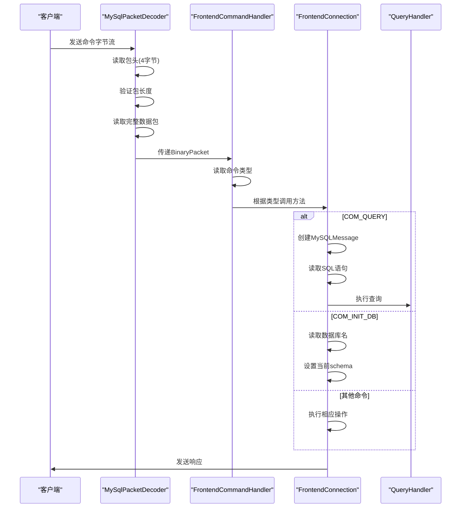

# 命令处理

<cite>
**本文档引用的文件**
- [CommandPacket.java](file://src/main/java/alchemystar/freedom/engine/net/proto/mysql/CommandPacket.java)
- [MySqlPacketDecoder.java](file://src/main/java/alchemystar/freedom/engine/net/codec/MySqlPacketDecoder.java)
- [FrontendCommandHandler.java](file://src/main/java/alchemystar/freedom/engine/net/handler/frontend/FrontendCommandHandler.java)
- [PacketUtil.java](file://src/main/java/alchemystar/freedom/engine/net/proto/util/PacketUtil.java)
- [MySQLMessage.java](file://src/main/java/alchemystar/freedom/engine/net/proto/mysql/MySQLMessage.java)
- [FrontendConnection.java](file://src/main/java/alchemystar/freedom/engine/net/handler/frontend/FrontendConnection.java)
- [ErrorCode.java](file://src/main/java/alchemystar/freedom/engine/net/proto/util/ErrorCode.java)
- [MySQLPacket.java](file://src/main/java/alchemystar/freedom/engine/net/proto/MySQLPacket.java)
</cite>

## 目录
1. [命令包结构](#命令包结构)
2. [Netty反序列化流程](#netty反序列化流程)
3. [命令分发机制](#命令分发机制)
4. [辅助工具类](#辅助工具类)
5. [命令处理时序](#命令处理时序)
6. [异常处理策略](#异常处理策略)

## 命令包结构

`CommandPacket`类是Freedom数据库中用于封装MySQL客户端命令的核心数据结构。该类继承自`MySQLPacket`，用于表示不同类型的SQL命令指令。其主要包含两个字段：`command`和`arg`，分别表示命令类型和命令参数。

`CommandPacket`支持多种构造函数，可以创建不同类型的命令包。例如，通过`CommandPacket(String query)`构造函数可以创建一个COM_QUERY类型的查询命令包，而通过`CommandPacket(String query, byte type)`构造函数可以创建指定类型的命令包。命令类型常量定义在`MySQLPacket`类中，如`COM_QUERY`（值为3）和`COM_INIT_DB`（值为2）。

该类提供了`read`方法用于从字节数组中读取命令包数据，使用`MySQLMessage`工具类解析数据包。`calcPacketSize`方法计算数据包大小，`getByteBuf`方法将命令包转换为Netty的`ByteBuf`对象以便发送。

**Section sources**
- [CommandPacket.java](file://src/main/java/alchemystar/freedom/engine/net/proto/mysql/CommandPacket.java#L14-L25)
- [MySQLPacket.java](file://src/main/java/alchemystar/freedom/engine/net/proto/MySQLPacket.java#L27-L32)

## Netty反序列化流程

在Netty框架中，`MySqlPacketDecoder`负责将原始字节流解码为`BinaryPacket`对象。该解码器首先读取4字节的包头信息，包括3字节的数据包长度和1字节的包ID。通过`ByteUtil.readUB3`方法读取3字节的无符号整数作为数据包长度。

解码流程中实现了过载保护机制，当数据包长度超过16MB时会抛出异常。如果可读字节数小于数据包长度，则认为是半包情况，通过`resetReaderIndex`回溯读取指针，等待更多数据到达。一旦收到完整的数据包，就创建`BinaryPacket`对象并将其添加到输出列表中，供后续处理器使用。

`MySQLMessage`类在反序列化过程中扮演重要角色，提供了一系列读取方法（如`readUB3`、`readBytes`等）用于解析MySQL协议中的各种数据类型。该类维护一个字节数组和位置指针，支持从指定位置读取不同类型的数据。

**Section sources**
- [MySqlPacketDecoder.java](file://src/main/java/alchemystar/freedom/engine/net/codec/MySqlPacketDecoder.java#L25-L63)
- [MySQLMessage.java](file://src/main/java/alchemystar/freedom/engine/net/proto/mysql/MySQLMessage.java#L50-L150)

## 命令分发机制

`FrontendCommandHandler`是命令处理的核心组件，负责根据命令类型分发到相应的处理器。该处理器继承自Netty的`ChannelHandlerAdapter`，重写了`channelRead`方法来处理接收到的消息。

在`channelRead`方法中，首先将消息转换为`BinaryPacket`对象，然后读取第一个字节作为命令类型。通过switch语句根据命令类型调用`FrontendConnection`的不同方法：
- `COM_INIT_DB`：调用`initDB`方法初始化数据库连接
- `COM_QUERY`：调用`query`方法执行SQL查询
- `COM_PING`：调用`ping`方法响应ping请求
- `COM_QUIT`：调用`close`方法关闭连接
- 其他命令类型也有相应的处理方法

对于未知的命令类型，会调用`writeErrMessage`方法返回错误响应。此外，`userEventTriggered`方法处理空闲事件，当连接空闲时间超过配置的超时时间时，会自动关闭连接以释放资源。

**Section sources**
- [FrontendCommandHandler.java](file://src/main/java/alchemystar/freedom/engine/net/handler/frontend/FrontendCommandHandler.java#L21-L88)
- [FrontendConnection.java](file://src/main/java/alchemystar/freedom/engine/net/handler/frontend/FrontendConnection.java#L50-L100)

## 辅助工具类

`PacketUtil`类提供了命令包解析和创建的辅助方法。该类包含一些静态工具方法，用于简化数据包的处理。例如，`encode`方法用于将字符串按照指定字符集编码为字节数组，支持处理编码异常的情况。

`PacketUtil`还提供了创建各种协议包的便捷方法，如`getHeader`用于创建结果集头部包，`getField`用于创建字段包，`getShutdown`用于创建服务器关闭错误包。这些方法封装了包的初始化逻辑，包括设置包ID、错误码、消息内容等。

`CharsetUtil`工具类与`PacketUtil`配合使用，提供字符集相关的操作，如通过字符集名称获取索引值。这些工具类共同构成了协议处理的基础设施，提高了代码的复用性和可维护性。

**Section sources**
- [PacketUtil.java](file://src/main/java/alchemystar/freedom/engine/net/proto/util/PacketUtil.java#L14-L68)
- [FrontendConnection.java](file://src/main/java/alchemystar/freedom/engine/net/handler/frontend/FrontendConnection.java#L200-L250)

## 命令处理时序

**Diagram sources**
- [MySqlPacketDecoder.java](file://src/main/java/alchemystar/freedom/engine/net/codec/MySqlPacketDecoder.java#L25-L63)
- [FrontendCommandHandler.java](file://src/main/java/alchemystar/freedom/engine/net/handler/frontend/FrontendCommandHandler.java#L21-L88)
- [FrontendConnection.java](file://src/main/java/alchemystar/freedom/engine/net/handler/frontend/FrontendConnection.java#L50-L150)

## 异常处理策略

系统实现了完善的异常处理机制，确保在各种异常情况下能够正确响应。当遇到未知命令类型时，会返回`ER_UNKNOWN_COM_ERROR`错误码，提示"Unknown command"。对于空的SQL语句，返回`ER_NOT_ALLOWED_COMMAND`错误码。

字符集相关的异常处理也得到了考虑，当指定的字符集不支持时，会返回`ER_UNKNOWN_CHARACTER_SET`错误码。系统还实现了连接空闲超时检测，通过Netty的`IdleStateEvent`机制，当连接长时间无活动时自动关闭，防止资源泄漏。

错误码定义在`ErrorCode`接口中，包含了MySQL协议标准的错误码以及系统自定义的错误码。`FrontendConnection`的`writeErrMessage`方法负责将错误信息封装为`ErrorPacket`并发送给客户端，确保客户端能够收到清晰的错误反馈。

**Section sources**
- [FrontendCommandHandler.java](file://src/main/java/alchemystar/freedom/engine/net/handler/frontend/FrontendCommandHandler.java#L75-L85)
- [FrontendConnection.java](file://src/main/java/alchemystar/freedom/engine/net/handler/frontend/FrontendConnection.java#L150-L200)
- [ErrorCode.java](file://src/main/java/alchemystar/freedom/engine/net/proto/util/ErrorCode.java#L100-L200)