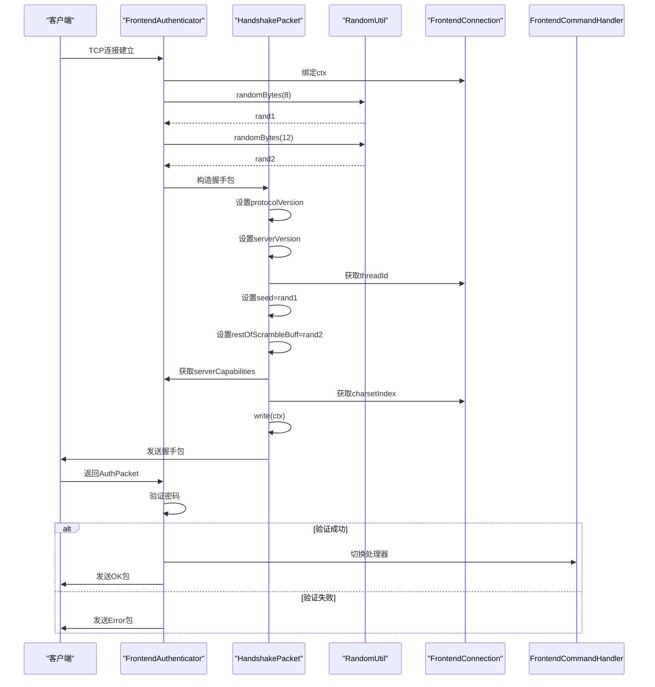

# 握手流程

<cite>
**本文档中引用的文件**  
- [HandshakePacket.java](file://src/main/java/alchemystar/freedom/engine/net/proto/mysql/HandshakePacket.java)
- [FrontendAuthenticator.java](file://src/main/java/alchemystar/freedom/engine/net/handler/frontend/FrontendAuthenticator.java)
- [RandomUtil.java](file://src/main/java/alchemystar/freedom/engine/net/proto/util/RandomUtil.java)
- [Versions.java](file://src/main/java/alchemystar/freedom/engine/net/proto/util/Versions.java)
- [Capabilities.java](file://src/main/java/alchemystar/freedom/engine/net/proto/util/Capabilities.java)
- [FrontendConnection.java](file://src/main/java/alchemystar/freedom/engine/net/handler/frontend/FrontendConnection.java)
- [SecurityUtil.java](file://src/main/java/alchemystar/freedom/engine/net/proto/util/SecurityUtil.java)
- [Database.java](file://src/main/java/alchemystar/freedom/engine/Database.java)
</cite>

## 目录
1. [握手包构造](#握手包构造)  
2. [协议版本与服务器版本](#协议版本与服务器版本)  
3. [线程ID赋值逻辑](#线程id赋值逻辑)  
4. [随机种子生成机制](#随机种子生成机制)  
5. [serverCapabilities标志位解析](#servercapabilities标志位解析)  
6. [字符集索引设置](#字符集索引设置)  
7. [握手包发送流程](#握手包发送流程)  
8. [完整握手时序图](#完整握手时序图)  
9. [异常处理机制](#异常处理机制)

## 握手包构造

在Freedom数据库中，MySQL协议的握手流程由`FrontendAuthenticator`类负责初始化，通过构造`HandshakePacket`对象并将其序列化后发送至客户端。`HandshakePacket`继承自`MySQLPacket`，封装了MySQL协议握手阶段所需的所有字段，并提供`write`方法用于通过Netty的`ChannelHandlerContext`发送数据。

握手包的构造过程发生在`FrontendAuthenticator.channelActive`方法中，当新的客户端连接建立时触发。该过程包括协议版本、服务器版本、线程ID、随机种子、能力标志、字符集索引等字段的初始化。

**Section sources**  
- [HandshakePacket.java](file://src/main/java/alchemystar/freedom/engine/net/proto/mysql/HandshakePacket.java#L1-L77)
- [FrontendAuthenticator.java](file://src/main/java/alchemystar/freedom/engine/net/handler/frontend/FrontendAuthenticator.java#L1-L173)

## 协议版本与服务器版本

握手包中的`protocolVersion`字段表示MySQL协议版本，其值由`Versions.PROTOCOL_VERSION`常量定义，固定为`10`，对应MySQL 4.1及以上版本的协议。

`serverVersion`字段表示服务器版本信息，其值由`Versions.SERVER_VERSION`定义，当前为`"5.1.1-freedom".getBytes()`，标识该数据库为基于MySQL 5.1.1协议兼容的Freedom自研数据库。

这两个字段在`FrontendAuthenticator.channelActive`中直接赋值，用于告知客户端服务端所支持的协议版本和具体实现版本。

**Section sources**  
- [Versions.java](file://src/main/java/alchemystar/freedom/engine/net/proto/util/Versions.java#L1-L12)
- [FrontendAuthenticator.java](file://src/main/java/alchemystar/freedom/engine/net/handler/frontend/FrontendAuthenticator.java#L54-L56)

## 线程ID赋值逻辑

`threadId`字段在握手包中用于标识客户端连接的唯一线程ID。在Freedom中，该值来源于`FrontendConnection`对象的`id`属性，通过`source.getId()`获取。

`FrontendConnection`代表一个前端客户端连接，每个连接在创建时会分配一个唯一的`id`，该ID在握手阶段作为`threadId`发送给客户端，用于后续请求的上下文关联和连接管理。

**Section sources**  
- [FrontendAuthenticator.java](file://src/main/java/alchemystar/freedom/engine/net/handler/frontend/FrontendAuthenticator.java#L57)
- [FrontendConnection.java](file://src/main/java/alchemystar/freedom/engine/net/handler/frontend/FrontendConnection.java#L280-L285)

## 随机种子生成机制

随机种子（`seed`）用于客户端密码加密验证，是握手安全性的关键部分。Freedom数据库采用拼接方式生成20字节的随机种子：

1. 生成前8字节的`rand1`：调用`RandomUtil.randomBytes(8)`
2. 生成后12字节的`rand2`：调用`RandomUtil.randomBytes(12)`
3. 拼接为完整种子：`seed = rand1 + rand2`

在`HandshakePacket`中，`seed`字段仅存储`rand1`（前8字节），而`restOfScrambleBuff`字段存储`rand2`（后12字节）。这种设计符合MySQL 4.1协议的`scramble`字段分段结构。

`RandomUtil`使用线程安全的伪随机数生成器，基于系统纳秒时间戳和线性同余算法生成随机字节，确保每次生成的种子具有足够的随机性。

**Section sources**  
- [FrontendAuthenticator.java](file://src/main/java/alchemystar/freedom/engine/net/handler/frontend/FrontendAuthenticator.java#L45-L52)
- [RandomUtil.java](file://src/main/java/alchemystar/freedom/engine/net/proto/util/RandomUtil.java#L1-L50)
- [HandshakePacket.java](file://src/main/java/alchemystar/freedom/engine/net/proto/mysql/HandshakePacket.java#L1-L77)

## serverCapabilities标志位解析

`serverCapabilities`字段表示服务端支持的功能能力，是一个位图标志，用于与客户端进行能力协商。在Freedom中，该值由`getServerCapabilities()`方法动态计算。

关键能力标志包括：
- `CLIENT_LONG_PASSWORD`：支持长密码
- `CLIENT_FOUND_ROWS`：返回匹配行数而非影响行数
- `CLIENT_LONG_FLAG`：获取所有列标志
- `CLIENT_CONNECT_WITH_DB`：允许连接时指定数据库
- `CLIENT_PROTOCOL_41`：支持MySQL 4.1协议
- `CLIENT_INTERACTIVE`：交互式客户端支持
- `CLIENT_TRANSACTIONS`：支持事务
- `CLIENT_SECURE_CONNECTION`：支持安全连接（SHA1加密）

这些标志通过按位或（`|=`）操作组合，最终形成32位整数。客户端在认证包（`AuthPacket`）中返回其能力标志，服务端据此调整后续通信行为。

**Section sources**  
- [FrontendAuthenticator.java](file://src/main/java/alchemystar/freedom/engine/net/handler/frontend/FrontendAuthenticator.java#L130-L154)
- [Capabilities.java](file://src/main/java/alchemystar/freedom/engine/net/proto/util/Capabilities.java#L1-L85)

## 字符集索引设置

`serverCharsetIndex`字段表示服务端默认字符集的索引号。该值来源于`FrontendConnection`对象的`charsetIndex`属性，通过`source.charsetIndex & 0xff`转换为无符号字节。

字符集索引用于客户端与服务端之间的文本编码协商。Freedom通过`CharsetUtil`工具类实现字符集名称与索引的双向映射。在握手阶段，服务端将当前连接的字符集索引发送给客户端，客户端应在后续通信中使用该字符集进行编码。

**Section sources**  
- [FrontendAuthenticator.java](file://src/main/java/alchemystar/freedom/engine/net/handler/frontend/FrontendAuthenticator.java#L60)
- [FrontendConnection.java](file://src/main/java/alchemystar/freedom/engine/net/handler/frontend/FrontendConnection.java#L120-L128)

## 握手包发送流程

握手包的发送由`FrontendAuthenticator.channelActive`方法驱动，具体流程如下：

1. 将`FrontendConnection`与Netty的`ChannelHandlerContext`绑定
2. 生成随机种子`rand1`和`rand2`
3. 构造`HandshakePacket`对象并填充所有字段
4. 调用`HandshakePacket.write(ctx)`序列化并发送

发送过程中，`HandshakePacket.write`方法使用Netty的`ByteBuf`进行二进制编码，先写入包长度和包ID，再依次写入各字段。发送操作通过`ctx.writeAndFlush(buffer)`异步执行，无需线程池介入，直接由Netty I/O线程处理。

发送完成后，连接上下文建立，等待客户端返回`AuthPacket`进行身份验证。

**Section sources**  
- [FrontendAuthenticator.java](file://src/main/java/alchemystar/freedom/engine/net/handler/frontend/FrontendAuthenticator.java#L40-L74)
- [HandshakePacket.java](file://src/main/java/alchemystar/freedom/engine/net/proto/mysql/HandshakePacket.java#L30-L48)

## 完整握手时序图

**Diagram sources**  
- [FrontendAuthenticator.java](file://src/main/java/alchemystar/freedom/engine/net/handler/frontend/FrontendAuthenticator.java#L40-L74)
- [HandshakePacket.java](file://src/main/java/alchemystar/freedom/engine/net/proto/mysql/HandshakePacket.java#L30-L48)

## 异常处理机制

握手阶段的异常主要集中在身份验证环节，由`FrontendAuthenticator.channelRead`方法处理：

1. **密码验证失败**：调用`checkPassword`方法验证客户端密码，若失败则调用`failure()`发送`ER_ACCESS_DENIED_ERROR`错误。
2. **用户不存在**：若客户端提供的用户名与`Database.getInstance().getUserName()`不匹配，则拒绝访问。
3. **空用户名**：用户名为空时直接拒绝。
4. **加密异常**：在`SecurityUtil.scramble411`中发生`NoSuchAlgorithmException`时，记录警告并拒绝连接。

错误信息通过`writeErrMessage`方法封装为`ErrorPacket`发送给客户端，同时记录日志。连接在认证失败后保持打开状态，允许客户端重试，超时由`AUTH_TIMEOUT`控制。

**Section sources**  
- [FrontendAuthenticator.java](file://src/main/java/alchemystar/freedom/engine/net/handler/frontend/FrontendAuthenticator.java#L100-L128)
- [SecurityUtil.java](file://src/main/java/alchemystar/freedom/engine/net/proto/util/SecurityUtil.java#L1-L78)
- [Database.java](file://src/main/java/alchemystar/freedom/engine/Database.java#L1-L78)