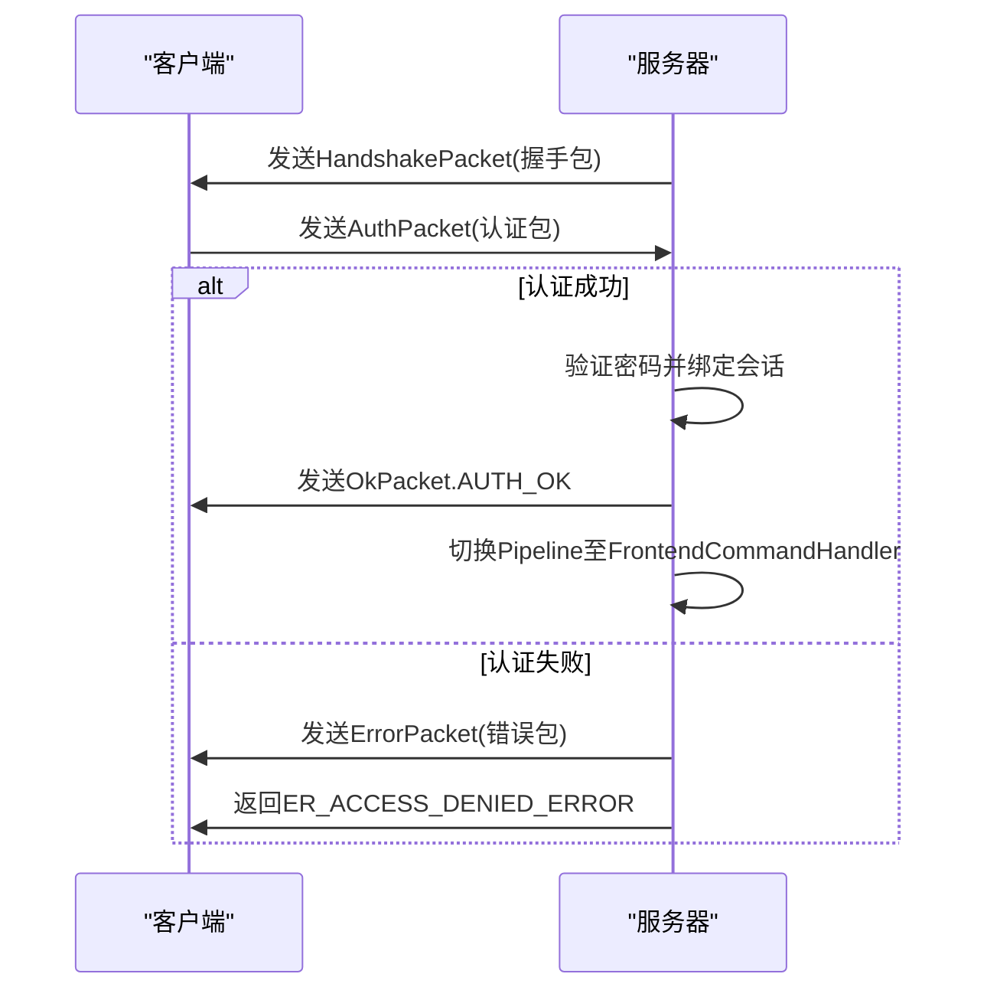
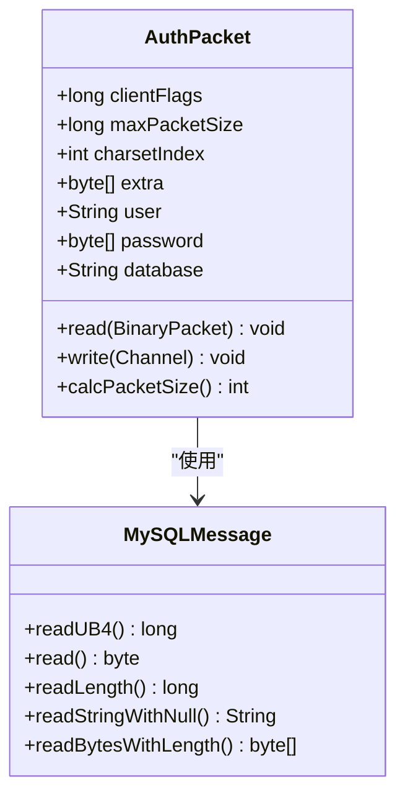
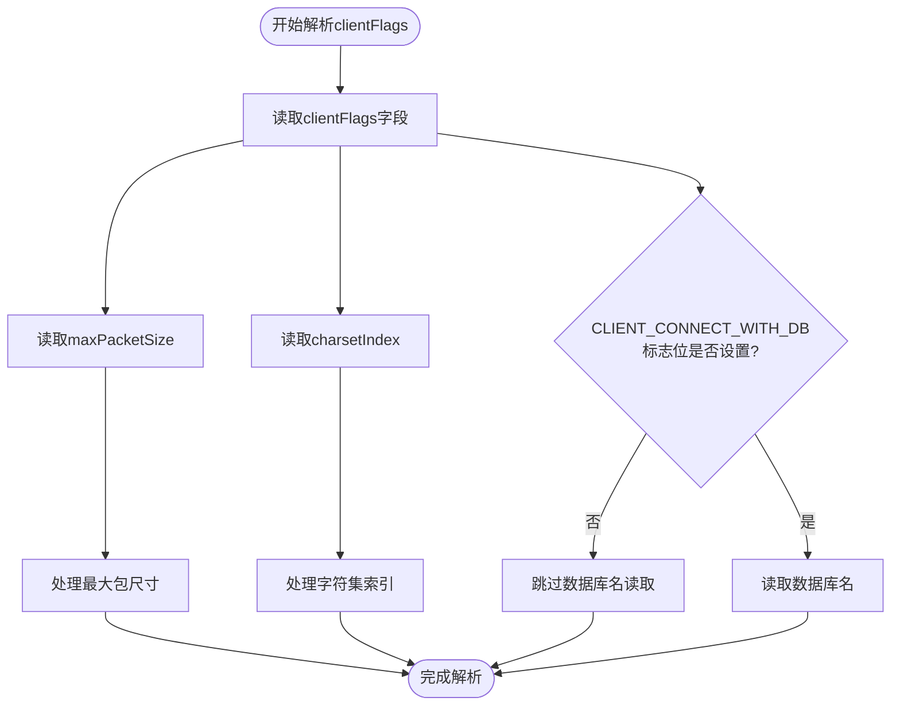
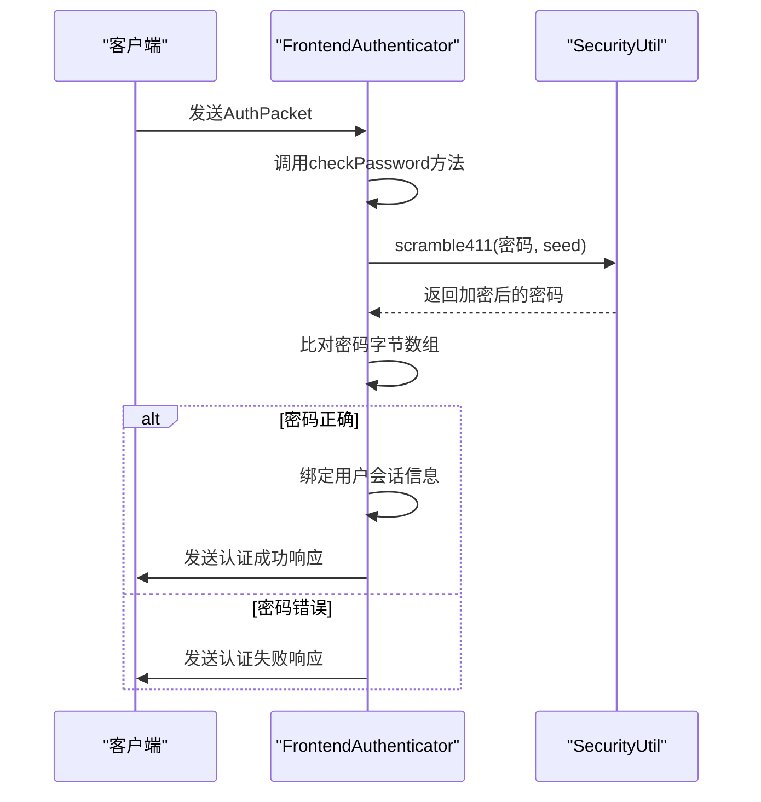
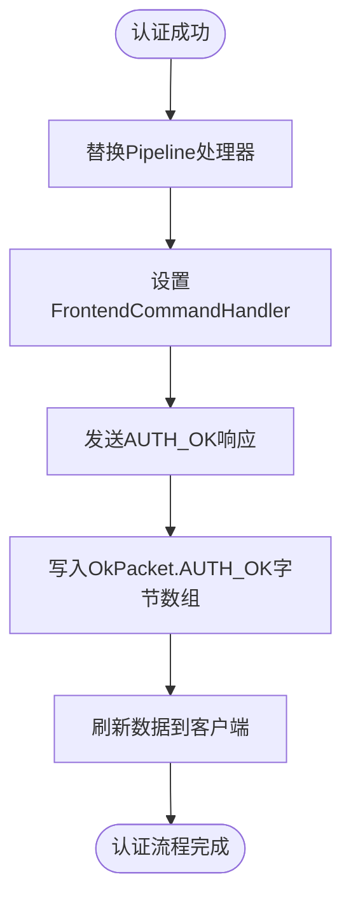
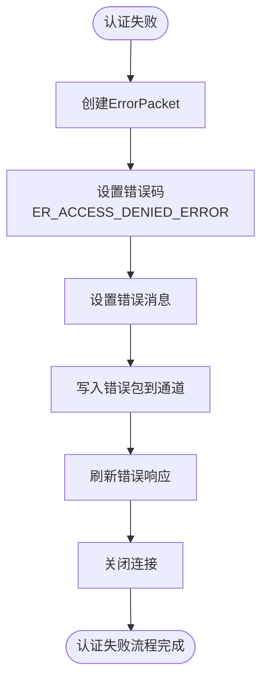
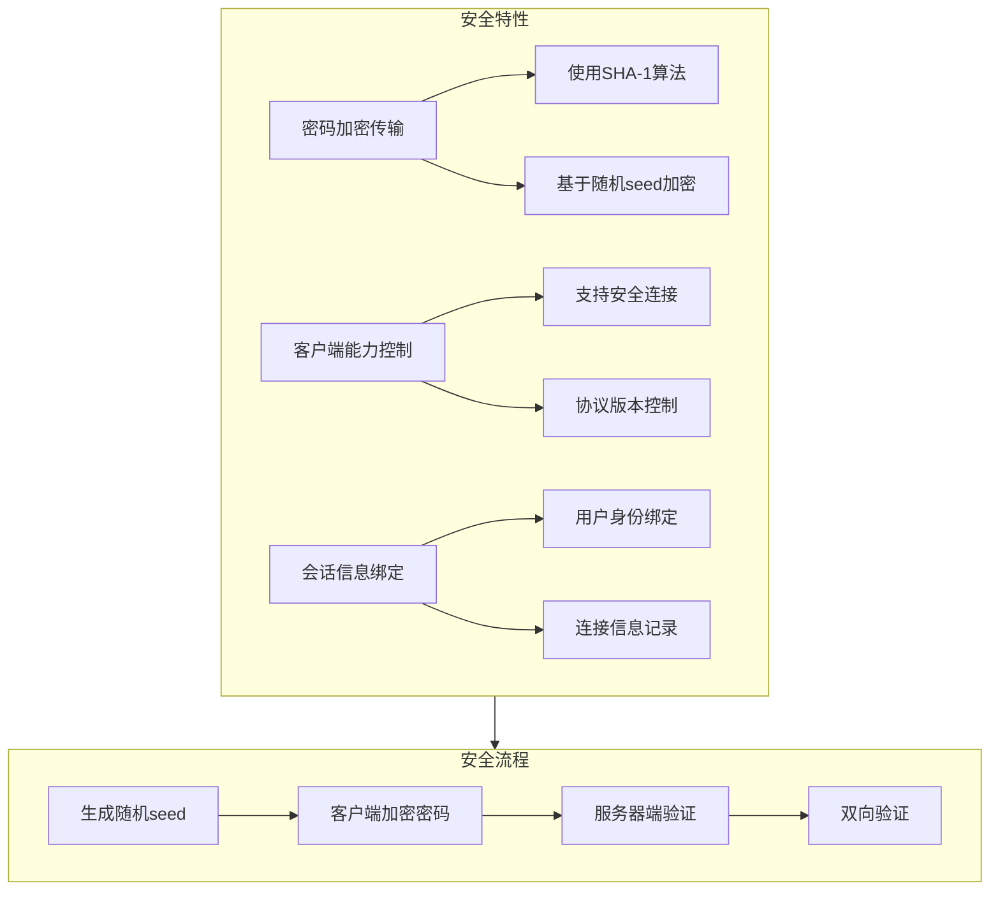

# 认证机制

<cite>
**本文档引用的文件**
- [AuthPacket.java](file://src/main/java/alchemystar/freedom/engine/net/proto/mysql/AuthPacket.java)
- [FrontendAuthenticator.java](file://src/main/java/alchemystar/freedom/engine/net/handler/frontend/FrontendAuthenticator.java)
- [Capabilities.java](file://src/main/java/alchemystar/freedom/engine/net/proto/util/Capabilities.java)
- [SecurityUtil.java](file://src/main/java/alchemystar/freedom/engine/net/proto/util/SecurityUtil.java)
- [OkPacket.java](file://src/main/java/alchemystar/freedom/engine/net/proto/mysql/OkPacket.java)
- [ErrorPacket.java](file://src/main/java/alchemystar/freedom/engine/net/proto/mysql/ErrorPacket.java)
- [MySQLMessage.java](file://src/main/java/alchemystar/freedom/engine/net/proto/mysql/MySQLMessage.java)
- [FrontendConnection.java](file://src/main/java/alchemystar/freedom/engine/net/handler/frontend/FrontendConnection.java)
- [ErrorCode.java](file://src/main/java/alchemystar/freedom/engine/net/proto/util/ErrorCode.java)
- [Database.java](file://src/main/java/alchemystar/freedom/engine/Database.java)
</cite>

## 目录
1. [简介](#简介)
2. [认证流程概述](#认证流程概述)
3. [AuthPacket解析](#authpacket解析)
4. [客户端能力标志解析](#客户端能力标志解析)
5. [密码验证机制](#密码验证机制)
6. [认证成功处理](#认证成功处理)
7. [认证失败处理](#认证失败处理)
8. [安全性分析](#安全性分析)

## 简介
Freedom数据库的客户端认证机制实现了标准的MySQL协议认证流程，通过握手包、认证包的交互完成客户端身份验证。本机制基于MySQL 4.1协议实现，采用安全的密码加密传输方式，确保认证过程的安全性。

## 认证流程概述

**图示来源**
- [FrontendAuthenticator.java](file://src/main/java/alchemystar/freedom/engine/net/handler/frontend/FrontendAuthenticator.java#L40-L173)
- [AuthPacket.java](file://src/main/java/alchemystar/freedom/engine/net/proto/mysql/AuthPacket.java#L15-L119)

## AuthPacket解析
AuthPacket类负责解析客户端发送的认证数据包，包含客户端能力标志、最大包尺寸、字符集索引、用户名、密码和数据库名等信息。

**图示来源**
- [AuthPacket.java](file://src/main/java/alchemystar/freedom/engine/net/proto/mysql/AuthPacket.java#L15-L119)
- [MySQLMessage.java](file://src/main/java/alchemystar/freedom/engine/net/proto/mysql/MySQLMessage.java#L15-L365)

**本节来源**
- [AuthPacket.java](file://src/main/java/alchemystar/freedom/engine/net/proto/mysql/AuthPacket.java#L15-L119)
- [MySQLMessage.java](file://src/main/java/alchemystar/freedom/engine/net/proto/mysql/MySQLMessage.java#L15-L365)

## 客户端能力标志解析
客户端能力标志（clientFlags）用于标识客户端支持的功能特性，通过位运算进行解析和判断。

**图示来源**
- [AuthPacket.java](file://src/main/java/alchemystar/freedom/engine/net/proto/mysql/AuthPacket.java#L30-L58)
- [Capabilities.java](file://src/main/java/alchemystar/freedom/engine/net/proto/util/Capabilities.java#L15-L86)

**本节来源**
- [AuthPacket.java](file://src/main/java/alchemystar/freedom/engine/net/proto/mysql/AuthPacket.java#L30-L58)
- [Capabilities.java](file://src/main/java/alchemystar/freedom/engine/net/proto/util/Capabilities.java#L15-L86)

## 密码验证机制
密码验证流程通过FrontendAuthenticator的channelRead方法实现，包括密码解密、比对和用户会话绑定。

**图示来源**
- [FrontendAuthenticator.java](file://src/main/java/alchemystar/freedom/engine/net/handler/frontend/FrontendAuthenticator.java#L90-L139)
- [SecurityUtil.java](file://src/main/java/alchemystar/freedom/engine/net/proto/util/SecurityUtil.java#L15-L78)

**本节来源**
- [FrontendAuthenticator.java](file://src/main/java/alchemystar/freedom/engine/net/handler/frontend/FrontendAuthenticator.java#L90-L139)
- [SecurityUtil.java](file://src/main/java/alchemystar/freedom/engine/net/proto/util/SecurityUtil.java#L15-L78)

## 认证成功处理
认证成功后，系统会切换Netty Pipeline至命令处理程序，并发送OK响应。

**图示来源**
- [FrontendAuthenticator.java](file://src/main/java/alchemystar/freedom/engine/net/handler/frontend/FrontendAuthenticator.java#L141-L150)
- [OkPacket.java](file://src/main/java/alchemystar/freedom/engine/net/proto/mysql/OkPacket.java#L15-L70)

**本节来源**
- [FrontendAuthenticator.java](file://src/main/java/alchemystar/freedom/engine/net/handler/frontend/FrontendAuthenticator.java#L141-L150)
- [OkPacket.java](file://src/main/java/alchemystar/freedom/engine/net/proto/mysql/OkPacket.java#L15-L70)

## 认证失败处理
认证失败时，系统会返回相应的错误码和错误信息。

**图示来源**
- [FrontendAuthenticator.java](file://src/main/java/alchemystar/freedom/engine/net/handler/frontend/FrontendAuthenticator.java#L152-L158)
- [ErrorPacket.java](file://src/main/java/alchemystar/freedom/engine/net/proto/mysql/ErrorPacket.java#L15-L80)
- [ErrorCode.java](file://src/main/java/alchemystar/freedom/engine/net/proto/util/ErrorCode.java#L15-L523)

**本节来源**
- [FrontendAuthenticator.java](file://src/main/java/alchemystar/freedom/engine/net/handler/frontend/FrontendAuthenticator.java#L152-L158)
- [ErrorPacket.java](file://src/main/java/alchemystar/freedom/engine/net/proto/mysql/ErrorPacket.java#L15-L80)
- [ErrorCode.java](file://src/main/java/alchemystar/freedom/engine/net/proto/util/ErrorCode.java#L15-L523)

## 安全性分析
Freedom数据库的认证机制实现了多层安全保护，确保用户凭证的安全传输和存储。

**图示来源**
- [FrontendAuthenticator.java](file://src/main/java/alchemystar/freedom/engine/net/handler/frontend/FrontendAuthenticator.java#L40-L88)
- [SecurityUtil.java](file://src/main/java/alchemystar/freedom/engine/net/proto/util/SecurityUtil.java#L15-L78)
- [Database.java](file://src/main/java/alchemystar/freedom/engine/Database.java#L15-L78)

**本节来源**
- [FrontendAuthenticator.java](file://src/main/java/alchemystar/freedom/engine/net/handler/frontend/FrontendAuthenticator.java#L40-L88)
- [SecurityUtil.java](file://src/main/java/alchemystar/freedom/engine/net/proto/util/SecurityUtil.java#L15-L78)
- [Database.java](file://src/main/java/alchemystar/freedom/engine/Database.java#L15-L78)