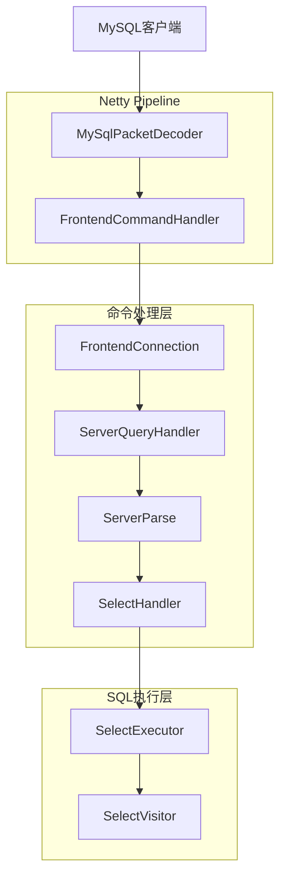
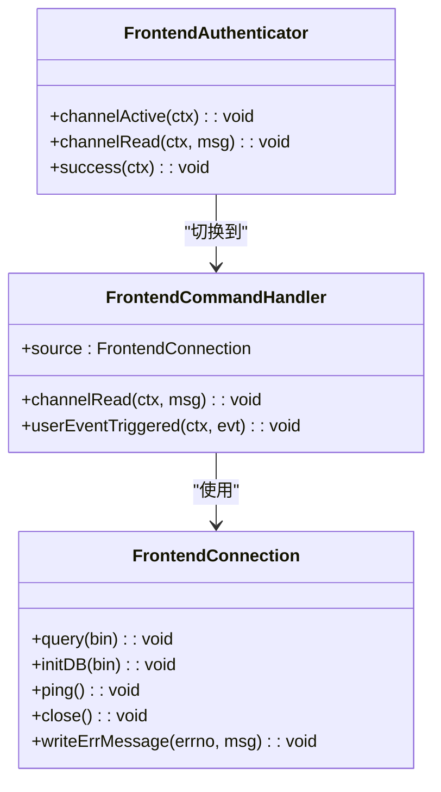
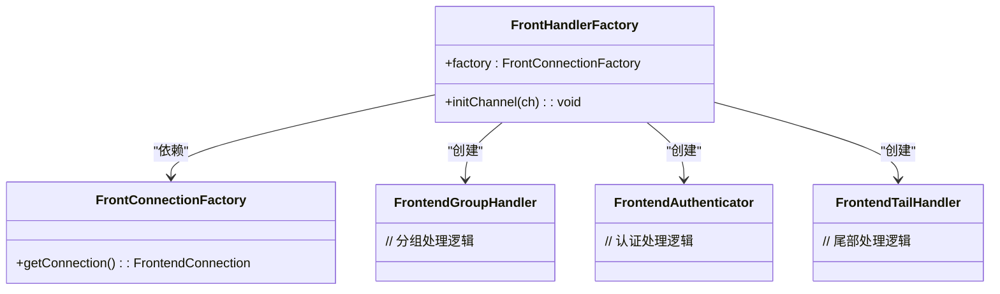
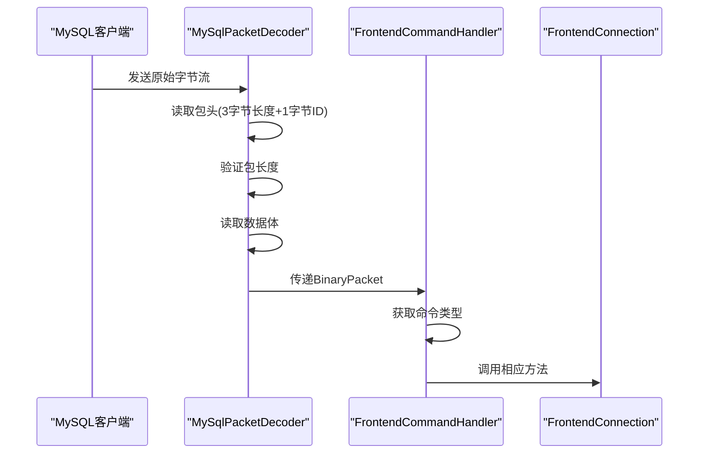
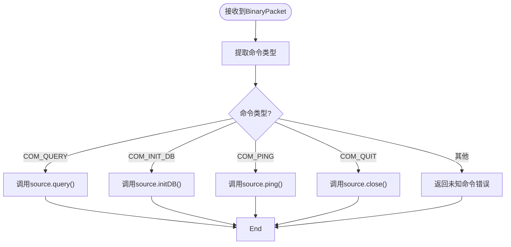
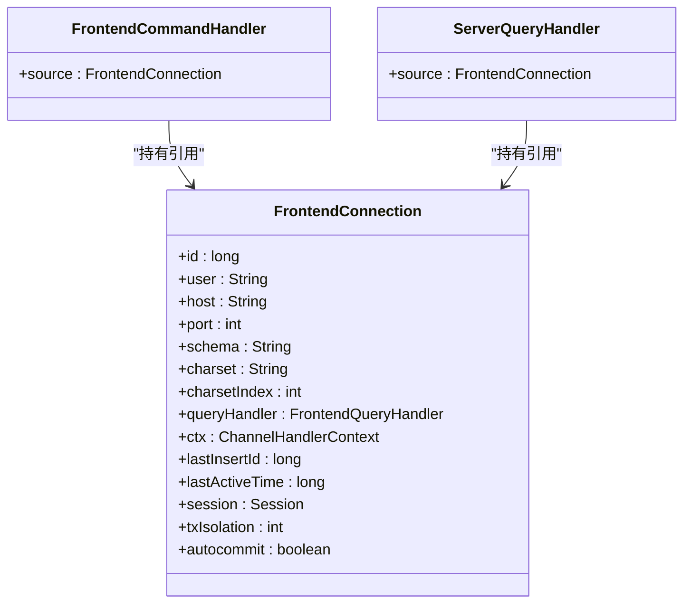
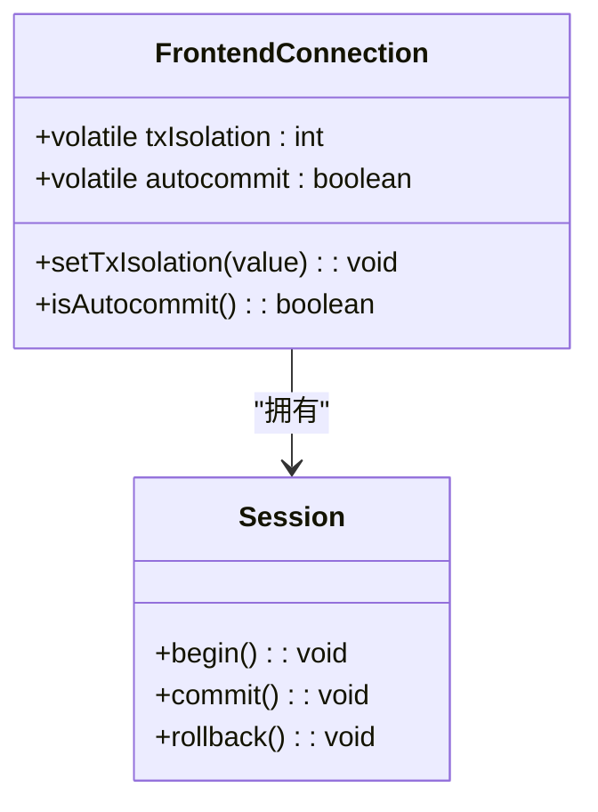
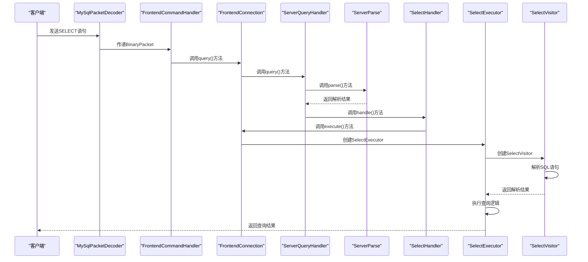
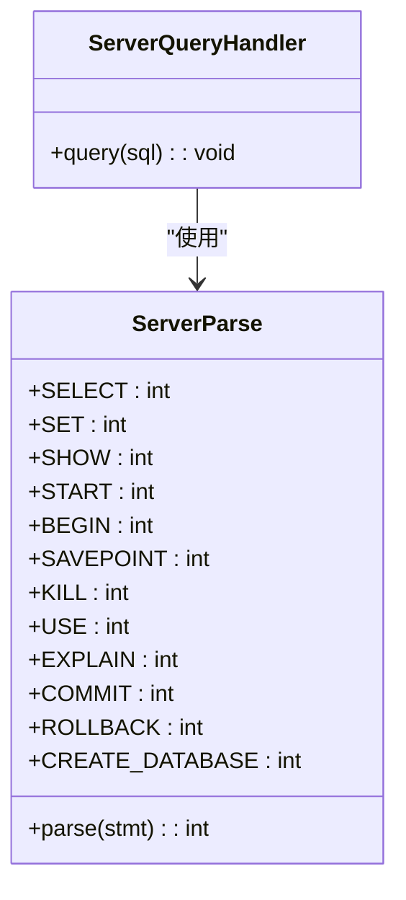
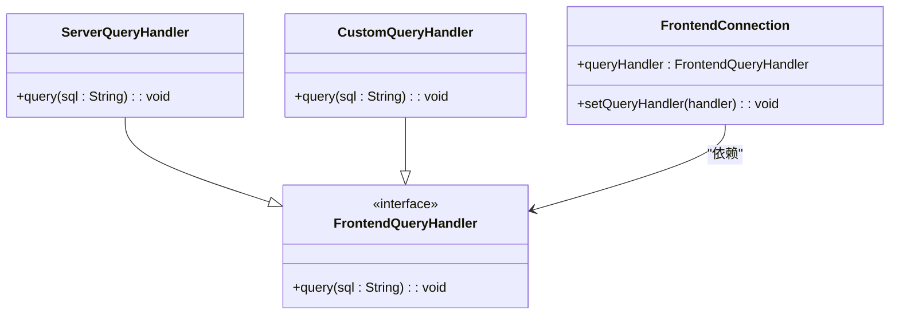

# 命令分发

<cite>
**本文档中引用的文件**  
- [FrontendCommandHandler.java](file://src/main/java/alchemystar/freedom/engine/net/handler/frontend/FrontendCommandHandler.java)
- [FrontHandlerFactory.java](file://src/main/java/alchemystar/freedom/engine/net/handler/factory/FrontHandlerFactory.java)
- [CommandPacket.java](file://src/main/java/alchemystar/freedom/engine/net/proto/mysql/CommandPacket.java)
- [ServerQueryHandler.java](file://src/main/java/alchemystar/freedom/engine/net/handler/frontend/ServerQueryHandler.java)
- [FrontendConnection.java](file://src/main/java/alchemystar/freedom/engine/net/handler/frontend/FrontendConnection.java)
- [MySqlPacketDecoder.java](file://src/main/java/alchemystar/freedom/engine/net/codec/MySqlPacketDecoder.java)
- [ServerParse.java](file://src/main/java/alchemystar/freedom/engine/parser/ServerParse.java)
- [SelectHandler.java](file://src/main/java/alchemystar/freedom/engine/net/handler/frontend/SelectHandler.java)
- [SelectExecutor.java](file://src/main/java/alchemystar/freedom/sql/SelectExecutor.java)
- [SelectVisitor.java](file://src/main/java/alchemystar/freedom/sql/parser/SelectVisitor.java)
</cite>

## 目录
1. [引言](#引言)
2. [命令分发机制总体架构](#命令分发机制总体架构)
3. [核心组件分析](#核心组件分析)
4. [命令分发流程详解](#命令分发流程详解)
5. [上下文传递与线程安全](#上下文传递与线程安全)
6. [SELECT语句执行路径示例](#select语句执行路径示例)
7. [扩展性与插件化设计](#扩展性与插件化设计)
8. [结论](#结论)

## 引言
本文档详细阐述了Freedom数据库系统中命令分发机制的设计与实现。重点分析了前端命令处理器如何接收并路由不同类型的MySQL命令，以及系统如何通过工厂模式动态创建处理器实例。文档还深入探讨了上下文信息的传递机制、线程安全性保障，以及系统的扩展性设计。

## 命令分发机制总体架构

**图示来源**  
- [MySqlPacketDecoder.java](file://src/main/java/alchemystar/freedom/engine/net/codec/MySqlPacketDecoder.java)
- [FrontendCommandHandler.java](file://src/main/java/alchemystar/freedom/engine/net/handler/frontend/FrontendCommandHandler.java)
- [FrontendConnection.java](file://src/main/java/alchemystar/freedom/engine/net/handler/frontend/FrontendConnection.java)
- [ServerQueryHandler.java](file://src/main/java/alchemystar/freedom/engine/net/handler/frontend/ServerQueryHandler.java)
- [ServerParse.java](file://src/main/java/alchemystar/freedom/engine/parser/ServerParse.java)
- [SelectHandler.java](file://src/main/java/alchemystar/freedom/engine/net/handler/frontend/SelectHandler.java)
- [SelectExecutor.java](file://src/main/java/alchemystar/freedom/sql/SelectExecutor.java)
- [SelectVisitor.java](file://src/main/java/alchemystar/freedom/sql/parser/SelectVisitor.java)

## 核心组件分析

### FrontendCommandHandler分析

`FrontendCommandHandler`是命令分发的核心组件，负责接收解码后的命令包并根据命令类型进行路由。该处理器继承自Netty的`ChannelHandlerAdapter`，通过`channelRead`方法处理接收到的数据。

**图示来源**  
- [FrontendCommandHandler.java](file://src/main/java/alchemystar/freedom/engine/net/handler/frontend/FrontendCommandHandler.java#L15-L89)
- [FrontendConnection.java](file://src/main/java/alchemystar/freedom/engine/net/handler/frontend/FrontendConnection.java#L15-L320)

**本节来源**  
- [FrontendCommandHandler.java](file://src/main/java/alchemystar/freedom/engine/net/handler/frontend/FrontendCommandHandler.java#L15-L89)
- [FrontendConnection.java](file://src/main/java/alchemystar/freedom/engine/net/handler/frontend/FrontendConnection.java#L15-L320)

### FrontHandlerFactory分析

`FrontHandlerFactory`是前端处理器的工厂类，负责在连接建立时初始化Netty管道中的各个处理器。该工厂采用责任链模式构建处理器链，确保命令按正确顺序处理。

**图示来源**  
- [FrontHandlerFactory.java](file://src/main/java/alchemystar/freedom/engine/net/handler/factory/FrontHandlerFactory.java#L15-L41)
- [FrontConnectionFactory.java](file://src/main/java/alchemystar/freedom/engine/net/handler/factory/FrontConnectionFactory.java)

**本节来源**  
- [FrontHandlerFactory.java](file://src/main/java/alchemystar/freedom/engine/net/handler/factory/FrontHandlerFactory.java#L15-L41)

## 命令分发流程详解

### 命令接收与解码

命令分发的第一步是接收和解码MySQL协议包。`MySqlPacketDecoder`负责将原始字节流解码为`BinaryPacket`对象，该过程遵循MySQL协议规范。

**图示来源**  
- [MySqlPacketDecoder.java](file://src/main/java/alchemystar/freedom/engine/net/codec/MySqlPacketDecoder.java#L15-L63)
- [FrontendCommandHandler.java](file://src/main/java/alchemystar/freedom/engine/net/handler/frontend/FrontendCommandHandler.java#L15-L89)

**本节来源**  
- [MySqlPacketDecoder.java](file://src/main/java/alchemystar/freedom/engine/net/codec/MySqlPacketDecoder.java#L15-L63)
- [FrontendCommandHandler.java](file://src/main/java/alchemystar/freedom/engine/net/handler/frontend/FrontendCommandHandler.java#L15-L89)

### 命令路由机制

`FrontendCommandHandler`通过switch语句根据`commandType`进行命令路由。每种命令类型都有对应的处理方法，这些方法最终委托给`FrontendConnection`实例执行。

**图示来源**  
- [FrontendCommandHandler.java](file://src/main/java/alchemystar/freedom/engine/net/handler/frontend/FrontendCommandHandler.java#L45-L80)
- [FrontendConnection.java](file://src/main/java/alchemystar/freedom/engine/net/handler/frontend/FrontendConnection.java#L15-L320)

**本节来源**  
- [FrontendCommandHandler.java](file://src/main/java/alchemystar/freedom/engine/net/handler/frontend/FrontendCommandHandler.java#L45-L80)

## 上下文传递与线程安全

### 上下文信息传递

系统通过`FrontendConnection`对象在各个处理器之间传递上下文信息。该对象包含了连接相关的所有状态信息，如用户、主机、端口、字符集、事务隔离级别等。

**图示来源**  
- [FrontendConnection.java](file://src/main/java/alchemystar/freedom/engine/net/handler/frontend/FrontendConnection.java#L15-L320)
- [FrontendCommandHandler.java](file://src/main/java/alchemystar/freedom/engine/net/handler/frontend/FrontendCommandHandler.java#L15-L89)
- [ServerQueryHandler.java](file://src/main/java/alchemystar/freedom/engine/net/handler/frontend/ServerQueryHandler.java#L15-L85)

**本节来源**  
- [FrontendConnection.java](file://src/main/java/alchemystar/freedom/engine/net/handler/frontend/FrontendConnection.java#L15-L320)

### 线程安全与状态一致性

系统通过以下机制保证线程安全和状态一致性：
1. 每个连接有独立的`FrontendConnection`实例
2. 关键状态变量使用`volatile`关键字修饰
3. Netty的事件循环保证单线程处理

**图示来源**  
- [FrontendConnection.java](file://src/main/java/alchemystar/freedom/engine/net/handler/frontend/FrontendConnection.java#L15-L320)
- [Session.java](file://src/main/java/alchemystar/freedom/engine/session/Session.java)

**本节来源**  
- [FrontendConnection.java](file://src/main/java/alchemystar/freedom/engine/net/handler/frontend/FrontendConnection.java#L15-L320)

## SELECT语句执行路径示例

### 完整调用链分析

以SELECT语句为例，展示从命令接收到SQL解析的完整调用链：

**图示来源**  
- [FrontendCommandHandler.java](file://src/main/java/alchemystar/freedom/engine/net/handler/frontend/FrontendCommandHandler.java#L15-L89)
- [FrontendConnection.java](file://src/main/java/alchemystar/freedom/engine/net/handler/frontend/FrontendConnection.java#L15-L320)
- [ServerQueryHandler.java](file://src/main/java/alchemystar/freedom/engine/net/handler/frontend/ServerQueryHandler.java#L15-L85)
- [ServerParse.java](file://src/main/java/alchemystar/freedom/engine/parser/ServerParse.java#L15-L449)
- [SelectHandler.java](file://src/main/java/alchemystar/freedom/engine/net/handler/frontend/SelectHandler.java#L15-L40)
- [SelectExecutor.java](file://src/main/java/alchemystar/freedom/sql/SelectExecutor.java#L15-L122)
- [SelectVisitor.java](file://src/main/java/alchemystar/freedom/sql/parser/SelectVisitor.java#L15-L186)

**本节来源**  
- [FrontendCommandHandler.java](file://src/main/java/alchemystar/freedom/engine/net/handler/frontend/FrontendCommandHandler.java#L15-L89)
- [FrontendConnection.java](file://src/main/java/alchemystar/freedom/engine/net/handler/frontend/FrontendConnection.java#L15-L320)
- [ServerQueryHandler.java](file://src/main/java/alchemystar/freedom/engine/net/handler/frontend/ServerQueryHandler.java#L15-L85)
- [ServerParse.java](file://src/main/java/alchemystar/freedom/engine/parser/ServerParse.java#L15-L449)
- [SelectHandler.java](file://src/main/java/alchemystar/freedom/engine/net/handler/frontend/SelectHandler.java#L15-L40)
- [SelectExecutor.java](file://src/main/java/alchemystar/freedom/sql/SelectExecutor.java#L15-L122)
- [SelectVisitor.java](file://src/main/java/alchemystar/freedom/sql/parser/SelectVisitor.java#L15-L186)

### 关键方法调用分析

1. **FrontendCommandHandler.channelRead**: 接收命令包，提取命令类型
2. **FrontendConnection.query**: 从数据包中提取SQL语句
3. **ServerQueryHandler.query**: 调用SQL解析器进行语法分析
4. **ServerParse.parse**: 识别SQL语句类型
5. **SelectHandler.handle**: 处理SELECT语句的特殊情况
6. **SelectExecutor.execute**: 执行查询逻辑
7. **SelectVisitor.visit**: 解析SQL语法树

## 扩展性与插件化设计

### 命令类型扩展机制

系统通过`ServerParse`类的静态常量定义所有支持的命令类型，新命令的添加只需在该类中定义新的常量并实现相应的处理器。

**图示来源**  
- [ServerParse.java](file://src/main/java/alchemystar/freedom/engine/parser/ServerParse.java#L15-L449)
- [ServerQueryHandler.java](file://src/main/java/alchemystar/freedom/engine/net/handler/frontend/ServerQueryHandler.java#L15-L85)

**本节来源**  
- [ServerParse.java](file://src/main/java/alchemystar/freedom/engine/parser/ServerParse.java#L15-L449)

### 插件化处理器设计

系统采用接口+实现的模式，允许通过实现`FrontendQueryHandler`接口来扩展新的查询处理器。`FrontendConnection`通过`setQueryHandler`方法动态设置处理器实例。

**图示来源**  
- [FrontendQueryHandler.java](file://src/main/java/alchemystar/freedom/engine/net/handler/frontend/FrontendQueryHandler.java)
- [ServerQueryHandler.java](file://src/main/java/alchemystar/freedom/engine/net/handler/frontend/ServerQueryHandler.java#L15-L85)
- [FrontendConnection.java](file://src/main/java/alchemystar/freedom/engine/net/handler/frontend/FrontendConnection.java#L15-L320)

**本节来源**  
- [ServerQueryHandler.java](file://src/main/java/alchemystar/freedom/engine/net/handler/frontend/ServerQueryHandler.java#L15-L85)
- [FrontendConnection.java](file://src/main/java/alchemystar/freedom/engine/net/handler/frontend/FrontendConnection.java#L15-L320)

## 结论
Freedom数据库系统的命令分发机制设计精巧，通过Netty框架实现了高效的网络通信，利用工厂模式和责任链模式构建了灵活的处理器链。系统通过`FrontendConnection`对象在各个组件间传递上下文信息，保证了状态的一致性。命令路由机制清晰，扩展性良好，支持通过插件化方式添加新的命令类型和处理器。整个设计体现了高内聚、低耦合的原则，为系统的稳定性和可维护性提供了保障。