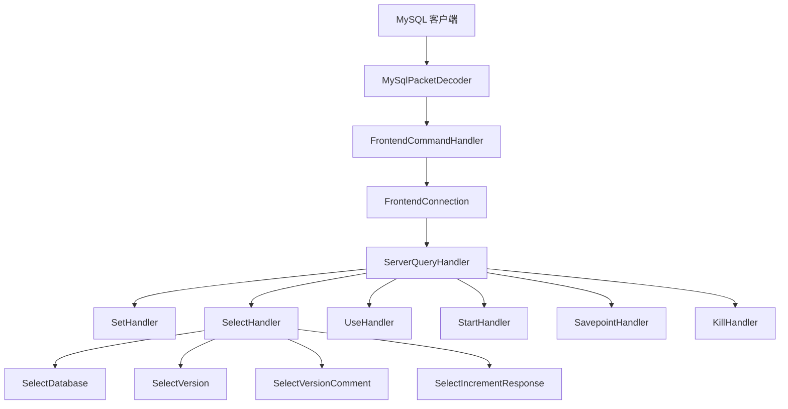
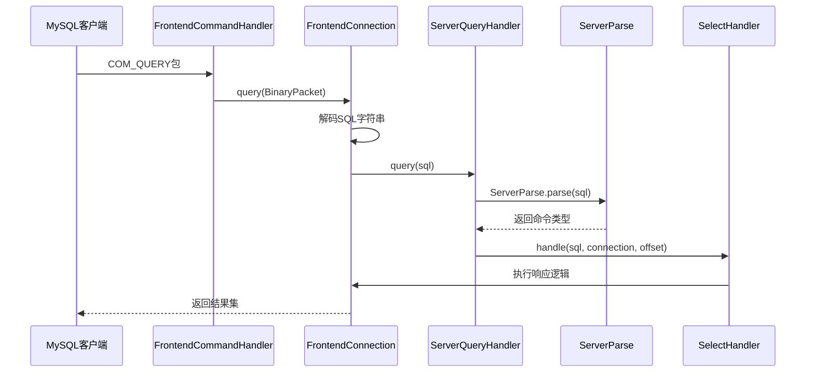
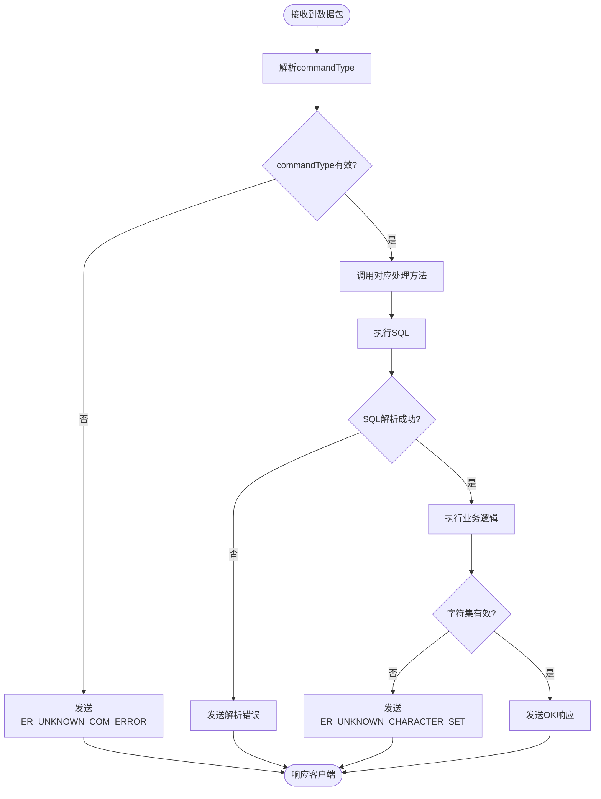

# 命令处理器链

<cite>
**本文档中引用的文件**  
- [FrontendCommandHandler.java](file://src/main/java/alchemystar/freedom/engine/net/handler/frontend/FrontendCommandHandler.java)
- [FrontendConnection.java](file://src/main/java/alchemystar/freedom/engine/net/handler/frontend/FrontendConnection.java)
- [CommandPacket.java](file://src/main/java/alchemystar/freedom/engine/net/proto/mysql/CommandPacket.java)
- [ServerQueryHandler.java](file://src/main/java/alchemystar/freedom/engine/net/handler/frontend/ServerQueryHandler.java)
- [UseHandler.java](file://src/main/java/alchemystar/freedom/engine/net/handler/frontend/UseHandler.java)
- [SelectHandler.java](file://src/main/java/alchemystar/freedom/engine/net/handler/frontend/SelectHandler.java)
- [SetHandler.java](file://src/main/java/alchemystar/freedom/engine/net/handler/frontend/SetHandler.java)
- [UnknownPacketException.java](file://src/main/java/alchemystar/freedom/engine/net/exception/UnknownPacketException.java)
</cite>

## 目录
1. [简介](#简介)
2. [命令处理器链总体架构](#命令处理器链总体架构)
3. [FrontendCommandHandler 核心处理机制](#frontendcommandhandler-核心处理机制)
4. [基于 commandType 的分支处理逻辑](#基于-commandtype-的分支处理逻辑)
5. [COM_QUERY 请求的完整处理流程](#com_query-请求的完整处理流程)
6. [各命令处理器职责划分](#各命令处理器职责划分)
7. [会话状态管理与线程安全](#会话状态管理与线程安全)
8. [异常处理机制](#异常处理机制)
9. [总结](#总结)

## 简介
本文深入分析 Freedom 数据库系统中命令处理器链的实现机制，重点解析 `FrontendCommandHandler` 作为 Netty 责任链中的一环，如何接收并处理解码后的 `CommandPacket`。详细说明其根据 `commandType` 字段（如 `COM_QUERY=3`、`COM_INIT_DB=2` 等）进行条件分支判断，并将请求转发给相应处理器的逻辑。通过代码结构分析，阐述 `ServerQueryHandler`、`UseHandler`、`SelectHandler` 和 `SetHandler` 等组件的职责划分与协作流程。

## 命令处理器链总体架构

**图示来源**  
- [FrontendCommandHandler.java](file://src/main/java/alchemystar/freedom/engine/net/handler/frontend/FrontendCommandHandler.java)
- [FrontendConnection.java](file://src/main/java/alchemystar/freedom/engine/net/handler/frontend/FrontendConnection.java)
- [ServerQueryHandler.java](file://src/main/java/alchemystar/freedom/engine/net/handler/frontend/ServerQueryHandler.java)

## FrontendCommandHandler 核心处理机制

`FrontendCommandHandler` 是 Netty 事件循环中负责处理前端命令的核心处理器，继承自 `ChannelHandlerAdapter`，通过 `channelRead` 方法接收解码后的 `BinaryPacket`。该处理器持有 `FrontendConnection` 实例，用于维护客户端连接状态和会话信息。

当数据包到达时，`FrontendCommandHandler` 首先更新连接的最后活跃时间，然后提取数据包的第一个字节作为 `commandType`，通过 `switch-case` 结构分发到不同的处理逻辑。这种设计实现了命令类型的解耦，使得新增命令类型只需扩展 `switch` 分支即可。

**本节来源**  
- [FrontendCommandHandler.java](file://src/main/java/alchemystar/freedom/engine/net/handler/frontend/FrontendCommandHandler.java#L35-L88)
- [FrontendConnection.java](file://src/main/java/alchemystar/freedom/engine/net/handler/frontend/FrontendConnection.java#L100-L120)

## 基于 commandType 的分支处理逻辑

`FrontendCommandHandler` 依据 `commandType` 字段进行多路分发，主要支持以下命令类型：

- `COM_INIT_DB` (2): 初始化数据库连接，调用 `FrontendConnection.initDB()` 处理数据库切换
- `COM_QUERY` (3): 执行 SQL 查询，调用 `FrontendConnection.query()` 进入 SQL 解析流程
- `COM_PING` (14): 心跳检测，调用 `FrontendConnection.ping()` 返回 OK 包
- `COM_QUIT` (1): 客户端断开连接，调用 `FrontendConnection.close()`
- `COM_PROCESS_KILL` (19): 终止会话，调用 `FrontendConnection.kill()`
- `COM_STMT_PREPARE`, `COM_STMT_EXECUTE`, `COM_STMT_CLOSE`: 预处理语句相关命令
- `COM_HEARTBEAT` (22): 心跳包处理

对于未识别的命令类型，系统会调用 `FrontendConnection.writeErrMessage()` 发送错误响应，返回 `ER_UNKNOWN_COM_ERROR` 错误码。

**本节来源**  
- [FrontendCommandHandler.java](file://src/main/java/alchemystar/freedom/engine/net/handler/frontend/FrontendCommandHandler.java#L45-L85)
- [CommandPacket.java](file://src/main/java/alchemystar/freedom/engine/net/proto/mysql/CommandPacket.java#L10-L11)

## COM_QUERY 请求的完整处理流程

当 `commandType` 为 `COM_QUERY` 时，处理流程如下：

1. `FrontendCommandHandler` 调用 `FrontendConnection.query(BinaryPacket)` 方法
2. `FrontendConnection` 从数据包中提取 SQL 字符串，并进行字符集解码
3. 若 `queryHandler` 不为空，则调用其 `query(sql)` 方法，此处为 `ServerQueryHandler`
4. `ServerQueryHandler` 调用 `ServerParse.parse(sql)` 对 SQL 进行初步解析，返回命令类型和偏移量
5. 根据解析结果，通过 `switch-case` 分发到具体的处理器：
   - `SELECT`: 交由 `SelectHandler.handle()`
   - `SET`: 交由 `SetHandler.handle()`
   - `SHOW`: 交由 `ShowHandler.handle()`
   - `USE`: 交由 `UseHandler.handle()`
   - `BEGIN`: 调用 `FrontendConnection.begin()`
   - `COMMIT`/`ROLLBACK`: 调用事务相关方法

**图示来源**  
- [FrontendCommandHandler.java](file://src/main/java/alchemystar/freedom/engine/net/handler/frontend/FrontendCommandHandler.java#L58-L60)
- [FrontendConnection.java](file://src/main/java/alchemystar/freedom/engine/net/handler/frontend/FrontendConnection.java#L100-L120)
- [ServerQueryHandler.java](file://src/main/java/alchemystar/freedom/engine/net/handler/frontend/ServerQueryHandler.java#L35-L75)

## 各命令处理器职责划分

系统通过多个专用处理器实现职责分离：

### UseHandler：数据库切换处理
`UseHandler` 负责处理 `USE database_name` 语句。其 `handle()` 方法接收 SQL 语句和连接上下文，目前实现为直接调用 `FrontendConnection.writeOk()` 返回成功响应，待后续实现实际的数据库切换逻辑。

**本节来源**  
- [UseHandler.java](file://src/main/java/alchemystar/freedom/engine/net/handler/frontend/UseHandler.java#L10-L14)

### SelectHandler：简单 SELECT 语句处理
`SelectHandler` 专门处理预定义的 `SELECT` 查询，如：
- `SELECT DATABASE()`: 调用 `SelectDatabase.response()`
- `SELECT @@version_comment`: 调用 `SelectVersionComment.response()`
- `SELECT @@version`: 调用 `SelectVersion.response()`
- `SELECT @@session.auto_increment_increment`: 调用 `SelectIncrementResponse.response()`

对于其他 `SELECT` 语句，则调用 `FrontendConnection.execute()` 进入通用执行流程。

**本节来源**  
- [SelectHandler.java](file://src/main/java/alchemystar/freedom/engine/net/handler/frontend/SelectHandler.java#L15-L38)

### SetHandler：会话变量设置处理
`SetHandler` 处理各种 `SET` 命令，包括：
- 事务自动提交 (`AUTOCOMMIT`)
- 事务隔离级别 (`TX_ISOLATION`)
- 字符集设置 (`NAMES`, `CHARACTER SET`)
- 会话变量

根据 `ServerParseSet.parse()` 的解析结果，设置相应的会话状态（如 `autocommit`、`txIsolation`、`charset`），并通过 `writeOk()` 返回成功响应。

**本节来源**  
- [SetHandler.java](file://src/main/java/alchemystar/freedom/engine/net/handler/frontend/SetHandler.java#L25-L80)

## 会话状态管理与线程安全

`FrontendConnection` 类是会话状态的核心容器，维护以下关键状态：
- `schema`: 当前数据库
- `charset`: 字符集
- `autocommit`: 自动提交模式
- `txIsolation`: 事务隔离级别
- `lastActiveTime`: 最后活跃时间
- `session`: 会话对象

所有状态字段均通过 `volatile` 关键字修饰（如 `autocommit`、`txIsolation`），确保多线程环境下的可见性。状态的修改均通过同步方法（如 `setAutocommit()`、`setTxIsolation()`）进行，保证了线程安全。

处理器通过 `FrontendConnection` 实例访问和修改会话状态，实现了上下文的统一管理。

**本节来源**  
- [FrontendConnection.java](file://src/main/java/alchemystar/freedom/engine/net/handler/frontend/FrontendConnection.java#L50-L60)
- [SetHandler.java](file://src/main/java/alchemystar/freedom/engine/net/handler/frontend/SetHandler.java#L50-L60)

## 异常处理机制

系统采用分层异常处理机制：

1. **未知命令处理**：在 `FrontendCommandHandler` 的 `default` 分支中，调用 `FrontendConnection.writeErrMessage(ErrorCode.ER_UNKNOWN_COM_ERROR, "Unknown command")` 直接返回错误包，无需抛出异常。
2. **字符集异常**：在 `FrontendConnection.query()` 中，若字符集解码失败，捕获 `UnsupportedEncodingException` 并返回 `ER_UNKNOWN_CHARACTER_SET` 错误。
3. **运行时异常**：系统定义了 `UnknownPacketException` 作为运行时异常，用于处理协议层面的未知数据包，继承自 `RuntimeException`，便于在调用栈中传递。

错误响应通过 `ErrorPacket` 封装，包含错误码和消息，确保客户端能获得清晰的错误信息。

**图示来源**  
- [FrontendCommandHandler.java](file://src/main/java/alchemystar/freedom/engine/net/handler/frontend/FrontendCommandHandler.java#L80-L85)
- [FrontendConnection.java](file://src/main/java/alchemystar/freedom/engine/net/handler/frontend/FrontendConnection.java#L110-L115)
- [UnknownPacketException.java](file://src/main/java/alchemystar/freedom/engine/net/exception/UnknownPacketException.java)

## 总结
Freedom 系统的命令处理器链采用 Netty 责任链模式，通过 `FrontendCommandHandler` 实现命令分发，`FrontendConnection` 管理会话状态，`ServerQueryHandler` 及其下属处理器实现具体业务逻辑。该设计实现了高内聚、低耦合，便于扩展和维护。异常处理机制完善，确保了系统的健壮性。