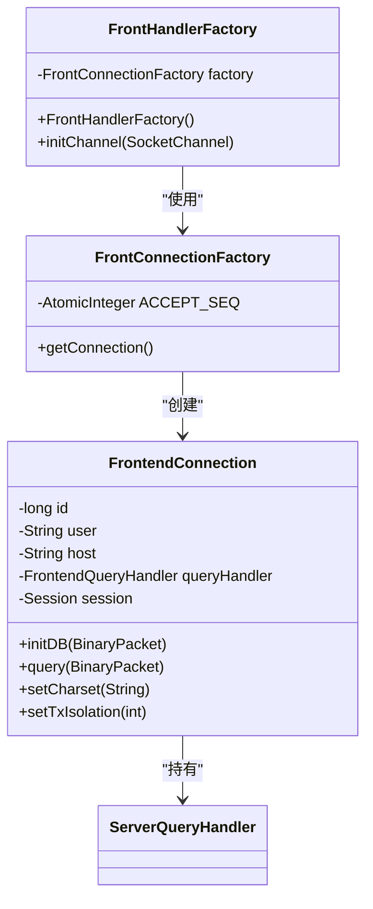
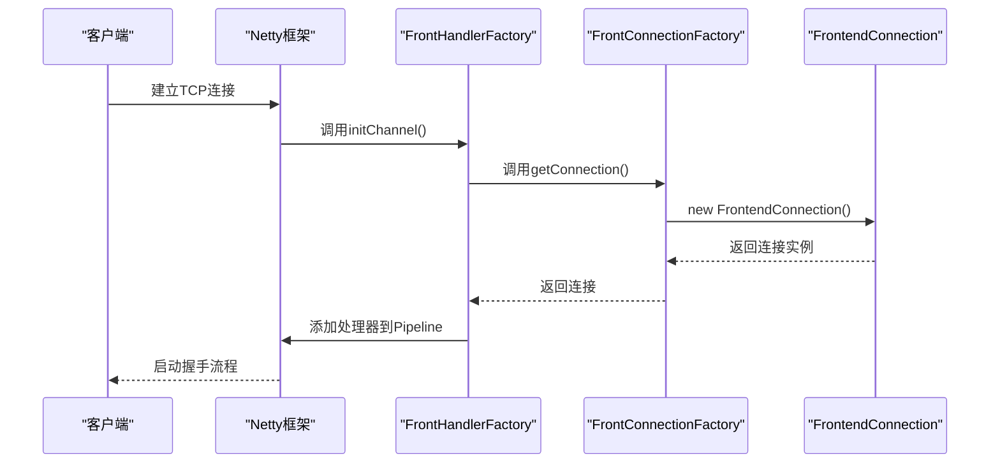
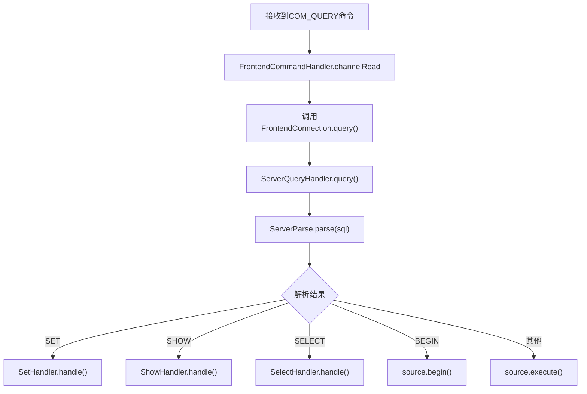

# 处理器工厂

<cite>
**本文档中引用的文件**  
- [FrontHandlerFactory.java](file://src/main/java/alchemystar/freedom/engine/net/handler/factory/FrontHandlerFactory.java)
- [FrontConnectionFactory.java](file://src/main/java/alchemystar/freedom/engine/net/handler/factory/FrontConnectionFactory.java)
- [FrontendConnection.java](file://src/main/java/alchemystar/freedom/engine/net/handler/frontend/FrontendConnection.java)
- [ServerQueryHandler.java](file://src/main/java/alchemystar/freedom/engine/net/handler/frontend/ServerQueryHandler.java)
- [FrontendQueryHandler.java](file://src/main/java/alchemystar/freedom/engine/net/handler/frontend/FrontendQueryHandler.java)
- [FrontendCommandHandler.java](file://src/main/java/alchemystar/freedom/engine/net/handler/frontend/FrontendCommandHandler.java)
</cite>

## 目录
1. [引言](#引言)
2. [工厂类设计与实现](#工厂类设计与实现)
3. [连接初始化中的工厂作用](#连接初始化中的工厂作用)
4. [处理器分发机制分析](#处理器分发机制分析)
5. [扩展性与开闭原则](#扩展性与开闭原则)
6. [异常处理与健壮性](#异常处理与健壮性)
7. [总结](#总结)

## 引言
在数据库中间件系统中，前端连接的处理逻辑需要根据客户端发送的不同命令类型动态调用相应的处理器。为实现这一目标，系统采用工厂模式对处理器对象进行集中管理与动态创建。本文档详细阐述`FrontHandlerFactory`和`FrontConnectionFactory`的设计与实现机制，分析其如何通过解耦连接初始化与处理器创建过程，提升系统的可维护性与扩展性。

## 工厂类设计与实现

`FrontHandlerFactory`类作为Netty框架中的`ChannelInitializer`实现，负责在新客户端连接建立时初始化整个处理器链。该工厂通过组合`FrontConnectionFactory`来创建前端连接实例，并据此构建完整的处理流水线。

工厂的核心职责包括：
- 创建独立的`FrontendConnection`实例用于维护每个客户端连接的状态
- 构建包含认证、命令分发、尾部处理等环节的Netty处理器链
- 注册心跳检测与MySQL协议解码器
- 实现连接级别的状态隔离与资源管理

**图示来源**  
- [FrontHandlerFactory.java](file://src/main/java/alchemystar/freedom/engine/net/handler/factory/FrontHandlerFactory.java#L1-L41)
- [FrontConnectionFactory.java](file://src/main/java/alchemystar/freedom/engine/net/handler/factory/FrontConnectionFactory.java#L1-L37)
- [FrontendConnection.java](file://src/main/java/alchemystar/freedom/engine/net/handler/frontend/FrontendConnection.java#L1-L320)

**本节来源**  
- [FrontHandlerFactory.java](file://src/main/java/alchemystar/freedom/engine/net/handler/factory/FrontHandlerFactory.java#L1-L41)
- [FrontConnectionFactory.java](file://src/main/java/alchemystar/freedom/engine/net/handler/factory/FrontConnectionFactory.java#L1-L37)

## 连接初始化中的工厂作用

当客户端发起连接请求时，`FrontHandlerFactory`的`initChannel`方法被触发，启动完整的连接初始化流程。此过程通过`FrontConnectionFactory`生成全新的`FrontendConnection`实例，确保每个连接拥有独立的上下文环境。

`FrontConnectionFactory`在创建连接时执行以下关键操作：
- 使用原子计数器生成唯一连接ID（`ACCEPT_SEQ`）
- 设置默认字符集与事务隔离级别
- 初始化会话对象（`Session`）
- 配置默认查询处理器为`ServerQueryHandler`
- 记录连接创建时间戳

该设计实现了连接资源的集中化管理，避免了手动实例化带来的状态污染风险，同时为后续的连接监控与回收提供了基础支持。

**图示来源**  
- [FrontHandlerFactory.java](file://src/main/java/alchemystar/freedom/engine/net/handler/factory/FrontHandlerFactory.java#L15-L35)
- [FrontConnectionFactory.java](file://src/main/java/alchemystar/freedom/engine/net/handler/factory/FrontConnectionFactory.java#L15-L35)
- [FrontendConnection.java](file://src/main/java/alchemystar/freedom/engine/net/handler/frontend/FrontendConnection.java#L1-L50)

**本节来源**  
- [FrontHandlerFactory.java](file://src/main/java/alchemystar/freedom/engine/net/handler/factory/FrontHandlerFactory.java#L15-L35)
- [FrontConnectionFactory.java](file://src/main/java/alchemystar/freedom/engine/net/handler/factory/FrontConnectionFactory.java#L15-L35)

## 处理器分发机制分析

系统通过多层处理器协作实现命令的精准分发。`FrontendCommandHandler`作为Netty管道中的核心处理器，负责解析MySQL协议包类型并路由至相应处理逻辑。

当接收到`COM_QUERY`命令时，处理流程如下：
1. `FrontendCommandHandler`识别命令类型为`COM_QUERY`
2. 调用`FrontendConnection.query()`方法
3. 通过预设的`ServerQueryHandler`执行SQL解析
4. 根据解析结果分发至`SetHandler`、`ShowHandler`等具体处理器

`ServerQueryHandler`作为查询处理器的实现类，实现了`FrontendQueryHandler`接口，其`query`方法根据SQL语句类型调用静态处理器类进行处理。这种设计将命令解析与业务逻辑分离，提高了代码的可读性与可测试性。

**图示来源**  
- [FrontendCommandHandler.java](file://src/main/java/alchemystar/freedom/engine/net/handler/frontend/FrontendCommandHandler.java#L30-L60)
- [ServerQueryHandler.java](file://src/main/java/alchemystar/freedom/engine/net/handler/frontend/ServerQueryHandler.java#L15-L50)
- [FrontendQueryHandler.java](file://src/main/java/alchemystar/freedom/engine/net/handler/frontend/FrontendQueryHandler.java#L1-L10)

**本节来源**  
- [FrontendCommandHandler.java](file://src/main/java/alchemystar/freedom/engine/net/handler/frontend/FrontendCommandHandler.java#L30-L89)
- [ServerQueryHandler.java](file://src/main/java/alchemystar/freedom/engine/net/handler/frontend/ServerQueryHandler.java#L1-L85)
- [FrontendQueryHandler.java](file://src/main/java/alchemystar/freedom/engine/net/handler/frontend/FrontendQueryHandler.java#L1-L10)

## 扩展性与开闭原则

该工厂设计严格遵循开闭原则（对扩展开放，对修改关闭）。新增命令类型时，只需添加新的处理器类并更新`ServerParse`的解析逻辑，无需修改现有工厂代码或连接管理逻辑。

例如，若需支持`COM_ALTER`命令，只需：
1. 创建`AlterHandler`类实现相应逻辑
2. 在`ServerParse`中添加`ALTER`类型的解析规则
3. 在`ServerQueryHandler`的switch-case中添加对应分支

这种设计显著降低了系统耦合度，使得功能扩展更加安全高效。同时，通过接口（`FrontendQueryHandler`）而非具体实现进行依赖，进一步增强了系统的灵活性与可替换性。

**本节来源**  
- [ServerQueryHandler.java](file://src/main/java/alchemystar/freedom/engine/net/handler/frontend/ServerQueryHandler.java#L25-L59)
- [FrontendQueryHandler.java](file://src/main/java/alchemystar/freedom/engine/net/handler/frontend/FrontendQueryHandler.java#L1-L10)

## 异常处理与健壮性

系统在工厂层与处理器层均建立了完善的异常处理机制。`FrontConnectionFactory`在创建连接时会捕获潜在的初始化异常，确保不会返回不完整对象。`FrontendConnection`提供了统一的错误响应方法`writeErrMessage`，保证客户端能收到标准化的错误信息。

此外，通过Netty的`IdleStateHandler`实现连接空闲检测，结合`FrontendConnection`的最后活跃时间戳，可及时清理长时间无活动的连接，防止资源泄漏。这种主动式健康检查机制提升了系统的整体稳定性。

**本节来源**  
- [FrontendConnection.java](file://src/main/java/alchemystar/freedom/engine/net/handler/frontend/FrontendConnection.java#L100-L120)
- [FrontHandlerFactory.java](file://src/main/java/alchemystar/freedom/engine/net/handler/factory/FrontHandlerFactory.java#L20-L25)

## 总结
`FrontHandlerFactory`与`FrontConnectionFactory`的协同工作，构建了一个高效、可扩展的前端处理器管理体系。通过工厂模式实现连接与处理器的解耦，利用Netty的管道机制完成命令的精确路由，系统在保证高性能的同时具备良好的可维护性。该设计充分体现了面向对象设计原则在实际项目中的应用价值，为后续功能扩展奠定了坚实基础。